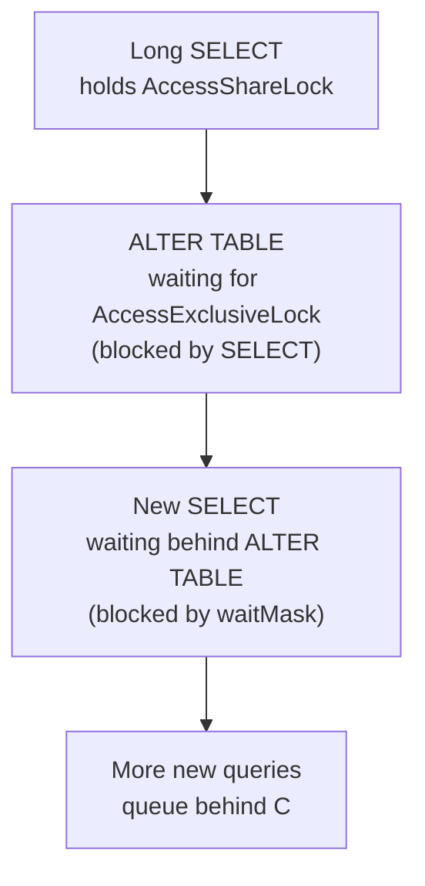
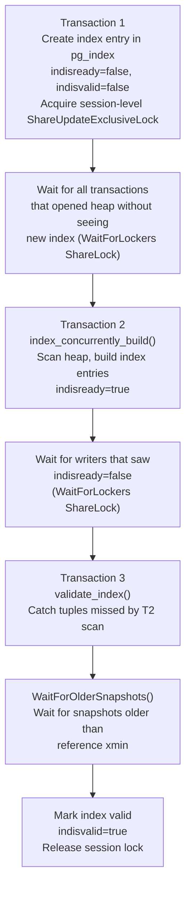

Every DDL statement acquires at least one table-level lock before touching catalog rows. The choice of lock mode determines which concurrent operations can proceed. Getting that choice wrong — or not understanding its implications — is the root cause of a class of production incidents where a schema migration turns into a pile-up of blocked queries.

## The Lock Mode Hierarchy

PostgreSQL defines eight lock modes in ascending order of exclusivity. For DDL purposes, the four most relevant are:

| Mode | Abbrev | Who uses it |
|---|---|---|
| `AccessShareLock` | AS | `SELECT` |
| `ShareUpdateExclusiveLock` | SUEx | `VACUUM`, `ANALYZE`, `CREATE INDEX CONCURRENTLY` |
| `ShareLock` | S | `CREATE INDEX` (non-concurrent) |
| `AccessExclusiveLock` | AEx | Most `ALTER TABLE`, `DROP TABLE`, `TRUNCATE` |

The conflict table (`LockConflicts[]`, `lock.c`) defines which modes block each other. The critical asymmetry: `AccessExclusiveLock` conflicts with every other mode including `AccessShareLock`. `ShareUpdateExclusiveLock` conflicts with itself and anything more exclusive, but not with `AccessShareLock` or `RowShareLock`. This is the entire basis for "safe concurrent DDL" — operations that can coexist with running queries hold `ShareUpdateExclusiveLock` rather than `AccessExclusiveLock`.

```c
/* From lock.c — LockConflicts[] (simplified) */
/* AccessShareLock */     LOCKBIT_ON(AccessExclusiveLock),
/* ShareUpdateExclusiveLock */
    LOCKBIT_ON(ShareUpdateExclusiveLock) |
    LOCKBIT_ON(ShareLock) | ... | LOCKBIT_ON(AccessExclusiveLock),
/* AccessExclusiveLock */
    LOCKBIT_ON(AccessShareLock) | LOCKBIT_ON(RowShareLock) | ...
    LOCKBIT_ON(AccessExclusiveLock)
```

## DDL Command Lock Reference

### ALTER TABLE

`ALTER TABLE` is unusual in that the lock level is not fixed. `AlterTableGetLockLevel()` (`tablecmds.c`) computes it per subcommand. The function walks the list of subcommands and promotes the running lock level to the maximum required by any single subcommand. The starting default is `ShareUpdateExclusiveLock`.

| Subcommand | Lock | Notes |
|---|---|---|
| `ADD COLUMN` (nullable, no default) | `AccessExclusiveLock` | Modifies `pg_attribute`, visible to `SELECT` |
| `ADD COLUMN ... DEFAULT expr` | `AccessExclusiveLock` | Fast path (PG11+) avoids heap rewrite but still takes AEL |
| `ADD COLUMN ... DEFAULT volatile_expr` | `AccessExclusiveLock` + heap rewrite | Volatile default forces `tab->rewrite` |
| `DROP COLUMN` | `AccessExclusiveLock` | Change visible to `SELECT` |
| `ALTER COLUMN TYPE` | `AccessExclusiveLock` | Must rewrite heap |
| `SET TABLESPACE` | `AccessExclusiveLock` | Must rewrite heap |
| `ADD CONSTRAINT PRIMARY KEY/UNIQUE` | `AccessExclusiveLock` | Builds index inline |
| `ADD CONSTRAINT FOREIGN KEY` | `ShareRowExclusiveLock` | Only adds triggers |
| `ADD CONSTRAINT ... NOT VALID` | `ShareRowExclusiveLock` | Does not scan existing rows |
| `VALIDATE CONSTRAINT` | `ShareUpdateExclusiveLock` | MVCC scan, safe concurrent |
| `SET NOT NULL` | `AccessExclusiveLock` | Catalog change, plan-visible |
| `DROP NOT NULL` | `AccessExclusiveLock` | May change query plans |
| `ENABLE/DISABLE TRIGGER` | `ShareRowExclusiveLock` | Affects write ops only |
| `RENAME COLUMN` | `AccessExclusiveLock` | Routed through `RenameStmt`, not this path |
| `ATTACH PARTITION` (non-default) | `ShareUpdateExclusiveLock` | Safe concurrent |
| `ATTACH PARTITION` (default) | `AccessExclusiveLock` | Must lock parent |
| `SET (storage_parameter)` | Varies | Handled by `AlterTableGetRelOptionsLockLevel` |

The comment in `AlterTableGetLockLevel()` explains why `ALTER TABLE` uses `AccessExclusiveLock` even when a weaker lock might theoretically suffice: Hot Standby only knows about `AccessExclusiveLocks` propagated from the primary. Any catalog change that might affect standby SELECTs must use `AccessExclusiveLock` to ensure the standby pauses conflicting queries.

### CREATE INDEX

Non-concurrent `CREATE INDEX` opens the heap with `ShareLock`. `ShareLock` blocks `INSERT`, `UPDATE`, and `DELETE` (which hold `RowExclusiveLock`) but not `SELECT`. In practice, most production schemas already have enough concurrent write activity that holding `ShareLock` for the duration of a large index build is untenable.

`CREATE INDEX CONCURRENTLY` uses `ShareUpdateExclusiveLock` instead, allowing all DML to continue while the index is built. The cost is that the operation spans multiple transactions and takes significantly longer.

### Other Common DDL

| Command | Lock | Notes |
|---|---|---|
| `DROP TABLE` | `AccessExclusiveLock` | On target and any FK-referencing tables |
| `TRUNCATE` | `AccessExclusiveLock` | Also locks FK-referenced tables |
| `VACUUM` (manual) | `ShareUpdateExclusiveLock` | Conflicts with another VACUUM, not with queries |
| `ANALYZE` | `ShareUpdateExclusiveLock` | Safe to run while queries are active |
| `REINDEX` | `ShareLock` (table) | Blocks writes; use `REINDEX CONCURRENTLY` |
| `REINDEX CONCURRENTLY` | `ShareUpdateExclusiveLock` | Safe |
| `CLUSTER` | `AccessExclusiveLock` | Full table rewrite |
| `REFRESH MATERIALIZED VIEW` | `AccessExclusiveLock` | Use `CONCURRENTLY` to get `ExclusiveLock` |

## How Lock Queuing Causes Outages

When a session requests a lock that conflicts with held locks, it joins the wait queue for that lock object (`lock->waitProcs`, a priority queue in `proc.c`). New requesters normally append to the tail. The critical consequence: once a session is waiting in the queue, its `waitMask` is visible to all subsequent lock acquisition attempts on the same object. If the waiting lock mode conflicts with what a newcomer wants, the newcomer must wait behind the existing waiter. This holds even if the existing holder's lock would have been compatible.

This creates the classic DDL pile-up:



The new SELECT at step C would be compatible with the existing SELECT at step A — both are `AccessShareLock`. But `ALTER TABLE` is waiting for `AccessExclusiveLock`, which conflicts with `AccessShareLock`. As a result, the new SELECT cannot jump the queue. The lock manager enforces strict ordering: new requests that would conflict with any waiting request must wait.

A single long-running `SELECT` combined with a poorly timed `ALTER TABLE` can therefore block all traffic to a table within seconds. The pile-up compounds until the blocker commits or the DDL times out.

## lock_timeout: The Essential DDL Safety Net

The timeout system (`timeout.h`) provides `LOCK_TIMEOUT` as a separate timer from `STATEMENT_TIMEOUT`. When `lock_timeout` expires during a session's wait in `ProcSleep()`, the backend receives a SIGALRM-derived signal, unwinds with an error (`ERROR: canceling statement due to lock timeout`), removes itself from the wait queue, and rolls back the transaction.

This is the standard pattern for safe production DDL:

```sql
BEGIN;
SET lock_timeout = '2s';
SET statement_timeout = '30s';

ALTER TABLE orders ADD COLUMN processed_at timestamptz;

COMMIT;
```

If `lock_timeout` fires, the `ALTER TABLE` aborts without having held any table lock. The queue then immediately clears. The `statement_timeout` guards against the case where the lock was acquired but the operation itself is unexpectedly slow.

A retry loop in application code or a migration tool gives the DDL multiple chances to slip in during quiet windows:

```sql
DO $$
DECLARE
  attempts int := 0;
BEGIN
  LOOP
    BEGIN
      SET LOCAL lock_timeout = '3s';
      ALTER TABLE orders ADD COLUMN processed_at timestamptz;
      EXIT;  -- success
    EXCEPTION
      WHEN lock_not_available THEN
        attempts := attempts + 1;
        IF attempts >= 5 THEN RAISE; END IF;
        PERFORM pg_sleep(1);
    END;
  END LOOP;
END;
$$;
```

`lock_not_available` is the SQLSTATE (`55P03`) raised when `lock_timeout` fires. `statement_timeout` raises `query_canceled` (`57014`) instead. When both timers fire near-simultaneously, `postgres.c` resolves the ambiguity by reporting the one whose deadline came first (`get_timeout_finish_time()`).

## Fast ADD COLUMN with DEFAULT (PG11+)

Before PostgreSQL 11, adding a column with a non-null default required rewriting the entire table — an O(n) heap scan under `AccessExclusiveLock`. PG11 introduced the "missing value" mechanism: when the default expression is stable or immutable (not volatile, not a domain with constraints), PostgreSQL stores the evaluated default in `pg_attribute.attmissingval` rather than writing it into every existing tuple.

The check in `ATExecAddColumn()` (`tablecmds.c`):

```c
if (rel->rd_rel->relkind == RELKIND_RELATION &&
    !colDef->generated &&
    !has_domain_constraints &&
    !contain_volatile_functions((Node *) defval))
{
    /* evaluate once and store in pg_attribute */
    StoreAttrMissingVal(rel, attribute.attnum, missingval);
}
else
{
    /* fall back to heap rewrite */
    tab->rewrite |= AT_REWRITE_DEFAULT_VAL;
}
```

When the fast path triggers, PostgreSQL modifies no heap rows. It still acquires the `AccessExclusiveLock` and still modifies the catalog. But it holds the lock only for the brief catalog update — not for the duration of a table scan. For tables with billions of rows, this is the difference between milliseconds and hours.

Volatile functions (`now()`, `random()`, sequences via `nextval()`) bypass the fast path because the default must differ per row. That requires touching every existing tuple. The same applies to domain constraints, which must be validated per-row.

## CREATE INDEX CONCURRENTLY: The Multi-Phase Lock Dance

Concurrent index creation avoids `AccessExclusiveLock` entirely by spreading work across three transactions, each with multiple `WaitForLockers()` calls (`indexcmds.c`):



The session-level `ShareUpdateExclusiveLock` on the heap relation persists across all three transaction commits. This prevents `DROP TABLE` (which would need `AccessExclusiveLock`) from racing with the build. The lock is released only after the index is marked valid.

The `WaitForLockers()` calls use `ShareLock` as the threshold: they wait until no transaction holds a lock that conflicts with `ShareLock`. This means all writers that predated the relevant index state transition have finished. This is not a lock acquisition — it is a passive wait that does not block new queries.

The consequence for operations like `DROP INDEX` or `REINDEX`: an incomplete `CREATE INDEX CONCURRENTLY` (interrupted mid-way, leaving `indisvalid=false`) requires `DROP INDEX CONCURRENTLY` to clean up. A regular `DROP INDEX` on a partially-built index will block all `ShareUpdateExclusiveLock` holders.

## Catalog-Level Locking

The table-level lock on the user relation is separate from the locks PostgreSQL takes on system catalog tables. When DDL modifies `pg_class`, `pg_attribute`, or `pg_index`, it opens those catalog tables with `RowExclusiveLock` (e.g., `table_open(RelationRelationId, RowExclusiveLock)`). This is a lower lock than the `AccessExclusiveLock` on the target relation, which means catalog updates are finer-grained than the relation lock implies.

The relcache subsystem invalidates cached relation descriptors on commit, so concurrent sessions will reload `pg_class` and `pg_attribute` entries after the DDL transaction commits. The `AccessExclusiveLock` on the target relation guarantees that no session can be inside a cached plan for that relation during the catalog change. The lock prevents any new accesses and waits for in-progress ones to finish.

## Safe ALTER TABLE Patterns for Production

### Splitting constraint addition from validation

`ALTER TABLE ... ADD CONSTRAINT ... NOT VALID` skips the validation scan, acquiring only `ShareRowExclusiveLock` on the existing rows. PostgreSQL enforces the constraint for new writes immediately, but it does not check existing rows. A subsequent `ALTER TABLE ... VALIDATE CONSTRAINT` scans existing rows under `ShareUpdateExclusiveLock`, which allows concurrent reads and writes.

```sql
-- Step 1: fast, only RowShareExclusiveLock
ALTER TABLE orders
  ADD CONSTRAINT chk_amount_positive
  CHECK (amount > 0) NOT VALID;

-- Step 2: safe concurrent scan
ALTER TABLE orders VALIDATE CONSTRAINT chk_amount_positive;
```

### Adding NOT NULL without a full rewrite

`SET NOT NULL` requires `AccessExclusiveLock` because the planner uses nullability as a planning hint. The concurrent alternative is to use a `NOT VALID` check constraint and validate it separately, then (from PG17+) `SET NOT NULL USING constraint_name`. On older versions the only option is to accept the `AccessExclusiveLock` window or add an application-level not-null invariant first.

### Backfilling defaults without a heap rewrite

When the default is volatile (e.g., `clock_timestamp()`), the fast path is unavailable. Instead, you must add the column nullable first, then populate and constrain it in separate steps:

```sql
-- Lock is very brief (only catalog update)
ALTER TABLE orders ADD COLUMN created_at timestamptz;

-- Batched update, no DDL lock
UPDATE orders SET created_at = now()
  WHERE id BETWEEN $1 AND $2;

-- Constraint lock, brief
ALTER TABLE orders ALTER COLUMN created_at SET NOT NULL;
```

## Monitoring Lock Waits

```sql
-- Sessions waiting for locks
SELECT
  pg_blocking_pids(pid) AS blocked_by,
  pid,
  wait_event_type,
  wait_event,
  state,
  query_start,
  left(query, 80) AS query
FROM pg_stat_activity
WHERE wait_event_type = 'Lock'
ORDER BY query_start;
```

```sql
-- Full lock graph: what each blocked session is waiting for
SELECT
  blocked.pid         AS blocked_pid,
  blocked.query       AS blocked_query,
  blocking.pid        AS blocking_pid,
  blocking.query      AS blocking_query,
  locks.relation::regclass AS locked_relation,
  locks.mode          AS waited_mode
FROM pg_stat_activity blocked
JOIN pg_locks locks
  ON locks.pid = blocked.pid AND NOT locks.granted
JOIN pg_stat_activity blocking
  ON blocking.pid = ANY(pg_blocking_pids(blocked.pid));
```

```sql
-- All held and pending locks on a specific table
SELECT pid, mode, granted, relation::regclass
FROM pg_locks
WHERE relation = 'orders'::regclass
ORDER BY granted DESC, pid;
```

`pg_blocking_pids()` traverses the lock graph and returns the set of PIDs that are directly blocking the given PID. It follows the chain only one level — to find the root cause in a multi-level block, iterate.

The `wait_event` column in `pg_stat_activity` shows `relation` for regular relation locks and `extend` for relation-extension locks. The process title also shows `waiting` while a backend is inside `WaitOnLock()` / `ProcSleep()`, visible in `ps aux` output.

## Related Topics

- [[subsystems/locking/overview|Locking Overview]] — covers the full lock mode hierarchy, conflict table, and how the lock manager grants and queues requests at the relation and page level.
- [[subsystems/locking/lock-contention-and-slow-queries|Lock Contention and Slow Queries]] — explains how to diagnose and resolve pile-ups caused by DDL holding or waiting for heavy locks.
- [[subsystems/locking/deadlock|Deadlock Detection]] — describes how PostgreSQL detects and breaks cycles in the wait graph, which can involve DDL sessions acquiring multiple locks.
- [[code-paths/create-index|CREATE INDEX]] — details the full execution path for both concurrent and non-concurrent index builds, including the multi-phase locking dance.
- [[code-paths/alter-table|ALTER TABLE]] — traces how subcommand lists are processed, how `AlterTableGetLockLevel` promotes the lock level, and when heap rewrites are triggered.
- [[subsystems/catalog/relcache|Relation Cache]] — explains how cached relation descriptors are invalidated after DDL commits and why `AccessExclusiveLock` is required to safely swap them out.
- [[troubleshooting/lock-waits|Lock Wait Troubleshooting]] — practical guide to using `pg_stat_activity`, `pg_locks`, and `pg_blocking_pids()` to find and resolve lock wait incidents.
