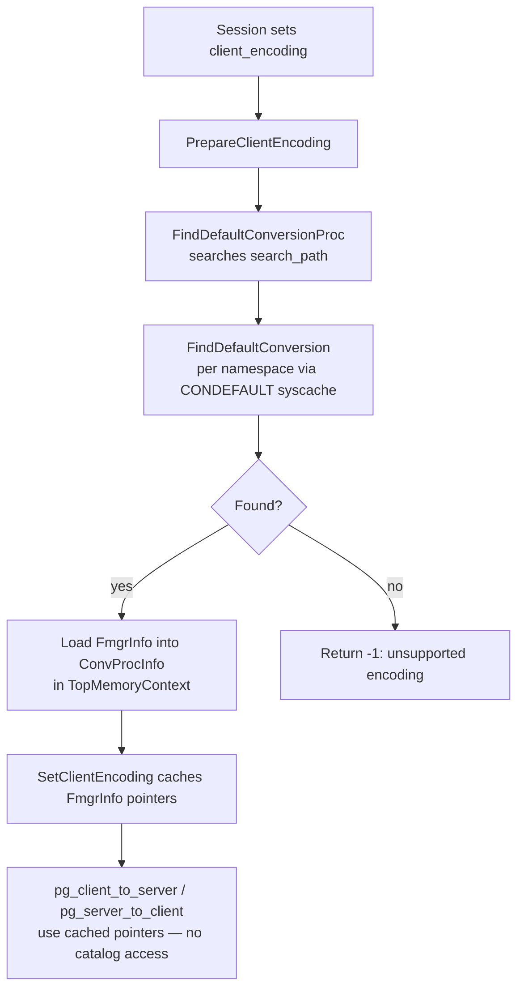

`pg_conversion` is the system catalog that maps encoding pairs to the conversion functions that translate between them. When a session's `client_encoding` differs from the database encoding, the backend consults this catalog to locate a suitable conversion function. The same mechanism handles explicit `CONVERT` calls and encoding-aware `COPY`. Without entries in this catalog, exchanging text across encodings is impossible.

## Catalog Schema

Each row in `pg_conversion` (OID 2607, `ConversionRelationId`) describes one directed conversion — from a source encoding to a destination encoding — via a single function.

| Column | Type | Description |
|---|---|---|
| `oid` | `Oid` | Object identifier; primary key. |
| `conname` | `name` | Conversion name, unique within a namespace. |
| `connamespace` | `Oid` | Namespace (schema) containing the conversion; FK to `pg_namespace`. |
| `conowner` | `Oid` | Role that owns the conversion; FK to `pg_authid`. |
| `conforencoding` | `int32` | Integer encoding ID of the source encoding (e.g., `PG_UTF8`). |
| `contoencoding` | `int32` | Integer encoding ID of the destination encoding. |
| `conproc` | `regproc` | OID of the conversion function in `pg_proc`. |
| `condefault` | `bool` | True if this is the default conversion for the `(conforencoding, contoencoding)` pair within the namespace. |

Three indexes cover the catalog:

- `pg_conversion_oid_index` — unique, on `oid` (primary key).
- `pg_conversion_name_nsp_index` — unique, on `(conname, connamespace)`, enforcing the uniqueness of conversion names per schema.
- `pg_conversion_default_index` — unique, on `(connamespace, conforencoding, contoencoding, oid)`, used by `FindDefaultConversion` to locate the default for a given encoding pair.

The `CONDEFAULT` syscache entry is keyed on `(connamespace, conforencoding, contoencoding)` and is the fast path for all default-conversion lookups.

## Creating a Conversion

`CreateConversionCommand()` (`conversioncmds.c`) processes `CREATE CONVERSION`. It validates the inputs, then calls `ConversionCreate()` to insert the catalog row. See [[subsystems/catalog/encoding-conversion-procs|encoding conversion procedures]] for the fixed function signature and what each argument means. `CreateConversionCommand` verifies the signature by resolving the function against the exact argument-type array `{INT4OID, INT4OID, CSTRINGOID, INTERNALOID, INT4OID, BOOLOID}`. It then checks that the return type is `INT4OID`. It also performs a dry-run call with an empty input string to confirm the function handles the `(from, to)` pair it claims to handle.

`ConversionCreate()` itself checks for duplicates before inserting:

1. It rejects a duplicate `(conname, connamespace)` pair via `SearchSysCacheExists2(CONNAMENSP, ...)`.
2. For a default conversion (`def = true`), it calls `FindDefaultConversion()` on the same namespace and encoding pair. If one already exists, it raises `ERRCODE_DUPLICATE_OBJECT`.

After inserting the tuple, `ConversionCreate` records three dependency edges: on the conversion function (`pg_proc`), on the namespace (`pg_namespace`), and on the owner role via `recordDependencyOnOwner`. Dropping the function or the schema therefore cascades to the conversion.

## Default vs. Non-Default Conversions

Multiple rows may share the same `(conforencoding, contoencoding)` pair. The `condefault` flag determines which row `FindDefaultConversion()` returns. Within a namespace, only one default conversion may exist per encoding pair — `ConversionCreate` enforces this at creation time. Non-default conversions can be invoked explicitly by name using `CONVERT USING`, but they are invisible to the automatic client-server encoding path.

`FindDefaultConversion(namespace, for_encoding, to_encoding)` uses the `CONDEFAULT` syscache index keyed on `(namespace, conforencoding, contoencoding)`. It iterates any matching tuples. It returns the `conproc` OID of the first one with `condefault = true`.

`FindDefaultConversionProc(for_encoding, to_encoding)` is defined in `namespace.c`. It wraps `FindDefaultConversion` and adds the `search_path` walk: it iterates the active search path namespaces (excluding the temp namespace), calls `FindDefaultConversion` for each, and returns the first match. This means a user-defined default conversion in an earlier schema on the search path can shadow a system conversion in `pg_catalog`.

## The Automatic Conversion Path

When a client connects, the backend negotiates `client_encoding`. If the client encoding differs from the server (database) encoding, `PrepareClientEncoding()` in `mbutils.c` calls `FindDefaultConversionProc` twice — once for client-to-server and once for server-to-client. It caches the resulting `FmgrInfo` pointers in a `ConvProcInfo` struct allocated in `TopMemoryContext`. The [[subsystems/types/encoding-utilities|encoding utilities]] layer then uses these cached pointers for every text value entering or leaving the backend, without additional catalog access.

`pg_do_encoding_conversion()` is the lower-level variant used for explicit conversions and `COPY`. It calls `FindDefaultConversionProc` on each invocation (requiring an active transaction). It then calls the function via `OidFunctionCall6`:

```c
(void) OidFunctionCall6(proc,
    Int32GetDatum(src_encoding),
    Int32GetDatum(dest_encoding),
    CStringGetDatum((char *) src),
    CStringGetDatum((char *) result),
    Int32GetDatum(len),
    BoolGetDatum(false));   /* noError = false */
```

The conversion machinery treats `SQL_ASCII` as a wildcard: any source or destination of `SQL_ASCII` bypasses catalog lookup entirely, because `SQL_ASCII` imposes no encoding constraint. `CREATE CONVERSION` rejects an attempt to register a conversion to or from `SQL_ASCII` at parse time.

## Conversion Chains

The catalog stores only direct conversions. When no direct entry exists for a `(src, dst)` pair, `pg_unicode_to_server()` constructs an indirect path through UTF-8: it encodes the code point to UTF-8 first, then invokes the UTF-8-to-server conversion. This two-step chain requires two separate `pg_conversion` rows — one for whatever-to-UTF-8 and one for UTF-8-to-server — but no explicit chaining logic in the catalog itself. Application code in `mbutils.c` assembles the chain, not a generic chaining mechanism.

The consequence is that a pair of encodings with no direct row and no common UTF-8 intermediary cannot be converted. The system ships with a dense set of UTF-8-based rows precisely because UTF-8 acts as the universal pivot.

## Built-in and User-Defined Conversions

The system ships with a large set of built-in conversions defined in `src/backend/utils/mb/conversion_procs/`. Each subdirectory there corresponds to one or a pair of encoding families (e.g., `utf8_and_euc_jp`, `latin2_and_win1250`). Each subdirectory compiles into a shared library that the conversion functions load. `initdb` registers those functions in `pg_conversion`.

Users can add custom conversions with `CREATE CONVERSION`, provided they supply a function with the correct signature. Custom conversions live in user schemas. They interact with the search path lookup in `FindDefaultConversionProc`. Removing a built-in conversion row directly from `pg_conversion` (via `DROP CONVERSION`) would silently break automatic client encoding for sessions using that encoding pair.

## Relation to the mb/ Infrastructure

The conversion functions registered in `pg_conversion` are thin wrappers around the conversion tables for each encoding pair in `src/backend/utils/mb/conversion_procs/`. Each wrapper validates its arguments with the `CHECK_ENCODING_CONVERSION_ARGS` macro (which calls `check_encoding_conversion_args()`), then delegates to the encoding-specific translation tables. The catalog layer is deliberately thin: `pg_conversion` only stores function OIDs and encoding IDs; all the byte-level translation logic lives in the `mb/` layer.



## See also

- [[subsystems/types/encoding-utilities|encoding utilities]] — runtime conversion dispatch, `ConvProcInfo` caching, `pg_do_encoding_conversion`
- [[subsystems/catalog/core-catalogs|core system catalogs]] — catalog access patterns, syscache lookups, `CatalogTupleInsert`
