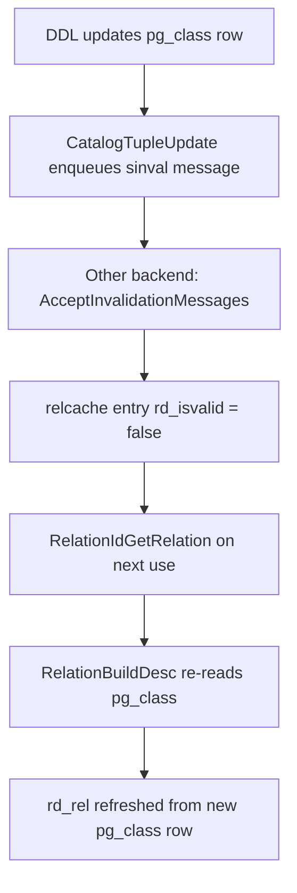

`pg_class` is PostgreSQL's central relation registry: every named relation-like object in a database has exactly one row here, regardless of whether it is an ordinary table, an index, a view, a sequence, a materialized view, a foreign table, or a composite type placeholder. The row encodes the object's identity (OID, name, schema, owner), its storage parameters, its behavioral flags, and statistical estimates that the planner relies on. Because almost every DDL and DML operation touches `pg_class`, it is the most frequently accessed system catalog in a running cluster.

## What "relation" means in pg_class

The word *relation* is used broadly in PostgreSQL internals. `pg_class` holds rows for ten distinct kinds of objects, identified by the single-character `relkind` column:

| `relkind` | Constant | Description |
|---|---|---|
| `r` | `RELKIND_RELATION` | Ordinary heap table |
| `i` | `RELKIND_INDEX` | Secondary index (any AM) |
| `S` | `RELKIND_SEQUENCE` | Sequence object |
| `t` | `RELKIND_TOASTVALUE` | [[subsystems/storage/toast|TOAST]] table for out-of-line varlena storage |
| `v` | `RELKIND_VIEW` | View (no physical storage) |
| `m` | `RELKIND_MATVIEW` | Materialized view (has physical storage) |
| `c` | `RELKIND_COMPOSITE_TYPE` | Composite type's synthetic placeholder row |
| `f` | `RELKIND_FOREIGN_TABLE` | Foreign table via FDW |
| `p` | `RELKIND_PARTITIONED_TABLE` | Partitioned table (no own storage) |
| `I` | `RELKIND_PARTITIONED_INDEX` | Partitioned index (no own storage) |

Three macros in `pg_class.h` derive important groupings from `relkind`:

- `RELKIND_HAS_STORAGE(relkind)` — true for `r`, `i`, `S`, `t`, `m`. These have a physical file on disk, and normally have `relfilenode` set to a non-zero value (or are mapped via the [[subsystems/catalog/relmapper|relmapper]]).
- `RELKIND_HAS_TABLE_AM(relkind)` — true for `r`, `t`, `m`. These carry a `TableAmRoutine` pointer in the [[subsystems/catalog/relcache|relcache]] entry (`rd_tableam`). Sequences deliberately omit this macro even though they use the heap AM internally, because they are handled specially in nearly every code path that dispatches on access method.
- `RELKIND_HAS_PARTITIONS(relkind)` — true for `p`, `I`. These have children but no storage of their own.

Code that receives a `relkind` value it cannot handle should call `errdetail_relkind_not_supported()` (`pg_class.c`) to produce an error detail using the SQL-level term ("table", "index", "view", etc.) rather than the raw character code. The function covers all ten `relkind` values and calls `elog(ERROR, ...)` for unrecognised characters, making it both a user-facing formatting helper and an exhaustiveness guard.

## Column layout

The fixed portion of a `pg_class` row is defined by `FormData_pg_class` in `pg_class.h`. Three variable-length columns (`relacl`, `reloptions`, `relpartbound`) appear after the fixed portion inside a `#ifdef CATALOG_VARLEN` block and are not loaded into the [[subsystems/catalog/relcache|relcache]] `rd_rel` field.

### Identity and ownership

| Column | Type | Notes |
|---|---|---|
| `oid` | `Oid` | Primary key; basis for all cross-catalog foreign keys |
| `relname` | `name` | Unqualified relation name; unique per `(relname, relnamespace)` |
| `relnamespace` | `Oid` | OID of the containing `pg_namespace` row |
| `reltype` | `Oid` | OID of the implicit row type in `pg_type`; 0 for indexes and sequences |
| `reloftype` | `Oid` | Composite type OID for typed tables (`CREATE TABLE OF`); otherwise 0 |
| `relowner` | `Oid` | Owner role OID |

The circular link between `pg_class` and `pg_type` is intentional. When a table is created, PostgreSQL inserts a composite row type entry into `pg_type` first. It then writes the `pg_class` row with `reltype` pointing at it. The `pg_type` row carries a back-pointer in `typrelid`. This symmetry allows SQL to treat a table's row as a first-class type.

### Physical storage

| Column | Type | Notes |
|---|---|---|
| `relam` | `Oid` | Access method OID (`pg_am`); heap for tables, specific AM for indexes; 0 for virtual relations |
| `relfilenode` | `Oid` | Base filename for the relation's data fork; 0 means "mapped" — see [[subsystems/catalog/relmapper|relmapper]] |
| `reltablespace` | `Oid` | Tablespace OID; 0 means the database default |
| `reltoastrelid` | `Oid` | OID of this relation's [[subsystems/storage/toast|TOAST]] table in `pg_class`; 0 if none |

A `relfilenode` of 0 means the relation is a *mapped* catalog — its actual file number is stored in the `pg_filenode.map` binary file managed by `relmapper.c`. This applies to `pg_class` itself and the other critical bootstrap catalogs, breaking the chicken-and-egg dependency of locating `pg_class` without reading `pg_class`.

### Statistical estimates

| Column | Type | Notes |
|---|---|---|
| `relpages` | `int32` | Last-known 8 kB page count; updated by VACUUM and ANALYZE |
| `reltuples` | `float4` | Estimated live row count; −1 means "never analyzed" |
| `relallvisible` | `int32` | Count of all-visible pages per the [[subsystems/storage/visibility-map|visibility map]]; updated by VACUUM |

These three columns are statistical estimates, not authoritative counts. `VACUUM` and `ANALYZE` write them as a side effect — not after every DML statement. The header comment in `pg_class.h` is explicit: `relpages` is "not always up-to-date" and `reltuples` is "not always up-to-date; -1 means unknown".

The planner reads these columns during plan construction to estimate selectivity and join cardinality. When the estimates are stale — for example after a large bulk load that has not yet been followed by `ANALYZE` — plans can be suboptimal. A freshly loaded table with `reltuples = -1` will receive a default row estimate rather than an accurate one, often causing the planner to choose nested-loop joins or sequential scans where an index-nested-loop would be cheaper.

The `relallvisible` count is a prerequisite for index-only scans: the planner uses it to estimate how often a visibility check will require a heap fetch. A relation with all pages marked all-visible will have `relallvisible = relpages`, making index-only scans maximally attractive. `relallvisible` is updated by VACUUM, not by ANALYZE, so a table that is analyzed but not vacuumed may have a stale count even if `reltuples` is fresh.

### Behavioral flags

| Column | Type | Semantics |
|---|---|---|
| `relhasindex` | `bool` | Set to true when any index is created; never automatically reset to false |
| `relisshared` | `bool` | True for catalogs shared across all databases (`pg_database`, `pg_authid`, etc.) |
| `relpersistence` | `char` | `p` = permanent, `u` = unlogged, `t` = temporary |
| `relnatts` | `int16` | Count of user-defined columns; must match `pg_attribute` rows with `attnum > 0` |
| `relchecks` | `int16` | Number of CHECK constraints for this relation |
| `relhasrules` | `bool` | True if the relation has or has had rewrite rules |
| `relhastriggers` | `bool` | True if the relation has or has had triggers |
| `relhassubclass` | `bool` | True if any other relation inherits from this one |
| `relrowsecurity` | `bool` | Row-level security is enabled |
| `relforcerowsecurity` | `bool` | RLS enforced even for the table owner |
| `relispopulated` | `bool` | For materialized views: true after `REFRESH MATERIALIZED VIEW` |
| `relreplident` | `char` | Replica identity strategy (`d`, `n`, `f`, `i`) |
| `relispartition` | `bool` | True if this object is a partition of a partitioned table |
| `relrewrite` | `Oid` | Non-zero during a `REWRITE`-class `ALTER TABLE`; links to the original relation |

The `relhasindex` flag is a **one-way latch**: the system sets it true when an index is created and never resets it when the last index is dropped. Code that relies on this flag for a fast exit during DML can safely skip index maintenance only when it is false; when it is true, the code must verify actual index existence via `pg_index`, because the table may have had all indexes dropped after the flag was last set. The asymmetry is intentional — missing an index write is catastrophically unsafe, while performing a redundant check is merely wasteful.

#### relpersistence codes

| Code | Constant | Meaning |
|---|---|---|
| `p` | `RELPERSISTENCE_PERMANENT` | WAL-logged; survives crash and restart |
| `u` | `RELPERSISTENCE_UNLOGGED` | No WAL; survives restart but loses data after crash; uses `init` fork to reset |
| `t` | `RELPERSISTENCE_TEMP` | Session-scoped; invisible to other sessions; dropped at session end |

#### relreplident codes

| Code | Constant | Meaning |
|---|---|---|
| `d` | `REPLICA_IDENTITY_DEFAULT` | Primary key columns, or nothing if no PK |
| `n` | `REPLICA_IDENTITY_NOTHING` | No identity logged |
| `f` | `REPLICA_IDENTITY_FULL` | All columns logged as identity |
| `i` | `REPLICA_IDENTITY_INDEX` | Explicitly chosen index columns |

### Transaction safety columns

| Column | Type | Notes |
|---|---|---|
| `relfrozenxid` | `TransactionId` | All XIDs below this are frozen in the relation; tracks anti-[[subsystems/transactions/xid-wraparound|wraparound]] progress |
| `relminmxid` | `TransactionId` | Minimum live MultiXact ID; analogous to `relfrozenxid` for multixact wraparound |

`relfrozenxid` is advanced by aggressive `VACUUM` operations. When a relation's `relfrozenxid` is too far behind the current XID, [[subsystems/background/autovacuum|autovacuum]] will prioritise freezing that relation to prevent [[subsystems/transactions/xid-wraparound|XID wraparound]]. The system-wide oldest `relfrozenxid` across all `pg_class` rows determines how far PostgreSQL can advance before wraparound becomes a risk.

### Variable-length columns

Three columns are declared inside a `#ifdef CATALOG_VARLEN` block and are absent from the fixed-size `FormData_pg_class` struct copy held in `rd_rel`:

| Column | Type | Notes |
|---|---|---|
| `relacl` | `aclitem[]` | Access control list; NULL means owner-only |
| `reloptions` | `text[]` | Storage options as `key=value` pairs (e.g., `fillfactor=70`) |
| `relpartbound` | `pg_node_tree` | Partition bound expression; set for rows where `relispartition = true` |

Because these are not in `rd_rel`, code that needs them must fetch the live tuple via the [[subsystems/catalog/syscache|syscache]] and call `SysCacheGetAttr()` with the appropriate `Anum_pg_class_*` constant. This design keeps the fixed-size struct at a predictable `CLASS_TUPLE_SIZE` (the offset of `relminmxid` plus `sizeof(TransactionId)`) and avoids variable-length data in the relcache's hot path.

## Relcache and invalidation cycle

Every backend maintains a per-session relation cache (`RelationIdCache`) keyed by relation OID. Each entry holds a fully-assembled `RelationData` struct whose `rd_rel` field is a palloc'd copy of the fixed portion of the corresponding `pg_class` row. Most code that reads relation metadata — name, kind, access method, flags — never touches the `pg_class` heap at all; it reads `rd_rel` directly.

When a DDL statement updates a `pg_class` row, the executing backend enqueues a shared invalidation message for the affected OID. Other backends drain this queue at transaction boundaries and at the start of each command via `AcceptInvalidationMessages()`. On receipt, backends mark the cached entry as `rd_isvalid = false`; `RelationBuildDesc()` rebuilds the entry from `pg_class` on the next access. The invalidation mechanism refreshes nailed catalogs (including `pg_class` itself) in place rather than discarding them.

The [[subsystems/catalog/cache-invalidation|cache-invalidation]] mechanism also handles init-file invalidation. DDL that modifies a critical catalog unlinks the `pg_internal.init` binary files before committing so that freshly started backends do not load stale descriptors.

## Indexes and syscache backing

`pg_class` itself has three indexes, declared in `pg_class.h`:

| Index | OID | Uniqueness | Columns |
|---|---|---|---|
| `pg_class_oid_index` | 2662 | unique (PK) | `oid` |
| `pg_class_relname_nsp_index` | 2663 | unique | `relname`, `relnamespace` |
| `pg_class_tblspc_relfilenode_index` | 3455 | non-unique | `reltablespace`, `relfilenode` |

The first two back the `RELOID` and `RELNAMENSP` [[subsystems/catalog/syscache|syscache]] entries (declared with `MAKE_SYSCACHE` in `pg_class.h`), enabling O(1) lookup by OID or by qualified name. The third supports the storage manager in locating relations by their physical file. This lookup is needed when relocating a tablespace, or when crash recovery must open a relation given only its filenode.

## Schema introspection patterns

Because `pg_class` is an ordinary heap relation, any role with `SELECT` privilege on it can query it directly. Common patterns used by web developers, ORM frameworks, and migration tools:

- **Listing tables in a schema**: filter on `relnamespace = (SELECT oid FROM pg_namespace WHERE nspname = '...')` and `relkind = 'r'`. Use `relkind IN ('r', 'p')` to include partitioned tables.
- **Checking for row-level security**: read `relrowsecurity` and `relforcerowsecurity`.
- **Detecting stale statistics**: compare `reltuples` against `pg_stat_user_tables.n_live_tup`, or check `reltuples = -1` which signals a table that has never been analyzed.
- **Partition detection**: `relispartition = true` means the row is a partition leaf; `relkind = 'p'` means the row is a partitioned table root.
- **Finding the TOAST table**: follow `reltoastrelid` to the `pg_class` row with `relkind = 't'`.
- **Accessing storage options**: use `pg_catalog.pg_options_to_table(reloptions)` in SQL, or `SysCacheGetAttr()` with `Anum_pg_class_reloptions` in C code.
- **Detecting active rewrites**: a non-zero `relrewrite` column identifies a transient relation created during an `ALTER TABLE` that requires a full table rewrite; the value points to the original relation's OID.

ORM frameworks and migration tools typically join `pg_class` with `pg_namespace`, `pg_attribute`, `pg_index`, and `pg_constraint` to reconstruct the full schema. The `information_schema` views (`information_schema.tables`, `information_schema.columns`) are SQL wrappers over these same catalog tables, with additional filtering that hides system catalogs and enforces privilege checks.

## See also

- [[subsystems/catalog/relcache]] — in-memory relation descriptors built from pg_class rows
- [[subsystems/catalog/relmapper]] — file number resolution for mapped catalogs with relfilenode = 0
- [[subsystems/catalog/syscache]] — per-backend tuple cache; backs RELOID and RELNAMENSP lookups
- [[subsystems/catalog/core-catalogs]] — broader overview of pg_class, pg_attribute, pg_type, pg_proc
- [[subsystems/catalog/cache-invalidation]] — how pg_class updates propagate to other backends
- [[subsystems/storage/visibility-map]] — source of the relallvisible count
- [[subsystems/storage/toast]] — TOAST tables registered in pg_class with relkind = 't'
- [[subsystems/transactions/xid-wraparound]] — relfrozenxid and relminmxid track freezing progress
