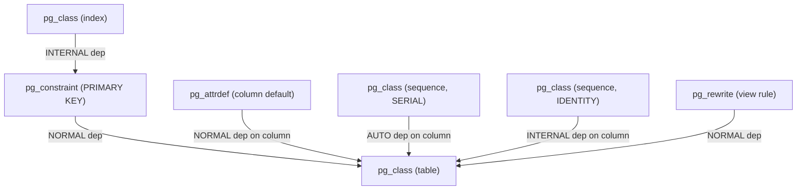
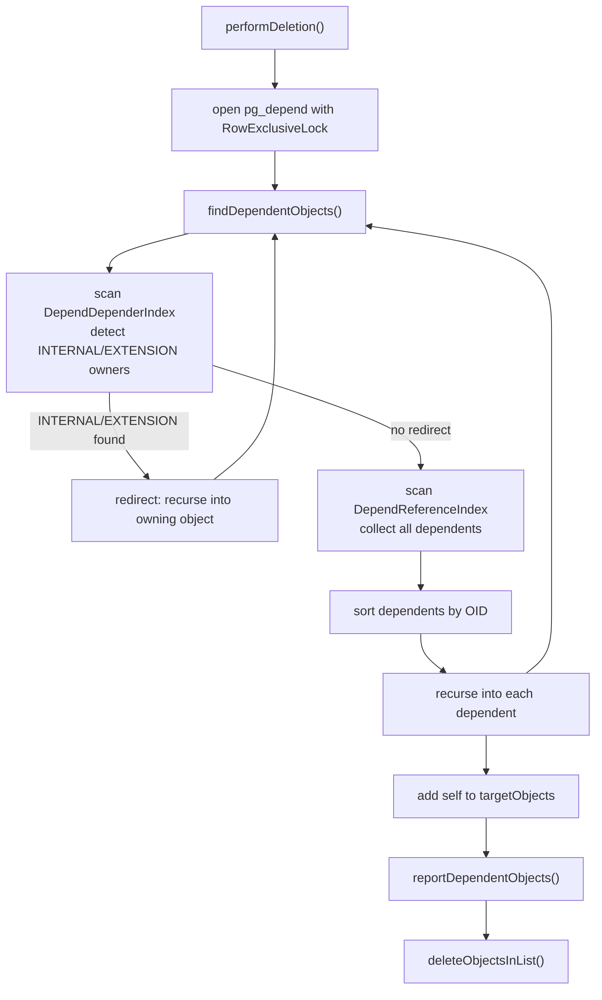

Every time you create a table, index, constraint, view, function, or extension, PostgreSQL writes entries into `pg_depend` that describe what those objects rely on. When you later issue a DROP, the catalog engine reads those entries to figure out what must be removed along with the target, what must block the drop, and in what order objects can be safely deleted. Without this bookkeeping, cascading drops and safe schema evolution would require scanning every catalog table for cross-references.

## The Structure of pg_depend

Each row in `pg_depend` records a single directed dependency: one object (the *dependent*) relies on another (the *referenced*). The schema is symmetric: both sides are identified by a three-tuple of `(classid, objid, objsubid)`.

```
classid     -- OID of the pg_class row for the catalog that owns the dependent object
objid       -- OID of the dependent object within that catalog
objsubid    -- column number for column-level deps; 0 for whole-object deps

refclassid  -- OID of the pg_class row for the catalog that owns the referenced object
refobjid    -- OID of the referenced object
refobjsubid -- column number for column-level refs; 0 for whole-object refs

deptype     -- a single char encoding the kind of dependency
```

The struct is defined in `src/include/catalog/pg_depend.h` as `FormData_pg_depend`. The `classid` and `refclassid` fields are foreign keys into `pg_class` — they tell you which system catalog to look in for the object description. For example, `classid = RelationRelationId` means the dependent is a row in `pg_class`, while `classid = ProcedureRelationId` means it is a row in `pg_proc`.

The `objsubid` field encodes sub-object identity. For table columns, it holds the `attnum`. A default expression attached to column 3 would have `classid = AttrDefaultRelationId`, `objsubid = 0`, and `refobjsubid = 3` pointing at the column on the referenced table side. Not all possible attribute-to-relation dependencies are recorded here — only cases where the relationship is conditional or inconvenient to infer from catalog contents alone.

Two btree indexes back `pg_depend`:

- `pg_depend_depender_index` on `(classid, objid, objsubid)` — used when looking up what a given object depends on
- `pg_depend_reference_index` on `(refclassid, refobjid, refobjsubid)` — used when looking up what depends on a given object

Both indexes are essential to DROP performance, since the cascading traversal must scan in both directions.

## Dependency Types

The `deptype` column is a single ASCII character drawn from the `DependencyType` enum in `src/include/catalog/dependency.h`:

| deptype | Constant | Meaning |
|---------|----------|---------|
| `n` | `DEPENDENCY_NORMAL` | Standard dependency. DROP of referenced object cascades to dependent with `CASCADE`; blocks with `RESTRICT`. |
| `a` | `DEPENDENCY_AUTO` | Dependent is auto-dropped when referenced object is dropped, without requiring `CASCADE`. Used for indexes and statistics on a table. |
| `i` | `DEPENDENCY_INTERNAL` | Dependent is an internal implementation component of the referenced object. Cannot be dropped independently; DROP must go through the owning object. |
| `e` | `DEPENDENCY_EXTENSION` | Dependent is a member of an extension. Treated like `INTERNAL` for drop purposes. |
| `x` | `DEPENDENCY_AUTO_EXTENSION` | Dependent is auto-dropped if its extension is dropped, but can also be dropped independently. |
| `P` | `DEPENDENCY_PARTITION_PRI` | Used for partitioned table hierarchies; the dependent is a partition member of the primary partitioned object. |
| `S` | `DEPENDENCY_PARTITION_SEC` | Secondary partition relationship, used when an object participates in multiple partition hierarchies. |

The distinction between `NORMAL`, `AUTO`, and `INTERNAL` determines how DROP behaves when it encounters the dependency during traversal. A NORMAL dependency blocks a restricted drop and requires explicit CASCADE; an AUTO dependency silently removes the dependent; an INTERNAL dependency redirects the drop to the owning object instead.

**Pinned objects** are a special case that predates explicit `pg_depend` entries. Rather than recording a `PIN`-type row for every built-in object, PostgreSQL uses an OID range test in `IsPinnedObject()` (`src/backend/catalog/catalog.c`): any object with an OID below `FirstUnpinnedObjectId` is pinned unless it is a large object, a database, or the `public` namespace. This means the catalog tables for built-in types, operators, and access methods carry no `pg_depend` rows at all — the OID check simply blocks them.

## Common Dependency Chains

Understanding which dependency type is used in practice clarifies how schema objects relate to each other.

**Table and its column defaults.** A column DEFAULT expression is stored as a row in `pg_attrdef`. That row has a `NORMAL` dependency on the table column it belongs to (`refobjsubid` holds the attnum). Dropping the column cascades automatically to the default.

**SERIAL and IDENTITY columns.** A `SERIAL` column creates a sequence behind the scenes. The sequence has an `AUTO` dependency on the column (`refobjsubid != 0`). An `IDENTITY` column creates a sequence with an `INTERNAL` dependency instead, meaning the sequence cannot be dropped directly at all — it must be removed by altering or dropping the owning column. The difference between these two dep types is what makes `ALTER TABLE ... DROP COLUMN` behave differently for `SERIAL` versus `IDENTITY`.

**Indexes on a table.** An index has an `AUTO` dependency on the table it indexes. This is why `DROP TABLE` removes indexes silently without requiring `CASCADE`, while `DROP INDEX` on a unique index backing a primary key constraint fails until you drop the constraint first.

**Constraint and its index.** When a primary key or unique constraint is created, a backing index is built. The index has an `INTERNAL` dependency on the `pg_constraint` row, not directly on the table. This chains the index to the constraint so that both are removed together. Neither, however, can be dropped without the other.

**View and base table.** A view's rewrite rule has `NORMAL` dependencies on every relation it references. Dropping a base table with `RESTRICT` will error because the view depends on it; `CASCADE` propagates the drop to the view.

**Function and its return type.** A function has `NORMAL` dependencies on its argument types and return type. If a user-defined type is dropped, all functions that reference it in their signature must also be dropped or the command is blocked.

**Extension and its objects.** Every object created during `CREATE EXTENSION` acquires an `EXTENSION` dependency on the extension row in `pg_extension`. An attempt to drop one of those objects directly will fail with a message directing you to drop the extension instead. The same INTERNAL-branch logic in `findDependentObjects()` enforces this: it identifies the owning extension as the required target.



## How DROP Traverses pg_depend

Every DROP command that can participate in the dependency system routes through `performDeletion()` or `performMultipleDeletions()` in `src/backend/catalog/dependency.c`. Both functions open `pg_depend` once with `RowExclusiveLock` and pass the open relation through the entire recursive traversal to avoid repeated opens.

The traversal is a depth-first search implemented in `findDependentObjects()`. It maintains two data structures:

- A **stack** of objects currently being visited (for cycle detection)
- A **targetObjects** list of objects confirmed for deletion (the output)

For each object being visited, the function performs two scans:

1. Scan the `DependDependerIndex` (looking up what *this* object depends on) to detect INTERNAL or EXTENSION dependencies that would redirect the drop to an owning object.
2. Scan the `DependReferenceIndex` (looking up what depends on *this* object) to collect all dependents that must be recursively visited.

The redirect logic for INTERNAL/EXTENSION dependencies is subtle. If, at the outermost recursion level, an object has an INTERNAL dependency on some owner, `findDependentObjects()` refuses the drop unless the owner is itself in the pending deletion list. When recursing, if the owner is already on the stack, the dependency is harmless — the owner will be deleted after. Otherwise, the function releases its lock on the current object, acquires a deletion lock on the owner, and recurses into the owner instead.

After collecting all dependents of an object, `findDependentObjects()` sorts them by `(classId, objectId, objectSubId)` before recursing. This sorting is not required for correctness. Any topological order that visits dependents before their dependencies is valid. The sort ensures consistent output from `DROP CASCADE` across runs, which matters for regression test stability.

The result of the traversal is that `targetObjects` holds objects in safe deletion order: each object appears after all of its dependents. `findDependentObjects()` builds the list leaves-first, through post-order placement: it calls `add_exact_object_address_extra` after recursing into all dependents.



## RESTRICT vs CASCADE

After `findDependentObjects()` builds the full deletion set, `reportDependentObjects()` enforces the behavior mode.

Under `DROP RESTRICT`, any object in `targetObjects` that was reached via a NORMAL dependency (and only via NORMAL paths) causes an error. RESTRICT mode allows silent deletion of objects reached via AUTO, INTERNAL, PARTITION, or EXTENSION paths. This is why `DROP TABLE` does not require `CASCADE` just because the table has indexes — those indexes are AUTO dependents.

Under `DROP CASCADE`, the system deletes all objects in `targetObjects` and emits a NOTICE for each NORMAL-dependency cascade. Setting the `PERFORM_DELETION_QUIETLY` flag suppresses the NOTICE message to DEBUG2 level (used for internal operations like temporary schema cleanup).

The error reporting caps client-facing output at 100 dependencies (`MAX_REPORTED_DEPS`) and emits the full list to the server log only, since extremely long error strings can cause problems with client libraries.

## The Deletion Queue and Object Removal

`deleteObjectsInList()` iterates `targetObjects` in order and calls `deleteOneObject()` for each. The ordering guarantee from `findDependentObjects()` means dependents are always deleted before the objects they depend on, so foreign key checks and catalog integrity constraints are not violated mid-transaction.

Each call to `deleteOneObject()` dispatches to `doDeletion()`, which uses the object's `classId` to select the appropriate catalog-specific removal function: `heap_drop_with_catalog()` for relations, `RemoveFunctionById()` for functions, and so on. Before the per-type deletion, `deleteOneObject()` removes the `pg_depend` rows for the object itself (via `deleteDependencyRecordsFor()`), so that subsequent recursive calls do not revisit already-processed dependencies.

Event triggers fire before the actual deletions if `trackDroppedObjectsNeeded()` returns true, allowing extension code to observe the complete list of objects about to disappear.

## pg_shdepend: Dependencies on Shared Objects

`pg_depend` is per-database: it lives in each database's schema and records dependencies on objects that exist within the same database. Shared objects — roles (`pg_authid`), tablespaces (`pg_tablespace`), and databases themselves — exist at the cluster level and are visible across all databases. A per-database catalog cannot record dependencies on these objects without cross-database scans during DROP.

`pg_shdepend` solves this by living in the shared catalog space (its `BKI_SHARED_RELATION` attribute creates it in the global catalog area). It has the same logical structure as `pg_depend` with one addition: a `dbid` column that identifies the database containing the dependent object. A zero `dbid` means the dependent is itself a shared object.

The `deptype` field in `pg_shdepend` uses a different enum, `SharedDependencyType`:

| deptype | Constant | Meaning |
|---------|----------|---------|
| `o` | `SHARED_DEPENDENCY_OWNER` | The referenced role owns the dependent object. |
| `a` | `SHARED_DEPENDENCY_ACL` | The referenced role appears in the ACL of the dependent object. |
| `r` | `SHARED_DEPENDENCY_POLICY` | The referenced role is mentioned in a row security policy. |
| `t` | `SHARED_DEPENDENCY_TABLESPACE` | The referenced tablespace is used by a relation without storage (e.g. partitioned table). |

When you attempt `DROP ROLE`, `checkSharedDependencies()` (`src/backend/catalog/pg_shdepend.c`) scans `pg_shdepend` using the `SharedDependReferenceIndexId` index and builds a human-readable list of all objects that depend on the role. If any such objects exist in other databases that the current session cannot inspect, the function still reports a count — it cannot describe them, but it cannot ignore them either. This cross-database awareness is the core reason `pg_shdepend` exists as a separate catalog.

The `checkSharedDependencies()` function distinguishes three categories of dependents: objects in the current database (fully describable), shared objects visible in the current session (describable), and objects in remote databases (count only). DROP ROLE fails if any category is non-empty; there is no CASCADE mode for role drops.

## Inspecting Dependencies

The two indexes make ad-hoc dependency queries fast:

```sql
-- Everything that depends on table mytable
SELECT dep.deptype,
       cl.relname AS dependent_relation,
       dep.objsubid,
       dep.classid
FROM   pg_depend dep
JOIN   pg_class cl ON cl.oid = dep.objid AND dep.classid = 'pg_class'::regclass
WHERE  dep.refclassid = 'pg_class'::regclass
  AND  dep.refobjid   = 'mytable'::regclass;

-- Everything the function myfunc() depends on
SELECT dep.deptype,
       dep.refclassid::regclass AS ref_catalog,
       dep.refobjid,
       dep.refobjsubid
FROM   pg_depend dep
WHERE  dep.classid  = 'pg_proc'::regclass
  AND  dep.objid    = 'myfunc()'::regprocedure;

-- Which roles own objects in this database
SELECT r.rolname,
       sd.classid::regclass AS catalog,
       sd.objid
FROM   pg_shdepend sd
JOIN   pg_roles r ON r.oid = sd.refobjid
WHERE  sd.dbid     = (SELECT oid FROM pg_database WHERE datname = current_database())
  AND  sd.deptype  = 'o';  -- SHARED_DEPENDENCY_OWNER
```

The system view `pg_depend` is directly queryable with no special privileges, making it convenient for understanding what will be affected before issuing a cascading DROP.

## DROP Performance on Wide Schemas

The traversal in `findDependentObjects()` acquires a deletion lock on every object it visits — not just the original target. On schemas with thousands of objects (large extension installs, highly connected type hierarchies, or tables with many indexes and constraints), the recursion visits a large number of objects and acquires a large number of locks within a single transaction. Lock acquisition itself contends on the lock manager's partition mutex. The scan of `pg_depend` for each object adds catalog I/O.

The sorted-dependent-list approach adds a `qsort()` call per visited object, which is cheap for small fan-outs but adds up when a table has hundreds of dependent indexes and statistics. Extensions that define many inter-dependent types or operators can create particularly deep recursion stacks; the traversal calls `check_stack_depth()` at each recursion level to detect overflow before it happens.

The `PERFORM_DELETION_CONCURRENTLY` flag exists for `DROP INDEX CONCURRENTLY`, which needs different lock semantics. Concurrent deletion, however, does not generalize to other object types. Bulk schema operations (dropping an extension with hundreds of member objects) all go through the same single-transaction traversal.

## Related Topics

- [[subsystems/catalog/core-catalogs|Core Catalogs]] — the system catalogs (`pg_class`, `pg_proc`, etc.) whose OIDs appear as `classid` and `refclassid` in every `pg_depend` row
- [[subsystems/catalog/object-addressing|Object Addressing]] — the `ObjectAddress` struct and helpers that identify objects by `(classId, objectId, objectSubId)`, matching the three-part key used in `pg_depend`
- [[code-paths/drop-commands|DROP Commands]] — the command-level entry points that call `performDeletion()` and drive the dependency traversal described here
- [[subsystems/extensions/overview|Extensions]] — extension objects acquire `DEPENDENCY_EXTENSION` rows in `pg_depend`, and DROP EXTENSION relies entirely on this catalog to find all member objects
- [[subsystems/catalog/pg-class|pg_class]] — the primary catalog referenced by `classid = RelationRelationId` in most `pg_depend` rows; tables, indexes, sequences, and views all appear here
- [[subsystems/auth/role-management|Role Management]] — DROP ROLE triggers `checkSharedDependencies()` against `pg_shdepend`, which records every object owned by or granting privileges to a role
- [[subsystems/locking/overview|Locking Overview]] — `findDependentObjects()` acquires a deletion lock on every visited object, making lock contention a practical concern for cascading drops on large schemas
