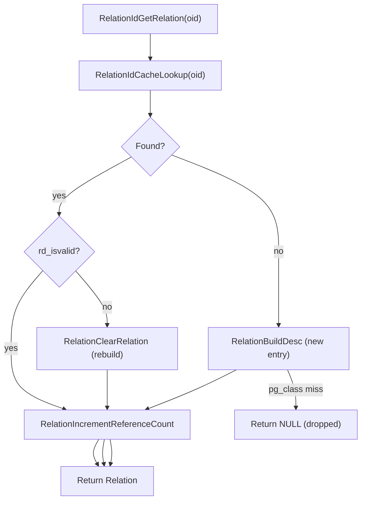
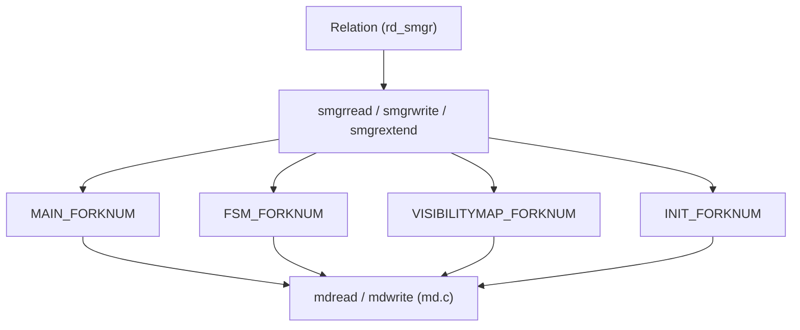
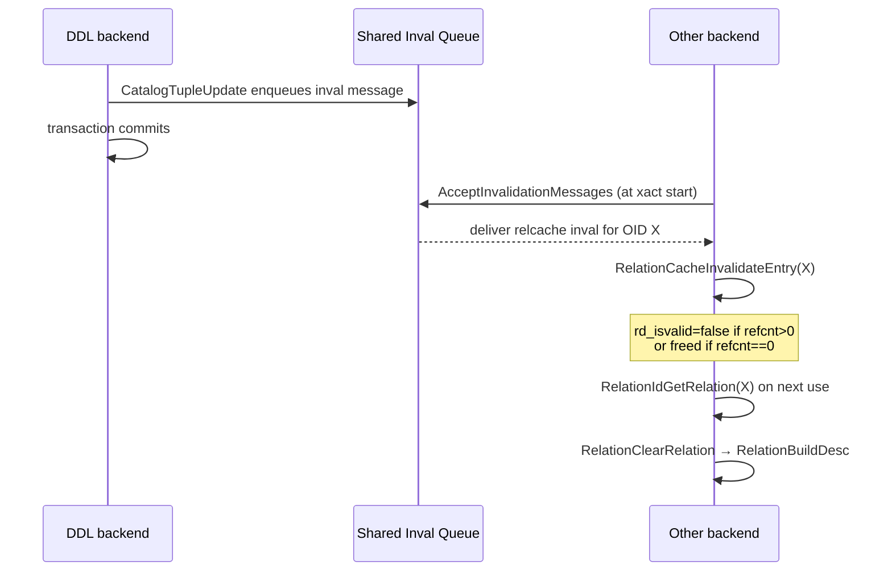

# Relation Cache (relcache)

Every time a backend opens a table, index, or sequence, it needs more than just the relation's OID — it needs a complete structural description: the column definitions, the storage location, the rewrite rules, the row-level security policies, and the access method routines. Assembling this information from the system catalogs on every access would require scanning `pg_class`, `pg_attribute`, `pg_index`, `pg_rewrite`, and several other tables, each of which may itself require catalog lookups to interpret. The relation cache (relcache) exists to absorb that cost by keeping fully-assembled relation descriptors in memory for the lifetime of a backend session.

The relcache is a per-backend hash table, `RelationIdCache`, keyed by relation OID. Each entry maps an OID to a live `RelationData` struct (typedef'd as `Relation`). The macros `RelationIdCacheLookup`, `RelationCacheInsert`, and `RelationCacheDelete` in `relcache.c` manage the table. All three delegate to the generic `hash_search()` facility with the OID as the sole key.

## The RelationData Structure

`RelationData` (`src/include/utils/rel.h`) is the central type of the relcache. A `Relation` pointer returned by `RelationIdGetRelation()` is a pointer to one of these. Its fields cover five broad concerns: physical identity, catalog data, behavioral descriptors, lazy-populated ancillary data, and lifecycle bookkeeping.

### Physical identity and storage

| Field | Type | Purpose |
|---|---|---|
| `rd_locator` | `RelFileLocator` | tablespace OID + database OID + relfilenumber: the physical address of the main relation file |
| `rd_smgr` | `SMgrRelation` | cached storage manager handle; `NULL` until first I/O |
| `rd_backend` | `BackendId` | owning backend for temporary relations; `InvalidBackendId` for permanent relations |
| `rd_islocaltemp` | `bool` | true only for temp relations belonging to this session |

The relcache does not open `rd_smgr` eagerly. Callers use `RelationGetSmgr()` (`rel.h`), a small inline function. On first access, it calls `smgropen(rel->rd_locator, rel->rd_backend)` and caches the result in `rd_smgr`. Because a relcache flush also closes the smgr handle (via `RelationCloseSmgr()`), callers should not hold onto the returned pointer across operations that could trigger invalidation.

### Core catalog data

| Field | Type | Purpose |
|---|---|---|
| `rd_id` | `Oid` | the relation's OID; also the hash key |
| `rd_rel` | `Form_pg_class` | pointer to a palloc'd copy of the `pg_class` row |
| `rd_att` | `TupleDesc` | tuple descriptor built from `pg_attribute` rows |
| `rd_options` | `bytea *` | parsed `pg_class.reloptions`; `NULL` means "use defaults" |
| `rd_index` | `Form_pg_index` | `pg_index` row (index relations only) |
| `rd_indextuple` | `HeapTupleData *` | the full `pg_index` tuple (index relations only) |

`RelationBuildDesc()` loads `rd_rel` first. `RelationBuildTupleDesc()` builds `rd_att` immediately afterwards. It scans `pg_attribute` for all columns of the relation and constructs a `TupleDescData` in `CacheMemoryContext`. The tuple descriptor includes per-attribute type OIDs, typmod values, collation OIDs, and the constraint information from `pg_attrdef` and `pg_constraint`.

### Behavioral descriptors

| Field | Type | Purpose |
|---|---|---|
| `rd_rules` | `RuleLock *` | rewrite rules loaded from `pg_rewrite` |
| `rd_rulescxt` | `MemoryContext` | private [[subsystems/memory/contexts|memory context]] for `rd_rules` |
| `trigdesc` | `TriggerDesc *` | trigger metadata from `pg_trigger`; `NULL` if none |
| `rd_rsdesc` | `RowSecurityDesc *` | row-level security policies; `NULL` if none |
| `rd_tableam` | `TableAmRoutine *` | table access method function table |
| `rd_indam` | `IndexAmRoutine *` | index access method function table (index relations only) |
| `rd_amhandler` | `Oid` | OID of the AM handler function |

### Lazily-populated ancillary data

Several fields are not filled during the initial `RelationBuildDesc()` call. They are populated on demand and tracked with separate validity flags:

| Field | Validity flag | Purpose |
|---|---|---|
| `rd_indexlist` | `rd_indexvalid` | list of OIDs of all indexes on this relation |
| `rd_pkindex` | `rd_indexvalid` | OID of the primary key index |
| `rd_replidindex` | `rd_indexvalid` | OID of the replica identity index |
| `rd_statlist` | `rd_statvalid` | list of OIDs of extended statistics objects |
| `rd_fkeylist` | `rd_fkeyvalid` | list of `ForeignKeyCacheInfo` structs |
| `rd_partkey` | (non-NULL) | partition key; `NULL` until `RelationGetPartitionKey()` |
| `rd_partdesc` | (non-NULL) | partition descriptor; `NULL` until first use |
| `rd_keyattr` / `rd_pkattr` / `rd_idattr` | `rd_attrsvalid` | bitmaps of columns referenced by FK, PK, and replica identity |

The index list (`rd_indexlist`) is especially important for the executor and the HOT update logic: a backend must know which columns are indexed before deciding whether an update can be heap-only. `RelationGetIndexList()` populates the list from `pg_index` on first call and caches it; any relcache invalidation for the relation clears `rd_indexvalid` and forces a reload on next access.

### Lifecycle bookkeeping

| Field | Type | Purpose |
|---|---|---|
| `rd_refcnt` | `int` | reference count; see below |
| `rd_isnailed` | `bool` | true for critical system catalogs that must not be evicted |
| `rd_isvalid` | `bool` | false when an invalidation has been received but the entry has not yet been rebuilt |
| `rd_createSubid` | `SubTransactionId` | subxact that created this relation in the current top transaction; `InvalidSubTransactionId` if created before |
| `rd_newRelfilelocatorSubid` | `SubTransactionId` | highest subxact that changed `rd_locator` to its current value |

## Entry Lookup and the Hash Table

The public entry point for any code that needs to work with a relation is `RelationIdGetRelation(Oid relationId)` (`relcache.c`). Its logic is straightforward:

`RelationIdCacheLookup` is a macro that calls `hash_search(RelationIdCache, &oid, HASH_FIND, NULL)` and extracts the `reldesc` pointer. On a hit, the lookup checks whether `rd_isvalid` is false, meaning an invalidation arrived while the entry had open references. If so, it rebuilds the entry in place before returning it. Indexes go through the lighter `RelationReloadIndexInfo()`. Tables and other objects go through `RelationClearRelation(relation, true)`, which rebuilds the full descriptor.

A cache miss calls `RelationBuildDesc()` to construct a new entry and insert it. The caller must already hold at least `AccessShareLock` on the relation OID; without that, concurrent DDL could drop the relation's `pg_class` row between the miss detection and the catalog scans inside `RelationBuildDesc()`.

`RelationClose(Relation relation)` is the counterpart to `RelationIdGetRelation()`. It simply calls `RelationDecrementReferenceCount()`, which decrements `rd_refcnt` and releases the reference from the current `ResourceOwner`. The descriptor itself remains in the cache with `rd_refcnt == 0` until either it is invalidated and rebuilt or the session ends.

## Building a Descriptor from Scratch

`RelationBuildDesc(Oid targetRelId, bool insertIt)` constructs a complete `RelationData` by reading the system catalogs in order:

1. `ScanPgRelation()` fetches the `pg_class` row for `targetRelId`, using an index scan if `criticalRelcachesBuilt` is true or a heap scan otherwise.
2. `AllocateRelationDesc()` pallocs the `RelationData` in `CacheMemoryContext` and copies the `pg_class` form into `rd_rel`.
3. `RelationBuildTupleDesc()` scans `pg_attribute` (via the `ATTNUM` syscache) to build `rd_att`, then calls `AttrDefaultFetch()` to load column defaults from `pg_attrdef` and `CheckConstraintFetch()` for check constraints.
4. For index relations, `RelationInitIndexAccessInfo()` reads `pg_index`, loads the opclass and operator family OIDs for each index column, and resolves the support procedure OIDs from `pg_amproc`.
5. Rewrite rules (`rd_rules`) are loaded only if `pg_class.relhasrules` is set.
6. Row security policies (`rd_rsdesc`) are loaded only if `pg_class.relrowsecurity` is set.
7. `RelationInitPhysicalAddr()` resolves `rd_locator` from `relfilenode` in `pg_class` or from the relation mapper for mapped relations.
8. `RelationInitTableAccessMethod()` or `RelationInitIndexAccessInfo()` resolves the `rd_tableam` or `rd_indam` function tables.

The entire build runs inside `CacheMemoryContext` so that all allocated structures persist beyond the originating transaction.

`RelationBuildDesc()` itself calls `table_open()`, and `table_open()` calls `AcceptInvalidationMessages()`. As a result, an invalidation message can arrive for the relation being built while the build is in progress. The `in_progress_list` stack tracks these ongoing builds. If a matching invalidation arrives, the build sets the entry's `invalidated` flag and restarts its catalog scan from the `retry:` label, instead of caching a descriptor that may be stale.

## Reference Counting

`rd_refcnt` counts every open reference to a relation. The count starts at 0 for normal relations and at 1 for nailed relations; nailed relations are never allowed to reach 0. `RelationIncrementReferenceCount()` increments the count and registers the relation with the current `ResourceOwner`; `RelationDecrementReferenceCount()` decrements it and removes the registration.

The `ResourceOwner` mechanism closes every relation a query opened when the query's resource owner is released. This happens even if the query errors out. A relation with a positive refcount cannot be freed, but it can be marked `rd_isvalid = false` to indicate that a rebuild is needed on next use.

Nailed relations (`rd_isnailed = true`) are critical system catalogs — `pg_class`, `pg_attribute`, `pg_proc`, `pg_type`, `pg_database`, `pg_authid`, `pg_auth_members` — that must be permanently resident in the cache. Their `rd_refcnt` starts at 1 at startup and is never allowed to drop to 0. When a nailed relation is invalidated, `RelationReloadNailed()` refreshes its `rd_rel` from `pg_class` in place but does not discard the descriptor.

## Relation Forks and the Storage Manager

A heap relation's physical data is spread across up to four files, called *forks*, distinguished by a `ForkNumber`:

| Fork | Constant | File suffix | Purpose |
|---|---|---|---|
| Main | `MAIN_FORKNUM` (0) | (none) | heap or index data pages |
| [[subsystems/storage/fsm|Free Space Map]] | `FSM_FORKNUM` (1) | `_fsm` | per-page free space summaries |
| [[subsystems/storage/visibility-map|Visibility Map]] | `VISIBILITYMAP_FORKNUM` (2) | `_vm` | all-visible and all-frozen bits per page |
| Init | `INIT_FORKNUM` (3) | `_init` | unlogged relation init fork (truncated to zero at recovery) |

The relcache descriptor does not store separate handles for each fork. Instead, all fork I/O goes through the single `SMgrRelation` handle in `rd_smgr`, passing the `ForkNumber` argument at each call. `smgrread()`, `smgrwrite()`, `smgrextend()`, and similar functions all take a `ForkNumber` parameter. The storage manager layer (`smgr.c`) translates the `(RelFileLocator, ForkNumber, BlockNumber)` triple to an actual OS file path.

The `rd_smgr` pointer is an owning pointer. `relcache.c` calls `smgrsetowner(&rel->rd_smgr, ...)` to register this ownership. As a result, the `rd_smgr` field is automatically set back to `NULL` if the `SMgrRelation` is closed, for example by `smgrcloseall()` during a full cache invalidation.

## Cache Invalidation

When a DDL statement modifies a relation's definition, the backend executing the DDL queues a `SharedInvalidationMessage` of type `SHAREDINVALINVALID` for the affected OID into the shared invalidation queue (`sinvaladt.c`). Other backends drain this queue at transaction boundaries and at the start of each command via `AcceptInvalidationMessages()`, which calls `RelationCacheInvalidateEntry()` for each relcache-targeted message.

`RelationCacheInvalidateEntry(Oid relationId)` looks up the entry in `RelationIdCache`:

- If found with `rd_refcnt == 0`, `RelationFlushRelation()` destroys the descriptor immediately.
- If found with positive refcount, the entry is marked `rd_isvalid = false` but kept alive. It will be rebuilt in `RelationIdGetRelation()` when next accessed.
- If not found, the OID is checked against `in_progress_list` to catch the case where `RelationBuildDesc()` is currently building an entry for this relation; if found there, the build's `invalidated` flag is set so it restarts.

A more severe form of invalidation occurs when the shared invalidation queue overflows or when `debug_discard_caches` is active. In this case, `RelationCacheInvalidate(bool debug_discard)` performs a two-phase scan of the entire `RelationIdCache`:

- **Phase 1** — the scan frees entries with zero refcount immediately. It closes the smgr handle of entries with positive refcount and queues them for rebuild. It refreshes the `rd_locator` of mapped relations first, since the relation map may have changed.
- **Phase 2** — this phase rebuilds queued entries in a specific order: `pg_class` first, then `pg_class_oid_index`, then other nailed relations, then everything else. This ordering ensures that the system catalogs needed to rebuild any descriptor are up to date before the rebuild consults them.

### Init File Invalidation

DDL that modifies a critical catalog must also invalidate the `pg_internal.init` files so that freshly-started backends do not load stale data. A pair of calls bracketing the commit accomplishes this:

1. `RelationCacheInitFilePreInvalidate()` — acquires `RelCacheInitLock` and unlinks both init files while holding the lock.
2. `RelationCacheInitFilePostInvalidate()` — releases `RelCacheInitLock`.

The lock ensures that no backend is in the middle of reading an init file when it is unlinked. After the unlink, the next backend to start up will find no init file and will bootstrap from the catalogs, then write a fresh init file at the end of its startup transaction.

## The Init File: Startup Acceleration

Building relcache entries for every critical system catalog from scratch on every backend startup would require dozens of catalog scans before the first user query could be processed. PostgreSQL avoids this by serialising the relcache entries for a fixed set of critical relations into binary init files at the end of each startup sequence (and after any relevant DDL):

- `global/pg_internal.init` — entries for shared system catalogs (`pg_database`, `pg_authid`, `pg_auth_members`, `pg_shseclabel`, `pg_subscription`) and their indexes.
- `base/<dboid>/pg_internal.init` — entries for per-database system catalogs (`pg_class`, `pg_attribute`, `pg_proc`, `pg_type`) and their indexes.

`RelationCacheInitializePhase2()` tries to load the shared init file first. `RelationCacheInitializePhase3()` tries the local init file next. If either file is missing or has a wrong magic number (`RELCACHE_INIT_FILEMAGIC`), the backend falls back to building phony stubs via `formrdesc()` — hard-coded descriptors generated from the compile-time schema definitions in `schemapg.h`. It then sets `needNewCacheFile = true`, so it writes a fresh init file at the end of startup.

The init file contains a binary dump of each `RelationData` struct followed by its variable-length substructures (`TupleDesc`, attribute arrays, `pg_index` tuple, support procedure arrays). The magic number embeds the `RELCACHE_INIT_FILEMAGIC` constant, so that the backend rejects init files from incompatible builds.

Once the critical relcache entries are in place, the backend sets `criticalRelcachesBuilt` to `true`. This flag gates a global behaviour change: before it is set, `pg_class` scans use heap scans rather than index scans (because the index relcache entries do not yet exist), and several catalog-access fallback paths are active. After it is set, the backend uses all the normal index-scan paths.

## See also

- [[subsystems/catalog/syscache]] — the catcache layer that the relcache relies on for individual tuple lookups during `RelationBuildDesc`
- [[subsystems/storage/buffer-manager]] — catalog heap pages read during `RelationBuildDesc` flow through the buffer manager
- [[subsystems/transactions/mvcc]] — the catalog snapshot used during relcache builds is a specialised MVCC snapshot
- [[architecture/overview]] — the per-backend nature of the relcache is part of the shared-nothing-between-backends design
