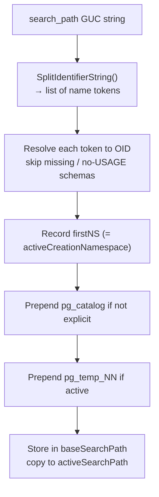

# Schema Search Path and Name Resolution

When a query references an unqualified object name — a table, function, operator, or type without an explicit `schema.name` prefix — PostgreSQL must decide which schema to look in. The `search_path` GUC defines an ordered list of schemas to search. The first match wins. Everything from DDL to function calls to type coercions goes through this resolution mechanism, making `search_path` one of the most broadly impactful session-level settings in the system.

## The search_path GUC

`search_path` is a comma-separated list of schema names. The default value is `"$user", public`. The special token `$user` is not a literal schema name; at resolution time, PostgreSQL substitutes it with the name of the current role (from `pg_authid.rolname`). If a schema with that name exists and the current user has `USAGE` on it, the resolver includes it in the path. Otherwise, it silently skips the schema.

The `public` schema is a conventional default that `initdb` creates, but it has no special status in the name resolution code. It is present in the default path only because the GUC default says so.

Typical settings:

```sql
-- Session-level, reverts at session end
SET search_path = myapp, public;

-- Per-role default, persists across sessions
ALTER ROLE alice SET search_path = alice, shared, public;

-- Per-database default, applies to all connecting sessions
ALTER DATABASE mydb SET search_path = myapp, public;
```

`pg_db_role_setting` stores the per-role and per-database defaults. `ApplySettings()` applies them during session startup, before any user SQL runs.

## Implicit schemas: pg_catalog and pg_temp

Two schemas participate in search even when they are absent from the explicit list.

PostgreSQL always searches **`pg_catalog`**. The exact position depends on whether it appears explicitly in `search_path`. If `pg_catalog` does not appear explicitly, PostgreSQL inserts it at the front, before every user schema, following SQL99's requirement that the system catalog namespace is always reachable. If it does appear explicitly, PostgreSQL searches it at the position given.

This has a non-obvious consequence: you cannot shadow a built-in function by creating a same-named function in a user schema and listing that schema first, unless you also place `pg_catalog` explicitly *after* that schema. With the default path `"$user", public`, a function created in `public` does not shadow `pg_catalog.length`, because PostgreSQL prepends `pg_catalog` before `public` during resolution. To shadow a system function, the path must explicitly demote `pg_catalog`:

```sql
SET search_path = public, pg_catalog;  -- now public functions shadow pg_catalog
```

PostgreSQL prepends **`pg_temp_NN`** (the session's temporary-table namespace) before everything else, once a temp namespace has been initialized. The alias `pg_temp` in the `search_path` string resolves to whatever `pg_temp_NN` OID belongs to the current session. For security reasons, PostgreSQL searches the temp namespace only for relations and types, not for functions, operators, or other object types. This prevents a hostile user from shadowing a trusted function by creating one in a temp schema.

The effective search order for most queries is therefore:

```
pg_temp_NN (if active)  →  pg_catalog  →  explicit list entries (left to right)
```

## Building the active search path

PostgreSQL converts the raw GUC string (e.g. `"$user", public`) to a list of OIDs lazily, on the first unqualified name lookup after the path becomes dirty. Three events set the dirty state: assigning to `search_path`, a `pg_namespace` or `pg_authid` syscache invalidation, or a role-switch. `recomputeNamespacePath()` (`namespace.c`) performs the conversion.



The function:
1. Splits `namespace_search_path` on commas.
2. For each token, resolves the OID: `$user` triggers a `AUTHOID` syscache lookup; `pg_temp` maps to `myTempNamespace`; anything else calls `get_namespace_oid()`.
3. The function silently drops schemas that do not exist or where `ACL_USAGE` is denied. This is intentional — the GUC was already accepted at assignment time, so errors are not appropriate here.
4. The first element of the resulting OID list becomes `activeCreationNamespace`: the schema where a `CREATE TABLE t (...)` with no explicit schema would land.
5. The function prepends `PG_CATALOG_NAMESPACE` if it is absent. It prepends `myTempNamespace` if the namespace is set and not already present.
6. The function stores the result in `baseSearchPath` (in `TopMemoryContext`, since it must survive transaction boundaries) and points `activeSearchPath` to it.

The `namespaceUser` field records which role the path was computed for. If the current user ID differs on the next call, `recomputeNamespacePath()` recomputes the path, because `$user` may now resolve differently and ACL_USAGE checks against schemas might have changed.

## Name resolution at the catalog level

Every unqualified name lookup calls `recomputeNamespacePath()` at the start, then iterates `activeSearchPath`:

```c
/* RelnameGetRelid, namespace.c */
recomputeNamespacePath();
foreach(l, activeSearchPath)
{
    Oid namespaceId = lfirst_oid(l);
    relid = get_relname_relid(relname, namespaceId);
    if (OidIsValid(relid))
        return relid;
}
return InvalidOid;
```

The same pattern appears for `TypenameGetTypid`, `OpernameGetOprid`, `FuncnameGetCandidates`, and every other unqualified object lookup. Each call resolves lazily and stops at the first match.

The analyzer converts a parsed `RangeVar` (unqualified or qualified) into a relation OID via `RangeVarGetRelidExtended()` (`namespace.c`). If the `RangeVar` has a `schemaname`, the lookup bypasses the search path entirely and resolves only in that schema. If not, it delegates to `RelnameGetRelid()`. After resolving the OID, `RangeVarGetRelidExtended()` loops with invalidation checks: if a syscache message arrives between the name lookup and the lock acquisition, it repeats the name lookup to ensure the locked OID still matches the name.

## The override stack

Certain backend code paths must temporarily substitute a fixed search path regardless of the session's `search_path` GUC — for example, when running event trigger functions or installing an extension. `PushOverrideSearchPath()` / `PopOverrideSearchPath()` (`namespace.c`) implement a stack of override entries. While any override is active, `recomputeNamespacePath()` returns immediately without touching `baseSearchPath`.

The function comment for `PushOverrideSearchPath` explicitly cautions: "Do not use this function; almost any usage introduces a security vulnerability." The override bypasses ACL checks on the implicit schemas and persists across permission changes that would otherwise invalidate the base path.

## Temporary tables and pg_temp

PostgreSQL does not create a session's temporary namespace (`pg_temp_NN`) until the first `CREATE TEMP TABLE` in that session. Until then, `myTempNamespace` is `InvalidOid`. PostgreSQL silently ignores the `pg_temp` token in the path string when the temp namespace has not yet been initialized. There is one exception: if `pg_temp` appears as the first element of the explicit path, the resolver sets `activeTempCreationPending` to `true`. The next attempt to create an object in the default namespace will trigger `InitTempTableNamespace()` and land the object in the temp schema, even before any `CREATE TEMP TABLE` statement.

Each backend session gets its own `pg_temp_NN` schema (the `NN` is a backend ID). The alias `pg_temp` resolves to the current session's schema only; another session's temp schema is inaccessible by name. At session end or after a transaction that created temp tables is aborted, `RemoveTempRelations()` cleans up the schema.

## Security: search_path injection

Because unqualified names resolve against the active search path, an attacker who can create objects in a schema that appears before a trusted schema in the path can intercept function calls made with unqualified names. The canonical attack:

1. An application function calls `SELECT format(...)` without schema-qualifying `format`.
2. An attacker has `CREATE` privilege in a schema that appears before `pg_catalog` in the effective path.
3. The attacker creates `CREATE FUNCTION format(...) ...` in that schema.
4. The application's unqualified call now resolves to the attacker's function.

In practice, the default search path makes this difficult for `pg_catalog` functions because PostgreSQL prepends `pg_catalog` implicitly. But functions that live in user schemas — including many extension functions — are vulnerable if an attacker can place a shadow in an earlier-searched schema.

The documented mitigation for code running with elevated trust is to use fully schema-qualified names throughout, or to lock down the search path at the connection or function level:

```sql
-- Force pg_catalog as the only searched schema (no creation namespace)
SET search_path = pg_catalog;

-- Or restrict to exactly the schemas you intend
SET search_path = pg_catalog, myapp;
```

`pg_dump` and other system tools use a similar approach. The `ALWAYS_SECURE_SEARCH_PATH_SQL` macro defined in `src/include/common/connect.h` is:

```c
"SELECT pg_catalog.set_config('search_path', '', false);"
```

Setting `search_path` to the empty string removes all explicit schemas. `pg_catalog` still resolves implicitly, so system catalog queries work. But no user schema is reachable by unqualified name. DDL that would create an object in the default namespace fails, because `activeCreationNamespace` is `InvalidOid`.

## SECURITY DEFINER functions and search_path

A `SECURITY DEFINER` function runs with the privileges of its owner, not the caller. This means the caller's `search_path` is still in effect unless explicitly overridden. An attacker who can control the search path of a session that calls a security-definer function can inject objects into earlier schema positions, potentially redirecting any unqualified name the function uses.

The fix is to pin the search path inside the function definition:

```sql
CREATE OR REPLACE FUNCTION privileged_action()
  RETURNS void
  LANGUAGE plpgsql
  SECURITY DEFINER
  SET search_path = pg_catalog, myapp  -- <-- pins the path
AS $$
BEGIN
  -- calls here resolve only in pg_catalog and myapp
END;
$$;
```

When a function has a `proconfig` array (which includes any GUC settings specified with `SET` in the `CREATE FUNCTION`), `fmgr_security_definer()` (`fmgr.c`) opens a new GUC nesting level with `NewGUCNestLevel()` and applies the stored settings via `ProcessGUCArray()` before invoking the function body. The nesting level ensures the GUC reverts automatically when the function returns or on error, without relying on explicit cleanup.

```c
/* fmgr_security_definer, fmgr.c */
if (fcache->proconfig)
    save_nestlevel = NewGUCNestLevel();

if (OidIsValid(fcache->userid))
    SetUserIdAndSecContext(fcache->userid,
                           save_sec_context | SECURITY_LOCAL_USERID_CHANGE);

if (fcache->proconfig)
    ProcessGUCArray(fcache->proconfig,
                    (superuser() ? PGC_SUSET : PGC_USERSET),
                    PGC_S_SESSION,
                    GUC_ACTION_SAVE);
```

A function with neither `prosecdef` nor `proconfig` takes a fast path in `fmgr_info_cxt_security()`, which never wraps it in `fmgr_security_definer()` at all. The overhead only applies when those features are in use.

## Introspecting the active path

Two SQL functions expose the current state:

| Function | Returns |
|---|---|
| `current_schema()` | The first schema in the active explicit path — the default creation namespace. NULL if the explicit path is empty. |
| `current_schemas(include_implicit boolean)` | An array of all active schema names. If `true`, includes `pg_catalog` and `pg_temp_NN`; if `false`, returns only the explicit user-visible entries. |

`current_schemas(false)` corresponds to what the user typed in `search_path`; `current_schemas(true)` shows what the name resolution code actually walks.

```sql
SET search_path = myapp, public;

SELECT current_schema();
-- myapp

SELECT current_schemas(true);
-- {pg_catalog,myapp,public}

SELECT current_schemas(false);
-- {myapp,public}
```

`fetch_search_path()` (`namespace.c`) backs both functions; it calls `recomputeNamespacePath()` and returns a copy of `activeSearchPath`. When `activeTempCreationPending` is true — meaning `pg_temp` was first in the path but no temp tables exist yet — `fetch_search_path()` forces `InitTempTableNamespace()` to ensure the returned path reflects the actual creation namespace. This is why PostgreSQL classifies `current_schema()` as `stable` rather than `immutable`: it can have a side effect of schema creation.

## Visibility functions

`pg_table_is_visible(oid)`, `pg_function_is_visible(oid)`, and the analogous functions for other object types check whether a given object would be found by an unqualified name search. They work by scanning `activeSearchPath` and checking both that the object's schema appears in the path, and that no earlier schema in the path contains an object with the same name. These are the same functions used by `\d` and similar psql meta-commands to decide whether to display a schema prefix.

## Extensions and search_path

`CREATE EXTENSION` installs all extension objects into a target schema. It selects the schema in this order of precedence (`extension.c`):

1. The `SCHEMA schema_name` clause of `CREATE EXTENSION`, if provided.
2. The `schema` field in the extension's `.control` file, if set (mandatory for non-relocatable extensions).
3. `activeCreationNamespace` — the first explicit entry in `search_path`.

If none of the above yields a valid schema, `CREATE EXTENSION` raises an error. During installation, `execute_extension_script()` sets `search_path` to a path starting with the target schema, so that objects created by the extension script land in the right place without needing qualification inside the script itself.

After installation, the extension objects live in their schema regardless of the user's `search_path`. If the target schema is not in the search path, all references to extension functions must be schema-qualified.

## pg_dump and schema qualification

`pg_dump` always emits schema-qualified names for user objects, making its output independent of `search_path`. Before running any queries that reference user objects, it resets the connection's search path to the empty string:

```c
/* pg_dump.c */
ExecuteSqlStatement(fout, "RESET search_path");
/* ... then immediately: */
PQclear(ExecuteSqlQueryForSingleRow(fout, ALWAYS_SECURE_SEARCH_PATH_SQL));
```

The first `RESET` restores the GUC to its compiled default; `ALWAYS_SECURE_SEARCH_PATH_SQL` then clears it to the empty string. All subsequent catalog queries in pg_dump use `pg_catalog.`-qualified names throughout, including operators written as `OPERATOR(pg_catalog.=)` to avoid resolving through a potentially hostile search path.

## Invalidation and caching

The path-to-OID conversion in `recomputeNamespacePath()` reads from the syscache, so it is fast for repeated lookups. However, `recomputeNamespacePath()` caches the list result itself in `baseSearchPath` and reuses it until invalidated. Two syscache callbacks mark `baseSearchPathValid = false`:

- `NAMESPACEOID` cache invalidation — a schema was created, dropped, or renamed.
- `AUTHOID` cache invalidation — a role was renamed (which could change what `$user` resolves to).

PostgreSQL increments the `activePathGeneration` counter every time `activeSearchPath` changes content. Code that caches the search path result can compare this counter to detect staleness without re-scanning the full path list.

## Reference: search_path-related GUC settings

| Setting | Scope | Effect |
|---|---|---|
| `search_path` | Session / role / database | Ordered schema search list |
| `default_search_path` | — | Not a GUC; the factory default is `"$user", public` |

Relevant commands:

```sql
-- Show current effective path (with implicits)
SHOW search_path;

-- Show what will actually be searched including pg_catalog and pg_temp
SELECT current_schemas(true);

-- Lock down for a security-sensitive session
SET search_path = '';

-- Check what schema an object would be found in
SELECT nspname
FROM pg_namespace n
JOIN pg_class c ON c.relnamespace = n.oid
WHERE c.relname = 'mytable'
  AND pg_table_is_visible(c.oid);
```

## Related Topics

- [[subsystems/catalog/pg-namespace|pg_namespace]] — the catalog table that stores schema definitions, which name resolution iterates over when building the active path
- [[subsystems/catalog/syscache|Syscache]] — the syscache infrastructure that `recomputeNamespacePath()` queries for namespace and role OIDs, and whose invalidation callbacks trigger path recomputation
- [[subsystems/catalog/cache-invalidation|Cache Invalidation]] — explains how `NAMESPACEOID` and `AUTHOID` invalidations mark `baseSearchPathValid = false` and force a path rebuild
- [[subsystems/guc|GUC]] — the GUC machinery that stores, validates, and propagates the `search_path` setting across sessions, roles, and databases
- [[subsystems/catalog/per-role-settings|Per-Role Settings]] — how `ALTER ROLE … SET search_path` and `ALTER DATABASE … SET search_path` are stored in `pg_db_role_setting` and applied at session startup
- [[code-paths/schema-commands|Schema Commands]] — DDL operations (`CREATE SCHEMA`, `DROP SCHEMA`) that modify `pg_namespace` and thereby invalidate the cached search path
- [[subsystems/extensions/overview|Extensions Overview]] — how `CREATE EXTENSION` selects its target schema using the active creation namespace derived from `search_path`
- [[subsystems/catalog/core-catalogs|Core Catalogs]] — `pg_namespace`, `pg_class`, `pg_proc` and other catalogs that name resolution reads
- [[subsystems/roles-privileges|Roles and Privileges]] — how `ACL_USAGE` on schemas interacts with path resolution
- [[subsystems/row-level-security|Row-Level Security]] — another session-scoped security mechanism that interacts with schema visibility
- [[subsystems/parser/semantic-analysis|Semantic Analysis]] — where `RangeVar` to OID resolution happens in the query pipeline
