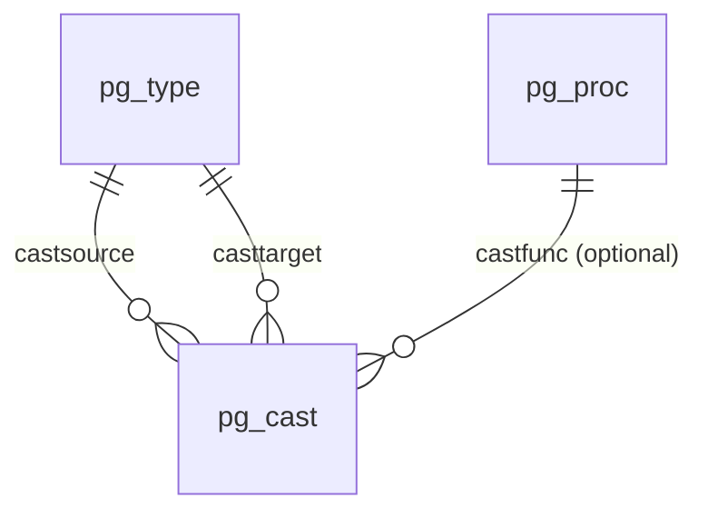
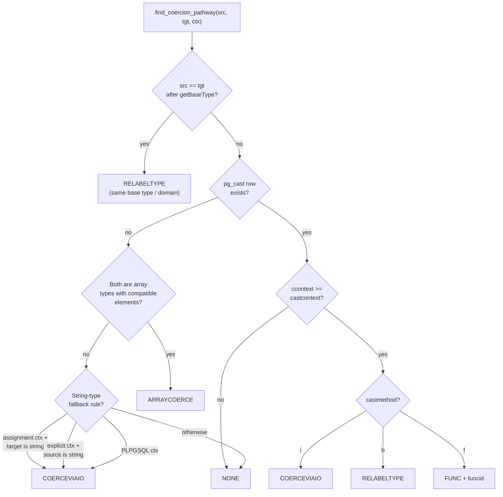

# Type Casting and Coercion: pg_cast

`pg_cast` is the system catalog that maps every known conversion between two data types. When the parser or planner needs to reconcile a type mismatch — whether silently in an expression or through an explicit `CAST()` call — it looks up the source and target OIDs in this catalog, reads three columns (`castfunc`, `castcontext`, `castmethod`), and decides how to materialize the conversion. The design separates *when* a cast is allowed (context) from *how* it is executed (method), which lets a single `pg_cast` row drive both the parser's coercion rules and the executor's conversion logic.

---

## The pg_cast Catalog Schema

`pg_cast` has OID 2605 (`CastRelationId`). Each row represents one directed edge in the type graph: a conversion from `castsource` to `casttarget`.

| Column | Type | Description |
|---|---|---|
| `oid` | `Oid` | Row identifier. |
| `castsource` | `Oid` | Source type OID (FK to `pg_type`). |
| `casttarget` | `Oid` | Target type OID (FK to `pg_type`). |
| `castfunc` | `Oid` | Conversion function OID (FK to `pg_proc`); `0` for binary and I/O casts. |
| `castcontext` | `char` | Permissible coercion contexts: `i`, `a`, or `e`. |
| `castmethod` | `char` | Execution mechanism: `f`, `b`, or `i`. |

Two unique indexes exist: one on `oid` and one on `(castsource, casttarget)`. The latter pair is what `find_coercion_pathway()` probes via `SearchSysCache2(CASTSOURCETARGET, ...)`, making every coercion check a cache-resident point lookup rather than a heap scan.

The catalog is deliberately minimal. It records no information about reversibility, transitivity, or cost — the planner infers those from the cast method and the function's own `pg_proc` metadata.



---

## Cast Context: Three Permission Levels

`castcontext` stores one of three ASCII codes that control when the cast may be applied without an explicit operator. The three levels exist to prevent silent data loss at different points in the SQL pipeline.

Implicit coercion (`i`) fires everywhere: operator resolution, UNION type unification, function argument matching, and ORDER BY/DISTINCT reconciliation. The parser applies these casts speculatively while scoring candidates, so a cast in this category directly affects which overloaded operator or function gets selected.

Assignment coercion (`a`) is designed for the INSERT/UPDATE path. There, the user has explicitly named a target column, so a silent conversion is reasonable, but it should not spread into general expressions.

Explicit-only casts (`e`) cover conversions that are either lossy (`float8` to `integer` truncates) or semantically surprising enough that the user must signal intent. They never affect overload resolution.

| Code | Constant | Permitted in |
|---|---|---|
| `i` | `COERCION_CODE_IMPLICIT` | Any expression context; the parser applies it automatically |
| `a` | `COERCION_CODE_ASSIGNMENT` | INSERT / UPDATE target column coercion; requires explicit syntax in general expressions |
| `e` | `COERCION_CODE_EXPLICIT` | Only when the user writes `CAST(x AS y)` or `x::y` |

The three levels form a strict hierarchy. `find_coercion_pathway()` converts the stored `char` into the internal `CoercionContext` enum (defined in `primnodes.h`) and performs a single numeric comparison:

```c
/* Rely on ordering of enum for correct behavior here */
if (ccontext >= castcontext)
    /* cast is applicable in this context */
```

Because the enum is ordered `COERCION_IMPLICIT < COERCION_ASSIGNMENT < COERCION_EXPLICIT`, a cast registered as assignment-compatible (`a`) also fires when explicit coercion is requested. It does not fire when the parser is resolving an implicit mismatch in a general expression.

A fifth context, `COERCION_PLPGSQL`, sits above `COERCION_EXPLICIT` and enables an I/O fallback for PL/pgSQL assignments (see the CoerceViaIO fallback section below).

---

## Cast Methods: How the Conversion Executes

`castmethod` records which runtime mechanism handles the conversion:

| Code | Constant | Meaning |
|---|---|---|
| `f` | `COERCION_METHOD_FUNCTION` | Call the function stored in `castfunc` |
| `b` | `COERCION_METHOD_BINARY` | No-op at the representation level; types share identical storage format |
| `i` | `COERCION_METHOD_INOUT` | Convert via the source type's output function into the target type's input function |

### Binary-Compatible Casts (method `b`)

Two types are binary compatible when their on-disk representations are identical — same `typlen`, `typbyval`, and `typalign`. The canonical example is `varchar` and `text`: both are `varlena` with the same internal layout. At the catalog level, PostgreSQL records this as `castmethod = 'b'` and `castfunc = 0`.

When `find_coercion_pathway()` encounters `COERCION_METHOD_BINARY`, it returns `COERCION_PATH_RELABELTYPE`. The parser then inserts a `RelabelType` node rather than a function call. `RelabelType` carries only a new type OID and is free at runtime — the executor reads the same bytes under a different type label. No function is invoked and no memory copy occurs.

The planner also exploits `RelabelType`. When a predicate contains `col::text` and `col` is `varchar`, the planner can recognize that the cast changes nothing physically. Index paths on `col` remain eligible because the physical key bytes are unchanged — the index stores the same varlena data regardless of whether the declared type is `varchar` or `text`. Without binary compatibility this optimization would be impossible; the planner would have to assume the function could return a different value than its input.

`IsBinaryCoercible(src, target)` tests both conditions together: whether a `pg_cast` row exists with `castmethod = 'b'` *and* `castcontext = 'i'`. The function also handles several hardwired cases that need no catalog row. A domain is always binary-coercible to its base type, but not vice versa, since the reverse direction requires domain constraint checking. Any type is binary-coercible to polymorphic pseudo-types like `ANYELEMENT` or `ANYCOMPATIBLE`. Array types are binary-coercible to `ANYARRAY`. Composite types are binary-coercible to `RECORD`. `IsBinaryCoercibleWithCast()` is the variant that additionally returns the matching `pg_cast` OID when one is involved.

Declaring a binary-compatible cast requires superuser privileges. The `CreateCast()` validator enforces that the two types agree on `typlen`, `typbyval`, and `typalign`, and explicitly rejects composite, enum, and array types — these all embed type OIDs in their stored representations and cannot be safely aliased. The error message in the source is explicit:

```
"source and target data types are not physically compatible"
```

### I/O Casts (method `i`)

An I/O cast uses the source type's output function to produce a `cstring` text representation, then calls the target type's input function to parse that string. The round-trip is semantically equivalent to writing `target_type(source_value::text)` by hand.

In the query plan this becomes a `CoerceViaIO` node:

```c
CoerceViaIO *iocoerce = makeNode(CoerceViaIO);
iocoerce->arg    = (Expr *) node;
iocoerce->resulttype = targetTypeId;
iocoerce->coerceformat = cformat;
```

The cost is material: two function calls per row plus allocation of an intermediate `cstring`. For bulk operations over millions of rows this can dominate runtime. I/O casts are appropriate when two types share a compatible text format but have no direct conversion function — many user-defined types fall into this category.

The `castmethod = 'i'` entry in `pg_cast` explicitly declares that a particular pair of types should use I/O conversion. This is distinct from the *fallback* I/O path that the parser synthesizes even without any `pg_cast` row (see below).

### Function-Based Casts (method `f`)

The most general form: `castfunc` stores the OID of a dedicated conversion function in `pg_proc`. The function must satisfy specific signature requirements validated at `CREATE CAST` time:

**One argument** `(sourcetype) → targettype`
The simplest form. No awareness of the target column's type modifier or whether the cast was written explicitly.

**Two arguments** `(sourcetype, integer) → targettype`
The second argument receives the type modifier (`atttypmod`) of the destination column, passed as an `int4` constant in the plan. A `targetTypMod` of `-1` means no constraint is in force. Used for length-constraining casts such as `varchar(n)` or `numeric(p, s)`.

**Three arguments** `(sourcetype, integer, boolean) → targettype`
Extends the two-argument form. The third argument is the `isExplicit` flag: `true` when the user wrote `CAST()` or `::` explicitly, `false` when the cast was applied implicitly. The parser computes this as `ccontext == COERCION_EXPLICIT`. Some built-in functions use `isExplicit` to decide whether to raise an error on overflow (explicit path can be strict) or silently truncate (implicit path must not raise errors).

PostgreSQL enforces the argument types at cast creation:

```c
if (nargs < 1 || nargs > 3)
    ereport(ERROR, ... "cast function must take one to three arguments");
if (nargs > 1 && proargtypes[1] != INT4OID)
    ereport(ERROR, ... "second argument of cast function must be type integer");
if (nargs > 2 && proargtypes[2] != BOOLOID)
    ereport(ERROR, ... "third argument of cast function must be type boolean");
```

The function's first argument does not need to exactly match `sourcetypeid` — it must be binary-coercible from the source type. Similarly the return type must be binary-coercible to `targettypeid`. This flexibility allows a single internal function to serve multiple related types; the cast creation code records the intermediate casts as dependencies (`incastid`, `outcastid`) so that dropping them cascades correctly.

---

## Coercion Resolution

`find_coercion_pathway()` in `src/backend/parser/parse_coerce.c` is the single gateway through which the parser resolves any type conversion need. It accepts a source OID, target OID, a `CoercionContext`, and returns a `CoercionPathType` together with (for function casts) the function OID.

The possible return values:

| Return value | Meaning |
|---|---|
| `COERCION_PATH_NONE` | No viable conversion exists in this context |
| `COERCION_PATH_FUNC` | Apply the function in `*funcid` |
| `COERCION_PATH_RELABELTYPE` | Binary-compatible; insert a `RelabelType` node |
| `COERCION_PATH_ARRAYCOERCE` | Element-wise cast; wrap in `ArrayCoerceExpr` |
| `COERCION_PATH_COERCEVIAIO` | Round-trip through text; insert a `CoerceViaIO` node |



The first step calls `getBaseType()` on both OIDs, collapsing any domain to its underlying base type before the `pg_cast` lookup. Two consequences follow. First, a domain is always castable to and from its base type, because they reduce to the same OID. Second, all domains over a base type automatically inherit any cast registered for that base type.

Once a path is found, the parser builds the appropriate plan node in `build_coercion_expression()`. For function casts, the parser injects `targetTypMod` and the `isExplicit` boolean as additional constant arguments, based on the function's `pronargs`:

```c
if (nargs >= 2)
    args = lappend(args, makeConst(INT4OID, ..., Int32GetDatum(targetTypMod), ...));
if (nargs == 3)
    args = lappend(args, makeConst(BOOLOID, ...,
                   BoolGetDatum(ccontext == COERCION_EXPLICIT), ...));
```

### Array Coercion

When no direct `pg_cast` row exists between two types but both are array types, `find_coercion_pathway()` recursively looks for a cast between the element types. If one is found, it returns `COERCION_PATH_ARRAYCOERCE`, which the parser represents as an `ArrayCoerceExpr`. The `elemexpr` field of `ArrayCoerceExpr` holds whatever expression node (`FuncExpr`, `RelabelType`, `CoerceViaIO`) applies the per-element conversion. This means array cast inheritance is entirely automatic: registering a cast between `integer` and `mytype` also enables `integer[]` to `mytype[]`.

`find_coercion_pathway()` excludes `oidvector` and `int2vector` from this automatic array coercion path — they are special internal array-like types with additional invariants (1-dimensional, packed) that `ArrayCoerceExpr` does not guarantee.

### The CoerceViaIO Fallback

When no `pg_cast` row exists and the array path also fails, the parser has one more option before returning `COERCION_PATH_NONE`. If the request context is at least assignment level and the target type belongs to the string category (`TYPCATEGORY_STRING`), the parser synthesizes `COERCION_PATH_COERCEVIAIO` without any catalog row. Symmetrically, an explicit cast from a string-category source to any type also activates this path.

```c
if (result == COERCION_PATH_NONE)
{
    if (ccontext >= COERCION_ASSIGNMENT &&
        TypeCategory(targetTypeId) == TYPCATEGORY_STRING)
        result = COERCION_PATH_COERCEVIAIO;
    else if (ccontext >= COERCION_EXPLICIT &&
             TypeCategory(sourceTypeId) == TYPCATEGORY_STRING)
        result = COERCION_PATH_COERCEVIAIO;
}
```

This preserves compatibility with pre-8.3 behavior where many types implicitly cast to `text`. Without it, `INSERT INTO t(col) VALUES (my_user_type)` where `col` is `text` would fail even though every type has an output function. The fallback is intentionally restricted to string types and assignment/explicit contexts to prevent implicit I/O casts from spreading through operator resolution.

For `COERCION_PLPGSQL`, a final catch-all activates `COERCION_PATH_COERCEVIAIO` for any remaining unresolved pair, supporting PL/pgSQL's loose assignment semantics.

---

## Domains and Cast Inheritance

Domains do not have their own `pg_cast` rows for general type conversions. The inheritance mechanism is entirely implicit: `find_coercion_pathway()` calls `getBaseType()` on both type arguments at entry, reducing domains to their base types before any catalog lookup.

This means:
- Any cast that exists for base type `T` is automatically available to domain `D OVER T`.
- A domain is always castable to and from its own base type (same OID after reduction).
- Casting from `D` to `T` is a `COERCION_PATH_RELABELTYPE` — no function call. Casting from `T` to `D` is also `RELABELTYPE` in terms of representation, but the caller (`coerce_type()`) still applies domain constraint checking afterward.

The asymmetry matters. `IsBinaryCoercible(domain, basetype)` returns `true`, but `IsBinaryCoercible(basetype, domain)` only returns `true` if the domain adds no constraints. In practice, the code treats the base-to-domain direction as binary-compatible at the representation level, while separately enforcing domain checks.

`CREATE CAST` warns when either endpoint is a domain, because the row is silently bypassed:

```
WARNING:  cast will be ignored because the source data type is a domain
```

A user-visible consequence: it is not possible to attach a different cast function specifically for a domain. If `dom_email OVER text` needs custom validation during casting, that validation must live in a function that explicitly checks the domain constraints, not in a `pg_cast` row targeting the domain.

---

## Cast Dependencies and Lifecycle

`CastCreate()` records dependency edges from the new `pg_cast` row to:

- The source type (`pg_type`).
- The target type (`pg_type`).
- The cast function (`pg_proc`), if any.
- Up to two intermediate `pg_cast` rows (`incastid`, `outcastid`) for binary-coercibility allowances that let the cast function's parameter type differ from the declared source type.

The `DependencyType` argument to `CastCreate()` controls what happens on DROP. System-generated casts use `DEPENDENCY_INTERNAL`. PostgreSQL drops them only as part of dropping the owning object — for example, the range-to-multirange cast is internal to the range type, so dropping the range type drops the cast. User-defined casts use `DEPENDENCY_NORMAL`, meaning PostgreSQL drops them automatically if a user drops either endpoint type. Extension-owned casts additionally call `recordDependencyOnCurrentExtension()`, so `DROP EXTENSION` cleans them up transitively without requiring the user to drop the cast manually first.

Because a unique index covers the `(castsource, casttarget)` pair, `CastCreate()` checks for an existing row via `SearchSysCache2(CASTSOURCETARGET, ...)` before inserting and raises a friendly error ("cast from type X to type Y already exists") rather than letting the unique constraint violation surface from the index.

Permissions required to create a cast are asymmetric: the creator must own *either* the source type or the target type (not necessarily both). This allows a type author to integrate their type with existing built-in types without needing to own `int4` or `text`. A binary-compatible cast additionally requires superuser because an incorrect `WITHOUT FUNCTION` declaration can cause the executor to misinterpret bytes.

---

## Implicit Cast Risks and Ambiguity

Implicit casts (`castcontext = 'i'`) participate in overload resolution whenever the parser must choose among multiple candidate functions or operators. The resolution algorithm tests whether one candidate is "preferred" within a type category and whether implicit casts can connect the actual argument types to each candidate's parameter types.

Adding a new implicit cast between two types that were previously unrelated can break existing queries in two distinct ways.

### Ambiguity Injection

If functions `f(text)` and `f(integer)` both exist, and someone registers a new implicit cast from `integer` to `text`, the situation changes. The call `f(42)`, which previously resolved unambiguously to `f(integer)`, now has two viable implicit cast paths and fails with:

```
ERROR:  function f(integer) is not unique
```

No code changed, but the type graph changed. The regression is invisible until the new cast is deployed.

### Silent Overload Switch

Suppose only one candidate function exists at type-check time. If a new implicit cast later makes a previously non-viable path viable for a *different* candidate, the parser may silently start choosing a different overload. This produces different semantics with no error or warning. The regression can appear days or months after the cast is added.

### Practical Guidelines

The core team is therefore conservative about adding new implicit casts to built-in types. You can most safely use implicit casts within a type family where you control all the overloads, or in a category where the new type is the only member.

User-defined types default to `TYPCATEGORY_USER`, which reduces the chance of collisions with existing overloads, but authors still need to be careful when casting toward numeric or string categories. A `TYPCATEGORY_USER` type with an implicit cast to `text` will participate in string overload resolution for every function that has a `text` variant.

The `typispreferred` flag in [[subsystems/catalog/core-catalogs|pg_type]] interacts with cast resolution: when two implicit cast paths tie on other criteria, the one leading to the preferred type within its category wins. Only one type per category should be preferred; making a new type preferred in `TYPCATEGORY_NUMERIC` would fight with `float8`.

The `can_coerce_type()` function is the checkboard used during overload scoring: it determines whether a given set of actual argument types can reach a given set of parameter types through implicit casts. Because `func_select_candidate()` calls it for every candidate function, any new implicit cast doubles the number of paths the parser must consider for every function call in the affected type family.

---

## The Coercion Pipeline in the Parser

The public entry point for all coercion in the parse phase is `coerce_to_target_type()`. It wraps a two-step process:

1. **Type coercion** — `coerce_type()` consults `find_coercion_pathway()` and inserts the appropriate plan node (`FuncExpr`, `RelabelType`, `CoerceViaIO`, or `ArrayCoerceExpr`). If the target is a domain, `coerce_to_domain()` wraps the result in a `CoerceToDomain` node, which carries the domain's run-time constraint checks.

2. **Typmod coercion** — `coerce_type_typmod()` separately enforces length or precision constraints if `targettypmod != -1`. It calls `find_typmod_coercion_function()` to look up a self-cast (see below). If a self-cast function exists, `coerce_type_typmod()` injects it as a `FuncExpr`; otherwise it applies a `RelabelType` to stamp the result with the new typmod label.

`coerce_to_target_type()` returns `NULL` rather than raising an error when the conversion is not possible in the requested context, allowing callers to produce context-specific error messages. `can_coerce_type()` performs the same feasibility check without building any nodes, and the parser uses it during operator/function overload resolution to score candidates.

### Domain constraint checking during coercion

When the target type is a domain, the coercion pipeline calls `coerce_to_domain()` after the base-type conversion completes. It produces a `CoerceToDomain` node:

```c
result = makeNode(CoerceToDomain);
result->arg        = (Expr *) arg;   /* the already-converted value */
result->resulttype = typeId;         /* the domain OID */
result->resulttypmod = -1;           /* domains do not carry a typmod */
```

At execution time, `ExecEvalCoerceToDomain` evaluates the argument and then runs each constraint check attached to the domain. If any check fails, the executor raises the domain violation error. This means a domain coercion is never free even when the underlying type conversion is binary-compatible.

---

## Typmod Coercion: Casts from a Type to Itself

A special case of `pg_cast` is a row where `castsource == casttarget`. These are length coercion casts: they enforce a precision or length constraint within the same type. Assigning a `text` value to a `varchar(10)` column requires exactly this — no type change, only constraint enforcement.

`find_typmod_coercion_function()` detects the pattern:

```c
/* If the target type has a pg_cast entry from itself to itself,
 * it must need length coercion. */
```

`coerce_type_typmod()` uses the returned function OID. It builds a `FuncExpr` with two arguments (value and typmod constant), then applies a `RelabelType` to stamp the result with the new `typmod`. Types like `bpchar` (`char(n)`), `varchar(n)`, `numeric(p,s)`, and `bit(n)` all register self-casts for this purpose.

For varlena array types, `find_typmod_coercion_function()` looks for a self-cast on the element type rather than the array type itself. The parser wraps the resulting coercion in an `ArrayCoerceExpr`, so it applies the function per-element.

---

## String Literals and the unknown Type

The parser initially gives SQL string literals like `'42'` or `'2024-01-01'` the type `unknown` (OID 705, `TYPCATEGORY_UNKNOWN`). `unknown` is a pseudo-type with no physical representation of its own — it is a placeholder that defers type assignment until the context resolves it.

`coerce_type()` handles `unknown` inputs specially. When the input is an `UNKNOWNOID Const` node and a target type is known, the parser calls the target type's input function (`typinput` from `pg_type`) directly at parse time to fold the literal into a typed constant. This is fundamentally different from a `CoerceViaIO` cast: the parser calls the input function once during planning on the string text, producing a constant of the correct type. No runtime conversion happens.

This matters for correctness. `int4`'s input function rejects `'1.2'` with an error, whereas a float-to-int cast would round it. Using the input function preserves the intended semantics of the literal type.

In overload resolution, the resolver treats `unknown`-typed arguments as wildcards — they are compatible with any type. If one candidate can match all non-unknown arguments and the unknown arguments can take any type needed, that candidate wins. Only if multiple candidates remain ambiguous after discarding `unknown` handling does the resolution fail. This is why `SELECT '1'::text` works without an explicit cast target: the `::text` cast pins the unknown to `text` before overload scoring runs.

---

## Observability

The `pg_cast` catalog is directly queryable:

```sql
-- All implicit casts from the numeric type category
SELECT castsource::regtype, casttarget::regtype, castmethod, castcontext
FROM pg_cast
JOIN pg_type src ON src.oid = castsource
WHERE src.typcategory = 'N'
  AND castcontext = 'i'
ORDER BY castsource, casttarget;

-- All function-based casts involving a specific type
SELECT castsource::regtype, casttarget::regtype, castfunc::regproc
FROM pg_cast
WHERE (castsource = 'mytype'::regtype OR casttarget = 'mytype'::regtype)
  AND castmethod = 'f';
```

`pg_cast` entries created by extensions appear alongside system entries; the dependency on the extension's OID is the only distinguishing marker. `pg_dump` uses the dependency information to order cast dumps after their endpoint types and functions.

---

## See also

- [[subsystems/catalog/core-catalogs|Core system catalogs (pg_type, pg_proc)]]
- [[subsystems/executor/expression-eval|Expression evaluation and node types]]
- [[subsystems/planner/overview|Planner overview]]
