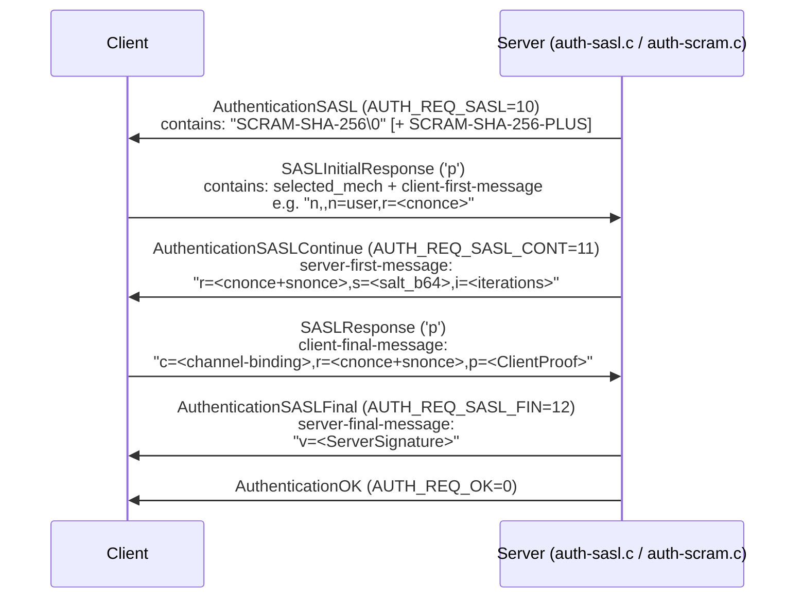

# Client Connection Establishment

This article traces the full path from a TCP `accept()` call in the postmaster to the moment the backend sends `ReadyForQuery` ('Z') to the client. Every step that follows is specific to protocol version 3.0, the only version supported since PostgreSQL 7.4. The relevant source spans `postmaster.c`, `libpq/auth.c`, `libpq/hba.c`, and `utils/init/postinit.c`.

---

## Postmaster Listen Loop

The postmaster is a single-process daemon that never executes queries itself. After initialization it enters `ServerLoop()` (`postmaster.c:1735`), which loops forever waiting for events on the listen sockets registered during startup.

```
listen sockets: ListenSocket[MAXLISTEN]   (postmaster.c:229)
```

`StreamServerPort()` populates sockets during postmaster startup for each entry in `listen_addresses`. On each iteration `ServerLoop` calls:

```c
nevents = WaitEventSetWait(pm_wait_set,
                           DetermineSleepTime(),
                           events,
                           lengthof(events), 0);
```

Postmaster startup builds the wait set (`pm_wait_set`) with `WL_SOCKET_ACCEPT` events on every `ListenSocket[i]` plus a latch for signal delivery (`postmaster.c:1719–1726`). When a new TCP connection arrives the kernel marks the socket readable; `WaitEventSetWait` returns with `events[i].events & WL_SOCKET_ACCEPT` set.

`ServerLoop` then calls:

1. `ConnCreate(events[i].fd)` — calls `StreamConnection()` to `accept()` the new socket and fills a heap-allocated `Port` struct.
2. `BackendStartup(port)` — forks a child process.
3. `StreamClose(port->sock)` + `ConnFree(port)` — postmaster closes its copy of the socket; the child owns it from here.

### Port struct

`Port` (`include/libpq/libpq-be.h:146`) is the central data structure for a connection. The postmaster allocates it via `malloc`, so it outlives `fork()` without being shared memory.

| Field | Type | Purpose |
|---|---|---|
| `sock` | `pgsocket` | Accepted file descriptor |
| `proto` | `ProtocolVersion` | Negotiated FE/BE protocol (`uint32`) |
| `laddr` / `raddr` | `SockAddr` | Local and remote socket addresses |
| `database_name` | `char *` | Parsed from startup packet |
| `user_name` | `char *` | Parsed from startup packet |
| `guc_options` | `List *` | Alternating GUC name/value pairs |
| `hba` | `HbaLine *` | Matched pg_hba.conf record |
| `ssl_in_use` | `bool` | SSL layer active |
| `peer_cert_valid` | `bool` | Client certificate verified |
| `canAcceptConnections` | `CAC_state` | Server readiness snapshot |

---

## Fork on Connect

`BackendStartup()` (`postmaster.c:4124`) is the branching point:

```
postmaster                        child (backend)
---------                        ----------------
RandomCancelKey(&MyCancelKey)
canAcceptConnections(NORMAL)
AssignPostmasterChildSlot()
pid = fork_process()
                          -->    InitPostmasterChild()
                                 ClosePostmasterPorts(false)
                                 BackendInitialize(port)
                                 InitProcess()
                                 BackendRun(port)   [→ PostgresMain]
dlist_push_head(&BackendList, &bn->elem)
```

Key points:

- `RandomCancelKey()` generates the cancel key (`MyCancelKey`, type `int32`) **before** `fork()`, so both parent and child hold it. The postmaster records it in `bn->cancel_key`; the child will send it to the client in a `BackendKeyData` message later.
- The postmaster sets `bn->dead_end` when `canAcceptConnections()` returns anything other than `CAC_OK`. A dead-end child never registers with shared memory; it only sends the rejection error and exits.
- On `EXEC_BACKEND` platforms (Windows), the postmaster uses `backend_forkexec()` instead of `fork()`, but the logical sequence is identical.

### `canAcceptConnections` states

`canAcceptConnections(BACKEND_TYPE_NORMAL)` (`postmaster.c:2497`) returns one of:

| `CAC_state` | Meaning | Client error code |
|---|---|---|
| `CAC_OK` | Server is running and has capacity | — |
| `CAC_STARTUP` | Server is still starting | `ERRCODE_CANNOT_CONNECT_NOW` |
| `CAC_SHUTDOWN` | Shutdown in progress or smart-shutdown | `ERRCODE_CANNOT_CONNECT_NOW` |
| `CAC_RECOVERY` | Crash recovery mode | `ERRCODE_CANNOT_CONNECT_NOW` |
| `CAC_NOTCONSISTENT` | Recovery not yet at consistent state | `ERRCODE_CANNOT_CONNECT_NOW` |
| `CAC_TOOMANY` | `CountChildren()` >= `MaxLivePostmasterChildren()` | `ERRCODE_TOO_MANY_CONNECTIONS` |

The `CAC_TOOMANY` check here is a **soft** limit against the postmaster child-process array size, not the exact `max_connections` limit. `InitPostgres` enforces the hard limit later, when the backend tries to join the shared-memory `ProcArray`.

---

## BackendInitialize: Pre-Auth Setup

`BackendInitialize(port)` (`postmaster.c:4284`) runs in the child process before any shared memory is touched. Its responsibilities:

1. `pq_init()` — initialises the libpq send/receive buffers; sets `whereToSendOutput = DestRemote`.
2. Registers `SIGTERM` handler `process_startup_packet_die` (calls `_exit(1)`), so a slow client cannot block postmaster shutdown.
3. Registers `STARTUP_PACKET_TIMEOUT` (duration: `AuthenticationTimeout`) via `enable_timeout_after()`.
4. Resolves the client's IP address for logging (`pg_getnameinfo_all`).
5. Calls `ProcessStartupPacket(port, false, false)`.
6. On success, updates `ps_display` with `user database host`.

If `ProcessStartupPacket` returns `STATUS_ERROR` (bad packet, cancel packet, timeout), the child calls `proc_exit(0)` immediately — no authentication is attempted.

---

## SSL / GSSAPI Negotiation

Before sending the startup packet proper, a client may request encryption. `ProcessStartupPacket()` detects this by examining the first four bytes, which encode a special `ProtocolVersion` magic:

| Magic (hex) | Decimal | `#define` | Meaning |
|---|---|---|---|
| `04D2:162F` | 1234/5679 | `NEGOTIATE_SSL_CODE` | Client wants SSL |
| `04D2:1630` | 1234/5680 | `NEGOTIATE_GSS_CODE` | Client wants GSSAPI encryption |
| `04D2:162E` | 1234/5678 | `CANCEL_REQUEST_CODE` | Cancel request (not a new session) |
| `0003:0000` | 3/0 | `PG_PROTOCOL(3,0)` | Normal startup packet |

### SSL upgrade path

```
client                        server (ProcessStartupPacket)
------                        --------------------------------
[send NEGOTIATE_SSL_CODE]
                         <--  send 'S' (SSL supported) or 'N'
[if 'S': TLS ClientHello]
                         <--  TLS ServerHello + Certificate
[TLS Finished]
                         -->  secure_open_server(port)
[send startup packet]         ssl_done = true; goto retry
```

The response byte 'S' triggers `secure_open_server(port)` (in `be-secure-openssl.c`). After the TLS handshake completes, the server checks `pq_buffer_has_data()`: any buffered plaintext received before the handshake is a protocol violation (potential MITM injection) and causes `FATAL`.

When the server accepts SSL, it also sets `gss_done` to `true` — the client cannot subsequently negotiate GSSAPI on the same connection.

### pg_hba.conf connection-type matching

SSL status is known at this point, so `check_hba()` later filters records by `ConnType`:

| `ConnType` | Matches |
|---|---|
| `ctLocal` | Unix-domain socket only |
| `ctHost` | Any TCP connection (SSL or not) |
| `ctHostSSL` | TCP + SSL active |
| `ctHostNoSSL` | TCP without SSL |
| `ctHostGSS` | TCP + GSSAPI encryption active |
| `ctHostNoGSS` | TCP without GSSAPI encryption |

---

## Startup Packet (Protocol 3.0)

After any encryption negotiation, `ProcessStartupPacket` reads the real startup packet:

```
[int32 length][int32 protocol_version][NUL-terminated key=value pairs ...][NUL terminator]
```

- Length includes itself (4 bytes). Maximum is `MAX_STARTUP_PACKET_LENGTH = 10000` bytes.
- `protocol_version` is `PG_PROTOCOL(3,0)` = `0x00030000`. The server rejects any major version other than 3.
- `ProcessStartupPacket` (`postmaster.c:2199`) scans key/value pairs:

| Key | Stored in |
|---|---|
| `database` | `port->database_name` |
| `user` | `port->user_name` |
| `options` | `port->cmdline_options` |
| `replication` | sets `am_walsender` / `am_db_walsender` |
| `application_name` | `port->application_name` (also a GUC) |
| anything else | appended to `port->guc_options` as GUC name+value pairs |

The protocol reserves keys beginning with `_pq_.` for future extensions; the server returns unknown ones to the client in a `NegotiateProtocolVersion` ('v') message, but the connection continues.

If `user` is absent, the server sends `FATAL` immediately. If `database` is absent, it defaults to `user`.

---

## Authentication: pg_hba.conf Lookup

`InitPostgres` calls `PerformAuthentication(port)` (`postinit.c:190`). It:

1. Enables `STATEMENT_TIMEOUT` for `AuthenticationTimeout` seconds.
2. Calls `ClientAuthentication(port)` (`auth.c:392`).
3. On return, disables the timeout and logs "connection authorized" if `log_connections = on`.

`ClientAuthentication` calls `hba_getauthmethod(port)`, which delegates to `check_hba(port)` (`hba.c:2486`). `check_hba` iterates `parsed_hba_lines` (the in-memory parse of `pg_hba.conf`) and sets `port->hba` on the first match.

### Matching logic in `check_hba`

The first matching rule wins. A rule matches when:

1. `conntype` is consistent with the connection (local/host/hostssl/etc.).
2. `database` list contains the target database (or `all`/`sameuser`/`samerole`).
3. `roles` list contains the connecting role (or `all`).
4. IP address / mask matches `port->raddr` (for `host*` records).

If no rule matches, `check_hba` sets `port->hba->auth_method` to `uaImplicitReject`, which produces "no pg_hba.conf entry for host …".

### Authentication methods

| `UserAuth` enum | Method name | Mechanism |
|---|---|---|
| `uaTrust` | `trust` | No credential check |
| `uaReject` | `reject` | Always deny |
| `uaMD5` | `md5` | MD5-hashed password challenge |
| `uaSCRAM` | `scram-sha-256` | SASL / SCRAM-SHA-256 |
| `uaPassword` | `password` | Cleartext password |
| `uaGSS` | `gss` | Kerberos via GSSAPI |
| `uaSSPI` | `sspi` | Windows SSPI negotiate |
| `uaPeer` | `peer` | Unix socket UID lookup |
| `uaIdent` | `ident` | TCP ident protocol (RFC 1413) |
| `uaCert` | `cert` | Client TLS certificate |
| `uaLDAP` | `ldap` | LDAP bind |
| `uaRADIUS` | `radius` | RADIUS challenge-response |
| `uaPAM` | `pam` | PAM stack |

You can combine `clientcert=verify-full` with any method; in that case, the server also runs `CheckCertAuth()` after the primary method succeeds.

---

## SCRAM-SHA-256 Exchange

`uaSCRAM` routes through `CheckPWChallengeAuth()` → `CheckSASLAuth(&pg_be_scram_mech, …)` (`auth-sasl.c:52`). The mechanism implementation is in `auth-scram.c`; the SASL dispatch layer is in `auth-sasl.c`.



Server-side state machine (`scram_state_enum`):

| State | Transition | Action |
|---|---|---|
| `SCRAM_AUTH_INIT` | receive client-first-message | `read_client_first_message()` → `build_server_first_message()` |
| `SCRAM_AUTH_SALT_SENT` | receive client-final-message | `read_client_final_message()` → `verify_client_proof()` → `build_server_final_message()` |
| `SCRAM_AUTH_FINISHED` | — | Exchange complete |

`verify_client_proof()` computes `StoredKey` from `pg_authid.rolpassword` (a stored SCRAM verifier) and compares it against the `ClientProof` using an HMAC-SHA-256 operation. If the user does not exist, the server performs a "mock" SCRAM exchange (`doomed = true`) anyway, to avoid timing-based user enumeration.

If `SCRAM-SHA-256-PLUS` (channel binding) is negotiated, the client includes the TLS channel binding data in `client-final-message`. The server verifies this via `be_tls_get_certificate_hash()`.

---

## Connection Limit Enforcement

PostgreSQL enforces `max_connections` at two points:

1. **Soft, in postmaster** (`canAcceptConnections`, `postmaster.c:2540`): rejects if `CountChildren(BACKEND_TYPE_ALL) >= MaxLivePostmasterChildren()`. This cap is slightly above `MaxBackends` to allow in-progress authentication to overlap with active backends.

2. **Hard, in `InitPostgres`** (`postinit.c:940–958`): after the backend has claimed a `PGPROC` slot (via `InitProcessPhase2` → `ProcArrayAdd`), the code checks whether the remaining free slots fall below the reserved thresholds:

   - `superuser_reserved_connections`: slots held back for roles with `SUPERUSER`.
   - `reserved_connections` (PG 16+): slots held back for roles with `pg_use_reserved_connections`.

   A non-superuser exceeding these limits gets `ERRCODE_TOO_MANY_CONNECTIONS ("sorry, too many clients already")` at this point, after authentication has already succeeded.

The server computes `MaxBackends` at start as:
```
max_connections + autovacuum_max_workers + max_wal_senders
  + max_worker_processes + 1 (autovacuum launcher) + 1 (background writer) ...
```

---

## Parameter Status Messages

After authentication and database setup complete, `PostgresMain()` calls `BeginReportingGUCOptions()`, which marks all GUC variables carrying `GUC_REPORT` as needing to be sent. `PostgresMain()` calls `ReportChangedGUCOptions()` just before the first `ReadyForQuery`; it iterates the `guc_report_list` and emits a `ParameterStatus` ('S') message for each:

```c
pq_beginmessage(&msgbuf, 'S');
pq_sendstring(&msgbuf, record->name);
pq_sendstring(&msgbuf, val);
pq_endmessage(&msgbuf);
```
(`guc.c:2598–2601`)

GUC variables with `GUC_REPORT` in PG 16:

| Variable | Typical value |
|---|---|
| `server_version` | `"16.14"` |
| `server_encoding` | `"UTF8"` |
| `client_encoding` | `"UTF8"` |
| `is_superuser` | `"on"` / `"off"` |
| `session_authorization` | role name |
| `DateStyle` | `"ISO, MDY"` |
| `IntervalStyle` | `"postgres"` |
| `TimeZone` | `"UTC"` |
| `integer_datetimes` | `"on"` (always, since PG 10) |
| `standard_conforming_strings` | `"on"` |
| `application_name` | from startup packet |
| `in_hot_standby` | `"on"` on standby |

Clients (libpq) cache these locally; subsequent `SET` commands within the session generate fresh `ParameterStatus` messages via the same path.

---

## BackendKeyData

Immediately before `ReadyForQuery`, `PostgresMain()` sends a `BackendKeyData` ('K') message (`postgres.c:4326–4334`):

```c
pq_beginmessage(&buf, 'K');
pq_sendint32(&buf, (int32) MyProcPid);
pq_sendint32(&buf, (int32) MyCancelKey);
pq_endmessage(&buf);
```

The client stores `(PID, cancel_key)`. To cancel a running query, the client opens a **new TCP connection** to the postmaster port and sends a `CancelRequestPacket`:

```c
typedef struct CancelRequestPacket {
    MsgType  cancelRequestCode;  /* CANCEL_REQUEST_CODE = PG_PROTOCOL(1234,5678) */
    uint32   backendPID;
    uint32   cancelAuthCode;
} CancelRequestPacket;
```

The postmaster receives this in `ProcessStartupPacket` (the `proto == CANCEL_REQUEST_CODE` branch) and dispatches to `processCancelRequest()` (`postmaster.c:2431`), which:

1. Iterates `BackendList` looking for a `Backend` with `bp->pid == backendPID`.
2. Checks `bp->cancel_key == cancelAuthCode`.
3. On match: `signal_child(bp->pid, SIGINT)`.
4. On PID-match but wrong key: logs a warning; no signal sent.

The postmaster immediately closes the cancel connection afterward — it sends no data back to the client. `SIGINT` triggers `StatementCancelHandler` in the target backend, which sets `QueryCancelPending` and eventually raises `ERROR` (not `FATAL`), so the session survives.

---

## ReadyForQuery

`ReadyForQuery()` (`tcop/dest.c:251`) sends message type 'Z' followed by a single byte transaction-status indicator:

| Byte | Meaning |
|---|---|
| `'I'` | Idle — not inside a transaction block |
| `'T'` | Inside a transaction block |
| `'E'` | Inside a failed transaction block |

It also flushes the output buffer (`pq_flush()`), which is the **only place** that flushes unconditionally at the end of an interaction cycle. The client library (libpq) treats receipt of 'Z' as the signal that the server is ready for the next query. An `'I'` status on the very first 'Z' message signals a fully established, idle session.

---

## Full Connection Sequence

```mermaid
sequenceDiagram
    participant C as Client
    participant PM as Postmaster (ServerLoop)
    participant BE as Backend (child)

    C->>PM: TCP SYN → accept() in ConnCreate
    C->>BE: [optional] NEGOTIATE_SSL_CODE
    BE->>C: 'S' or 'N'
    C->>BE: [if 'S'] TLS handshake
    C->>BE: StartupPacket (protocol 3.0, user, database, options)
    BE->>BE: ProcessStartupPacket → parse params
    BE->>BE: InitPostgres → PerformAuthentication → ClientAuthentication
    BE->>BE: check_hba → select auth method
    BE->>C: AuthenticationRequest (method-specific)
    C->>BE: credentials
    BE->>C: AuthenticationOK (0)
    BE->>BE: set up session (load catalogs, set GUCs)
    BE->>C: ParameterStatus × N (GUC_REPORT variables)
    BE->>C: BackendKeyData (PID + cancel_key)
    BE->>C: ReadyForQuery ('Z' + 'I')
    note over C,BE: session is now idle; client can send queries
```

---

## Connection Poolers

Connection poolers (PgBouncer, pgpool-II) sit between clients and PostgreSQL. They interact with this handshake at a different granularity depending on pooling mode; the architecture-level article linked below covers the session/transaction/statement trade-offs and the caveats around `SET`, prepared statements, temp tables, and advisory locks. Two protocol-level details matter regardless of mode:

- The pooler performs the PostgreSQL authentication handshake once per server connection, using its own credentials or a passthrough. The pooler handles client-facing authentication separately. Because the `BackendKeyData` PID and cancel key belong to the pooler's server-side session rather than the client's, the pooler must intercept and rewrite cancel requests to proxy them correctly.
- SCRAM-SHA-256 is compatible with pass-through authentication (the pooler forwards messages verbatim) only in PgBouncer 1.19+ with `auth_type = scram-sha-256`. Older versions required pre-hashed `md5`, since a client can compute an MD5 hash without knowing the plaintext password.

---

## See also

- [[architecture/client-connection]] — process model, command loop, and connection-pooler trade-offs (higher-level view)
- [[architecture/overview]]
- [[architecture/process-architecture]]
- [[subsystems/wire-protocol]]
- [[subsystems/guc]]
- [[subsystems/transactions/transaction-lifecycle]]
- [[subsystems/locking/row-level-locking]]
- [[subsystems/roles-privileges]]
- [[subsystems/row-level-security]]
