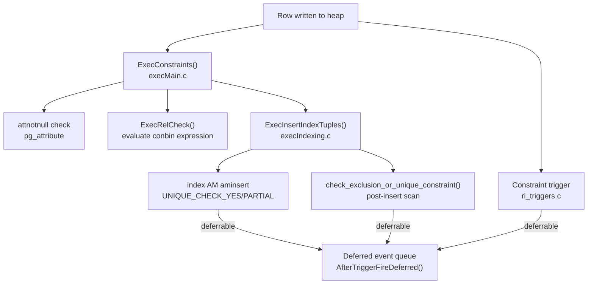

# Constraints

PostgreSQL enforces data integrity through six distinct constraint types, each with a different storage representation and enforcement mechanism. Understanding the differences matters because they affect locking, performance, and which SQL features apply to each type. The single authoritative catalog for constraint metadata is `pg_constraint`; the enforcement machinery spans the executor, index access methods, and the trigger subsystem.

## The pg_constraint Catalog

Every constraint except NOT NULL (in PG 16 and earlier) has a row in `pg_constraint`. **PostgreSQL 17** introduced `pg_constraint` rows for NOT NULL constraints. **PostgreSQL 18** extended the catalog with two new columns: `conenforced` (bool) records whether the constraint is actively enforced by the engine, and `conwithoutoverlaps` (bool, added earlier for temporal primary keys) is already present. The catalog is sparse by design: PostgreSQL leaves fields that do not apply to a given constraint type null or zeroed. The key fields:

| Field | Type | Meaning |
|---|---|---|
| `contype` | `char` | Constraint kind: `'c'` CHECK, `'f'` FOREIGN KEY, `'n'` NOT NULL (PG 17+), `'p'` PRIMARY KEY, `'u'` UNIQUE, `'x'` EXCLUSION, `'t'` trigger |
| `conrelid` | `oid` | OID of the constrained table; 0 for domain constraints |
| `contypid` | `oid` | OID of the domain, if this is a domain CHECK; 0 for table constraints |
| `conindid` | `oid` | OID of the supporting index for PK, UNIQUE, EXCLUSION, and FK (the PK/UNIQUE index on the referenced side) |
| `conkey` | `int2[]` | Attribute numbers of the constrained columns on `conrelid` |
| `confrelid` | `oid` | For FK: OID of the referenced table |
| `confkey` | `int2[]` | For FK: attribute numbers of the referenced columns on `confrelid` |
| `confupdtype` | `char` | FK ON UPDATE action: `'a'` NO ACTION, `'r'` RESTRICT, `'c'` CASCADE, `'n'` SET NULL, `'d'` SET DEFAULT |
| `confdeltype` | `char` | FK ON DELETE action (same codes) |
| `conbin` | `pg_node_tree` | For CHECK: the constraint expression as a serialized node tree |
| `condeferrable` | `bool` | Whether the constraint can be deferred within a transaction |
| `condeferred` | `bool` | Whether deferral is the default at session start |
| `convalidated` | `bool` | False for constraints added with `NOT VALID`; true once validated |
| `conislocal` | `bool` | False for constraints inherited from a parent table |
| `coninhcount` | `int2` | Number of parent relations that contribute this constraint |
| `conenforced` | `bool` | PG 18+: false for NOT ENFORCED constraints; true (default) for all enforced constraints |

`conname` is unique within a single table (enforced by a unique index on `conrelid + contypid + conname`) but not globally. The `ChooseConstraintName()` function in `pg_constraint.c` generates system names following the pattern `tablename_colname_fkey`, `tablename_pkey`, and `tablename_colname_check`.

## Constraint Type Summary

| Type | `contype` | Backing mechanism | Enforcement point | Deferrable? |
|---|---|---|---|---|
| CHECK | `'c'` | Expression tree in `conbin` | `ExecConstraints()` → `ExecRelCheck()`, after row assembly | No |
| NOT NULL (PG 16) | — | `attnotnull` flag in `pg_attribute` | `ExecConstraints()`, before index insert | No |
| NOT NULL (PG 17+) | `'n'` | `pg_constraint` row + `attnotnull` flag | `ExecConstraints()`, before index insert | No |
| PRIMARY KEY | `'p'` | Unique B-tree index (`conindid`) | `index_insert()` inside `ExecInsertIndexTuples()` | Yes |
| UNIQUE | `'u'` | Unique B-tree index (`conindid`) | `index_insert()` inside `ExecInsertIndexTuples()` | Yes |
| FOREIGN KEY | `'f'` | Constraint triggers in `ri_triggers.c` | After each row or statement (or deferred to commit) | Yes |
| EXCLUSION | `'x'` | GiST/GIN index with operator array (`conindid`) | `check_exclusion_or_unique_constraint()` in `execIndexing.c` | Yes |

## NOT NULL Constraints

In PostgreSQL 16 and earlier, NOT NULL is not stored as a `pg_constraint` row at all. It lives as a boolean flag `attnotnull` on the column's `pg_attribute` row. The executor checks it in `ExecConstraints()` (`execMain.c`) before writing a tuple to the heap:

```c
/* src/backend/executor/execMain.c */
if (att->attnotnull && slot_attisnull(slot, attrChk))
    ereport(ERROR, ...);
```

Because the check requires only a flag read on an already-loaded tuple descriptor, there is no catalog join and no deferred trigger path. This also means NOT NULL constraints in PG 16 cannot be named, dropped by constraint name without knowing the column, or marked `DEFERRABLE`.

**PostgreSQL 17** introduces a `pg_constraint` entry (contype `'n'`) for NOT NULL constraints, enabling named and deferrable NOT NULL constraints. PostgreSQL still sets the `attnotnull` flag as before, but the catalog row is the authoritative record for the constraint.

**PostgreSQL 18** extends NOT NULL support further. You can now add NOT NULL constraints as `NOT VALID` — meaning PostgreSQL does not scan existing rows at the time it adds the constraint, and defers validation to an explicit `VALIDATE CONSTRAINT`. The `NO INHERIT` option is also available, preventing the constraint from propagating to child tables in an inheritance hierarchy. `ALTER TABLE ... ALTER CONSTRAINT ... [NO] INHERIT` controls inheritability after the fact. PostgreSQL now fully supports NOT NULL constraints on foreign tables. Because `pg_constraint` stores NOT NULL constraints with a name, `ALTER TABLE ... DROP CONSTRAINT constraint_name` works for NOT NULL just as it does for CHECK and FK constraints.

## CHECK Constraints

PostgreSQL stores CHECK constraints as serialized expression trees in `pg_constraint.conbin` (a `pg_node_tree` column). At row write time, `ExecConstraints()` calls `ExecRelCheck()`, which deserializes the expression, evaluates it using `ExecEvalExpr()` in the context of the new row's values, and raises an error if the result is false. The evaluation happens after the row is assembled but before any index insertions.

`pg_class.relchecks` counts the number of CHECK constraints on a table. When that count is zero, `ExecConstraints()` skips the evaluation entirely — a meaningful optimization for bulk loads on constraint-free tables.

Domain CHECK constraints work identically at the expression level. The difference is purely catalog: `conrelid` is 0 and `contypid` points to the domain's `pg_type` row. A domain constraint fires whenever a value of that type is cast or stored, regardless of which table column holds it.

**PostgreSQL 18** adds the `NOT ENFORCED` option for CHECK constraints. PostgreSQL records a NOT ENFORCED CHECK constraint in `pg_constraint` with `conenforced = false`, but the engine never evaluates it. This is useful when the application guarantees the invariant externally and the constraint exists purely for documentation or query-planning purposes. The `NOT VALID` and `NOT ENFORCED` options are orthogonal: `NOT VALID` means PostgreSQL did not scan existing rows; `NOT ENFORCED` means it never scans any rows — past or future.

### NOT VALID and VALIDATE CONSTRAINT

`ALTER TABLE ... ADD CONSTRAINT ... NOT VALID` creates the `pg_constraint` row with `convalidated = false`. The engine immediately checks new rows inserted after the constraint is added. It skips existing rows — it performs no table scan. This makes it safe to add a CHECK or FK constraint to a large table without holding a long lock on existing data.

`ALTER TABLE ... VALIDATE CONSTRAINT` performs a sequential scan of the table under a `ShareUpdateExclusiveLock`, which does not block concurrent reads or writes. After every existing row passes, PostgreSQL sets `convalidated` to `true`. The lock level is deliberately non-blocking; this is the intended workflow for large tables in production.

## UNIQUE and PRIMARY KEY Constraints

PostgreSQL implements both as unique B-tree indexes. `pg_constraint.conindid` holds the OID of the supporting index, and there is no separate runtime enforcement path independent of that index. When `ExecInsertIndexTuples()` (`execIndexing.c`) inserts a tuple into all indexes on a relation, the index AM's `aminsert` function receives `checkUnique = UNIQUE_CHECK_YES` for immediate constraints and `UNIQUE_CHECK_PARTIAL` for deferrable ones. The B-tree AM performs the uniqueness check atomically with the insertion, so it serializes two concurrent backends inserting the same key — one wins, one blocks or errors.

For deferrable UNIQUE and PK constraints, `pg_index.indimmediate` is false. `ExecInsertIndexTuples()` detects this and passes `UNIQUE_CHECK_PARTIAL` to the AM, which inserts the entry and returns a flag indicating a potential conflict rather than raising an error immediately. The AM records the conflicting TID and queues a deferred `unique_key_recheck` trigger. See [[subsystems/transactions/deferrable-constraints]] for the full deferred trigger machinery.

PRIMARY KEY additionally sets `attnotnull = true` on all key columns in `pg_attribute`, so the NOT NULL check for PK columns goes through the same `ExecConstraints()` path described above. A table can have at most one PK; it becomes the default join target for any FK that references the table without specifying columns. Unlike UNIQUE constraints, replacing a PK requires dropping the old one first; you cannot simply add a new one.

## Foreign Key Constraints

PostgreSQL implements foreign key enforcement entirely via constraint triggers, not through index lookups at write time. When `ATAddForeignKeyConstraint()` creates an FK, it registers four constraint trigger functions from `ri_triggers.c` on the relevant tables:

| Trigger function | Fires on | Action |
|---|---|---|
| `RI_FKey_check_ins` | INSERT/UPDATE on child (referencing) table | Verify FK value exists in parent |
| `RI_FKey_noaction_del` | DELETE/UPDATE on parent (referenced) table | Block if children reference the row (NO ACTION — deferrable) |
| `RI_FKey_restrict_del` | DELETE/UPDATE on parent table | Block if children exist (RESTRICT — always immediate) |
| `RI_FKey_cascade_del` | DELETE on parent table | Delete matching children |
| `RI_FKey_setnull_del` | DELETE on parent table | Set FK column to NULL in children |

The distinction between NO ACTION and RESTRICT exists because of deferrability. Both ultimately call `ri_restrict()`. RESTRICT triggers are always `NOT DEFERRABLE` and fire at statement end regardless of `SET CONSTRAINTS`. NO ACTION triggers, by contrast, can be deferred to transaction end.

`ri_triggers.c` caches SPI query plans in `ri_query_cache` and `ri_constraint_cache` across queries and transactions (allocated in `DynaHashCxt`), so repeated FK checks against the same constraint reuse compiled plans. The `RI_ConstraintInfo` struct holds the equality operator OIDs used to compare PK and FK column values, extracted from `pg_constraint` at first use.

The FK index on the referencing table (child side) is advisory: the engine uses it to improve cascade performance and avoid full table scans when a parent row is deleted, but the mechanism does not require it. PostgreSQL always resolves the referenced side through the PK or UNIQUE index identified by `pg_constraint.conindid`, which points to the index on `confrelid` (the referenced table).

For deferrable FK constraints, the trigger infrastructure handles deferral identically to unique constraint deferred triggers. See [[subsystems/transactions/deferrable-constraints]] for how `AfterTriggerFireDeferred()` processes the deferred event queue at commit.

**PostgreSQL 18** adds two FK improvements. First, PostgreSQL now allows `NOT VALID` foreign key constraints on partitioned tables; previously it rejected this combination. Second, FK constraints can be declared `NOT ENFORCED`, recording the relationship in the catalog (`conenforced = false`) without the engine ever checking referential integrity — analogous to the NOT ENFORCED CHECK behavior described above.

## Exclusion Constraints

Exclusion constraints generalize uniqueness from equality to any operator. Where a UNIQUE constraint requires that no two rows share the same key value, an EXCLUSION constraint requires that no two rows satisfy a specified operator comparison — typically `&&` (overlap) for range types or geometric types.

The backing structure is a GiST or GIN index (`conindid`) with a per-column exclusion operator array stored in `pg_constraint.conexclop`. At insert time, `ExecInsertIndexTuples()` calls `check_exclusion_or_unique_constraint()` after inserting the index entry. Unlike unique indexes, the GiST AM does not check for conflicts atomically during insertion. Instead, `execIndexing.c` performs a separate index scan after the insert to find any existing rows that satisfy the exclusion operator against the new row. If the scan finds a conflicting live row, it raises an error and the transaction aborts.

Two concurrent insertions of overlapping rows can deadlock: each finds the other's in-progress tuple and waits. The deadlock detector resolves this by aborting one transaction, which is acceptable since one of them would have failed with a constraint violation anyway. For speculative insertions (`INSERT ... ON CONFLICT`), the higher-XID transaction backs out first to avoid livelock.

Deferrable exclusion constraints work like deferrable unique constraints: `pg_index.indimmediate = false`, `ExecInsertIndexTuples()` passes `UNIQUE_CHECK_PARTIAL`, and a deferred trigger calls `check_exclusion_constraint()` at commit. The practical use cases are range types (no overlapping reservations, no overlapping price intervals) and geometric types.

## Constraint Naming and Introspection

System-generated constraint names follow patterns derived from table and column names: `tablename_pkey` for primary keys, `tablename_colname_key` for unique constraints, `tablename_colname_fkey` for foreign keys, `tablename_colname_check` for check constraints. `ChooseConstraintName()` chooses these names, resolving collisions by appending a numeric suffix.

`ALTER TABLE ... DROP CONSTRAINT name` drops named constraints. Because `conname` is unique per relation (not globally), the same name can appear in different schemas without conflict. **PostgreSQL 18** extends this to NOT NULL constraints, which now have `pg_constraint` rows, so `DROP CONSTRAINT` and `ALTER CONSTRAINT` can now reference them by name.

Standard SQL introspection is available through the information schema:

```sql
-- All constraints on a table
SELECT constraint_name, constraint_type, is_deferrable, initially_deferred
FROM information_schema.table_constraints
WHERE table_name = 'orders';

-- Columns involved in each constraint
SELECT constraint_name, column_name, ordinal_position
FROM information_schema.constraint_column_usage
WHERE table_name = 'orders';

-- Direct pg_constraint query for more detail (PG 18+: includes conenforced)
SELECT conname, contype, condeferrable, condeferred, convalidated, conindid, conenforced
FROM pg_constraint
WHERE conrelid = 'orders'::regclass;
```



## See Also

- [[subsystems/transactions/deferrable-constraints]] — how deferred constraint checking works at transaction commit, `SET CONSTRAINTS`, and the `AfterTrigger` event queue
- [[subsystems/indexes/btree]] — the B-tree index structures backing UNIQUE and PRIMARY KEY constraints
- [[code-paths/create-table]] — how constraints are registered in the catalog during `CREATE TABLE`
- [[subsystems/triggers]] — the trigger infrastructure that FK constraints run on

## Related Topics

- [[subsystems/catalog/pg-class|pg_class and pg_attribute]] — catalog columns such as `relchecks` and `attnotnull` that store lightweight NOT NULL and CHECK metadata outside `pg_constraint`
- [[subsystems/indexes/gist|GiST]] — the index type most commonly used to back exclusion constraints on range and geometric types
- [[subsystems/transactions/mvcc|MVCC]] — how tuple visibility interacts with constraint checks during concurrent inserts and the speculative-insertion protocol
- [[subsystems/locking/row-level-locking|Row-level Locking]] — the row locks acquired during FK enforcement and conflict detection in exclusion constraint checks
- [[subsystems/table-inheritance|Table Inheritance]] — how `conislocal` and `coninhcount` govern constraint propagation across parent and child tables
- [[subsystems/generated-columns|Generated Columns]] — closely related integrity feature stored in `pg_attribute`; interacts with CHECK constraint evaluation order
- [[subsystems/row-level-security|Row-level Security]] — another row-filtering mechanism that works alongside constraints to enforce access invariants
