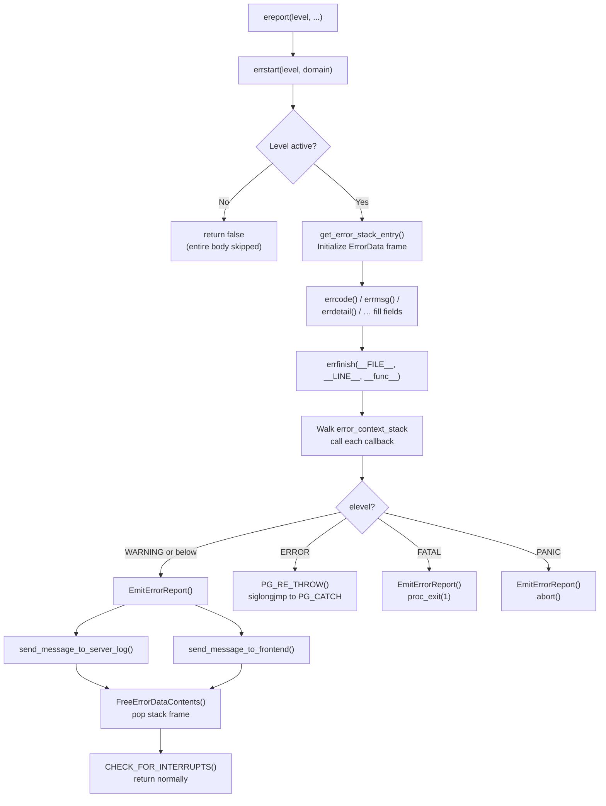

# Error Handling: elog and ereport

PostgreSQL's error reporting system is a self-contained infrastructure that spans the entire backend. Every message — from a debug trace to a cluster-killing PANIC — flows through the same two entry points: the `elog()` macro for quick single-line messages and the `ereport()` macro for structured reports with multiple annotated fields. Both macros ultimately push data into an `ErrorData` struct, call `errfinish()`, and either return normally (for low-severity messages) or execute a `siglongjmp` that unwinds the call stack to the nearest `PG_TRY` handler. Understanding this system is a prerequisite for reading almost any backend error path.

## The two macros

### elog

`elog` is the old-style API, defined as a thin wrapper:

```c
#define elog(elevel, ...)  \
    ereport(elevel, errmsg_internal(__VA_ARGS__))
```

It expands to exactly one `ereport` call with a single untranslated primary message. Use it for "can't happen" assertions and internal diagnostic messages that do not need a SQLSTATE code or auxiliary fields. The `errmsg_internal` variant skips gettext translation so that deep recursive error paths (e.g., "out of memory" during message formatting) cannot themselves trigger another translation call.

### ereport

`ereport` is the structured API:

```c
ereport(ERROR,
        errcode(ERRCODE_UNDEFINED_TABLE),
        errmsg("relation \"%s\" does not exist", relname),
        errdetail("Search path is: %s", search_path),
        errhint("Create the table or adjust search_path."));
```

The macro expands (simplified) to:

```c
do {
    pg_prevent_errno_in_scope();
    if (errstart(elevel, TEXTDOMAIN))
        errcode(...), errmsg(...), errdetail(...), errhint(...),
        errfinish(__FILE__, __LINE__, __func__);
    if (elevel >= ERROR)
        pg_unreachable();
} while (0)
```

`errstart()` is the gate: it returns `false` if the message level is below every active threshold, causing the entire body to be skipped with zero allocation. When the compiler can see that `elevel` is a compile-time constant at ERROR or above, GCC/Clang mark the call path as cold (via `errstart_cold`), improving instruction cache locality in the normal non-error path.

## Error levels

Levels are plain integers defined in `elog.h`. The ordering matters: ERROR is 21, FATAL 22, PANIC 23. The special LOG level (15) is deliberately out of numeric order with respect to the ERROR family so that `is_log_level_output()` can treat it as a peer of ERROR for server-log purposes while keeping it invisible to the client for most configurations.

| Level | Value | Server log | Client | Behaviour on return |
|---|---|---|---|---|
| `DEBUG5`–`DEBUG1` | 10–14 | Only if `log_min_messages` permits | No | Returns normally |
| `LOG` | 15 | Yes (if `log_min_messages <= LOG`) | No (by default) | Returns normally |
| `LOG_SERVER_ONLY` | 16 | Yes | Never | Returns normally |
| `COMMERROR` | 16 | Yes (client comm problems) | Never | Returns normally |
| `INFO` | 17 | No (by default) | Always | Returns normally |
| `NOTICE` | 18 | No (by default) | Yes (if `client_min_messages <= NOTICE`) | Returns normally |
| `WARNING` | 19 | Only if `log_min_messages <= WARNING` | Yes (if `client_min_messages <= WARNING`) | Returns normally |
| `WARNING_CLIENT_ONLY` | 20 | Never | Yes | Returns normally |
| `ERROR` | 21 | Yes | Yes | `siglongjmp` to nearest PG_CATCH |
| `FATAL` | 22 | Yes | Yes | `proc_exit(1)` |
| `PANIC` | 23 | Yes | Yes | `abort()` |

The `INFO` level is special: it bypasses `client_min_messages`, and the server always sends it to the client. It is intended for output explicitly requested by the user (e.g., `VACUUM VERBOSE`).

### Automatic level promotion

`errstart()` can silently raise the severity before proceeding:

- Inside a critical section (`CritSectionCount > 0`), any ERROR becomes PANIC. Critical sections guard shared-memory structures; an error there implies the structure is in an unknown state, so the safest action is to tear down the cluster.
- If `PG_exception_stack == NULL` (no `PG_TRY` handler is active, as in the postmaster or early backend startup), ERROR becomes FATAL.
- If `ExitOnAnyError` is set (used by `initdb`), ERROR becomes FATAL.
- If a stacked `ErrorData` frame with a higher severity already exists, `errstart()` raises the new level to match — preventing a lower-severity error from silently discarding a pending FATAL.

## The ErrorData struct

Each `ereport` cycle fills one frame in a small fixed stack (`ERRORDATA_STACK_SIZE = 5`). The stack depth exceeds zero only when an error or warning fires while another message is being constructed; five levels is sufficient for any realistic scenario and overflowing it triggers a PANIC.

| Field | Type | Purpose |
|---|---|---|
| `elevel` | `int` | Final error level after any promotions |
| `output_to_server` | `bool` | Whether to write to the server log |
| `output_to_client` | `bool` | Whether to send to the client connection |
| `sqlerrcode` | `int` | SQLSTATE encoded via `MAKE_SQLSTATE` |
| `message` | `char *` | Primary message (translated) |
| `detail` | `char *` | Secondary detail visible to both client and log |
| `detail_log` | `char *` | Detail sent to log only (never to client) |
| `hint` | `char *` | Suggested fix |
| `context` | `char *` | Call-stack context built by error context callbacks |
| `backtrace` | `char *` | C-level backtrace (opt-in via `backtrace_functions` GUC) |
| `message_id` | `const char *` | Untranslated original format string (for log hooks) |
| `schema_name` | `char *` | Schema name for catalog-level errors |
| `table_name` | `char *` | Table name for catalog-level errors |
| `column_name` | `char *` | Column name for catalog-level errors |
| `datatype_name` | `char *` | Datatype name for catalog-level errors |
| `constraint_name` | `char *` | Constraint name for catalog-level errors |
| `cursorpos` | `int` | Cursor position in the client query string |
| `internalpos` | `int` | Cursor position in an internally generated query |
| `internalquery` | `char *` | Text of the internally generated query |
| `saved_errno` | `int` | `errno` captured at `errstart` entry (used for `%m`) |
| `filename` | `const char *` | Source file (`__FILE__`) of the `ereport` call site |
| `lineno` | `int` | Source line (`__LINE__`) |
| `funcname` | `const char *` | Function name (`__func__`) |
| `hide_stmt` | `bool` | Suppress `STATEMENT:` line in server log |
| `hide_ctx` | `bool` | Suppress `CONTEXT:` line in server log |
| `assoc_context` | `MemoryContext` | Memory context for subsidiary string allocations |

All string fields that are non-NULL point to palloc'd memory in `ErrorContext`, the dedicated memory context that PostgreSQL keeps alive across transaction boundaries specifically to hold error state.

### SQLSTATE encoding

`MAKE_SQLSTATE` stores SQLSTATE codes as five 6-bit fields packed into a 32-bit integer. The macro maps each character of the 5-character SQLSTATE string to `((ch - '0') & 0x3F)` and packs them at offsets 0, 6, 12, 18, 24. `unpack_sql_state()` reverses this for wire transmission. This avoids repeated string comparisons in the hot path.

Default SQLSTATE values when `errcode()` is not called:
- Level ≥ ERROR: `ERRCODE_INTERNAL_ERROR` (`XX000`)
- Level = WARNING: `ERRCODE_WARNING` (`01000`)
- Level < WARNING: `ERRCODE_SUCCESSFUL_COMPLETION` (`00000`)

## The accessor functions

Each `errXxx()` function retrieves the current top-of-stack `ErrorData` frame, formats its argument into `ErrorContext`, and stores the result in the appropriate field. All return `0` so they can be chained in a comma expression inside the `ereport` macro body. The `EVALUATE_MESSAGE` macro handles `printf`-style formatting, retrying with a larger buffer if `appendStringInfoVA` reports truncation, and substituting `errno` (restored from `saved_errno`) for `%m` escapes.

| Function | Field written | Notes |
|---|---|---|
| `errcode(sqlerrcode)` | `sqlerrcode` | Takes a `MAKE_SQLSTATE` integer |
| `errcode_for_file_access()` | `sqlerrcode` | Maps `saved_errno` to an appropriate SQLSTATE |
| `errcode_for_socket_access()` | `sqlerrcode` | Maps `saved_errno` for socket errors |
| `errmsg(fmt, ...)` | `message` | Translated; `%m` expands to `strerror(saved_errno)` |
| `errmsg_internal(fmt, ...)` | `message` | Not translated; used for "can't happen" messages |
| `errmsg_plural(sg, pl, n, ...)` | `message` | Translated, plural-aware |
| `errdetail(fmt, ...)` | `detail` | Sent to both client and server log |
| `errdetail_internal(fmt, ...)` | `detail` | Not translated |
| `errdetail_log(fmt, ...)` | `detail_log` | Sent to server log only; never forwarded to client |
| `errhint(fmt, ...)` | `hint` | Sent to both |
| `errposition(pos)` | `cursorpos` | Character offset in the client query |
| `internalerrposition(pos)` | `internalpos` | Offset in an internal query |
| `internalerrquery(query)` | `internalquery` | Text of the internal query |
| `err_generic_string(field, str)` | schema/table/column/datatype/constraint | Uses `PG_DIAG_*` field codes |
| `errcontext(fmt, ...)` | `context` | Appends to context; typically called from callbacks |
| `errhidestmt(bool)` | `hide_stmt` | Suppresses `STATEMENT:` in log |
| `errhidecontext(bool)` | `hide_ctx` | Suppresses `CONTEXT:` in log |
| `errbacktrace()` | `backtrace` | Captures C-level stack trace |

`errcontext` is a macro that calls `set_errcontext_domain(TEXTDOMAIN)` followed by `errcontext_msg()`. The two-step design is needed because context callbacks can live in extension modules with a different gettext domain than the core backend.

## The reporting pipeline



For ERROR, `errfinish()` does *not* call `EmitErrorReport()` before longjmping. Instead, the `PG_CATCH` block is responsible for calling `EmitErrorReport()` as part of its cleanup, or the outermost handler in `PostgresMain` does so. This design allows a handler to inspect or suppress the error before it reaches any output.

### errstart in detail

`errstart()` does five things in order:

1. **Level promotion**: `errstart()` may raise the severity before any further work — to PANIC inside a critical section, to FATAL when no `PG_TRY` handler is active, and so on (see "Automatic level promotion" above).
2. **Output-destination check**: if the resulting level would produce no output to either the server log or the client and is below ERROR, `errstart()` returns `false` immediately, skipping all allocation with zero overhead (`should_output_to_server()`, `should_output_to_client()`).
3. **Early-exit for pre-memory-init failures**: if `ErrorContext` is not yet allocated (the memory subsystem has not been initialised), `errstart()` writes the error directly to stderr (`write_stderr()`) and the process exits — no palloc, no stack frame.
4. **Recursion containment**: if `errstart()` detects a re-entrant error-level call (`recursion_depth > 0` and `elevel >= ERROR`), it resets `ErrorContext` to reclaim memory; at depth > 2 (`in_error_recursion_trouble()`), it also clears `error_context_stack` and `debug_query_string` to break potential infinite loops in context callbacks.
5. **Stack-frame initialisation**: `errstart()` pushes a new `ErrorData` frame via `get_error_stack_entry()`, captures `saved_errno` from `errno` immediately (before any subsequent call can clobber it), sets a default SQLSTATE, and points `assoc_context` at `ErrorContext`.

## PG_TRY / PG_CATCH / PG_RE_THROW

PostgreSQL has no C++ exceptions. Error recovery uses POSIX `sigsetjmp`/`siglongjmp` wrapped in three macros that manage the exception stack:

```c
/* Simplified expansion of PG_TRY() */
sigjmp_buf *_save_exception_stack = PG_exception_stack;
ErrorContextCallback *_save_context_stack = error_context_stack;
sigjmp_buf _local_sigjmp_buf;
bool _do_rethrow = false;
if (sigsetjmp(_local_sigjmp_buf, 0) == 0)
{
    PG_exception_stack = &_local_sigjmp_buf;
    /* ... protected code ... */
}
else /* PG_CATCH */
{
    PG_exception_stack = _save_exception_stack;
    error_context_stack = _save_context_stack;
    /* ... error handling code ... */
}
/* PG_END_TRY */
PG_exception_stack = _save_exception_stack;
error_context_stack = _save_context_stack;
```

The key invariants:
- `PG_exception_stack` is a global pointer to the innermost active `sigjmp_buf`. `pg_re_throw()` calls `siglongjmp(*PG_exception_stack, 1)`.
- `PG_TRY` saves and restores both `PG_exception_stack` and `error_context_stack` around every block. This means that entry to the catch block automatically de-registers any context callbacks registered during the protected code, which prevents an error during cleanup from invoking them again.
- Local variables modified inside a `PG_TRY` block and read in `PG_CATCH` must be declared `volatile`. The compiler may hold them in registers across the `sigsetjmp` call; without `volatile`, values assigned in the protected block may appear to have reverted.

`PG_RE_THROW()` calls `pg_re_throw()`. If `PG_exception_stack` is non-NULL it longjmps outward. If it is NULL (no outer handler), `pg_re_throw()` promotes the ERROR to FATAL and calls `errfinish()` to exit the process cleanly.

`PG_FINALLY()` is an alternative to `PG_CATCH()` for cleanup code that must run on both success and failure paths. If an error occurred, the cleanup runs, and `PG_END_TRY()` then calls `PG_RE_THROW()` automatically.

### How ERROR unwinds the stack

```mermaid
sequenceDiagram
    participant Caller as PostgresMain
    participant PGT as PG_TRY handler
    participant Inner as inner function
    participant EL as elog.c

    Caller->>PGT: sigsetjmp (PG_exception_stack = &jmp)
    PGT->>Inner: call f()
    Inner->>EL: ereport(ERROR, ...)
    EL->>EL: errstart() — push ErrorData frame
    EL->>EL: errmsg() / errdetail() — fill fields
    EL->>EL: errfinish() — walk context callbacks
    EL->>EL: siglongjmp(*PG_exception_stack, 1)
    Note over EL,PGT: Stack unwinds; no C++ destructors
    PGT->>PGT: PG_CATCH: restore stacks
    PGT->>EL: EmitErrorReport() — send to log and client
    PGT->>EL: FlushErrorState() — pop frame, reset ErrorContext
    PGT->>Caller: return / PG_RE_THROW
```

The `siglongjmp` bypasses all C stack frames between the `ereport` call site and the `sigsetjmp` call. No RAII, no destructors, no automatic cleanup. Code that holds locks, open files, or pinned buffers must ensure cleanup happens either before the `ereport` or inside a `PG_CATCH` block. The `ResourceOwner` mechanism and `on_proc_exit` callbacks exist precisely to handle this.

## Error context callbacks

The `error_context_stack` is a singly-linked list of `ErrorContextCallback` nodes:

```c
typedef struct ErrorContextCallback
{
    struct ErrorContextCallback *previous;
    void        (*callback) (void *arg);
    void       *arg;
} ErrorContextCallback;
```

Code registers callbacks by pushing onto the global list head, and de-registers them by restoring the saved pointer:

```c
ErrorContextCallback errcallback;
errcallback.callback = my_error_callback;
errcallback.arg = (void *) my_state;
errcallback.previous = error_context_stack;
error_context_stack = &errcallback;

/* ... do work ... */

error_context_stack = errcallback.previous;  /* de-register */
```

`errfinish()` walks the entire list and calls each callback before dispatching the message. Each callback typically calls `errcontext()` to append a line to `edata->context`, producing the `CONTEXT:` field visible in the server log and (for ERROR and above) in the client response. A typical callback for a PL function might append:

```
PL/pgSQL function foo(integer) line 7 at assignment
```

Multiple callbacks produce multiple context lines in the order they were registered (innermost first, since the list is prepended to).

`GetErrorContextStack()` is a utility function that temporarily pushes a dummy `ErrorData` frame, walks `error_context_stack` to collect all context strings, and returns them as a palloc'd string. `pg_context_info()` and similar diagnostic functions use it.

## FATAL vs PANIC

Both levels call `EmitErrorReport()` before taking their terminal action. After reporting:

- **FATAL**: calls `proc_exit(1)`. This runs all `on_proc_exit` and `on_shmem_exit` callbacks, releases shared memory locks, and closes the client connection cleanly. The postmaster sees the exit status and may spawn a replacement backend. One backend dies; the cluster continues.

- **PANIC**: calls `abort()`, which raises `SIGABRT`. The postmaster catches the non-zero exit status and sends `SIGQUIT` to all other backends, then performs a full cluster restart with WAL recovery. PANIC is reserved for situations where shared state may have been corrupted and continued operation would be unsafe.

The distinction also affects the error level ordering used for server-log routing: `is_log_level_output()` treats LOG as logically between ERROR and FATAL (value 15 < ERROR = 21), which means LOG messages reach the server log whenever `log_min_messages` is LOG or any level ≤ ERROR, regardless of their numeric value.

## LOG vs ERROR: routing differences

A common point of confusion: LOG and ERROR both write to the server log, but only ERROR also sends a message to the client and aborts the transaction.

| Dimension | LOG | ERROR |
|---|---|---|
| Transaction aborted | No | Yes |
| Client receives message | No (unless `log_min_messages` routing changes it) | Yes, as an ErrorResponse |
| Server log | Yes (subject to `log_min_messages`) | Yes |
| `output_to_client` flag | `false` by default | `true` |
| `PG_TRY` catchable | Not applicable (returns normally) | Yes |

`COMMERROR` is an alias for `LOG_SERVER_ONLY` (value 16), and PostgreSQL uses it for client communication errors (broken pipe, protocol violations). It never reaches the client because the client connection is already compromised.

## Sending errors to the client

`send_message_to_frontend()` formats the `ErrorData` frame into the libpq wire protocol. For protocol version 3 (all modern clients), it sends an `ErrorResponse` (message type `'E'`) or `NoticeResponse` (`'N'`) containing a series of field bytes:

| Field byte | `PG_DIAG_*` constant | Content |
|---|---|---|
| `S` | `PG_DIAG_SEVERITY` | Localized severity string (`ERROR`, `FATAL`, etc.) |
| `V` | `PG_DIAG_SEVERITY_NONLOCALIZED` | English severity string |
| `C` | `PG_DIAG_SQLSTATE` | 5-character SQLSTATE code |
| `M` | `PG_DIAG_MESSAGE_PRIMARY` | Primary message (always present) |
| `D` | `PG_DIAG_MESSAGE_DETAIL` | Detail (omitted if NULL) |
| `H` | `PG_DIAG_MESSAGE_HINT` | Hint (omitted if NULL) |
| `W` | `PG_DIAG_CONTEXT` | Context (omitted if NULL) |
| `s` | `PG_DIAG_SCHEMA_NAME` | Schema name (omitted if NULL) |
| `t` | `PG_DIAG_TABLE_NAME` | Table name (omitted if NULL) |
| `c` | `PG_DIAG_COLUMN_NAME` | Column name (omitted if NULL) |
| `d` | `PG_DIAG_DATATYPE_NAME` | Datatype name (omitted if NULL) |
| `n` | `PG_DIAG_CONSTRAINT_NAME` | Constraint name (omitted if NULL) |
| `P` | `PG_DIAG_STATEMENT_POSITION` | Cursor offset (omitted if 0) |
| `p` | `PG_DIAG_INTERNAL_POSITION` | Internal query cursor offset |
| `q` | `PG_DIAG_INTERNAL_QUERY` | Internal query text |
| `F` | `PG_DIAG_SOURCE_FILE` | Source file name |
| `L` | `PG_DIAG_SOURCE_LINE` | Source line number |
| `R` | `PG_DIAG_SOURCE_FUNCTION` | Source function name |

A zero byte terminates the field list, then `pq_endmessage()` sends the buffered data. `send_message_to_frontend()` calls `pq_flush()` immediately after, to ensure the client receives the error even if the backend subsequently crashes before returning to the main loop.

Note that PostgreSQL deliberately excludes `detail_log` from client transmission — it is a server-only field used to record information that would be inappropriate or insecure to send to the client (e.g., the internal state of an access control decision).

## The emit_log_hook

```c
typedef void (*emit_log_hook_type) (ErrorData *edata);
extern emit_log_hook_type emit_log_hook;
```

`EmitErrorReport()` calls `emit_log_hook(edata)` before writing to the server log, provided `output_to_server` is true. The hook may set `edata->output_to_server = false` to suppress the default server-log write, but it cannot enable logging for messages that `errstart()` already decided to skip. Extensions use this hook to route errors to external logging systems (e.g., structured JSON, remote syslog aggregators) or to redact sensitive fields from the server log.

## Recursion and error-within-error

Because `elog.c` itself allocates memory and calls formatting functions, it can in principle trigger a new error during error processing. Several mechanisms limit the damage:

1. `errstart()`/`errfinish()` increment a `recursion_depth` counter in `elog.c` on entry and decrement it on exit. A nonzero depth on entry to `errstart()` for an ERROR-or-above message indicates genuine recursion.
2. On the first level of recursion, `MemoryContextReset(ErrorContext)` frees all previous error data to ensure at least 8 KB of space (which `ErrorContext` is guaranteed to have after reset).
3. At depth > 2, `in_error_recursion_trouble()` returns true. `errstart()` then clears `error_context_stack` and `debug_query_string` to break potential infinite loops in context callbacks or query-string inclusion.
4. `err_gettext()` skips gettext translation when in recursion trouble, since the translation subsystem is one plausible source of recursive errors.
5. Exhausting `ERRORDATA_STACK_SIZE` (5 frames) triggers an unconditional PANIC.

## Soft errors: errsave / ereturn

PostgreSQL 16 introduced a "soft error" mechanism for code that can optionally propagate errors to a caller instead of longjmping. The `errsave(context, ...)` macro behaves like `ereport(ERROR, ...)` when `context` is NULL or not an `ErrorSaveContext` node; if it is an `ErrorSaveContext`, `errsave` stores the error fields in the context struct and control returns normally. The caller checks `escontext->error_occurred` before trusting the return value. Data type input functions use this to support bulk-load scenarios where individual row errors should not abort the entire operation.

`ereturn(context, dummy_value, ...)` is a convenience wrapper that calls `errsave` and then `return dummy_value`, for functions with no cleanup needed after a soft error.

## See also

- [[architecture/process-architecture]] — backend process lifecycle and how proc_exit() cleans up after FATAL
- [[architecture/overview]] — shared memory layout and the postmaster watchdog that triggers cluster restart on PANIC
- [[subsystems/transactions/transaction-lifecycle]] — how AbortTransaction responds to a longjmp'd ERROR
- [[subsystems/memory/contexts]] — ErrorContext and the memory context tree
