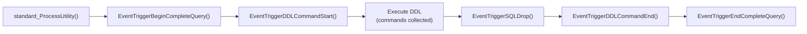

Event triggers are database-wide hooks that fire in response to DDL commands rather than DML. [[subsystems/triggers|Row and statement triggers]] attach to specific tables and react to INSERT, UPDATE, DELETE, and TRUNCATE. Event triggers attach to the database as a whole instead, and they react to schema changes such as `CREATE TABLE`, `DROP FUNCTION`, or `ALTER TYPE`. They give extensions and tooling a reliable interception point for auditing DDL, blocking prohibited operations, or recording metadata about every schema change.

## Events and the Commands That Fire Them

PostgreSQL supports four event types. Only superusers can create event triggers. The trigger function must also return type `event_trigger` (CreateEventTrigger(), event_trigger.c).

| Event | When it fires |
|---|---|
| `ddl_command_start` | Before the DDL command executes; the target object may not yet exist |
| `ddl_command_end` | After the DDL command completes successfully |
| `sql_drop` | After objects are dropped, but before the transaction commits; the dropped-objects list is available |
| `table_rewrite` | When `ALTER TABLE` or `ALTER TYPE` would cause a table rewrite |

Not every DDL command fires event triggers. PostgreSQL excludes commands that operate on global objects — databases, tablespaces, and roles — entirely. It also excludes commands that manipulate event triggers themselves. The function `EventTriggerSupportsObjectType()` (event_trigger.c) codifies the full list of supported object types. The compiler deliberately has no `default:` case there, so adding a new `ObjectType` forces a review of this list.

A trigger can also narrow its scope to specific command tags using a `WHEN tag IN (...)` clause. The tag list is validated at creation time against the set of tags that actually reach event trigger code, so invalid combinations are caught early (validate_ddl_tags(), event_trigger.c). PostgreSQL stores tags as a text array in `pg_event_trigger.evttags`. At cache-build time, `DecodeTextArrayToBitmapset()` (evtcache.c) decodes the array into a `Bitmapset` of `CommandTag` values, for O(1) membership tests during filtering.

## The Event Trigger Cache

Looking up applicable triggers for every DDL statement by scanning `pg_event_trigger` would be expensive. Instead, a per-backend hash table keyed by `EventTriggerEvent` is populated lazily on first use. A syscache callback registered on `EVENTTRIGGEROID` invalidates the table when needed (InvalidateEventCacheCallback(), evtcache.c).

Each cache entry holds a `List` of `EventTriggerCacheItem` structs — one per enabled trigger for that event — ordered by trigger name (the scan uses the `EventTriggerNameIndexId` index). The items carry the function OID, the `evtenabled` state, and the compiled `Bitmapset` of allowed tags. The state machine tracks three states (`ETCS_NEEDS_REBUILD`, `ETCS_REBUILD_STARTED`, `ETCS_VALID`) to handle the edge case where an invalidation arrives mid-rebuild. In that case, the current lookup uses the freshly built cache. But the cache is immediately marked stale, so a new rebuild occurs on the next access.

Event triggers are entirely disabled in standalone (single-user) mode. This provides an escape hatch if a broken trigger makes the database unusable. It also avoids a dependency on `systable_beginscan_ordered` before index recovery is complete (EventTriggerDDLCommandStart(), event_trigger.c).

## Per-Query State and Command Collection

DDL execution in PostgreSQL is a nested process. An outer `CREATE TABLE` may internally issue further catalog writes. `ALTER TABLE` decomposes into multiple subcommands. Event triggers need access to all of these, not just the outermost node.

This is handled through a linked stack of `EventTriggerQueryState` structs. Each time a complete query starts, `EventTriggerBeginCompleteQuery()` pushes a fresh state node. When the query ends (or errors out), `EventTriggerEndCompleteQuery()` pops the node and deletes its memory context. That context is a child of `TopMemoryContext`. Nested queries — for example, a `DO` block that runs DDL — push their own state on top, so each level has an independent command list and drop list.

The command collection mechanism records a `CollectedCommand` for each DDL operation that takes place within the query. Simple commands use `EventTriggerCollectSimpleCommand()`. PostgreSQL handles `ALTER TABLE` specially because it batches multiple subcommands: `EventTriggerAlterTableStart()` opens a `currentCommand` slot, individual subcommands append to it via `EventTriggerCollectAlterTableSubcmd()`, and `EventTriggerAlterTableEnd()` finalises and appends the whole batch. GRANT/REVOKE, ALTER OPERATOR FAMILY, CREATE OPERATOR CLASS, ALTER TEXT SEARCH CONFIGURATION, and ALTER DEFAULT PRIVILEGES each have their own collection helper. The complete list is exposed to trigger functions via `pg_event_trigger_ddl_commands()` during `ddl_command_end`.

Command collection carries a non-trivial cost, so the executor skips it entirely when no `sql_drop`, `table_rewrite`, or `ddl_command_end` triggers exist. `trackDroppedObjectsNeeded()` (event_trigger.c) checks for this case by querying the cache. `EventTriggerInhibitCommandCollection()` can also temporarily suppress collection for internal operations that should not be visible to trigger functions.

## Dropped Object Tracking

The `sql_drop` event provides visibility into objects that were removed. As dependency processing removes objects, each one is registered with `EventTriggerSQLDropAddObject()`. The function records the object's `ObjectAddress`, identity string, type string, schema name, and a pair of flags (`original` and `normal`) indicating whether the object was the direct target of the DROP command or a cascade victim.

PostgreSQL silently filters out temporary objects owned by other sessions. It reports only the current session's own temp objects. Several object classes require special handling to determine temporariness: schemas, column defaults, triggers, and policies. Each needs a lookup of their parent relation to decide (EventTriggerSQLDropAddObject(), event_trigger.c).

All dropped objects are stored in the current state's `SQLDropList` (a singly-linked list). The `in_sql_drop` flag on the state struct gates `pg_event_trigger_dropped_objects()`. Calling that function outside of a `sql_drop` trigger raises `EVENT_TRIGGER_PROTOCOL_VIOLATED`. A `PG_TRY`/`PG_FINALLY` block around the trigger invocation ensures the flag is cleared even if a trigger function raises an error.

The same guard pattern applies to `table_rewrite`. PostgreSQL sets `table_rewrite_oid` and `table_rewrite_reason` in the state before invoking triggers, and clears them in `PG_FINALLY` (EventTriggerTableRewrite(), event_trigger.c). The reason is an integer bitmask (`AT_REWRITE_*` values) indicating why the rewrite was needed — for example, a column type change versus a constraint addition.

## Invocation and Replication Role Filtering

Once `EventTriggerCommonSetup()` has assembled the run list from the cache, `EventTriggerInvoke()` fires each function in order. Between consecutive trigger functions a `CommandCounterIncrement()` makes each trigger's writes visible to the next. Each function runs in a short-lived child memory context that is reset after every invocation to prevent leaks accumulating across multiple triggers for the same event.

Replication role filtering mirrors the behaviour of [[subsystems/triggers|row triggers]]. Triggers marked `FIRES_ON_ORIGIN` are skipped when `session_replication_role` is `REPLICA`, and triggers marked `FIRES_ON_REPLICA` are skipped otherwise. The `ALTER EVENT TRIGGER ... ENABLE/DISABLE` command writes the `evtenabled` column of `pg_event_trigger`. Disabled triggers are excluded during cache rebuild rather than filtered at fire time, so they have no runtime cost.

## Ownership and Privilege Constraints

The owner of an event trigger must be a superuser. PostgreSQL enforces this both at creation time and when transferring ownership (AlterEventTriggerOwner_internal(), event_trigger.c). The motivation is straightforward: an event trigger runs for every user's DDL in the database. Placing one incorrectly could therefore block or monitor all schema changes. There is no mechanism to grant the CREATE EVENT TRIGGER privilege to non-superusers.

## Key Data Structures

| Structure | Location | Purpose |
|---|---|---|
| `EventTriggerQueryState` | event_trigger.c | Per-query context: command list, drop list, table-rewrite OID, inhibit flag; stacked as a linked list |
| `SQLDropObject` | event_trigger.c | Single dropped-object record on the `SQLDropList` |
| `EventTriggerCacheItem` | evtcache.h | Cached per-trigger data: function OID, enabled state, tag bitmapset |
| `EventTriggerCacheEntry` | evtcache.c | Hash entry keyed by `EventTriggerEvent`; holds the list of `EventTriggerCacheItem` |
| `EventTriggerData` | commands/event_trigger.h | Context struct passed to trigger functions; carries event name, parse tree, command tag |
| `CollectedCommand` | tcop/deparse_utility.h | Recorded DDL command; exposed via `pg_event_trigger_ddl_commands()` |

## Related Topics

- [[subsystems/triggers|Triggers]] — row and statement triggers on tables; shares the replication-role enable/disable model
- [[subsystems/catalog/core-catalogs|Core System Catalogs]] — `pg_event_trigger` stores trigger definitions; `pg_proc` stores the trigger function
- [[subsystems/memory/contexts|Memory contexts]] — each query state node owns a child context that is deleted on cleanup
