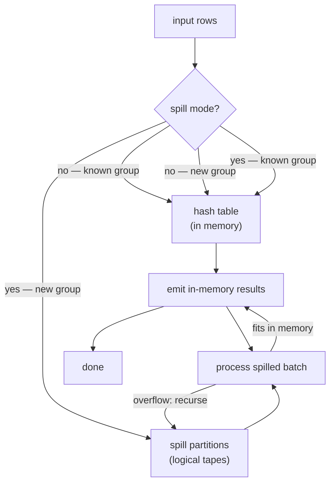
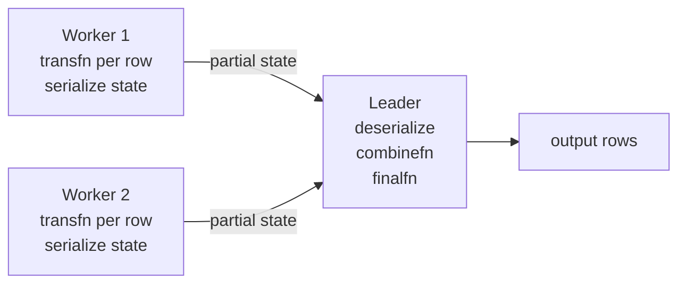

# Aggregate Execution

The `Agg` executor node evaluates `GROUP BY` clauses and aggregate functions (`SUM`, `COUNT`, `AVG`, custom aggregates, etc.). It supports four strategies — plain, sorted, hashed, and mixed — chosen by the planner based on cost. The same node also implements partial aggregation for parallel queries. Every aggregate is defined by a row in the `pg_aggregate` system catalog. The executor consults that catalog entry — resolved to function OIDs and type information during planning — for every aggregate it runs.

## The pg_aggregate catalog

Every aggregate function has a dual representation in the system catalogs. `pg_proc` holds the aggregate as an ordinary function entry — name, argument types, return type, owner, parallelism — with `prokind = 'a'`. `pg_aggregate` provides the implementation details that are specific to aggregates. `pg_proc` has no columns for these details. The two rows are linked by `pg_aggregate.aggfnoid`, which is the OID of the `pg_proc` entry.

The key columns of `pg_aggregate` (defined in `pg_aggregate.h`) are:

| Column | Type | Purpose |
|---|---|---|
| `aggfnoid` | `regproc` | OID of the aggregate's `pg_proc` entry |
| `aggkind` | `char` | `'n'` normal, `'o'` ordered-set, `'h'` hypothetical-set |
| `aggnumdirectargs` | `int16` | Number of direct (non-aggregated) arguments for ordered-set aggs |
| `aggtransfn` | `regproc` | Transition function OID (required) |
| `aggfinalfn` | `regproc` | Final function OID (0 if none) |
| `aggcombinefn` | `regproc` | Combine function OID for parallel aggregation (0 if none) |
| `aggserialfn` | `regproc` | Serialize transition state to `bytea` (0 if none) |
| `aggdeserialfn` | `regproc` | Deserialize `bytea` back to transition state (0 if none) |
| `aggmtransfn` | `regproc` | Moving-aggregate forward transition function (0 if none) |
| `aggminvtransfn` | `regproc` | Moving-aggregate inverse transition function (0 if none) |
| `aggmfinalfn` | `regproc` | Moving-aggregate final function (0 if none) |
| `aggfinalextra` | `bool` | Pass extra (dummy) arguments to `aggfinalfn` |
| `aggfinalmodify` | `char` | `'r'` read-only, `'s'` shareable, `'w'` read-write |
| `aggsortop` | `Oid` | Associated sort operator for `MIN`/`MAX` optimization (0 if none) |
| `aggtranstype` | `Oid` | Data type of the transition state |
| `aggtransspace` | `int32` | Estimated byte size of transition state (0 = let planner guess) |
| `aggmtranstype` | `Oid` | Data type of moving-aggregate transition state (0 if none) |
| `aggmtransspace` | `int32` | Estimated byte size of moving-aggregate state |
| `agginitval` | `text` | Text representation of the initial transition value (NULL is valid) |
| `aggminitval` | `text` | Initial value for moving-aggregate state |

The unique index on `aggfnoid` enforces the one-to-one relationship with `pg_proc`. The table is [[subsystems/storage/toast|TOAST]]-enabled because `agginitval` and `aggminitval` are variable-length text fields.

## How CREATE AGGREGATE writes the catalog

The grammar parses `CREATE AGGREGATE` and hands it to `DefineAggregate()` (`aggregatecmds.c`). `DefineAggregate()` resolves types and option strings, then calls `AggregateCreate()` (`pg_aggregate.c`).

`DefineAggregate()` decodes the aggregate kind from the argument list. When the SQL syntax includes a non-negative direct-argument count (the `ORDER BY` separating direct from aggregated args), `DefineAggregate()` sets the kind to `AGGKIND_ORDERED_SET`. The `HYPOTHETICAL` option then upgrades it to `AGGKIND_HYPOTHETICAL`. The function resolves each named type and validates cross-constraints. `msfunc` requires `mstype`. `serialfunc` and `deserialfunc` must both be present or both absent, and they are only allowed when `stype` is `internal`. The `initval` string is parsed through the type's input function at definition time, to catch obvious errors early, but it is stored as text because input functions may not be immutable.

`AggregateCreate()` does the actual catalog work:

1. It calls `ProcedureCreate()` to insert the `pg_proc` row with `prokind = 'a'` and a placeholder body `"aggregate_dummy"` (there is no actual procedural body for aggregates).
2. It looks up each named support function using `lookup_agg_function()`, which resolves overloaded names, enforces type compatibility, handles polymorphic types, and rejects set-returning functions. `AggregateCreate()` also rejects type coercion that would require a runtime cast. This is because `nodeAgg.c` cannot insert implicit coercions between transition steps.
3. It validates that the transition function's return type exactly matches `aggtranstype`. The same check applies to the combine and moving-aggregate variants.
4. It validates that the serialization function has the fixed signature `(internal) → bytea` and the deserialization function has `(bytea, internal) → internal`.
5. It writes a new row (or updates an existing one if `OR REPLACE` was given) into `pg_aggregate`. Replacing an aggregate is constrained: `aggkind` and `aggnumdirectargs` cannot change because those fields affect how the aggregate call is parsed.
6. It records `pg_depend` entries linking the aggregate to each support function and sort operator it references.

## The aggregate function model

Every aggregate function in PostgreSQL decomposes into a set of support functions, each serving a distinct role.

**Transition function** (`aggtransfn`): called once per input row. Its signature is `(transtype, arg1, ..., argN) → transtype`. It accumulates the running state. For `SUM(int8)`, this adds the current value to the running total. For `array_agg`, it appends to a growing array. The transition function is the only required component. All others are optional.

**Final function** (`aggfinalfn`): called once per group after all rows have been processed. It converts the accumulated transition state into the output value. For `AVG`, it divides the running sum by the running count. If absent, the transition state itself is the output. This is why `SUM` with a numeric transition type can omit a final function.

**Combine function** (`aggcombinefn`): takes two transition states and merges them. Its signature is `(transtype, transtype) → transtype`. This is what makes parallel aggregation possible. Two workers each accumulate a partial state, and the leader merges them with `combinefn` rather than re-reading the raw rows. For `SUM`, adding two partial sums is the same as `transfn`, so `combinefn = transfn`. For `AVG`, the transition state carries both a sum and a count, and `combinefn` adds both components independently.

**Serialize and deserialize functions** (`aggserialfn`, `aggdeserialfn`): convert a transition state to/from `bytea` for cross-process transport. These functions are required only when `aggtranstype` is `internal`, because `internal` values are raw C pointers. Raw C pointers cannot safely cross process boundaries. `serialfn` has signature `(internal) → bytea`. `deserialfn` has `(bytea, internal) → internal` (the dummy `internal` argument is a type-safety guard against accidental misuse). Aggregates with a concrete pass-by-value or pass-by-reference `transtype` do not need these functions. The executor copies the datum directly instead.

**Moving-aggregate functions** (`aggmtransfn`, `aggminvtransfn`, `aggmfinalfn`): support efficient sliding-window computation in window functions. The forward function `aggmtransfn` adds a row entering the window frame. The inverse function `aggminvtransfn` removes a row leaving the frame. With both functions defined, a window function over a sliding frame does O(1) work per row shift instead of recomputing the aggregate from scratch. The strictness of the forward and inverse functions must match — `AggregateCreate()` enforces this — because the executor handles NULL inputs uniformly for the pair.

The `aggfinalmodify` flag controls whether the executor can call `finalfn` multiple times on the same transition state (needed for `GROUPING SETS`) or share a transition state across multiple output `Aggref` nodes. `AGGMODIFY_READ_ONLY` means no side effects. `AGGMODIFY_SHAREABLE` allows multiple calls. `AGGMODIFY_READ_WRITE` means the function mutates the state and prevents sharing.

## Aggregation model at runtime

Every aggregate function has at least two components:

- **Transition function** (`transfn`): called once per input row; updates the running state. For `SUM(int8)`, this adds the input value to a running total.
- **Final function** (`finalfn`): called once per group; converts the transition state into the output value. For `AVG`, this divides the sum by the count.

Some aggregates also define a **combine function** used in partial aggregation, and optional **serialize/deserialize functions** for passing partial state between processes. These are discussed in detail in the parallel aggregation section below.

The transition and final functions decouple accumulation from output production. This separation is what makes partial aggregation composable: two partial transition states can be merged by `combinefn` without knowing anything about the original input rows.

## Polymorphic aggregates

Aggregates like `array_agg` accept inputs of any type and return a matching array type. PostgreSQL handles this through its polymorphic type system, using pseudo-types such as `anyelement`, `anyarray`, and `anynonarray`.

At the catalog level, a polymorphic aggregate's `aggtranstype` may itself be a polymorphic type (e.g. `anyarray` for `array_agg`). `AggregateCreate()` enforces a consistency rule: if `aggtranstype` is polymorphic, at least one aggregate argument must also be polymorphic. This lets the planner deduce the actual type at call time. The same rule applies to the final return type — the catalog validation in `AggregateCreate()` calls `check_valid_polymorphic_signature()` for both.

During planning, `preprocess_aggref()` (`prepagg.c`) resolves polymorphic types by calling `resolve_aggregate_transtype()` with the actual argument types supplied at the call site. The resolved concrete type is stored in `Aggref.aggtranstype` and used for everything thereafter — memory size estimates, hash table layout, transition state allocation. The original catalog entry still records the polymorphic pseudo-type. The resolution is purely a planning-time computation.

## Ordered-set and hypothetical-set aggregates

Ordered-set aggregates like `percentile_cont(0.5) WITHIN GROUP (ORDER BY salary)` have two distinct argument lists: direct arguments (given once, before `WITHIN GROUP`) and aggregated arguments (one per input row, inside `WITHIN GROUP`). The catalog uses `aggkind = 'o'` and `aggnumdirectargs` to distinguish them. The executor sees all arguments as a flat list. `aggnumdirectargs` tells it where the direct arguments end and the per-row arguments begin.

Hypothetical-set aggregates (`aggkind = 'h'`) are a subclass of ordered-set aggregates where the direct arguments mirror the aggregated arguments in type. `rank(5) WITHIN GROUP (ORDER BY score)` hypothetically inserts the value `5` into the sorted sequence. It then reports the rank of that value. The catalog validation in `AggregateCreate()` enforces that the last N direct argument types exactly match the N aggregated argument types.

For ordered-set aggregates, the transition function receives only the aggregated arguments (not the direct ones). The executor passes the direct arguments to the final function — which is what actually performs the computation using those arguments — along with the accumulated transition state. In the `AggStatePerAgg` structure, `aggdirectargs` holds the evaluated direct argument expressions for use during finalization (`finalize_aggregate()`, `nodeAgg.c`).

A plain aggregate's `aggkind` is `'n'` with `aggnumdirectargs = 0`. The `AGGKIND_IS_ORDERED_SET` macro tests for either `'o'` or `'h'`. This is the relevant distinction for how `AggregateCreate()` computes the transition function's signature: ordered-set aggregates exclude direct args from the transition function's input.

## Four aggregation strategies

The planner sets `Agg.aggstrategy` to one of four values:

| Strategy | Input requirement | When used |
|---|---|---|
| `AGG_PLAIN` | Any order | No `GROUP BY`; produces exactly one output row |
| `AGG_SORTED` | Pre-sorted by GROUP BY columns | Input already sorted; can stream output |
| `AGG_HASHED` | Any order | Unsorted input; groups tracked in a hash table |
| `AGG_MIXED` | Any order | `GROUPING SETS` with both hashed and sorted phases |

Strategy selection is cost-based. The planner compares estimates for both sorted and hashed approaches (`cost_agg()`, `costsize.c`), accounting for the expected spill cost when the estimated number of groups exceeds available memory. The strategy is then encoded in the plan node. It drives dispatch inside `ExecAgg()` (`nodeAgg.c`).

### Sorted aggregation

Sorted aggregation works by streaming. Input rows arrive pre-sorted on the grouping columns, so only one group's transition state needs to be live at any moment. The executor feeds each row to the transition functions immediately. When the grouping columns change value, the executor finalizes and emits the completed group. It then resets the per-group state for the next group.

Detecting a group boundary means comparing the current row's grouping-column values against the prior row's. The node stores the prior row in a `TupleTableSlot`. It uses the group comparison expression compiled into the phase's `eqfunctions` to detect the boundary. Memory use is bounded to a single group's state, regardless of cardinality. The planner therefore prefers this strategy when a suitable sort is available cheaply — for example, from an index scan or from an upstream `Sort` node it has already costed in. The implementation is in `agg_retrieve_direct()` (`nodeAgg.c`).

`AGG_PLAIN` is a degenerate case of sorted aggregation. With no grouping columns, there is exactly one group. It never changes, so no comparison is needed.

### Hash aggregation

Hash aggregation consumes the entire input before emitting any output. As each row arrives, the node hashes its grouping columns to find or create an entry in an in-memory hash table. The transition functions then update that entry's state in place. The deferred-output design allows groups to arrive in any order, at the cost of holding all partial states simultaneously (`agg_fill_hash_table()`, `nodeAgg.c`).

Each hash table entry carries a representative minimal tuple of the group key plus a flat array of `AggStatePerGroupData` structs — one per distinct transition function — allocated inline in the hash table's [[subsystems/memory/contexts|memory context]]. This layout avoids pointer chasing: a single hash lookup gives access to both the key and all live transition states for that group.

`work_mem` bounds memory usage. When the hash table grows beyond `hash_mem_limit` (derived from `work_mem`) or exceeds `hash_ngroups_limit`, the executor enters spill mode. The spill-to-disk mechanism described below then takes over.

### Mixed strategy

`AGG_MIXED` handles `GROUPING SETS` clauses that combine grouping sets requiring different sort orders. Phase 0 is the hash phase. It populates hash tables while the sorted phase processes input in sort order. After all sorted phases complete, the hash table results are drained. This allows a single scan of the input to serve multiple grouping sets with different structures.

## How planning reads pg_aggregate

The planner reads `pg_aggregate` during the preprocessing phase, before path generation. `preprocess_aggrefs()` (`prepagg.c`) walks the query tree and calls `preprocess_aggref()` for each `Aggref` node. For each aggregate reference, the planner performs a syscache lookup by `aggfnoid` (using the `AGGFNOID` syscache key) to fetch the `Form_pg_aggregate` struct, then extracts:

- `aggtransfn`, `aggfinalfn`, `aggcombinefn`, `aggserialfn`, `aggdeserialfn` — OIDs stored in `AggTransInfo` and `AggInfo` nodes for later use by the executor.
- `aggtranstype` — resolved from polymorphic to concrete using actual argument types; stored back in `Aggref.aggtranstype`.
- `aggtransspace` — the estimated byte footprint of one transition state, used by `get_agg_clause_costs()` to compute `AggClauseCosts.transitionSpace`.
- `agginitval` — fetched as a `text` datum and deserialized to the actual initial value by `GetAggInitVal()`.
- `aggfinalmodify` — determines whether multiple `Aggref` nodes can share a single transition state (`AGGMODIFY_READ_WRITE` prevents sharing).

`get_agg_clause_costs()` accumulates `AggClauseCosts` by calling `add_function_cost()` for each support function referenced in each `AggTransInfo`. The `transCost` field covers the per-row work (transition function, or combine function when building a partial-final plan). `finalCost` covers finalization (final function and serialization, if any). `transitionSpace` estimates the hash-table footprint for pass-by-reference transition types. It uses `aggtransspace` directly if nonzero. Otherwise, the planner falls back to `get_typavgwidth()` on the resolved `aggtranstype`. These cost estimates feed into `cost_agg()`. They ultimately determine whether the planner chooses hashed or sorted aggregation, and whether it introduces parallel partial aggregation.

## Key data structures

### AggStatePerTrans

One entry per distinct `(aggregate function, input expressions, filter)` combination. Multiple output `Aggref` nodes may share a single `pertrans` entry when their arguments are identical. For example, `SUM(x)` and `COUNT(x)` can share the same input-expression evaluation even though their transition functions differ.

`AggStatePerTrans` holds the function call infrastructure for the transition function. If the aggregate has `ORDER BY` or `DISTINCT`, it also holds a `Tuplesortstate` per grouping set, for accumulating input before the transition function is called. When sorting is required, the executor sets `aggsortrequired`. It then stashes input values into the sorter during the main scan, rather than feeding them to the transition function directly.

### AggStatePerGroup

One entry per `(pertrans entry, group)` combination. Holds the live transition state for one group:

| Field | Purpose |
|---|---|
| `transValue` | Current `Datum` holding the transition state |
| `transValueIsNull` | Whether `transValue` is NULL |
| `noTransValue` | True before the first non-NULL input (for strict functions) |

For hash aggregation, `pergroup` arrays are stored inline in each hash table entry. For sorted aggregation, a single `pergroup` array is reused for each group, which is why the sorted strategy never needs to hold more than one group's state in memory at once.

### AggStatePerAgg

One entry per distinct output `Aggref` node. Contains the final function OID, direct argument expressions (for ordered-set aggregates), and an index into the `pertrans` array pointing at the shared transition state.

### HashAggSpill and HashAggBatch

These two structures manage the spill-to-disk lifecycle. `HashAggSpill` owns the logical tape set and the per-partition tape pointers used when writing spilled tuples. `HashAggBatch` describes a single deferred work unit: a tape of spilled tuples for one grouping set, along with the number of hash bits already consumed so that recursive spills can use fresh bits.

## Advancing transition state per row

The per-row hot path evaluates all transition functions for the current phase by executing a single compiled `ExprState` — `aggstate->phase->evaltrans` — rather than dispatching each aggregate individually. This means the expression evaluator (or [[subsystems/executor/jit-llvm|JIT]]-compiled code) handles dispatch, null checks, and strict-function short-circuiting in one pass (`advance_aggregates()`, `nodeAgg.c`).

Strict transition functions skip the call entirely when any argument is NULL, leaving `transValue` unchanged. The very first non-NULL input for a strict function initializes `transValue` directly to that input value instead of calling the transition function, which avoids an undefined initial state. `MAX` and `MIN` are both strict and have no `initcond`. This is why they produce the correct answer even when the first input is the result.

Transition functions that receive a pass-by-reference `transValue` can modify it in place and return the same pointer, avoiding a palloc on every row. They detect this context with `AggCheckCallContext()`. For `COUNT(*)`, the transition function `int8inc()` (`int8.c`) uses this pattern to increment the counter in place. The `EEOP_AGG_PLAIN_TRANS` expression step detects that the returned pointer equals the input pointer and skips the copy.

## FILTER clause

SQL's `FILTER (WHERE ...)` clause on an aggregate skips rows that do not match the condition. The filter predicate is compiled into the `evaltrans` expression as a check that runs before the transition function is invoked. Because the entire per-row evaluation — filter, argument evaluation, and transition function call — is fused into one expression, the filter does not add a separate scan pass.

In window aggregate mode (`nodeWindowAgg.c`), the executor evaluates the filter explicitly before calling `advance_windowaggregate()`. A false result causes an early return that leaves `transValue` and `transValueCount` unchanged.

## ORDER BY and DISTINCT within aggregates

`ORDER BY` within an aggregate (e.g. `string_agg(name, ',' ORDER BY name)`) does not sort the whole input — it sorts only the values to be passed to the transition function for one group. When `aggsortrequired` is set on a `pertrans` entry, the executor pushes input values into a per-group `Tuplesortstate` during the scan phase. When the group is complete and finalization begins, the executor runs the sorter. It then replays the sorted values through the transition function. This happens before `finalfn` is called.

`DISTINCT` within an aggregate (e.g. `COUNT(DISTINCT x)`) works the same way: the executor sorts the values, then suppresses adjacent duplicates during replay. The equality check uses abbreviated keys from the sorter where possible to skip the full comparison for the common case of non-duplicates.

When the aggregate has a single input column, the executor uses the faster `tuplesort_getdatum` path instead of `tuplesort_gettupleslot`. `process_ordered_aggregate_single()` handles this case, versus `process_ordered_aggregate_multi()` for the general case (`nodeAgg.c`). The datum path is measurably faster for by-value types like integers because it avoids slot overhead.

Note that partial aggregation is incompatible with `ORDER BY` or `DISTINCT` within aggregates, because there is no way to guarantee global ordering or global distinctness across workers.

## Finalizing a group

When a group is complete, `finalize_aggregates()` (`nodeAgg.c`) first sorts the accumulated `Tuplesortstate` for any aggregate with `ORDER BY` or `DISTINCT` inputs. It then replays the sorted values through the transition function. This happens before finalization proceeds.

The executor then calls each aggregate's final function on the transition state. If `finalfn` is present, it converts the state to the output value. Otherwise, the executor returns `transValue` directly. Strict `finalfn` semantics apply — if `transValue` is NULL the output is NULL without calling the function. The executor wraps the transition state with `MakeExpandedObjectReadOnly()` before passing it to `finalfn`. This prevents destructive modification.

For ordered-set aggregates (e.g. `percentile_cont`), `finalfn` receives both the transition state and any "direct" arguments that were not part of the per-row accumulation. The executor evaluates these from `peragg->aggdirectargs`. It places them in the argument positions after the transition state.

## HashAgg spill to disk

Starting with PostgreSQL 13, hash aggregation can spill to disk when memory is exhausted, rather than failing or forcing the planner to choose a different strategy. The mechanism is partition-based and mirrors the spill design of sort-based hash joins.

When `hash_agg_check_limits()` finds that the combined `hash_metacxt` and `hashcontext` allocations exceed `hash_mem_limit`, or that the group count exceeds `hash_ngroups_limit`, the node enters spill mode. In spill mode:

1. Existing groups already in the hash table continue to receive transitions for matching rows.
2. Rows that would create a new group are instead written to one of several logical tapes, partitioned by hash value. The partition a row belongs to is determined by the high bits of the hash — bits not yet used for the current table's bucket selection.
3. After the input is exhausted, the in-memory results are drained and emitted.
4. Each spilled partition becomes a `HashAggBatch`. For each batch, the executor builds a fresh hash table and replays the batch's tuples through it. If a batch again overflows memory, it is spilled recursively into sub-partitions using a fresh slice of hash bits.

The number of partitions is chosen by `hash_choose_num_partitions()` with a factor of 1.5x the estimated number of partitions needed to fit in memory (`HASHAGG_PARTITION_FACTOR`), bounded by a minimum of 4 and a maximum of 1024 (`HASHAGG_MIN_PARTITIONS`, `HASHAGG_MAX_PARTITIONS`). The upper bound prevents tape-buffer memory from crowding out hash table space. Partition counts are always powers of two so that bit-masking can route tuples without division.

A HyperLogLog sketch (`HASHAGG_HLL_BIT_WIDTH = 5`, roughly 32 bytes, ~18% error) tracks the cardinality of each spilled partition. When the partition is replayed as a new batch, this cardinality estimate drives the selection of a fresh partition count for any further recursive spills.

PostgreSQL recompiles the transition expression (`hashagg_recompile_expressions()`) when spill mode begins. The new version adds a null-pointer check on the `AggStatePerGroup` array. That array may be NULL for a tuple that hashes to an unoccupied bucket, when no new groups are allowed. A second recompilation happens when reading from tapes. Tape-sourced tuples arrive there as `MinimalTuple` slots, rather than the outer plan's slot type.

## Partial aggregation in parallel queries

When the planner uses parallel aggregation, it inserts two `Agg` nodes:

- **Worker nodes** (`AGGSPLIT_INITIAL_SERIAL`): run `transfn` normally but skip `finalfn`. Instead, they serialize the transition state with `serialfn` and pass the raw state up to the gather node.
- **Leader node** (`AGGSPLIT_FINAL_DESERIAL`): receives serialized states from workers and deserializes them with `deserialfn`. It then combines them using `combinefn` (the cross-worker equivalent of `transfn`), and finally calls `finalfn` to produce the output.

The `AggSplit` flags are bit-packed: `DO_AGGSPLIT_SKIPFINAL`, `DO_AGGSPLIT_SERIALIZE`, `DO_AGGSPLIT_COMBINE`, `DO_AGGSPLIT_DESERIALIZE` control which functions are called at each node. Standard aggregates (`SUM`, `COUNT`, etc.) define their `combinefn` to be the same as `transfn` — adding a partial sum to a running total is the same operation regardless of whether the input came from raw rows or a worker's serialized state.

The serialize/deserialize round-trip exists because the transition state's internal representation may contain pointers or memory-context-dependent data. This data cannot be sent across process boundaries directly. `serialfn` converts the in-memory state to a `bytea`, which the transport layer can copy freely. `deserialfn` reconstructs a fresh state object from that `bytea`.

## Grouping sets and phases

`GROUPING SETS`, `ROLLUP`, and `CUBE` all reduce to a list of grouping sets. The executor can process structurally equivalent rollups — those whose grouping sets share a sort order — in a single pass over ordered data, by keeping a separate `pergroup` array for each set simultaneously. A row updates all sets. At each group boundary, the executor resets only the sets whose key columns changed. The sets are ordered from most specific to least specific so that resets cascade inward from the most finely grouped set.

When the grouping sets cannot share a sort order, the Agg node chains together multiple `Agg` plan nodes via the `chain` field. Each represents one phase with a distinct sort requirement. Phase transitions use `sort_out` and `sort_in` pointers. The current phase writes its input tuples into `sort_out` during its scan. When the next phase begins, that sort becomes the new `sort_in`. It is then sorted via `tuplesort_performsort()`. Phase 0 is always reserved for hashing. Sorted phases are numbered 1 through n.

## Memory management

Each group's transition state is allocated in `aggstate->curaggcontext` — an expression context whose per-tuple memory persists for the lifetime of one group. When the group changes, the context is rescanned, not just reset. This ensures that transition functions which registered shutdown callbacks via `AggRegisterCallback()` are notified before their memory disappears.

The expression evaluation context (`tmpcontext`) is reset between input rows. This is where argument evaluation and transition function calls happen. Allocations there are therefore transient by design.

For hash aggregation, `hash_metacxt` holds the hash table structure (buckets, pointers). `hashcontext->ecxt_per_tuple_memory` holds the actual group keys and inline `pergroup` arrays. When the table spills, `hash_tapeset` holds the logical tape set. The distinction matters for limit tracking: `hash_agg_check_limits()` sums both contexts to get the true memory footprint.

The per-entry size estimate (`hashentrysize`) is updated after each batch is processed, replacing the initial estimate with an observed ratio of memory to group count. This feedback loop makes recursive spill decisions progressively more accurate.

## Related Topics

- [[subsystems/executor/overview]] — where Agg fits in the node taxonomy
- [[subsystems/executor/expression-eval]] — how `evaltrans` is compiled and executed
- [[subsystems/planner/overview]] — how the planner chooses AGG_SORTED vs AGG_HASHED
- [[subsystems/planner/statistics]] — how group count estimates influence strategy choice
