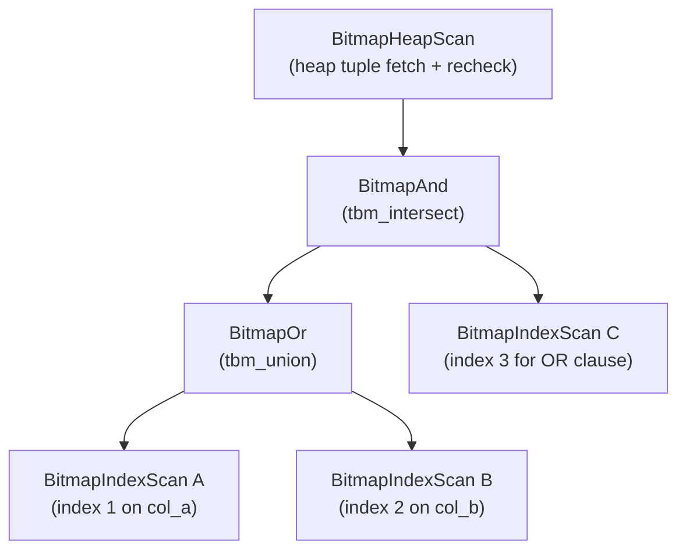

BitmapAnd and BitmapOr are executor nodes. They combine `TIDBitmap` results from multiple `BitmapIndexScan` children into a single bitmap, before the parent `BitmapHeapScan` fetches heap tuples. They implement the executor half of multi-index bitmap scans. When a query can exploit more than one index on the same relation, or when an OR predicate distributes across separate index conditions, the planner emits a tree of these nodes rather than a single index scan. The result is a compact representation of candidate tuple locations that allows the heap to be read in block order. This dramatically reduces random I/O.

## TIDBitmap: exact and lossy modes

A `TIDBitmap` (declared opaque in `tidbitmap.h`, implemented in `tidbitmap.c`) is a hash-map from block numbers to per-page bitmaps. Each entry is a `PagetableEntry`, carrying either an exact per-tuple bitmap (one bit per heap tuple offset on the page) or a lossy chunk flag (`ischunk = true`) that marks all tuples on that page as candidates.

The bitmap is created with a memory cap derived from [[subsystems/executor/work-mem-and-spill|work_mem]] via `tbm_create(work_mem * 1024L, ...)` (nodeBitmapOr.c). As TIDs are added, the hash table may grow past `maxentries`. When that happens, `tbm_mark_page_lossy()` demotes the affected page from exact to lossy. Lossy storage uses one bit per disk page rather than one bit per tuple offset. So a lossy chunk covers up to `PAGES_PER_CHUNK` pages with a single word, which is dramatically cheaper in memory. But it loses the knowledge of which specific tuples matched.

The `TBMIterateResult` returned to the heap scan carries `ntuples = -1` to signal a lossy page, and a populated `offsets[]` array for exact pages. The `recheck` field on exact entries handles a subtler case. When `tbm_intersect` combines a lossy and a non-lossy entry for the same page, it keeps the result as exact but flags it for recheck. This is necessary because the lossy side cannot confirm which individual tuples satisfy its predicate.

```
PagetableEntry fields of note:
  ischunk   — true  → lossy; covers a range of pages
  recheck   — true  → exact TIDs present but quals must be rechecked
  words[]   — per-tuple bitmap (exact) or per-page bitmap (lossy chunk)
```

## BitmapAnd: intersection with short-circuit

`MultiExecBitmapAnd()` (nodeBitmapAnd.c) calls `MultiExecProcNode()` on each child in turn, intersecting each returned bitmap into a running result via `tbm_intersect()` and then freeing the child bitmap. This is not the normal `ExecProcNode` tuple-at-a-time protocol. Bitmap nodes communicate via the `MultiExec` protocol, which returns a `Node *` (specifically a `TIDBitmap *`) rather than a tuple slot. Because of this, the stub `ExecBitmapAnd()` raises an error if called through the regular slot protocol.

The critical optimisation is the early-exit check: after every intersection step, `MultiExecBitmapAnd()` tests `tbm_is_empty()`. If the bitmap is already empty, it skips the remaining children entirely. It never executes their index scans. The comment in the source notes that `indxpath.c` deliberately orders subplans by increasing index access cost (most selective first). This ordering makes the early-exit fire as often as possible.

`BitmapAndState` is minimal: it holds only the `PlanState` base, a flat array `bitmapplans[]` of child `PlanState *`, and `nplans`. There are no expression contexts or tuple slots because BitmapAnd never evaluates quals or projects output tuples.

## BitmapOr: union with direct-accumulation optimisation

`MultiExecBitmapOr()` (nodeBitmapOr.c) implements a union. When a child is a `BitmapIndexScanState`, the node passes the already-allocated result bitmap directly to the child via `biss_result`. The index scan then ORs its TIDs into the shared bitmap in place, avoiding an explicit `tbm_union()` copy step. For non-`BitmapIndexScan` children (nested BitmapAnd or BitmapOr subtrees), the standard path allocates a new bitmap per child and then calls `tbm_union()` to merge.

The shared-bitmap shortcut means the BitmapOr node — not each child — is responsible for calling `tbm_create()` and setting the initial size limit. There is no short-circuit equivalent for OR. The node must scan every child, because any of them might contribute matching TIDs.

Memory pressure is the main driver of lossy promotion during a union. As `tbm_union` merges one bitmap into another, it downgrades any page that cannot fit as an exact entry to lossy in the accumulating result. The BitmapHeapScan above must therefore always be prepared to recheck tuples on pages flagged lossy or recheck.

When the BitmapHeapScan iterates the final bitmap, it calls `tbm_iterate()` page by page. For each page, `TBMIterateResult.ntuples == -1` means the entire page is lossy. The scan then reads every tuple on the page and re-evaluates the original filter condition (the `recheckCond` expression stored in the `BitmapHeapScan` plan node). For exact pages with `recheck = true`, the scan visits only the specific tuple offsets in the bitmap but still re-evaluates each one. Only exact pages with `recheck = false` can skip the per-tuple qual check. This design decouples the bitmap operators from the predicate logic. BitmapAnd and BitmapOr deal purely in sets of page/TID addresses, carrying no knowledge of the original index conditions. The recheck in the parent heap scan guarantees correctness in the presence of lossy entries.

## Planner conditions for emitting these nodes

The planner emits BitmapAnd and BitmapOr plans under two distinct circumstances, both handled in `indxpath.c` (see [[subsystems/planner/bitmap-scans]] for a fuller treatment):

- **Multiple indexes on the same relation with AND conditions.** `choose_bitmap_and()` evaluates subsets of available `BitmapIndexPath`s and estimates cost via `bitmap_and_cost_est()`. It then emits a `BitmapAndPath` for the winning combination. `choose_bitmap_and()` sorts the subpaths by increasing access cost before handing them to the executor, enabling the short-circuit optimisation described above.

- **OR predicates.** `generate_bitmap_or_paths()` processes OR clauses (collected by `orclauses.c`, see [[subsystems/planner/or-clauses]]). For each disjunct that can be satisfied by some index, it builds a `BitmapOrPath`. If individual disjuncts are themselves AND-able, `generate_bitmap_or_paths()` calls `choose_bitmap_and()` recursively to produce a nested `BitmapAndPath` as one input to the OR node.

The planner only generates a `BitmapOrPath` or `BitmapAndPath` when the cost model prefers it over a plain sequential scan or a single-index scan. It never emits these nodes unconditionally.

## Plan tree shape



In this example the query has `col_a = ? OR col_b = ?` ANDed with an additional predicate on `col_c`. The BitmapOr merges scans A and B. The BitmapAnd intersects that result with scan C. The BitmapHeapScan then fetches heap blocks in order, rechecking any lossy pages.

## Related Topics

- [[subsystems/planner/bitmap-scans]] — planner side: cost model, path generation, `choose_bitmap_and()`
- [[subsystems/planner/or-clauses]] — how OR predicates are distributed into per-index clauses
- [[subsystems/executor/work-mem-and-spill]] — `work_mem` controls the TIDBitmap size limit and when lossy promotion occurs
- [[subsystems/storage/visibility-map]] — BitmapHeapScan uses the visibility map to skip all-visible pages even for lossy bitmap entries
