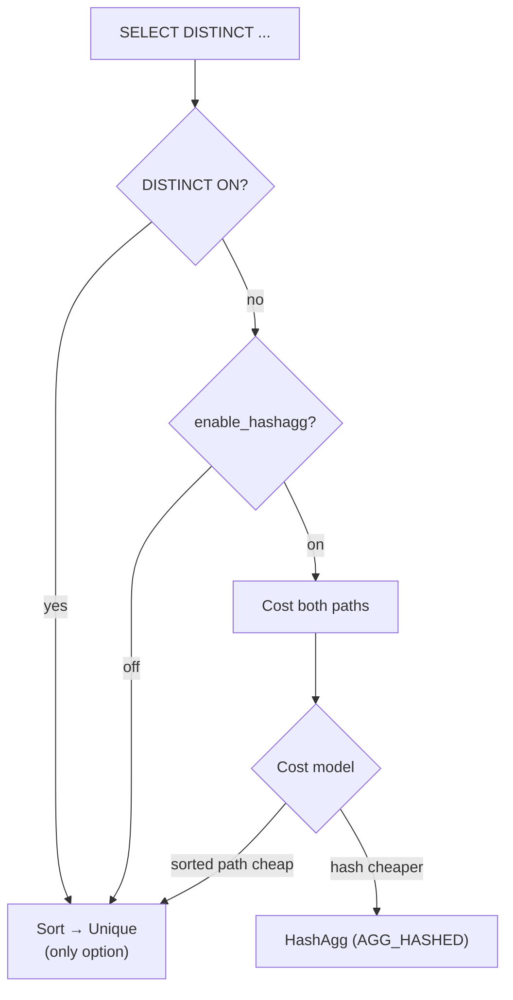

The Unique executor node implements sort-based deduplication for `SELECT DISTINCT` and `SELECT DISTINCT ON`. It is a streaming filter that relies entirely on its input arriving in sorted order. It carries no hash table and holds at most one saved tuple at any moment. This gives it a constant memory profile regardless of the number of distinct values.

## How Unique works

Unique assumes its subplan delivers tuples in an order where duplicates are always adjacent. On each call to `ExecUnique()` (nodeUnique.c), it pulls a new tuple from the outer child and compares it against the previously returned tuple stored in `ps_ResultTupleSlot`. If the two tuples match on all key columns, it discards the new tuple and continues the loop. The first tuple in each group is the one it returns. When the comparison fails — meaning a new group has begun — it copies the current tuple into the result slot with `ExecCopySlot()` and hands it back to the caller. The first tuple from the subplan always passes through unconditionally because the result slot is empty at that point.

The node holds exactly two tuple slots: the result slot (last-returned tuple) and the transient slot delivered by the child plan. There is no accumulation of group state, no hash table, and no work-mem budget. This makes Unique the natural choice whenever a pre-sorted path already exists and the planner can avoid paying a separate sort cost.

## Equality functions and initialisation

`ExecInitUnique()` calls `execTuplesMatchPrepare()` (execGrouping.c) to build a compiled `ExprState` for tuple comparison. The function resolves the equality operator OID for each key column (stored in `Unique.uniqOperators`) to its underlying C function via `get_opcode()`. It then calls `ExecBuildGroupingEqual()` to emit a [[subsystems/executor/jit-llvm|JIT]]-friendly expression tree. The result is stored as `UniqueState.eqfunction`.

At execution time, `ExecQualAndReset()` evaluates this expression with the new tuple placed in `ecxt_innertuple` and the saved tuple in `ecxt_outertuple`. The expression returns true when the tuples are **not distinct** — i.e., when they match and the duplicate should be suppressed.

The `Unique` plan node carries three parallel arrays of length `numCols`:

| Field | Purpose |
|---|---|
| `uniqColIdx` | Attribute numbers of the key columns |
| `uniqOperators` | Equality operator OIDs (one per key column) |
| `uniqCollations` | Collation OIDs for string comparisons |

`ExecInitUnique()` rejects the `EXEC_FLAG_BACKWARD` and `EXEC_FLAG_MARK` flags because Unique has no mechanism to reverse direction through a sorted stream.

## DISTINCT ON semantics

`SELECT DISTINCT ON (expr1, expr2, ...)` eliminates tuples that share the same values for the listed expressions only. The remaining output columns are irrelevant to the comparison. The tuple chosen from each group is the first one in sort order — typically determined by an accompanying `ORDER BY`.

The parser ensures that the `DISTINCT ON` expressions form a prefix of the `ORDER BY` sort key (or that `ORDER BY` is absent). The planner, in `create_final_distinct_paths()` (planner.c), must sort by whichever pathkeys are more restrictive. When `sort_pathkeys` extend beyond `distinct_pathkeys`, it uses `sort_pathkeys` as the required ordering, to satisfy both clauses in a single pass.

The Unique node itself is unaware of the distinction between plain `DISTINCT` and `DISTINCT ON`. It compares only the `numCols` key columns encoded in the plan node. With `DISTINCT ON`, `numCols` counts only the `DISTINCT ON` expressions, so all other output columns are invisible to the equality check. This is why `DISTINCT ON` cannot be satisfied by hash aggregation. Hashing would need to include the full output key, which defeats the partial-key semantics.

## Planner choice: Unique vs. hash aggregation

The planner evaluates both a sort-based path (Sort → Unique) and a hash-based path (HashAgg with `AGG_HASHED`) for plain `SELECT DISTINCT`. The decision logic lives in `create_final_distinct_paths()` (planner.c):

- **Hash aggregation is blocked entirely** when the query uses `DISTINCT ON` (`parse->hasDistinctOn`) or when `enable_hashagg` is off. In those cases the planner generates only sorted paths.
- **Unique wins cheaply** when a sorted path already satisfies `distinct_pathkeys` — an index scan in the right order, or an [[subsystems/executor/sort#incremental-sort|incremental sort]] with enough presorted keys. The planner adds no explicit sort. The Unique node sits directly atop the already-ordered child.
- **Cost competition** applies otherwise: the planner adds both a Sort+Unique path (using `create_upper_unique_path`) and an `AGG_HASHED` path (using `create_agg_path`) and lets the cost model choose. Hash aggregation wins on wide tables with low cardinality. Unique wins when the sort is cheap or output order is needed downstream.

The planner also considers **incremental sort**. If the input is partially sorted on a prefix of `distinct_pathkeys`, it tries `create_incremental_sort_path` before falling back to a full sort. This often lets Unique beat hash aggregation on append-only or time-series workloads where recent data arrives nearly in order.

## Memory profile

`UniqueState` has a constant memory footprint: one tuple stored in `ps_ResultTupleSlot` plus whatever the expression context needs for the equality comparison. Unique has no dependency on [[subsystems/executor/work-mem-and-spill]] because it never accumulates a batch of tuples. This contrasts with hash aggregation. Hash aggregation must materialise all distinct groups in memory, and it may spill to disk when they exceed `work_mem`.

The flip side is that Unique inherits the memory cost of the Sort node beneath it. An external sort can use up to `work_mem` per plan node, and it may write temporary files for large inputs. When the input is already sorted (e.g., arriving from a B-tree index scan), neither Sort nor Unique uses any significant memory.

## Interaction with LIMIT

Unique composes well with `LIMIT`, because the deduplication loop in `ExecUnique()` is lazy. It returns each unique tuple as soon as it is found. A `LIMIT N` node above Unique will call `ExecProcNode` exactly N times and then stop, leaving the rest of the input unread. This early-exit behaviour means that `SELECT DISTINCT ... LIMIT 10` can often be satisfied after reading only a small prefix of the sorted input. This makes Sort+Unique competitive even against hash aggregation for small limits on high-cardinality columns.

## Rescan

`ExecReScanUnique()` clears the result slot so that the first tuple of the new scan is unconditionally returned. If the child plan's `chgParam` is NULL, `ExecReScanUnique()` explicitly rescans the child. Otherwise, the child rescans itself on the next `ExecProcNode` call. This matches the standard rescan protocol used by other stateful executor nodes.

## Related Topics

- [[subsystems/executor/aggregate]] — hash aggregation (`AGG_HASHED`) is the primary alternative to Unique for `SELECT DISTINCT`
- [[subsystems/executor/sort]] — Unique always sits above a Sort or an already-ordered scan
- [[subsystems/executor/group-by]] — the Group node uses the same `execTuplesMatchPrepare` / `ExecQualAndReset` pattern for sorted grouping
- [[subsystems/executor/work-mem-and-spill]] — Sort may spill; Unique itself never does
- [[subsystems/executor/limit-offset]] — Limit above Unique enables early exit without reading the full sorted input
