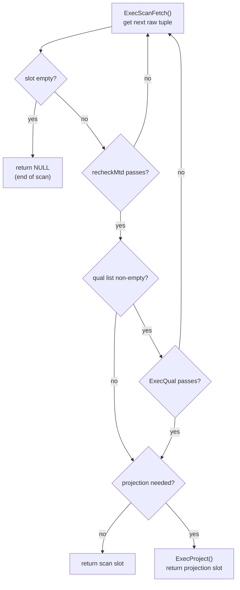

`ExecScan()` is the shared scan loop used by every tuple-at-a-time scan node in the executor. Rather than duplicating qual evaluation, projection, and EPQ handling in each node, every scan node supplies two callbacks and delegates the loop body to `ExecScan()`. The result is that nodes such as `SeqScan`, `IndexScan`, `BitmapHeapScan`, and `FunctionScan` each contain only the logic that is genuinely specific to their access method.

## Access-method callback types

Each scan node registers two function pointers when it initialises its `ScanState`:

| Type | Signature summary | Responsibility |
|---|---|---|
| `ExecScanAccessMtd` | `(ScanState *) → TupleTableSlot *` | Fetch the next raw tuple from the access method. Returns an empty slot when the source is exhausted. |
| `ExecScanRecheckMtd` | `(ScanState *, TupleTableSlot *) → bool` | Re-evaluate access-method-internal conditions against a tuple already in the slot. Returns `true` if the tuple still satisfies those conditions. |

The access callback owns everything below the executor's abstraction boundary: opening and advancing cursors, reading index entries, calling `table_scan_getnextslot()`, or invoking a set-returning function. The recheck callback exists for access methods that can produce false positives — the bitmap heap scan being the canonical example.

## The inner loop

`ExecScan()` drives a tight loop over these two callbacks, applying qual filtering and projection before returning a slot to the parent node.

The loop retries silently on recheck failure or qual failure. The cost is paid per-tuple rather than per-call, which keeps the node interface simple.

## Qual filtering versus access-method-internal conditions

`ExecQual()` evaluates the plan's qualifier list — expressions derived from the SQL `WHERE` clause that the planner pushed down to this scan node. These are always exact: a tuple that fails `ExecQual` is definitively rejected.

The `recheckMtd` callback handles a different class of condition: predicates that the access method evaluated approximately and may have gotten wrong. The bitmap heap scan illustrates this concretely. When the bitmap is lossy, a single bit in the bitmap represents an entire heap page rather than an individual tuple. Every tuple on that page is fetched and passed to `recheckMtd`. `recheckMtd` re-evaluates the original index conditions against each tuple, to discard the false positives. This two-level filtering — approximate at the page level, exact at the tuple level — lets the bitmap scan trade precision for memory efficiency without sacrificing correctness.

Index scans that are not lossy register a no-op recheck (returning `true` unconditionally), so the overhead disappears on the common path.

## EPQ integration in ExecScanFetch

`ExecScanFetch()` wraps the `accessMtd` callback and inserts EPQ (EvalPlanQual) handling transparently. When a concurrent `UPDATE` or `DELETE` triggers a re-evaluation — because a row visible to the scan has been modified by another transaction — `ExecScanFetch()` switches to fetching from the EPQ recheck queue instead of from the underlying access method. The individual scan node is unaware of this substitution. It continues to receive tuple slots and evaluate quals normally. This transparency is the point. EPQ correctness is enforced at the `ExecScan` level, rather than scattered across every scan node implementation.

EPQ is only active during `UPDATE`, `DELETE`, and `MERGE` execution. During these operations, the executor must re-lock and re-check tuples that were visible at plan time but have since changed.

## Projection elision

When a scan node's output columns are identical to the columns in the underlying scan slot — no expressions, no column reordering, no type coercions — `ExecAssignScanProjectionInfo()` detects this and marks the node as needing no projection. The flowchart branch that calls `ExecProject()` is bypassed entirely. The scan slot is returned directly instead. For wide tables where projection involves copying many `Datum` values, this elision is a measurable win.

## Rescan semantics

`ExecScanReScan()` resets the scan node for re-execution. This happens when a parameter changes — for example, when an inner side of a nested loop is rescanned with a new outer tuple. The function clears any EPQ state held by the scan. It then calls the node-specific `ExecReScan` hook, which repositions the access method cursor back to the start. From the perspective of the parent node, the scan produces tuples as if it had just been initialised.

## Related Topics

- [[subsystems/executor/overview|Executor overview]]
- [[subsystems/executor/seq-scan|Sequential scan]]
- [[subsystems/executor/joins|Join nodes]]
- [[subsystems/executor/expression-eval|Expression evaluation]]
- [[subsystems/executor/tuple-table-slot|Tuple table slot]]
