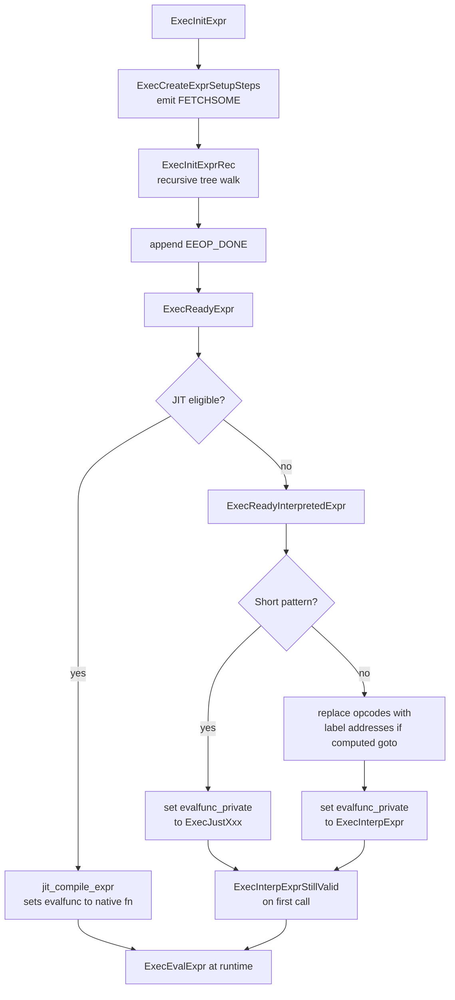

# Expression Evaluation

The expression evaluator evaluates every WHERE clause, projection column, join condition, and aggregate filter in a query. It is one of the hottest code paths in the executor. A single sequential scan over millions of rows might invoke the same compiled expression millions of times. The evaluator is therefore designed to minimise per-invocation overhead by doing all structural analysis once at plan startup, leaving the runtime path as a tight loop over a flat array of pre-compiled instructions.

## The compiled representation: ExprState

When a plan node initialises, each expression attached to it — quals, target list entries, join conditions — is compiled from the parser/planner's recursive node tree into an `ExprState`. The `ExprState` is the sole object handed to `ExecEvalExpr()` at runtime. The original tree is never walked again.

The key fields of `ExprState`:

| Field | Purpose |
|---|---|
| `steps` / `steps_len` | Flat array of `ExprEvalStep` instructions; the compiled program |
| `evalfunc` | Entry point called by `ExecEvalExpr()` — points to the interpreter, a [[subsystems/executor/jit-llvm|JIT]]-compiled function, or a fast-path routine |
| `evalfunc_private` | Secondary pointer used to hold the real target while `evalfunc` is temporarily set to a validity-checking wrapper |
| `resvalue` / `resnull` | Where the final result Datum and null flag land after all steps execute |
| `resultslot` | For projection states: the output `TupleTableSlot` that `ASSIGN_*` steps write into |
| `parent` | The `PlanState` this expression belongs to; needed to register `Aggref` and `SubPlan` nodes |
| `ext_params` | External `ParamListInfo` for `$1`, `$2` parameters when no parent plan exists |
| `innermost_caseval` / `innermost_casenull` | Thread-state for `CASE` and `FieldStore` nesting — points to the datum being examined by the current CASE arm |
| `flags` | Bitfield: `EEO_FLAG_IS_QUAL`, `EEO_FLAG_DIRECT_THREADED`, `EEO_FLAG_INTERPRETER_INITIALIZED` |

The `ExprState` is allocated in the per-query [[subsystems/memory/contexts|memory context]] and lives for the duration of the query. It mutates at runtime (result fields are overwritten each tuple) but the step array and all embedded function-call structures remain constant after compilation.

## Compilation: from node tree to step array

`ExecInitExpr()` drives compilation (execExpr.c). The sequence for any expression is:

1. Allocate an `ExprState` and zero it.
2. Call `ExecCreateExprSetupSteps()` to pre-scan the whole expression tree for `Var` references and emit `FETCHSOME` setup steps at the front of the array (see below).
3. Call the recursive `ExecInitExprRec()`, which switches on the node tag and appends steps for each sub-expression.
4. Append an `EEOP_DONE` step.
5. Call `ExecReadyExpr()` to choose an execution strategy.

`ExecInitExprRec()` is purely additive: it appends steps to `state->steps`, growing the array with `ExprEvalPushStep()` (which doubles the allocation when needed). The `resvalue`/`resnull` pointers in each step are set to wherever the result should be deposited — often `&state->resvalue`. But for function arguments, they point directly into the `fcinfo->args[]` array, so evaluated argument values arrive exactly where the function call expects them with no copy.

### Setup steps: FETCHSOME

Before any `VAR` step can copy a column value from a slot, the slot must have been deformed — the packed heap tuple bytes converted into the `tts_values[]`/`tts_isnull[]` arrays. The `ExecCreateExprSetupSteps()` pre-scan finds the highest-numbered column referenced from each of the three slot sources (inner, outer, scan) and emits a single `EEOP_{INNER,OUTER,SCAN}_FETCHSOME` step at the head of the program that calls `slot_getsomeattrs(slot, last_var)`. Deforming is thus done once per tuple per expression, not once per column reference. Subsequent `VAR` steps are pure array reads with no tuple-parsing work.

### Function call setup

`ExecInitFunc()` handles `FuncExpr`, `OpExpr`, and similar nodes (execExpr.c). It:

- Checks ACL permission to execute the function.
- Allocates an `FmgrInfo` and a `FunctionCallInfo` sized for exactly `nargs` arguments, both embedded in the step's inline `d.func` union.
- Recursively compiles each argument expression, pointing the result target at the corresponding `fcinfo->args[argno]` slot. Constant arguments skip compilation entirely. Their `Datum` values are filled into `fcinfo->args[]` once at compile time.
- Chooses the opcode: `EEOP_FUNCEXPR_STRICT` if `fn_strict && nargs > 0`, `EEOP_FUNCEXPR` otherwise. If `pgstat_track_functions` requires tracking, the `_FUSAGE` variants are chosen instead.

### CASE expression compilation

A `CASE WHEN ... THEN ... END` expression compiles into a sequence of per-arm instruction groups interspersed with conditional jumps. If there is a test expression (`CASE x WHEN ...`), it is compiled first and its result stored in a private `caseval`/`casenull` pair. The compiler then sets `state->innermost_caseval` to point to that pair before compiling each WHEN condition, so that any `CaseTestExpr` placeholder node inside the condition can read the test value via `EEOP_CASE_TESTVAL`. After each WHEN condition, an `EEOP_JUMP_IF_NOT_TRUE` step is emitted with a forward jump to the next arm. Each THEN clause is followed by an `EEOP_JUMP` to the end of the whole CASE. Jump targets are patched once the full step count is known, using a list of indices collected during compilation (execExpr.c).

### Qual compilation

`ExecInitQual()` takes an implicit-AND list of boolean expressions — the form that WHERE clauses take after parsing — and compiles it differently from a generic `ExecInitExpr()` call. For each clause, after compiling the clause expression, it emits an `EEOP_QUAL` step that checks the result. If the result is false or NULL, the step jumps immediately to `EEOP_DONE`, with `resvalue` set to `false`. This means the evaluator can bail out of a multi-clause WHERE the instant any clause fails, without evaluating remaining clauses. The `EEO_FLAG_IS_QUAL` flag is set on the `ExprState` to prevent it from being accidentally passed to `ExecCheck()`, which has different NULL semantics.

## The instruction set

Each `ExprEvalStep` (execExpr.h) packs into a single structure:

```
opcode     — EEOP_* enum value, or (with computed gotos) a jump label address
resvalue   — Datum * where this step writes its result
resnull    — bool * for the result null flag
d          — union of opcode-specific inline data
```

The `d` union holds all the data a step needs without a heap pointer chase. Function steps embed `FmgrInfo *` and `FunctionCallInfo *` directly. Constant steps store the `Datum` value inline. Variable steps store the zero-based column index.

### Core opcodes

| Opcode | What it does |
|---|---|
| `EEOP_DONE` | Signals end of program; jumps out of the interpreter loop |
| `EEOP_SCAN_FETCHSOME` | Deforms the scan slot up to column N via `slot_getsomeattrs` |
| `EEOP_INNER_FETCHSOME` / `EEOP_OUTER_FETCHSOME` | Same for inner and outer slots |
| `EEOP_SCAN_VAR` | Copies `tts_values[attnum]` and `tts_isnull[attnum]` from the scan slot |
| `EEOP_INNER_VAR` / `EEOP_OUTER_VAR` | Same from inner and outer slots |
| `EEOP_CONST` | Writes a compile-time `Datum` constant and its null flag |
| `EEOP_FUNCEXPR` | Calls `fn_addr(fcinfo)`, stores result |
| `EEOP_FUNCEXPR_STRICT` | Checks each argument for NULL first; short-circuits to NULL output if any argument is NULL, then calls the function |
| `EEOP_QUAL` | Simplified AND step: if result is false or NULL, sets result to false and jumps to done |
| `EEOP_BOOL_AND_STEP_FIRST` / `_STEP` / `_STEP_LAST` | Full SQL three-valued AND logic with short-circuit on false |
| `EEOP_BOOL_OR_STEP_FIRST` / `_STEP` / `_STEP_LAST` | Full SQL three-valued OR logic with short-circuit on true |
| `EEOP_JUMP` | Unconditional jump to a step index |
| `EEOP_JUMP_IF_NOT_TRUE` | Jump if result is NULL or false (used in CASE arms) |
| `EEOP_JUMP_IF_NULL` / `EEOP_JUMP_IF_NOT_NULL` | Conditional null-based jumps |
| `EEOP_CASE_TESTVAL` | Reads the innermost CASE test value from the compile-time pointer or from `econtext->caseValue_datum` as a fallback |
| `EEOP_ASSIGN_SCAN_VAR` | Directly copies a scan column into a result slot column (projection fast path) |
| `EEOP_ASSIGN_TMP` | Copies `state->resvalue` into a result slot column |
| `EEOP_AGGREF` | Reads a precomputed aggregate result from the Agg node's value array |
| `EEOP_PARAM_EXEC` | Fetches an internal executor parameter (`PARAM_EXEC`) |
| `EEOP_PARAM_EXTERN` | Fetches a client-supplied query parameter (`$1`, `$2`, ...) |
| `EEOP_WHOLEROW` | Constructs a composite Datum from an entire tuple slot |
| `EEOP_NULLTEST_ISNULL` / `EEOP_NULLTEST_ISNOTNULL` | `IS NULL` / `IS NOT NULL` scalar tests |
| `EEOP_SCALARARRAYOP` | Linear scan of an array for `= ANY(...)` / `<> ALL(...)` |
| `EEOP_HASHED_SCALARARRAYOP` | Hash-table-based lookup for large-array IN/NOT IN |

## NULL propagation

NULL handling is a pervasive concern. Every step has a `resnull` pointer alongside `resvalue`. The runtime model is that both must always be written together.

The central mechanism for strict functions is `EEOP_FUNCEXPR_STRICT`. When this opcode runs, the interpreter iterates over `fcinfo->args[0..nargs-1]` checking `isnull`. If any argument is null, `*op->resnull = true` is set. The execution then falls through to `EEO_NEXT()` without ever calling the function. The result `Datum` value is left undefined (it will be ignored by any consumer that checks the null flag). This short-circuit is significant. It means a strict function over a NULL column costs only the argument null-check, not a function call.

For AND/OR, the three-valued logic of SQL requires tracking whether any NULL has been seen so far. This tracking continues even when the expression has not yet short-circuited. `EEOP_BOOL_AND_STEP` uses a shared `anynull` flag (allocated at compile time and stored in `d.boolexpr.anynull`). The first step (`_STEP_FIRST`) resets this flag. If a subsequent step sees a NULL, it sets `anynull = true` but continues evaluating. Only on `_STEP_LAST` is the final result resolved. If the last value was TRUE but `anynull` was set, the result is promoted to NULL. This correctly implements "NULL AND TRUE = NULL" while still short-circuiting on FALSE (execExprInterp.c).

The `EEOP_QUAL` opcode is a simplified version of AND for WHERE evaluation. SQL specifies that a row does not pass a WHERE clause if the clause result is NULL. So `EEOP_QUAL` treats NULL identically to false, and immediately jumps to a done state that returns false. This lets multi-clause quals short-circuit earlier than a full `BOOL_AND` sequence would.

## The interpreter dispatch loop

`ExecInterpExpr()` is the main interpreter (execExprInterp.c). It begins by loading the four slot pointers (`scanslot`, `innerslot`, `outerslot`, `resultslot`) from the expression context into local variables. These stay in registers or on the stack for the duration of the call, avoiding repeated loads from `econtext->ecxt_*` fields.

The dispatch mechanism is selected at compile time:

**Computed-goto dispatch (direct threading)** is used when `HAVE_COMPUTED_GOTO` is defined. This is true for GCC and Clang. The `EEO_OPCODE` macro at expression-ready time replaces each step's `opcode` integer with the address of the corresponding label inside `ExecInterpExpr()`. The `EEO_NEXT()` macro then becomes a `goto *op->opcode` with an increment — a single indirect branch rather than a comparison plus a branch to a dispatch point. Each step jumps directly to the next step's handler, distributing the branch across multiple call sites and making it easier for the CPU's branch predictor to learn the per-site target. The `EEO_FLAG_DIRECT_THREADED` flag on the state records that this transformation has been done. This lets `ExecEvalStepOp()` reverse it when the original opcode is needed for debugging, or for the `CheckExprStillValid()` first-call check.

**Switch dispatch** is the fallback for non-GCC compilers. Each `EEO_NEXT()` becomes a jump back to a central `switch(opcode)` statement. The compiler typically implements this as a jump table, so dispatch is fast but still centralised. Branch prediction is harder than with computed gotos.

Both paths execute identical handler code. Only the dispatch glue differs. Complex handlers (aggregate transitions, subplan evaluation, whole-row construction) call out-of-line helper functions exported from execExprInterp.c. These helpers are also callable by the JIT compiler, which generates calls to them for complex opcodes rather than inlining them.

### First-call validity check

On the very first invocation of an interpreted expression, `ExecInterpExprStillValid()` runs instead of the real interpreter. It calls `CheckExprStillValid()`. This function walks the step array looking for `VAR` steps, and verifies that the column type recorded at compile time still matches the slot's current tuple descriptor. This guards against schema changes between plan creation and first execution. After the check passes, `state->evalfunc` is set to `state->evalfunc_private` (the real interpreter or fast-path function). The check is never repeated after that.

### Fast-path routines

Very short expressions with common patterns bypass `ExecInterpExpr()` entirely. `ExecReadyInterpretedExpr()` inspects the compiled step count and opcodes and routes to specialised functions for patterns like:

- `ExecJustConst` — a single `EEOP_CONST` step (just copy a datum).
- `ExecJustScanVar` / `ExecJustInnerVar` / `ExecJustOuterVar` — a `FETCHSOME` + `VAR` pair (read one column from a heap slot).
- `ExecJustScanVarVirt` / `ExecJustInnerVarVirt` / `ExecJustOuterVarVirt` — a bare `VAR` with no `FETCHSOME` (virtual slot, already deformed).
- `ExecJustAssignScanVar` etc. — assignment variants that write directly to the result slot.
- `ExecJustApplyFuncToCase` — `EEOP_CASE_TESTVAL` + `EEOP_FUNCEXPR_STRICT`, the pattern generated for `CASE x WHEN ... THEN f(x)` coercions.

These fast-path functions skip interpreter startup, avoid loading slot pointers that will not be used, and typically fit in a handful of instructions.

## JIT compilation

When the query's total cost exceeds `jit_above_cost` (or `jit_optimize_above_cost` for more aggressive optimisation), `ExecReadyExpr()` calls `jit_compile_expr()` before falling back to the interpreter (execExpr.c). If the JIT provider (LLVM) accepts the expression, it generates a native function that executes the step array without any interpreter dispatch overhead.

The JIT compiler does not replace the `ExprEvalStep` array. It reads the same opcodes, inline data, and function pointers that the interpreter would use. For simple opcodes (`CONST`, `VAR`, `FUNCEXPR`), it inlines the handler directly into the emitted machine code. For complex opcodes, it emits a call to the same out-of-line helper functions that the interpreter calls. When JIT compilation succeeds, the resulting function pointer is installed in `state->evalfunc`. So every subsequent call to `ExecEvalExpr()` invokes native code with no interpreter loop.

JIT is most effective on:
- Wide scans with many `FETCHSOME`/`VAR` steps over millions of rows.
- Complex filter expressions with many function calls.
- Aggregation inner loops, where JIT can also inline transition functions.

## Invoking at runtime

`ExecEvalExpr()` is an inline function in `executor.h` that calls `state->evalfunc(state, econtext, isNull)`. The `ExprContext` passed in provides the current tuple slots:

| Slot | Steps that use it |
|---|---|
| `ecxt_scantuple` | `EEOP_SCAN_*` |
| `ecxt_innertuple` | `EEOP_INNER_*` |
| `ecxt_outertuple` | `EEOP_OUTER_*` |

The expression context also carries `ecxt_per_tuple_memory`, a short-lived memory context that any function called during evaluation can allocate from. The plan node that owns the context resets it between tuples, reclaiming all per-row allocations automatically. Function code should not assume that allocations made here survive past the current tuple.

`ExecQual()` wraps `ExecEvalExpr()` for WHERE evaluation. If the expression was compiled with `ExecInitQual()`, a false or null result returns false to the caller. `ExecCheck()` is the variant for CHECK constraints, where a null result counts as passing.

## Projection

`ProjectionInfo` holds a single compiled `ExprState` that produces all output columns in one evaluation pass (execExpr.c). `ExecBuildProjectionInfo()` compiles the target list into this state, choosing between two strategies per column:

- **Safe `Var` fast path**: if the target list entry is a plain, non-system `Var` whose type matches the input descriptor, an `EEOP_ASSIGN_{SCAN,INNER,OUTER}_VAR` step is emitted. This single step copies the value and null flag directly from the source slot's `tts_values[]` array to the result slot's `tts_values[]` array — no intermediate `resvalue`, no `FETCHSOME` loop.
- **General expression path**: for anything else, the expression is compiled normally into `state->resvalue`, followed by an `EEOP_ASSIGN_TMP` step (or `EEOP_ASSIGN_TMP_MAKE_RO` for varlena types that might be referenced multiple times) to move the result into the correct slot column.

After `ExecProject()` runs all the steps in the projection's `ExprState`, the output slot has its `tts_values[]`/`tts_isnull[]` arrays populated. `ExecStoreVirtualTuple()` marks the slot non-empty. The caller receives a virtual tuple — no heap tuple is constructed. This is the cheapest possible form.

The same `ExecBuildProjectionInfo()` infrastructure is reused for `UPDATE` target-list evaluation via `ExecBuildUpdateProjection()`, which additionally copies unchanged columns from the old tuple's scan slot rather than re-evaluating expressions for them.

## Expression flow diagram



## See also

- [[subsystems/executor/tuple-table-slot]] — slot types and deformation that backs `FETCHSOME`/`VAR` steps
- [[subsystems/executor/overview]] — where `ExprState` fits in the plan node lifecycle
- [[subsystems/executor/aggregation-recipes]] — aggregate transition steps (`EEOP_AGG_*`)
