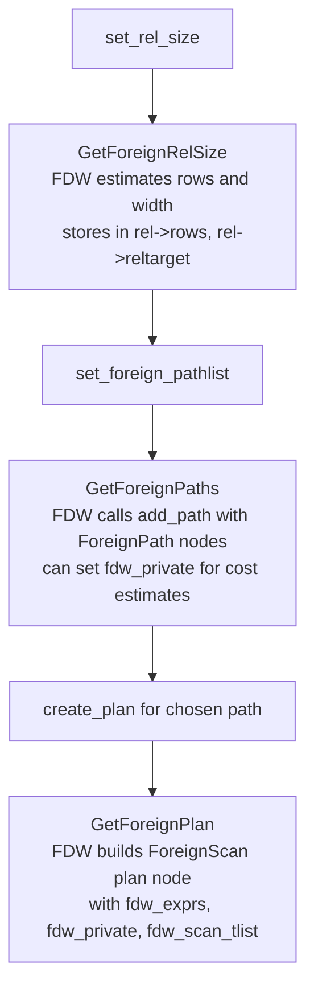

# Foreign Data Wrappers (FDW)

Foreign Data Wrappers are PostgreSQL's extension mechanism for reading from (and writing to) external data sources as if they were ordinary tables. An FDW is a shared library that implements a C callback API called `FdwRoutine`. This API plugs into both the planner and the executor.

Standard FDWs shipped with or available for PostgreSQL include `postgres_fdw` (remote PostgreSQL servers), `file_fdw` (local CSV/text files), and many third-party wrappers for Oracle, MySQL, Redis, S3, and others.

## SQL objects

```sql
-- 1. Install the FDW
CREATE EXTENSION postgres_fdw;

-- 2. Create a server descriptor
CREATE SERVER remote_pg
    FOREIGN DATA WRAPPER postgres_fdw
    OPTIONS (host 'db2.example.com', port '5432', dbname 'sales');

-- 3. Map local roles to remote credentials
CREATE USER MAPPING FOR alice
    SERVER remote_pg
    OPTIONS (user 'remote_alice', password 'secret');

-- 4. Declare the foreign table
CREATE FOREIGN TABLE orders (
    id   bigint,
    amt  numeric
) SERVER remote_pg OPTIONS (schema_name 'public', table_name 'orders');
```

These objects are stored in:

| Catalog | Stores |
|---|---|
| `pg_foreign_data_wrapper` | FDW name and handler function OID |
| `pg_foreign_server` | Server name, FDW OID, options |
| `pg_user_mapping` | Per-role credentials for a server |
| `pg_foreign_table` | Per-table server OID and options |

## FdwRoutine — the callback table

`GetFdwRoutineForRelation()` dlopen-loads the FDW library. It then calls the library's `handler` function (declared as `Datum handler(PG_FUNCTION_ARGS)`). The handler returns a `FdwRoutine *` — a struct of function pointers:

```c
/* src/include/foreign/fdwapi.h (abridged) */
typedef struct FdwRoutine
{
    /* Planner callbacks */
    GetForeignRelSize_function    GetForeignRelSize;    /* estimate row count */
    GetForeignPaths_function      GetForeignPaths;      /* add access paths */
    GetForeignPlan_function       GetForeignPlan;       /* build ForeignScan plan */
    BeginForeignScan_function     BeginForeignScan;     /* executor init */
    IterateForeignScan_function   IterateForeignScan;   /* fetch next tuple */
    ReScanForeignScan_function    ReScanForeignScan;    /* restart scan */
    EndForeignScan_function       EndForeignScan;       /* cleanup */

    /* Write callbacks (optional) */
    AddForeignUpdateTargets_function AddForeignUpdateTargets;
    PlanForeignModify_function    PlanForeignModify;
    BeginForeignModify_function   BeginForeignModify;
    ExecForeignInsert_function    ExecForeignInsert;
    ExecForeignBatchInsert_function ExecForeignBatchInsert;
    ExecForeignUpdate_function    ExecForeignUpdate;
    ExecForeignDelete_function    ExecForeignDelete;
    EndForeignModify_function     EndForeignModify;

    /* Join/upper-rel pushdown (optional) */
    GetForeignJoinPaths_function  GetForeignJoinPaths;
    GetForeignUpperPaths_function GetForeignUpperPaths;

    /* ANALYZE support (optional) */
    AnalyzeForeignTable_function  AnalyzeForeignTable;

    /* IMPORT FOREIGN SCHEMA (optional) */
    ImportForeignSchema_function  ImportForeignSchema;

    /* Async execution (optional, PG 14+) */
    IsForeignPathAsyncCapable_function IsForeignPathAsyncCapable;
    ForeignAsyncRequest_function  ForeignAsyncRequest;
    ForeignAsyncConfigureWait_function ForeignAsyncConfigureWait;
    ForeignAsyncNotify_function   ForeignAsyncNotify;
} FdwRoutine;
```

Only the scan callbacks (`GetForeignRelSize` through `EndForeignScan`) are mandatory. All others are optional. A `NULL` value means the feature is not supported.

## Planner integration

Foreign tables enter the planner as `RTE_RELATION` range table entries with `relkind = RELKIND_FOREIGN_TABLE`. The planner calls the FDW through three hooks during path generation:



### Estimating foreign relation size

`GetForeignRelSize()` (FDW handler, `foreign.c`) sets `baserel->rows`, the estimated foreign row count. It also populates `baserel->fdw_private` with any planner state the FDW wants to carry forward. `postgres_fdw` contacts the remote server with `EXPLAIN` here to get an accurate estimate.

### Proposing access paths for a foreign scan

`GetForeignPaths()` (FDW handler) calls `add_path(rel, path)` with one or more `ForeignPath` nodes. The FDW sets the cost fields on each path. The planner picks the cheapest one. Most FDWs add one sequential-scan-equivalent path. `postgres_fdw` may add parameterised paths for join pushdown.

### Building the foreign scan plan node

`GetForeignPlan()` (FDW handler) translates the chosen `ForeignPath` into a `ForeignScan` plan node. The FDW encodes whatever private state it needs into `fdw_private` (a list of `Value` nodes that must be copyable and serialisable). `fdw_exprs` carries any expressions that the FDW needs the executor to evaluate locally (e.g., pushed-down quals re-expressed as executor expressions).

## Executor integration

`ForeignScan` is executed by `nodeForeignscan.c` via the standard executor node interface:

```
ExecInitForeignScan
  → GetFdwRoutineForRelation
  → FDW->BeginForeignScan(node, eflags)
    allocates FDW-private state in node->fdw_state

ExecForeignScan (called repeatedly)
  → FDW->IterateForeignScan(node)
    returns TupleTableSlot or NULL at end-of-stream

ExecReScanForeignScan
  → FDW->ReScanForeignScan(node)

ExecEndForeignScan
  → FDW->EndForeignScan(node)
    closes remote connection, frees resources
```

### Fetching rows during execution

The core method, `IterateForeignScan()` (FDW handler), fills and returns a `TupleTableSlot`. For row-oriented remote sources, this typically means fetching a batch of rows over the remote connection and returning them one at a time. When the scan is exhausted, the FDW calls `ExecClearTuple(slot)` and returns the cleared slot (not NULL — the slot pointer itself is the signal, checked via `TupIsNull(slot)`).

## Pushdown

A capable FDW can push quals and aggregates to the remote side, dramatically reducing network traffic:

### Qual pushdown

In `GetForeignPaths` or `GetForeignPlan`, the FDW inspects `baserel->baserestrictinfo`. It classifies each qual as pushable or not, checking for safe operators and the absence of volatile functions. The FDW serialises pushable quals into SQL for the remote `WHERE` clause. It leaves non-pushable quals in `scan->scan.plan.qual` for local evaluation.

### Join pushdown (`GetForeignJoinPaths`)

`postgres_fdw` implements `GetForeignJoinPaths`, which `add_paths_to_joinrel` calls. If both sides of a join reference the same foreign server, the FDW can build a single `ForeignScan` that sends the entire join to the remote server. The resulting plan has a `ForeignScan` at the join rel level instead of a `HashJoin` / `NestLoop` over two `ForeignScan` nodes.

### Upper-rel pushdown (`GetForeignUpperPaths`)

`GetForeignUpperPaths()`, called from `create_upper_paths`, lets the FDW absorb aggregates, grouping, sorting, and LIMIT into the remote query. `postgres_fdw` uses this to push `GROUP BY`, `ORDER BY`, and `LIMIT` clauses.

## Write support

For DML, the FDW implements:

| Callback | Called when |
|---|---|
| `AddForeignUpdateTargets` | Planner: add junk columns needed to identify rows for UPDATE/DELETE |
| `PlanForeignModify` | Planner: produce `fdw_private` state for the modify node |
| `BeginForeignModify` | Executor init |
| `ExecForeignInsert` | Per inserted row |
| `ExecForeignBatchInsert` | Batch of inserted rows (PG 14+) |
| `ExecForeignUpdate` | Per updated row |
| `ExecForeignDelete` | Per deleted row |
| `EndForeignModify` | Cleanup |

`ExecForeignInsert`/`Update`/`Delete` receive the tuple slot(s). Each must return the slot with the actually-inserted/updated/deleted tuple (for RETURNING). If the remote operation fails, the FDW should `ereport(ERROR)`.

## IMPORT FOREIGN SCHEMA

```sql
IMPORT FOREIGN SCHEMA public
    FROM SERVER remote_pg INTO local_schema;
```

`IMPORT FOREIGN SCHEMA` calls `ImportForeignSchema`. This callback queries the remote server's catalog. It then executes `CREATE FOREIGN TABLE` statements for each remote table. The function receives a `ImportForeignSchemaStmt` with optional `LIMIT TO` / `EXCEPT` filters.

## FDW development pattern

A minimal read-only FDW requires:

```c
Datum myfdw_handler(PG_FUNCTION_ARGS)
{
    FdwRoutine *fdwroutine = makeNode(FdwRoutine);
    fdwroutine->GetForeignRelSize = myfdwGetForeignRelSize;
    fdwroutine->GetForeignPaths   = myfdwGetForeignPaths;
    fdwroutine->GetForeignPlan    = myfdwGetForeignPlan;
    fdwroutine->BeginForeignScan  = myfdwBeginForeignScan;
    fdwroutine->IterateForeignScan = myfdwIterateForeignScan;
    fdwroutine->ReScanForeignScan = myfdwReScanForeignScan;
    fdwroutine->EndForeignScan    = myfdwEndForeignScan;
    PG_RETURN_POINTER(fdwroutine);
}
```

A validator function (`CREATE FOREIGN DATA WRAPPER … VALIDATOR myfdw_validator`) is strongly recommended: it checks that `OPTIONS` keys are valid. PostgreSQL calls the validator at `CREATE SERVER`, `CREATE USER MAPPING`, and `CREATE FOREIGN TABLE` time.

## See also

- [[subsystems/executor/overview]] — how ForeignScan fits into the executor node tree
- [[subsystems/planner/overview]] — where GetForeignRelSize / GetForeignPaths are called
- [[subsystems/extensions/overview]] — packaging an FDW as a PostgreSQL extension
- [[subsystems/transactions/mvcc]] — foreign tables bypass MVCC; visibility is the FDW's responsibility
