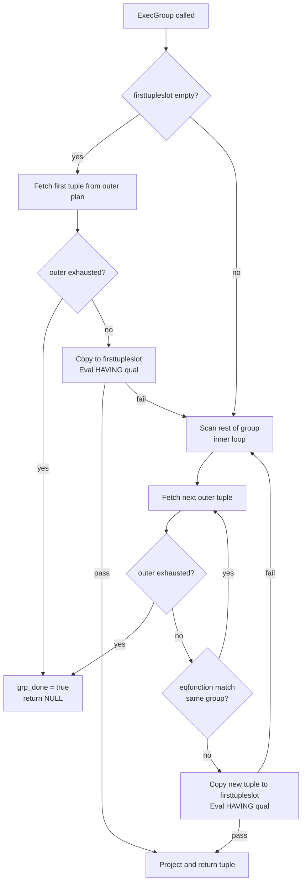

The Group executor node implements sort-based GROUP BY by scanning pre-sorted input and emitting one tuple per group. It is the streaming counterpart to hash aggregation: it holds only a single tuple in memory at any time, produces its first output row immediately, and scales to arbitrarily large numbers of groups without spilling to disk. The planner emits a Group node only for queries that use GROUP BY without aggregate functions. When aggregates are present, the planner uses an Agg node in `AGG_SORTED` mode instead.

## Group Boundary Detection

The core mechanism is a comparison of the current input tuple against the saved "group leader" tuple stored in `ss_ScanTupleSlot`. During initialisation, `ExecInitGroup()` calls `execTuplesMatchPrepare()` with the group column indexes (`grpColIdx`), equality operators (`grpOperators`), and collations (`grpCollations`) from the plan node. This builds an `ExprState *` stored as `GroupState.eqfunction` that evaluates all column equality tests in a single expression-evaluation pass.

At each iteration, `ExecGroup()` calls `ExecQualAndReset(node->eqfunction, econtext)` with `ecxt_innertuple` pointing at the saved group leader and `ecxt_outertuple` pointing at the new tuple. As long as this returns true the tuple belongs to the current group and is discarded. When it returns false, the new tuple starts a fresh group.

```c
typedef struct GroupState
{
    ScanState   ss;          /* its first field is NodeTag */
    ExprState  *eqfunction;  /* equality function */
    bool        grp_done;    /* indicates completion of Group scan */
} GroupState;
```

The node's memory footprint is constant. `ss_ScanTupleSlot` holds one `ExecCopySlot()` copy of the first tuple in the group. Everything else lives in the per-tuple `ExprContext`, which is reset after each comparison. The node detects group boundaries only between consecutive tuples. It is therefore correct only when all tuples belonging to the same group are adjacent in the input stream. The planner enforces this: it calls `create_group_path()` (planner.c) only on paths that already carry the required `group_pathkeys`, or after prepending a Sort or IncrementalSort path. If a suitably-sorted path exists — for example from a B-tree index scan — the planner does not need an explicit [[subsystems/executor/sort]] step. The Group node can then stream results with very low latency.

## Group vs Hash Aggregation

The Group node and the `AGG_HASHED` strategy inside [[subsystems/executor/aggregate]] represent two points on the memory-versus-latency tradeoff:

| Property | Group node | Hash agg (`AGG_HASHED`) |
|---|---|---|
| Memory per group | O(1) — one saved tuple | O(groups) — all groups in a hash table capped by [[subsystems/executor/work-mem-and-spill]] |
| First row latency | After first input tuple | After all input consumed |
| Requires sort | Yes (pre-sorted input) | No |
| Supports aggregates | No (use Agg node instead) | Yes |
| Scales to many groups | Yes, unbounded | Limited by work_mem; spills to disk |

The planner chooses between them in `create_ordinary_grouping_paths()` (planner.c). The planner emits a `GroupPath` only when `parse->groupClause` is non-empty and `parse->hasAggs` is false (line 6963–6975). When aggregates are present, even sorted paths get an `AggPath` with strategy `AGG_SORTED` rather than a `GroupPath`. `enable_hashagg` and `grouping_is_hashable()` gate hash aggregation. Setting `enable_hashagg = off` forces the sorted path.

By default, the planner prefers hash aggregation when the group columns are hashable. Hash aggregation avoids the cost of sorting. The planner will prefer the sort-based path (and therefore a potential Group node) when:

- `enable_hashagg = off`
- The input is already sorted by an index, making the sort cost zero
- The estimated number of groups is very large, making the hash table exceed `work_mem`
- The group-by columns are not hashable (e.g., geometric types without a hash operator)

## DISTINCT as Degenerate GROUP BY

`SELECT DISTINCT` without aggregate functions is semantically equivalent to `GROUP BY` on all output columns. The planner handles `DISTINCT` through a separate code path (`create_distinct_paths()`) that emits either a `UniquePath` (a Unique node) or a hashed `AggPath`, not a `GroupPath`. The Group node therefore does not appear for plain `DISTINCT` queries.

The practical difference between the two paths is:

- **Unique node** (`nodeUnique.c`): has the same streaming, constant-memory design as the Group node, but it compares only adjacent tuples without saving a copy. It passes the first tuple of each run and discards duplicates. PostgreSQL uses it for `DISTINCT` and `DISTINCT ON`.
- **Group node** (`nodeGroup.c`): PostgreSQL uses it for `GROUP BY` without aggregates. It saves the first tuple of each group into `ss_ScanTupleSlot`, so the executor can evaluate the HAVING qual (`ps.qual`) against the group representative.

The planner also considers hashed aggregation (`AGG_HASHED`) for plain `DISTINCT`, controlled by `enable_hashagg`. `DISTINCT ON (...)` suppresses hashing entirely (planner.c line 5116). Hash aggregation does not preserve the per-group ordering that `DISTINCT ON` implies.

## Execution Loop



`ExecReScanGroup()` resets `grp_done` to false and clears `ss_ScanTupleSlot`. This makes the next call to `ExecGroup()` fetch a fresh first tuple. `ExecEndGroup()` frees the expression context and clears the slot (nodeGroup.c).

## Related Topics

- [[subsystems/executor/aggregate]] — Agg node handles GROUP BY with aggregate functions; AGG_SORTED strategy uses the same pre-sorted-input requirement
- [[subsystems/executor/sort]] — Sort node that typically precedes Group when no index ordering is available
- [[subsystems/executor/distinct-unique]] — Unique node used for DISTINCT; shares the streaming design but lacks HAVING support
