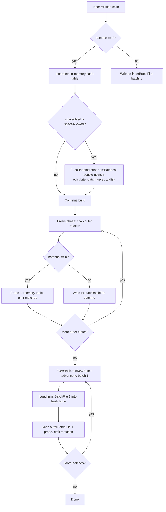
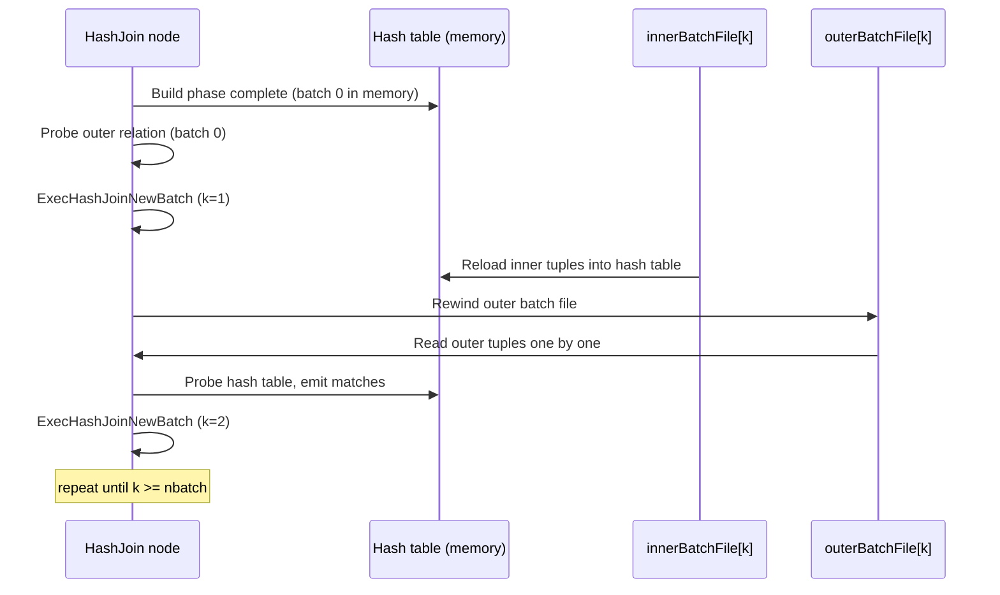

PostgreSQL's hash join implements the *hybrid hash join* algorithm from Zeller & Gray (VLDB 1990). When the inner relation fits in `work_mem * hash_mem_multiplier` bytes, the join completes in a single in-memory pass. Otherwise, PostgreSQL partitions the relation into numbered *batches*, writes them to temporary `BufFile`s on disk, and processes them one batch at a time. This article traces every step of that spill path in detail.

## The Two-Phase Algorithm at a Glance

A hash join always has an *inner* relation (the one that is hashed) and an *outer* relation (the one that is probed against the hash table). The planner places the smaller relation on the inner side.

**Build phase** — `MultiExecHash` / `MultiExecPrivateHash` in `nodeHash.c` scans every tuple of the inner plan node, computes the join-key hash value, and either inserts the tuple into the in-memory hash table (batch 0) or writes it to a temporary file for a later batch.

**Probe phase** — `ExecHashJoinImpl` in `nodeHashjoin.c` scans the outer relation. For each outer tuple it computes the same hash value and either probes the in-memory table (batch 0) or writes the tuple to the corresponding outer batch file for later.

After batch 0 finishes, the executor iterates through batches 1…N, loading each inner batch file into a fresh hash table and scanning the corresponding outer batch file to produce matches.



## Memory Budget: work_mem and hash_mem_multiplier

`get_hash_memory_limit()` in `nodeHash.c` computes the hash table's allowed size:

```c
size_t
get_hash_memory_limit(void)
{
    double mem_limit = (double) work_mem * hash_mem_multiplier * 1024.0;
    mem_limit = Min(mem_limit, (double) SIZE_MAX);
    return (size_t) mem_limit;
}
```

`hash_mem_multiplier` (default 2.0 since PG 13) allows hash joins to use more than the base `work_mem` limit. The result is stored as `hashtable->spaceAllowed`. The skew sub-table (see below) takes `SKEW_HASH_MEM_PERCENT` (2 %) of that budget.

## Initial Batch Count Estimation

Before reading a single tuple, `ExecHashTableCreate` calls `ExecChooseHashTableSize` to estimate how many batches will be needed:

```c
void
ExecChooseHashTableSize(double ntuples, int tupwidth, bool useskew,
                        bool try_combined_hash_mem, int parallel_workers,
                        size_t *space_allowed,
                        int *numbuckets, int *numbatches,
                        int *num_skew_mcvs)
{
    /* tupsize = HashJoinTupleData overhead + MAXALIGN'd MinimalTuple */
    int tupsize = HJTUPLE_OVERHEAD
                + MAXALIGN(SizeofMinimalTupleHeader)
                + MAXALIGN(tupwidth);
    double inner_rel_bytes = ntuples * tupsize;
    size_t hash_table_bytes = get_hash_memory_limit();

    /* ... skew budget carved out here ... */

    /* if inner relation fits in memory: single batch */
    if (inner_rel_bytes + bucket_bytes <= hash_table_bytes) {
        nbatch = 1;
    } else {
        /* compute minimum number of batches as a power of 2 */
        double dbatch = ceil(inner_rel_bytes / hash_table_bytes);
        nbatch = pg_nextpower2_32(Max(2, (int) dbatch));
    }
}
```

Both `nbatch` and `nbuckets` are always powers of 2. This is not an aesthetic choice — it makes `ExecHashGetBucketAndBatch` a single bitwise-AND operation rather than a division.

## How Tuples Are Assigned to Batches: ExecHashGetBucketAndBatch

```c
void
ExecHashGetBucketAndBatch(HashJoinTable hashtable,
                          uint32 hashvalue,
                          int *bucketno, int *batchno)
{
    uint32 nbuckets = (uint32) hashtable->nbuckets;
    uint32 nbatch   = (uint32) hashtable->nbatch;

    if (nbatch > 1) {
        *bucketno = hashvalue & (nbuckets - 1);
        /* rotate right by log2(nbuckets) so batchno uses different bits */
        *batchno  = pg_rotate_right32(hashvalue, hashtable->log2_nbuckets)
                    & (nbatch - 1);
    } else {
        *bucketno = hashvalue & (nbuckets - 1);
        *batchno  = 0;
    }
}
```

`ExecHashGetBucketAndBatch` takes the bucket number from the *low* bits of the hash value. It takes the batch number from bits that start just above the bucket bits, via a right rotation. This partitioning is monotone with respect to increasing `nbatch`. Doubling `nbatch` takes the single batch-index bit above the previous batch bits. This means a tuple in batch `k` moves to either batch `k` or batch `k + old_nbatch`. It can never move to a *lower* batch. That invariant is what makes dynamic batch-count growth safe.

## The Overflow Trigger: ExecHashTableInsert

Every tuple inserted into the hash table goes through `ExecHashTableInsert`. After allocating the `HashJoinTuple` in the current batch's dense-allocation chunk, it checks:

```c
hashtable->spaceUsed += hashTupleSize;
if (hashtable->spaceUsed + hashtable->nbuckets_optimal * sizeof(HashJoinTuple)
        > hashtable->spaceAllowed)
    ExecHashIncreaseNumBatches(hashtable);
```

The comparison includes the bucket-pointer array size, because growing the bucket array on the next `ExecHashIncreaseNumBuckets` call would itself consume memory.

## Dynamic Growth: ExecHashIncreaseNumBatches

When the overflow trigger fires, `ExecHashIncreaseNumBatches` doubles `nbatch` and repartitions all tuples currently in memory:

```c
static void
ExecHashIncreaseNumBatches(HashJoinTable hashtable)
{
    int oldnbatch = hashtable->nbatch;
    int nbatch    = oldnbatch * 2;     /* always doubles */

    if (!hashtable->growEnabled)       /* growth disabled after pathological skew */
        return;

    /* allocate or grow innerBatchFile[] and outerBatchFile[] arrays */
    hashtable->innerBatchFile = repalloc0_array(..., nbatch);
    hashtable->outerBatchFile = repalloc0_array(..., nbatch);
    hashtable->nbatch = nbatch;

    /* Walk every chunk; re-evaluate each tuple's batchno with new nbatch */
    memset(hashtable->buckets.unshared, 0,
           sizeof(HashJoinTuple) * hashtable->nbuckets);
    /* ... scan oldchunks ... */
    while (oldchunks != NULL) {
        /* for each tuple: */
        ExecHashGetBucketAndBatch(hashtable, hashTuple->hashvalue,
                                  &bucketno, &batchno);
        if (batchno == curbatch) {
            /* keep in memory */
            copyTuple = dense_alloc(hashtable, hashTupleSize);
            memcpy(copyTuple, hashTuple, hashTupleSize);
            copyTuple->next.unshared = hashtable->buckets.unshared[bucketno];
            hashtable->buckets.unshared[bucketno] = copyTuple;
        } else {
            /* evict: write to the correct inner batch file */
            ExecHashJoinSaveTuple(HJTUPLE_MINTUPLE(hashTuple),
                                  hashTuple->hashvalue,
                                  &hashtable->innerBatchFile[batchno],
                                  hashtable);
            hashtable->spaceUsed -= hashTupleSize;
        }
    }
}
```

This is an O(N) pass over all tuples already in memory. After the pass, `spaceUsed` drops, because `ExecHashIncreaseNumBatches` evicted roughly half the tuples. `ExecHashIncreaseNumBatches` disables growth globally (`growEnabled = false`) if a batch increase fails to free any tuples (extreme skew where every tuple belongs to the current batch), or if it retains every tuple.

## Batch Files: BufFile

PostgreSQL stores each batch's tuples in a `BufFile` — a temporary file abstracted over its virtual file descriptor layer. It creates each `BufFile` via `BufFileCreateTemp(false)` the first time a tuple needs to be written to a batch. Before that, the array slot is `NULL`.

Each record in a batch file is:

```
uint32           hashvalue
MinimalTupleData (variable length, t_len bytes)
```

`ExecHashJoinSaveTuple` writes each record. `ExecHashJoinGetSavedTuple` reads it back. The files live in the temp tablespace (`temp_tablespaces` GUC). PostgreSQL unlinks them when the batch finishes or the query aborts.

## The Probe Phase with Multiple Batches



`ExecHashJoinNewBatch` (called from the `HJ_NEED_NEW_BATCH` state):

1. Closes the previous batch's outer file to release disk space immediately.
2. Skips empty batch slots (no inner and no outer file), subject to outer/full join constraints and any dynamic `nbatch` increase that might have left tuples needing reclassification.
3. Calls `ExecHashTableReset` to drop the current in-memory hash table by resetting `batchCxt`.
4. Reads the inner batch file and inserts every tuple. This may itself trigger another `ExecHashIncreaseNumBatches`.
5. Rewinds the outer batch file to position 0 and returns `true`.

## The Performance Cliff: Power-of-Two Doubling

`nbatch` always doubles on every overflow. As a result, a join that would ideally need, say, 3 batches actually uses 4 (the next power of 2). A join that barely needs 2 uses 2. A join needing 5 uses 8. Each batch requires two passes over its data (one write during build, one read during probe). Unnecessary batches therefore waste I/O.

More subtly: if the initial estimate from `ExecChooseHashTableSize` is 1 (single-batch) but at runtime the table grows by even one byte over the limit, `ExecHashIncreaseNumBatches` jumps straight to `nbatch = 2`. Batch 0 keeps its data in memory. It never gets an inner batch file. Batch files for batches 1…N open lazily. As a result, the effective per-batch memory budget is `spaceAllowed / nbatch`. Half of that budget goes to batch 0, which already fits in memory. Batches 1 and up therefore use only the other half. They are unlikely to need further splitting.

```sql
-- Observe the cliff
EXPLAIN (ANALYZE, BUFFERS)
SELECT count(*)
FROM generate_series(1, 10000000) a(x)
JOIN generate_series(1, 10000000) b(y) ON a.x = b.y;
```

In the output, `Batches: 1` means no spill. Any higher value means disk was used. `Memory Usage: N kB` is `hashtable->spacePeak` (peak `spaceUsed`) divided by 1024.

```
Hash  (cost=...)
  Batches: 4  Memory Usage: 4096kB
  ->  ...
```

## Skew Optimization: ExecHashBuildSkewHash / ExecHashSkewTableInsert

Before the build phase starts, `ExecHashTableCreate` optionally builds a *skew hash table* for the most common values (MCVs) of the outer relation's join key. The planner supplies the column's statistics OID (`Hash.skewTable`, `Hash.skewColumn`).

```c
static void
ExecHashBuildSkewHash(HashJoinTable hashtable, Hash *node, int mcvsToUse)
{
    /* look up pg_statistic for the outer relation's join column */
    statsTuple = SearchSysCache3(STATRELATTINH, ...);
    get_attstatsslot(&sslot, statsTuple,
                     STATISTIC_KIND_MCV, InvalidOid,
                     ATTSTATSSLOT_VALUES | ATTSTATSSLOT_NUMBERS);

    /* require MCVs to cover at least SKEW_MIN_OUTER_FRACTION (0.01) of outer */
    frac = sum(sslot.numbers[0..mcvsToUse-1]);
    if (frac < SKEW_MIN_OUTER_FRACTION) return;

    /* open-addressing hash table, power-of-2 size, 4x factor for collisions */
    nbuckets = pg_nextpower2_32(mcvsToUse + 1) << 2;
    hashtable->skewBucket = palloc0(nbuckets * sizeof(HashSkewBucket *));
    hashtable->skewEnabled = true;
}
```

During the build phase, `MultiExecPrivateHash` calls `ExecHashGetSkewBucket` for every inner tuple. If the tuple's hash value matches one of the MCV hash values, it goes into the skew table rather than the main table:

```c
bucketNumber = ExecHashGetSkewBucket(hashtable, hashvalue);
if (bucketNumber != INVALID_SKEW_BUCKET_NO)
    ExecHashSkewTableInsert(hashtable, slot, hashvalue, bucketNumber);
else
    ExecHashTableInsert(hashtable, slot, hashvalue);
```

Tuples in the skew table effectively live in batch 0 forever. PostgreSQL never writes them to a batch file, regardless of `nbatch`. When the skew table's portion of `spaceAllowed` fills up (`spaceUsedSkew > spaceAllowedSkew`, which is 2 % of total budget), `ExecHashRemoveNextSkewBucket` evicts the least common MCV bucket, migrating its tuples into the main hash table.

The skew optimization is most valuable when the outer relation has one or a few very common join-key values (e.g. `customer_id` that heavily skews toward the top account). PostgreSQL guarantees that those matching inner tuples remain in memory and never hit disk. This avoids writing and re-reading them across potentially many batches.

The comment in `hashjoin.h` explains why PostgreSQL uses the outer relation's MCVs rather than the inner's. The outer relation is typically larger, so its I/O savings per MCV tuple are larger. Additionally, the planner prefers to put the more uniformly distributed relation on the inner side. This means the outer relation more often carries the interesting skew.

## HashJoinTableData Key Fields

| Field | Type | Purpose |
|---|---|---|
| `nbatch` | `int` | Current number of batches (power of 2) |
| `nbatch_original` | `int` | `nbatch` at start of inner scan |
| `nbatch_outstart` | `int` | `nbatch` at start of outer scan |
| `curbatch` | `int` | Index of the batch being processed (0 during build) |
| `growEnabled` | `bool` | `false` after growth proved useless (extreme skew) |
| `spaceUsed` | `Size` | Bytes currently in the in-memory hash table |
| `spaceAllowed` | `Size` | Upper limit (`work_mem * hash_mem_multiplier * 1024`) |
| `spacePeak` | `Size` | High-water mark; shown in EXPLAIN ANALYZE as "Memory Usage" |
| `spaceUsedSkew` | `Size` | Bytes used by the skew sub-table |
| `spaceAllowedSkew` | `Size` | 2 % of `spaceAllowed` |
| `innerBatchFile` | `BufFile **` | Array of per-batch inner temp files (index 0 unused) |
| `outerBatchFile` | `BufFile **` | Array of per-batch outer temp files (index 0 unused) |
| `chunks` | `HashMemoryChunk` | Linked list of 32 kB dense-allocation buffers for the current batch |
| `hashCxt` | `MemoryContext` | Lives for the whole join |
| `batchCxt` | `MemoryContext` | Reset between batches to free all per-batch storage |
| `spillCxt` | `MemoryContext` | Context for `innerBatchFile`/`outerBatchFile` arrays |

## Parallel Hash Join (PG 11+)

When the planner emits a `Parallel Hash Join` node (visible in EXPLAIN as such), workers cooperate to build a *shared* hash table in DSA (dynamic shared area) memory rather than each maintaining a private copy.

`MultiExecParallelHash` in `nodeHash.c` coordinates via a `build_barrier` with the following phases:

```
PHJ_BUILD_ELECT       -> PHJ_BUILD_ALLOCATE   (one worker allocates batch 0 table)
PHJ_BUILD_ALLOCATE    -> PHJ_BUILD_HASH_INNER  (all workers hash the inner rel)
PHJ_BUILD_HASH_INNER  -> PHJ_BUILD_HASH_OUTER  (multi-batch only: all hash outer)
PHJ_BUILD_HASH_OUTER  -> PHJ_BUILD_RUN         (probing can begin)
PHJ_BUILD_RUN         -> PHJ_BUILD_FREE        (one worker frees batches)
```

During `PHJ_BUILD_HASH_INNER`, if any worker finds that `spaceUsed > spaceAllowed`, it calls `ExecParallelHashIncreaseNumBatches`. Unlike the serial path, *all* workers participate in repartitioning under a secondary `grow_batches_barrier`. Each worker first dumps its own portion of the shared memory. The workers then collectively repartition into new shared tuple stores (`SharedTupleStore`). Growth stops once all batches fit in the combined budget.

The initial budget is `get_hash_memory_limit() * (nworkers + 1)` (leader counts as a worker). If that combined budget is still insufficient, the planner falls back to per-worker `hash_mem` sizing with inter-batch parallelism instead.

Per-batch processing is also parallel: different workers can process different batches concurrently (governed by a per-batch barrier with phases `PHJ_BATCH_ALLOCATE -> PHJ_BATCH_LOAD -> PHJ_BATCH_PROBE -> PHJ_BATCH_SCAN -> PHJ_BATCH_FREE`). If `nbatch < nworkers`, multiple workers share a single batch.

## Reading EXPLAIN ANALYZE Output

```sql
SET work_mem = '4MB';
EXPLAIN (ANALYZE, BUFFERS, FORMAT TEXT)
SELECT l.*, o.order_date
FROM large_lineitems l
JOIN orders o ON l.order_id = o.order_id;
```

```
Hash Join  (cost=... rows=... width=...)
           (actual time=... rows=... loops=1)
  Hash Cond: (l.order_id = o.order_id)
  Buffers: shared hit=... read=..., temp read=... written=...
  ->  Seq Scan on large_lineitems l  ...
  ->  Hash  (cost=... rows=... width=...)
             (actual time=... rows=... loops=1)
        Buckets: 65536  Batches: 8  Memory Usage: 4200kB
        ->  Seq Scan on orders o  ...
```

| Metric | Meaning |
|---|---|
| `Batches: 1` | Single-batch, no spill to disk |
| `Batches: N > 1` | Spilled; `N - 1` inner batch files and `N - 1` outer batch files were written and read |
| `Memory Usage: N kB` | `spacePeak / 1024`; this is the *peak* in-memory footprint, not per-batch |
| `Buckets: N` | Number of hash buckets at the time the build phase ended |
| `temp read/written` | Blocks of temp file I/O; only appears when `Batches > 1` |

`Memory Usage` will not exceed `work_mem * hash_mem_multiplier` by much. If `Batches` is, say, 8 but `Memory Usage` is close to the limit, the estimate was accurate. If `Memory Usage` is much lower than the limit but `Batches > 1`, the planner overestimated the inner relation size and chose a multi-batch plan upfront. Alternatively, skew-table eviction triggered batch growth early.

## Tuning Guidance

Increasing `work_mem` is the most direct way to eliminate batches:

```sql
SET work_mem = '128MB';  -- session-level
-- or per-query:
SET LOCAL work_mem = '128MB';
```

`hash_mem_multiplier` (default 2.0) can be raised to give hash joins more headroom without inflating sort/aggregate memory:

```sql
SET hash_mem_multiplier = 4.0;
```

For workloads that always spill, verify that `temp_tablespaces` points to a fast volume:

```sql
SHOW temp_tablespaces;
```

Skew optimization degrades when statistics are stale. After loading skewed data:

```sql
ANALYZE orders;
```

To diagnose whether a join is exceeding `work_mem` at runtime vs. the planner choosing multi-batch proactively, compare `Batches` with the planned batch count. If `Batches` is a higher power of 2 than what statistics would predict, the inner relation was larger than estimated. `ExecHashIncreaseNumBatches` therefore fired at runtime. The `nbatch_original` field tracks the planner's initial estimate. If `nbatch > nbatch_original` at the end, growth occurred.

## Related Topics

- [[subsystems/executor/work-mem-and-spill|Work Memory and Spill]] — covers how work_mem governs spill behaviour across all executor nodes, including hash joins, sorts, and aggregates
- [[subsystems/executor/joins|Joins]] — overview of all join strategies in the executor, placing hash join in context alongside nested loop and merge join
- [[subsystems/planner/join-method-selection|Join Method Selection]] — explains how the planner chooses between hash join, merge join, and nested loop based on cost estimates and available statistics
- [[subsystems/planner/cost-model|Cost Model]] — documents how the planner estimates hash join cost including the I/O penalty for multi-batch plans
- [[subsystems/storage/temp-files|Temp Files]] — describes the BufFile and virtual file descriptor infrastructure that backs batch files written during spill
- [[subsystems/executor/parallel|Parallel Query Execution]] — covers the shared hash table and barrier coordination used by Parallel Hash Join (PHJ_BUILD_* phases)
- [[subsystems/planner/parallel-query|Parallel Query Planning]] — explains when the planner emits a Parallel Hash Join node and how worker counts affect the combined hash memory budget
