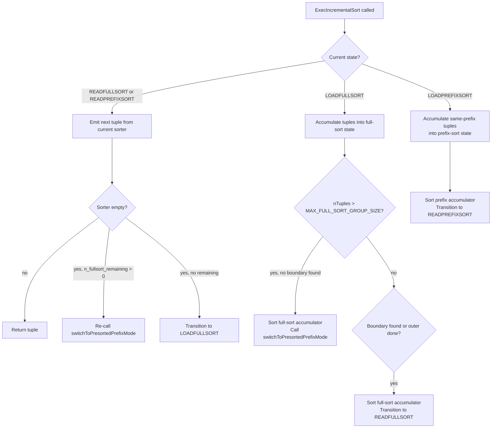

# Incremental Sort

Incremental sort (`nodeIncrementalSort.c`) exploits an already-sorted prefix in the input to avoid a global sort of the full result set. When a query orders by `(a, b)` and the input arrives sorted by `a`, the executor groups rows by `a` value and sorts each group independently on `b`. The total memory footprint stays proportional to the largest group rather than to the full input. The first rows appear as soon as the first group is sorted, making incremental sort composable with `LIMIT`.

PostgreSQL 13 introduced the node. The planner creates it via `create_incremental_sort_path()` (`pathnode.c`) when the input path already provides a useful prefix of the required sort key. A plain `Sort` on the same input sorts all rows on all keys at once. Incremental sort sorts each group only on the suffix keys that are not already in order, reducing per-group work from `O(N log N)` global to `O(G * (G/K) * log(G/K))`, where `G` is the total row count and `K` is the number of groups.

## How the planner decides to use incremental sort

The planner calls `pathkeys_count_contained_in()` to determine how many leading keys of the required ordering a candidate path already satisfies. If that count is greater than zero — and `enable_incremental_sort` is on (the default) — the planner calls `create_incremental_sort_path()` instead of `create_sort_path()` (`planner.c`, `allpaths.c`). When `enable_incremental_sort = off`, the planner never creates an `IncrementalSortPath`. It uses a full sort instead, even when a useful prefix ordering exists.

The key constraint is that `presorted_keys` must be strictly between zero and the total number of sort keys. A zero means no prefix ordering exists. Incremental sort then offers nothing. Equality means the input is already fully sorted. The query then needs no sort node at all. The assertion in `cost_incremental_sort()` enforces this: `presorted_keys > 0 && presorted_keys < list_length(pathkeys)`.

The cost model in `cost_incremental_sort()` (`costsize.c`) estimates the number of prefix groups using `estimate_num_groups()` on the presorted key expressions. `cost_tuplesort()` costs each group based on its estimated size (`input_rows / input_groups`). The total cost adds per-tuple overhead for group boundary detection (`cpu_tuple_cost + comparison_cost` per input row) and a per-group overhead for state reset (`2.0 * cpu_tuple_cost` per group). Startup cost is the startup cost of the first group plus the input's startup cost, allowing first-row latency to be much lower than a full sort when groups are small.

The planner also uses incremental sort for window functions. When the planner processes multiple `OVER` clauses with compatible partition/order keys, the output of one window aggregate may already be partially sorted for the next window. This lets incremental sort handle only the additional suffix ordering, rather than a full re-sort (`planner.c`).

## Two operating modes

The node runs in one of two modes depending on whether it has seen enough rows to estimate group sizes reliably. The constants `DEFAULT_MIN_GROUP_SIZE = 32` and `DEFAULT_MAX_FULL_SORT_GROUP_SIZE = 64` (defined in `nodeIncrementalSort.c`, the latter as `2 * DEFAULT_MIN_GROUP_SIZE`) control the transition heuristic.

### Full-sort mode

At startup, the node has no statistical knowledge of actual group sizes. It therefore accumulates rows without checking prefix key equality, until it has at least `DEFAULT_MIN_GROUP_SIZE` tuples. This deliberate delay prevents thrashing with tiny groups: if the node created a new `tuplesort` for every row, the overhead of setup and teardown would dominate. The node configures the full-sort accumulator to sort on **all** key columns — both prefix and suffix — because the early tuples may span multiple prefix groups.

Once the node has accumulated `DEFAULT_MIN_GROUP_SIZE` tuples, it starts comparing incoming rows against the last tuple of that batch (the `group_pivot`). When the node finds a prefix key change, it sorts and drains the accumulator. The node stays in full-sort mode until either the input is exhausted or `nTuples` exceeds `DEFAULT_MAX_FULL_SORT_GROUP_SIZE` without finding a group boundary. Exceeding the threshold signals that a large, single-prefix-key group is in progress. Continuing to sort all columns at that point would be wasteful. At that point the node triggers a mode transition.

The full-sort accumulator sorts on all requested columns even though some are already in order. This is correct because the accumulator may contain rows from multiple different prefix groups. Prefix key equality has not yet been verified across all of them. Sorting by all keys ensures the output is correct regardless.

### Presorted-prefix mode

Once the node determines it is processing a large group (or after the full-sort accumulator has been drained and a new group starts after the transition), it switches to prefix-sort mode. The node configures the prefix-sort `tuplesort` to sort only on the **suffix** columns — those not already provided by the input ordering (`nodeIncrementalSort.c`, `switchToPresortedPrefixMode()`). This is a meaningful reduction: if the input is sorted on five of six requested keys, the prefix-sort accumulator only sorts on one key instead of six.

In prefix-sort mode, the node reads rows from the outer node one at a time, comparing each against the `group_pivot` using `isCurrentGroup()`. Rows that match the current group go into the prefix-sort accumulator. The first non-matching row ends the group, triggers a sort, and becomes the carried-over first row of the next group. The node never switches back to full-sort mode once it has entered prefix-sort mode for a given group — subsequent groups always go through prefix-sort mode.

`switchToPresortedPrefixMode()` handles the transition itself. Because the full-sort accumulator already contains rows accumulated without prefix-key checks, those rows may span multiple prefix groups. The function drains the full-sort accumulator one tuple at a time, copying same-prefix tuples to the prefix-sort accumulator and stopping when a boundary is found. The field `n_fullsort_remaining` tracks how many tuples from the full-sort accumulator have not yet been transferred. As long as it is nonzero, the executor re-calls `switchToPresortedPrefixMode()` after draining and returning each prefix group to the caller.



## Detecting group boundaries

`isCurrentGroup()` tests whether a new input row belongs to the current prefix group by comparing the prefix sort keys against the `group_pivot` tuple. The comparison iterates key columns in **reverse order** — tail keys first, then leading keys. Because the input is sorted by all prefix keys jointly, changes in trailing prefix columns are more frequent than changes in the leading column. Checking from the end short-circuits earlier on average, reducing function call overhead.

The comparison uses equality operators derived from the sort operators: `get_equality_op_for_ordering_op()` finds the equality counterpart for each sort operator at init time (`preparePresortedCols()`). `preparePresortedCols()` pre-allocates the `FunctionCallInfo` structs and reuses them across comparisons, to avoid per-call palloc overhead.

## Memory behavior

A plain `Sort` node holds all input tuples in its `tuplesort` accumulator before returning any rows. Its memory high-water mark is therefore proportional to the total input size. When the input exceeds `work_mem`, `tuplesort` spills to disk with an external merge sort.

Incremental sort's memory is bounded by the **largest single group**, because the node sorts and drains each group before accumulating the next. A table with a million rows but only ten distinct values of the prefix key will sort in chunks of roughly 100,000 rows each. If each chunk fits in `work_mem`, no spill occurs. This holds even though the full input would not fit in `work_mem` as a whole. The EXPLAIN ANALYZE output makes this visible: `Average Memory` and `Peak Memory` across groups reflect the per-group working set, not the total input size.

The full-sort accumulator holds at most `DEFAULT_MAX_FULL_SORT_GROUP_SIZE` rows before the mode transition triggers — at most 64 rows under normal conditions (or fewer if a `LIMIT` makes the bound smaller). The prefix-sort accumulator holds one complete group at a time. `tuplesort_reset()` releases both at group boundaries. This reclaims the internal sort memory without tearing down the sort structure entirely.

When a group is truly pathological — millions of rows all sharing the same prefix key — incremental sort degrades to something close to a plain sort of that group. It still benefits all other groups, however. The `Peak Memory` field in EXPLAIN ANALYZE identifies such outliers.

## LIMIT interaction and first-row latency

Incremental sort is particularly valuable when combined with `LIMIT`. A plain sort must read and sort the entire input before returning row 1. Incremental sort returns the first row after sorting only the first group.

When the plan has a `LIMIT`, the upper executor nodes pass a sort bound down to the incremental sort node. The node tracks how many rows have already been returned in `bound_Done` and computes the remaining bound as `bound - bound_Done` before each new group. The node passes this remaining bound to `tuplesort_set_bound()` on the prefix-sort accumulator.

The bounded sort optimization is meaningful primarily in prefix-sort mode. With a bound set, `tuplesort` allocates a fixed-size top-N heap and runs replacement selection rather than a full merge sort — it only materializes the top `bound` rows of each group, discarding the rest during the sort phase. In full-sort mode, `DEFAULT_MAX_FULL_SORT_GROUP_SIZE` bounds the group size anyway. `tuplesort` is therefore unlikely to engage top-N heap sort, which requires `2 * bound` tuples before it activates. The savings there are minimal as a result.

If the `LIMIT` is smaller than `DEFAULT_MIN_GROUP_SIZE`, the node adjusts `minGroupSize` to `Min(DEFAULT_MIN_GROUP_SIZE, currentBound)`. This avoids fetching tuples that cannot contribute to the result.

## EXPLAIN output

A non-analyzed `EXPLAIN` shows two key fields:

```
Incremental Sort  (cost=0.43..67.20 rows=1000 width=8)
  Sort Key: a, b
  Presorted Key: a
```

`Sort Key` lists all columns in the requested sort order. `Presorted Key` lists only those columns already provided by the input — the prefix that makes incremental sort viable. The `Presorted Key` is always a strict prefix of `Sort Key`. Its length is `nPresortedCols`, stored in the `IncrementalSort` plan node.

With `EXPLAIN ANALYZE` the output adds per-mode statistics:

```
Incremental Sort  (cost=0.43..67.20 rows=1000 width=8)
                  (actual time=0.181..2.403 rows=1000 loops=1)
  Sort Key: a, b
  Presorted Key: a
  Full-sort Groups: 3  Sort Methods: quicksort  Average Memory: 42kB  Peak Memory: 128kB
  Pre-sorted Groups: 47  Sort Methods: quicksort  Average Memory: 8kB  Peak Memory: 12kB
```

**Full-sort Groups** is always at least 1 because the node always begins in full-sort mode. A count substantially larger than 1 means the node encountered multiple group boundaries while still in full-sort mode — either because groups are small enough that each fell entirely within the `DEFAULT_MIN_GROUP_SIZE` accumulation window, or because the transition to prefix-sort mode happened multiple times.

**Pre-sorted Groups** appears only after at least one transition to prefix-sort mode. Its absence means the input was exhausted during full-sort mode. Alternatively, every group exceeded `DEFAULT_MAX_FULL_SORT_GROUP_SIZE` and triggered a fresh transition each time, rather than staying in prefix-sort mode.

**Sort Methods** records the `tuplesort` algorithm used across groups for each mode: `quicksort` (in-memory), `top-N heapsort` (bounded in-memory), or `external merge` (spilled). The two modes can report different methods. For example, the first few large groups might cause spills while later small groups fit in memory.

**Average Memory** is a running mean: `totalMemorySpaceUsed / groupCount`. **Peak Memory** is the high-water mark over all groups. A large gap between Average and Peak indicates skewed group sizes — one outlier dominated memory while the majority were small. When different groups use both memory and disk space, EXPLAIN ANALYZE reports both.

The `rows` and `loops` fields in the actual timing line work the same as any other node. If incremental sort appears inside a `Nested Loop`, `loops` counts how many times the executor re-executed the sort (once per outer row). The per-loop statistics accumulate across all executions.

## Parallel query

Incremental sort participates in parallel query as an instrumented node inside parallel workers. It is **not** parallel-aware itself, however. The `parallel_aware` flag is always false (`pathnode.c`). Each worker independently runs its own incremental sort node over its share of the input. There is no cross-worker coordination for sorting.

The DSM instrumentation infrastructure (`ExecIncrementalSortInitializeDSM`, `ExecIncrementalSortInitializeWorker`, `ExecIncrementalSortRetrieveInstrumentation`) exists solely to collect `EXPLAIN ANALYZE` statistics from workers and merge them into the leader's output. When a parallel plan has workers and instrumentation is active, the `INSTRUMENT_SORT_GROUP` macro writes stats directly into the shared memory segment rather than local memory, avoiding an extra copy at instrumentation time.

In practice, incremental sort appears in parallel plans as a node below a `Gather` or `Gather Merge`. A `Gather Merge` can be particularly effective in combination: each worker runs incremental sort on its partition of the data. `Gather Merge` then merges the per-worker sorted streams without any additional sorting, since each stream is already sorted by the full key.

## Limitations

The planner cannot use incremental sort when the input provides no prefix of the required sort key. If none of the sort key columns are in the input's pathkeys, there is nothing to exploit. A plain `Sort` is then the only option. The planner enforces this: `presorted_keys == 0` unconditionally selects a plain sort.

The node does not support backward scans (`EXEC_FLAG_BACKWARD`) or mark/restore (`EXEC_FLAG_MARK`). A plain `Sort` accumulates all tuples and can be scanned in either direction. Incremental sort only holds one group at a time and cannot rewind across group boundaries. Cursors that require backward scrolling will therefore never use incremental sort.

Rescan (`ExecReScanIncrementalSort`) resets all state and re-executes from scratch. `Sort` can replay its accumulated result on rescan. Incremental sort cannot. It must re-fetch from the outer node instead, because it discards each group after draining it. This makes incremental sort less suitable in contexts where the same output is read multiple times — for example, as the inner side of a nested-loop join unless the outer node supports parameter-less rescans cheaply.

Statistical uncertainty can hurt planning. When the prefix key columns have no statistics (newly created tables, unanalyzed tables, complex expressions), `estimate_num_groups()` falls back to `DEFAULT_NUM_DISTINCT` as the group count estimate. If the actual group count is much lower (large groups), the planner underestimates the cost of incremental sort. If it is much higher (tiny groups), the planner overestimates the cost. Running `ANALYZE` before queries over large tables keeps these estimates accurate.

## Relationship to plain Sort

Incremental sort does not replace `Sort`. It requires the input to already carry the prefix ordering. The planner chooses between them by comparing estimated costs. When the input is unsorted, or when `enable_incremental_sort = off`, the planner uses `Sort`. Incremental sort is most valuable when:

- The input comes from an index scan on the prefix columns, or from a sort by a superset of the prefix.
- Groups are small (high-cardinality prefix key), so each group fits comfortably in `work_mem`.
- A `LIMIT` is present and first-row latency matters.
- The prefix ordering comes "for free" as a side effect of an earlier plan operation (e.g., a merge join that outputs rows in join-key order, or a `GROUP BY` that leaves rows grouped by the grouping columns).

The node interacts with the [[subsystems/executor/overview|executor overview]] through the standard `ExecIncrementalSort()` / `ExecInitIncrementalSort()` / `ExecEndIncrementalSort()` interface in `nodeIncrementalSort.c`.

## Related Topics

- [[subsystems/executor/sort|Sort]] — the plain sort node that incremental sort builds on and is compared against; chosen by the planner when no prefix ordering exists or when `enable_incremental_sort` is off.
- [[subsystems/executor/sort-support|Sort Support]] — the `SortSupport` infrastructure used by both sort and incremental sort to accelerate tuple comparisons via abbreviated keys and datum comparisons.
- [[subsystems/planner/sort-avoidance|Sort Avoidance]] — planner strategies for eliminating sorts entirely via index ordering or merge-join output; understanding when sorts are avoided clarifies when incremental sort is the fallback.
- [[subsystems/planner/cost-model|Cost Model]] — covers `cost_incremental_sort()` and `cost_tuplesort()` in `costsize.c`, which drive the planner's choice between sort strategies.
- [[subsystems/executor/work-mem-and-spill|Work Memory and Spill]] — explains how `work_mem` governs `tuplesort` spill to disk; incremental sort's per-group memory bound is the key advantage over a plain sort when groups fit in `work_mem`.
- [[subsystems/executor/merge-append-node|Merge Append Node]] — exploits pre-existing ordering across append subplans to merge sorted streams without re-sorting; a complementary node to incremental sort.
- [[subsystems/executor/window-functions|Window Functions]] — the executor node that benefits from incremental sort when multiple `OVER` clauses share a compatible prefix ordering.
