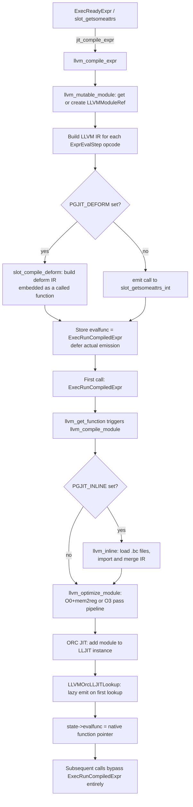
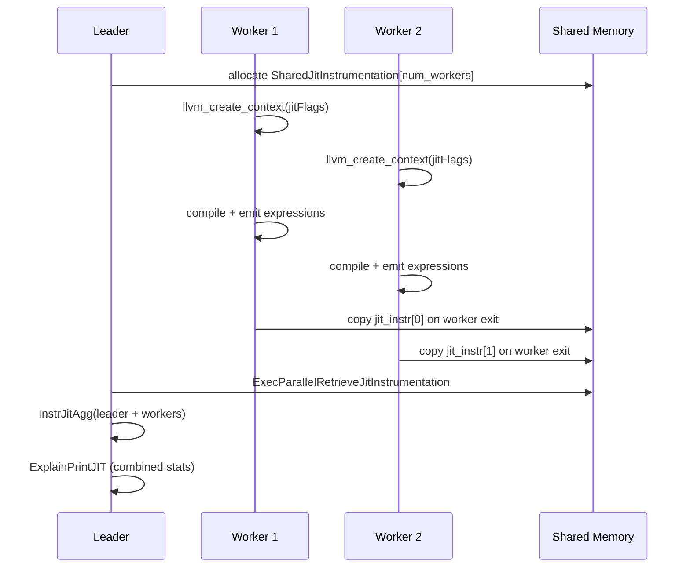

# JIT Compilation with LLVM

PostgreSQL can compile query-specific hot paths to native machine code at runtime using LLVM. This eliminates interpreter overhead from the expression evaluation loop and from generic heap-tuple deforming, both of which execute millions of times in analytical workloads. The two dominant CPU hot-paths targeted are expression evaluation and tuple deforming. In expression evaluation, `ExecEvalExpr` dispatches through an array of `ExprEvalStep` opcodes, invoking a C function via a pointer per step. This prevents the CPU from inlining call targets or eliminating dead code across step boundaries. In tuple deforming, `slot_getsomeattrs_int` walks a heap tuple's attribute array column by column, branching on nullability bits and alignment for every attribute. It does this even though the layout is already known at planning time, when the schema is fixed. LLVM JIT addresses both by generating a single native function per query that encodes schema and expression structure as compile-time constants, allowing the LLVM optimizer to eliminate branches, inline helper functions, and schedule instructions for the local CPU. PostgreSQL 11 introduced the feature. `--with-llvm` gates it at compile time. The minimum supported LLVM version is 3.9 (checked in `config/llvm.m4`).

## GUC Knobs

| GUC | Type | Default | Meaning |
|---|---|---|---|
| `jit` | bool | `on` | Master on/off switch |
| `jit_provider` | string | `"llvmjit"` | Shared library name; loaded on demand via `dlopen` |
| `jit_above_cost` | float | `100000` | Planner enables JIT only if `total_cost > jit_above_cost` |
| `jit_inline_above_cost` | float | `500000` | Sets `PGJIT_INLINE` flag when cost exceeds this |
| `jit_optimize_above_cost` | float | `500000` | Sets `PGJIT_OPT3` flag when cost exceeds this |
| `jit_expressions` | bool | `on` | Allow expression JIT (sets `PGJIT_EXPR` flag) |
| `jit_tuple_deforming` | bool | `on` | Allow deform JIT (sets `PGJIT_DEFORM` flag) |
| `jit_dump_bitcode` | bool | `off` | Write raw and optimized `.bc` files to `$PGDATA` |
| `jit_debugging_support` | bool | `off` | Register JITed code with GDB |
| `jit_profiling_support` | bool | `off` | Register JITed code with perf/OProfile |

Defaults are defined in `src/backend/jit/jit.c`:

```c
double  jit_above_cost         = 100000;
double  jit_inline_above_cost  = 500000;
double  jit_optimize_above_cost = 500000;
```

### Flag Bits

`PGJIT_*` flags are combined into `PlannedStmt.jitFlags` by the planner and propagated into `EState.es_jit_flags` at executor start.

| Flag | Bit | Meaning |
|---|---|---|
| `PGJIT_NONE` | `0` | No JIT |
| `PGJIT_PERFORM` | `1 << 0` | JIT is enabled for this query |
| `PGJIT_OPT3` | `1 << 1` | Use LLVM O3 optimization pipeline |
| `PGJIT_INLINE` | `1 << 2` | Inline external C functions from bitcode |
| `PGJIT_EXPR` | `1 << 3` | Compile expression evaluation functions |
| `PGJIT_DEFORM` | `1 << 4` | Compile tuple deforming functions |

Planner decision code (from `src/backend/optimizer/plan/planner.c`):

```c
result->jitFlags = PGJIT_NONE;
if (jit_enabled && jit_above_cost >= 0 &&
    top_plan->total_cost > jit_above_cost)
{
    result->jitFlags |= PGJIT_PERFORM;
    if (jit_optimize_above_cost >= 0 &&
        top_plan->total_cost > jit_optimize_above_cost)
        result->jitFlags |= PGJIT_OPT3;
    if (jit_inline_above_cost >= 0 &&
        top_plan->total_cost > jit_inline_above_cost)
        result->jitFlags |= PGJIT_INLINE;
    if (jit_expressions)
        result->jitFlags |= PGJIT_EXPR;
    if (jit_tuple_deforming)
        result->jitFlags |= PGJIT_DEFORM;
}
```

## Provider Architecture

The JIT subsystem uses a provider interface so that alternative back-ends (hypothetically) could replace LLVM. The provider is a shared library loaded at first use:

```c
// src/backend/jit/jit.c
snprintf(path, MAXPGPATH, "%s/%s%s", pkglib_path, jit_provider, DLSUFFIX);
init_fn = load_external_function(path, "_PG_jit_provider_init", true, NULL);
```

`_PG_jit_provider_init` fills a `JitProviderCallbacks` struct:

```c
typedef struct JitProviderCallbacks {
    JitProviderResetAfterErrorCB  reset_after_error;
    JitProviderReleaseContextCB   release_context;
    JitProviderCompileExprCB      compile_expr;
} JitProviderCallbacks;
```

The LLVM provider (`llvmjit.so`) maps these to `llvm_reset_after_error`, `llvm_release_context`, and `llvm_compile_expr`.

## Data Structures

### `JitContext` (provider-independent)

Defined in `src/include/jit/jit.h`:

```c
typedef struct JitContext {
    int              flags;      /* PGJIT_* bitmask */
    ResourceOwner    resowner;   /* owns cleanup */
    JitInstrumentation instr;
} JitContext;
```

`LLVMJitContext` embeds `JitContext` as its first member, so PostgreSQL can safely upcast and downcast between the two.

### `LLVMJitContext` (LLVM-specific)

Defined in `src/include/jit/llvmjit.h`:

| Field | Type | Purpose |
|---|---|---|
| `base` | `JitContext` | Provider-independent base; must be first |
| `module_generation` | `size_t` | Monotonic counter; used to generate unique symbol names |
| `llvm_context` | `LLVMContextRef` | Session-level LLVM context (reused, periodically recycled) |
| `module` | `LLVMModuleRef` | Current open module accumulating IR; `NULL` after emission |
| `compiled` | `bool` | Whether the current module has been emitted to ORC |
| `counter` | `int` | Per-module suffix counter for unique function names |
| `handles` | `List *` | `LLVMJitHandle` nodes for each emitted ORC module |

`llvm_create_context(jitFlags)` allocates the context in `TopMemoryContext` and registers it with `CurrentResourceOwner`, so `CurrentResourceOwner` releases it at (sub)transaction end:

```c
ResourceOwnerRememberJIT(CurrentResourceOwner, PointerGetDatum(context));
```

### `JitInstrumentation`

Tracks four phase timers plus a function count. All fields are `instr_time` (a platform-portable high-resolution time):

| Field | What is measured |
|---|---|
| `created_functions` | Number of LLVM functions emitted |
| `generation_counter` | IR construction time |
| `inlining_counter` | Time spent in `llvm_inline()` |
| `optimization_counter` | Time spent in `llvm_optimize_module()` |
| `emission_counter` | Time spent registering the module with ORC / first symbol lookup |

## Compilation Pipeline



Key design choice: the compiler generates IR eagerly but defers machine code emission until the function is first called. This means many expressions can be generated in one batch before triggering the more expensive optimization and emission steps.

### IR Generation

`llvm_compile_expr` allocates one LLVM basic block per `ExprEvalStep` opcode (`opblocks[i]`). Each opcode case in the giant switch statement in `llvmjit_expr.c` emits the corresponding IR. At the end the function stores an intermediate trampoline:

```c
state->evalfunc = ExecRunCompiledExpr;
state->evalfunc_private = cstate;  /* {context, funcname} */
```

### Lazy Emission via `ExecRunCompiledExpr`

On first execution, `ExecRunCompiledExpr` calls `llvm_get_function`. `llvm_get_function` in turn calls `llvm_compile_module`, if the module has not yet been emitted. After the first call the trampoline patches itself out:

```c
state->evalfunc = func;   /* direct native pointer from now on */
return func(state, econtext, isNull);
```

### ORC JIT Instances

Two global ORC JIT instances are maintained:

| Instance | Flag | LLVM API |
|---|---|---|
| `llvm_opt0_orc` | no `PGJIT_OPT3` | fast instruction selection |
| `llvm_opt3_orc` | `PGJIT_OPT3` | full `-O3` code generation |

On LLVM >= 12 these are `LLVMOrcLLJITRef`. On older LLVM, they are `LLVMOrcJITStackRef`. `llvm_compile_module` selects the correct instance based on the flag.

## Expression Evaluation JIT

`llvm_compile_expr` (in `llvmjit_expr.c`) produces a function with the signature:

```c
Datum eval_fn(ExprState *state, ExprContext *econtext, bool *isNull);
```

This matches `ExprStateEvalFunc`, so the executor can store it directly in `ExprState.evalfunc`.

The generated function:
- Reads slot values and null arrays from `ExprContext` fields as IR constants (pointers), avoiding repeated memory dereferences
- Encodes each `ExprEvalStep` as its own basic block, allowing the optimizer to eliminate dead blocks and merge trivial branches
- For `FUNC_CALL` steps, calls `BuildV1Call` which emits a direct call to the FmgrInfo function pointer if the C symbol is known, or an indirect call via a global constant otherwise
- For `FETCH_FROM_SCAN_SLOT` steps, optionally emits a call to the JIT-compiled deform function (see below)

Unsupported opcodes (e.g., `EEOP_SUBPLAN`, aggregation transitions) fall through to interpreter-mode helpers via `build_EvalXFunc`, keeping them callable from JITed code without breaking.

## Tuple Deforming JIT

`slot_compile_deform` (in `llvmjit_deform.c`) generates a function that extracts exactly `natts` columns from a heap tuple into `tts_values[]` / `tts_isnull[]` arrays, specializing on the `TupleDesc` known at planning time:

- Columns that are `NOT NULL` in the descriptor omit the null-bit check entirely
- Fixed-width columns (`attlen > 0`) use a compile-time-constant offset, skipping the alignment loop
- Variable-width columns still loop, but prior fixed-width columns reduce the worst case
- Only `TTSOpsHeapTuple`, `TTSOpsBufferHeapTuple`, and `TTSOpsMinimalTuple` are supported; virtual tuples return `NULL` immediately (they are already materialized)

The function is embedded as a callee inside the expression IR:

```c
if (tts_ops && desc && (context->base.flags & PGJIT_DEFORM))
    l_jit_deform = slot_compile_deform(context, desc, tts_ops,
                                        op->d.fetch.last_var);
```

If deform JIT is unavailable or the slot type is unsupported, the expression falls back to calling `slot_getsomeattrs_int`.

## Bitcode Files and Inlining

To inline C helper functions into JITed expressions, PostgreSQL compiles its source tree a second time with Clang using `-flto=thin -emit-llvm`, producing `.bc` (LLVM bitcode) files. These are installed under `$pkglibdir/bitcode/`. The rule from `src/Makefile.global.in`:

```makefile
COMPILE.c.bc = $(CLANG) -Wno-ignored-attributes $(BITCODE_CFLAGS) $(CPPFLAGS) \
               -flto=thin -emit-llvm -c
```

PostgreSQL builds a ThinLTO index file (`postgres.index.bc`) per module, to enable fast symbol lookup without loading entire bitcode files.

When `PGJIT_INLINE` is set, PostgreSQL calls `llvm_inline(module)` before optimization. Its implementation in `llvmjit_inline.cpp`:

1. Iterates over all external function declarations in the module
2. Looks up each symbol in the ThinLTO index (`postgres.index.bc` or an extension's equivalent)
3. If found, checks the function's instruction count against `inline_initial_cost` (100 instructions by default). It then recursively inlines callees with a decaying cost limit (`inline_cost_decay_factor = 0.5`)
4. Imports the accepted functions' IR from the corresponding `.bc` file using `IRMover`

This lets the optimizer inline `slot_getattr`, `DatumGetInt32`, and similar trivial helpers into the hot expression loop, eliminating function call overhead and enabling constant folding across call boundaries.

PostgreSQL loads the special file `llvmjit_types.bc` (built from `llvmjit_types.c`) at session initialization. It serves purely as a type and function-signature registry and does not contribute inlineable code itself.

### LLVM Context Reuse

PostgreSQL reuses a single `LLVMContextRef` across up to `LLVMJIT_LLVM_CONTEXT_REUSE_MAX` (100) compilations. After that threshold, and only when no `LLVMJitContext` is in use, it disposes of the context and recreates it. This prevents unbounded type accumulation from repeated inlining passes. `llvm_llvm_context_reuse_count` tracks the counter.

## EXPLAIN Output

When `EXPLAIN ANALYZE` runs on a JIT-compiled query, `ExplainPrintJITSummary` (in `explain.c`) appends a `JIT:` section. For text format:

```
JIT:
  Functions: 12
  Options: Inlining true, Optimization true, Expressions true, Deforming true
  Timing: Generation 3.421 ms, Inlining 18.302 ms, Optimization 22.115 ms,
          Emission 0.834 ms, Total 44.672 ms
```

| Field | Source |
|---|---|
| `Functions` | `JitInstrumentation.created_functions` |
| `Inlining` | `PGJIT_INLINE` flag |
| `Optimization` | `PGJIT_OPT3` flag |
| `Expressions` | `PGJIT_EXPR` flag |
| `Deforming` | `PGJIT_DEFORM` flag |
| `Generation` | `instr.generation_counter` |
| `Inlining` time | `instr.inlining_counter` |
| `Optimization` time | `instr.optimization_counter` |
| `Emission` time | `instr.emission_counter` (first symbol lookup on LLVM >= 12) |

## Parallel Query

Each parallel worker runs its own copy of the expression tree and creates its own `LLVMJitContext`. There is no sharing of compiled code across workers. Each worker independently compiles and emits native code. After worker completion, `ExecParallelRetrieveJitInstrumentation` copies each worker's `JitInstrumentation` into the leader's `EState.es_jit_worker_instr` (a `SharedJitInstrumentation` in DSM). `ExplainPrintJITSummary` aggregates leader and worker stats via `InstrJitAgg`.



## Optimization Levels

| Condition | Pass pipeline (LLVM < 17) | Pass pipeline (LLVM >= 17) |
|---|---|---|
| Neither `PGJIT_OPT3` nor `PGJIT_INLINE` | O0 + always-inliner + mem2reg | `default<O0>,mem2reg` |
| `PGJIT_INLINE` only | O0 + always-inliner + function-inliner + mem2reg | `default<O0>,mem2reg,inline` |
| `PGJIT_OPT3` | O3 + inliner threshold 512 | `default<O3>` |

Even in the `O0` path, the `mem2reg` pass runs, so that it promotes `alloca`-based IR (the natural output of the IR builder) to SSA registers before emission.

## Platform Support and Build

- Requires `--with-llvm` at `./configure` time
- Requires LLVM >= 3.9 and `clang` (for bitcode compilation)
- `USE_LLVM` preprocessor define guards all LLVM-specific code
- The provider library `llvmjit.so` is built from `src/backend/jit/llvm/`
- `llvmjit_types.bc` is installed to `$pkglibdir` (not the `bitcode/` subdirectory)
- Per-module bitcode and index files go to `$pkglibdir/bitcode/<module>/`
- If LLVM is not available, `jit_compile_expr` returns `false` and the interpreter handles all expressions

## Error Handling

LLVM functions do not use C `setjmp`/`longjmp`. To prevent PostgreSQL error recovery from leaving LLVM in an inconsistent state, the JIT code uses `llvm_enter_fatal_on_oom()` / `llvm_leave_fatal_on_oom()` guards around LLVM API calls. Inside this section, any OOM from LLVM triggers a `FATAL` (non-recoverable) error rather than a normal `ERROR`. On a normal `ERROR`, PostgreSQL calls `jit_reset_after_error` to discard the in-progress module and reset LLVM state.

## See also

- [[subsystems/executor/expression-eval]]
- [[subsystems/executor/tuple-table-slot]]
- [[subsystems/executor/overview]]
- [[code-paths/explain]]
