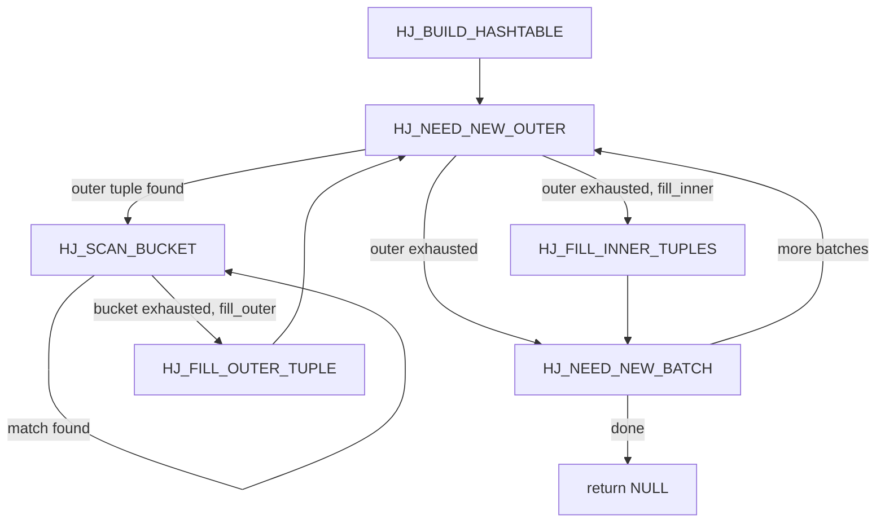
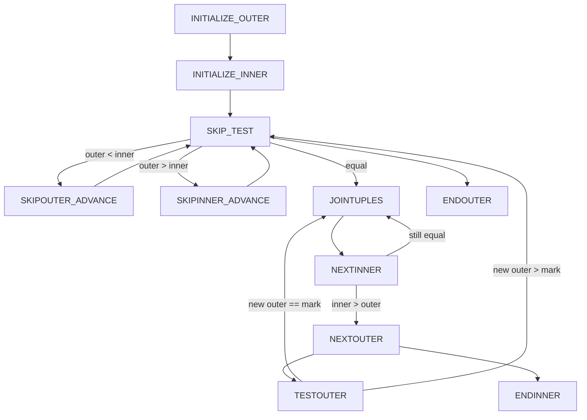

# Join Executor Nodes

PostgreSQL implements three physical join algorithms — nested loop, hash join, and merge join — each suited to different data sizes, available indexes, and sort order of inputs. The [[subsystems/planner/overview|planner]] selects among them based on estimated costs. The executor carries out whichever plan is chosen. All three share the same abstract join node structure (`JoinState`), which holds the join type, qualifier expressions, and null-fill slots needed for outer joins. They differ entirely, though, in how they drive their child nodes and how they manage intermediate state.

## Nested Loop Join

The nested loop join is the simplest algorithm conceptually: for each tuple produced by the outer child, scan the entire inner child looking for matching tuples. Its worst-case cost is O(outer × inner), which makes it impractical when both sides are large unindexed relations. It earns its place in query plans when the inner side is driven by an index — a parameterized inner path. Each probe into the inner side then costs only O(log N) rather than a full sequential scan.

### Parameterized inner plans

The key mechanism that enables index-driven inner scans is the `nestParams` list on the `NestLoop` plan node. Each `NestLoopParam` names a plan parameter (`paramno`) and the outer column that provides its value. When the outer tuple advances, `ExecNestLoop` iterates `nl->nestParams`, reads each named outer column from the outer tuple slot with `slot_getattr`, writes the result into the corresponding `PARAM_EXEC` slot in `econtext->ecxt_param_exec_vals`, and adds `paramno` to `innerPlan->chgParam` (nodeNestloop.c). The inner index scan detects the changed parameter set and applies it as a run-time key on the next call to `ExecProcNode`. Each inner scan therefore targets only the rows that satisfy the current outer value. The parameter value passes as a plain `Datum` — there is no expression evaluation overhead on the inner side beyond the index key extraction.

### Inner rescan semantics

After loading the parameters, `ExecNestLoop` calls `ExecReScan` on the inner plan. What this means in practice depends on the inner node type. For a parameterized index scan it is inexpensive: the scan drops its current position, applies the new key, and starts a fresh index descent. For a sequential scan it resets to block zero and begins reading the relation again. This is why the planner avoids nested loop with a sequential inner scan, when the outer side is large.

When `nestParams` is empty (no parameters flow to the inner side), initialization passes `EXEC_FLAG_REWIND` to the inner child as a hint that cheap restarts are desirable. When parameters are present, `ExecInitNestLoop` strips `EXEC_FLAG_REWIND` (nodeNestloop.c), because the inner plan will be rescanned with different keys on every outer tuple — there is nothing to rewind to.

The planner sometimes wraps the inner child in a Material node, even when it is parameterized, to cache its output when the inner result set is small and repeated full scans of the underlying storage would be expensive. The Material node absorbs the rescan cost by replaying its in-memory or on-disk tuplestore rather than re-executing its child.

### Join type handling

Nested loop supports INNER, LEFT, ANTI, and SEMI joins. It does not support RIGHT or FULL joins, because that would require iterating all inner tuples to find unmatched ones — exactly what hash and merge join are equipped to do with their per-tuple match flags.

For LEFT and ANTI, the node tracks `nl_MatchedOuter`. If the inner scan finishes without producing any match for the current outer tuple, the node checks this flag. For LEFT, it emits the outer tuple padded with the pre-built `nl_NullInnerTupleSlot` (an all-null virtual tuple initialized to the inner plan's result type). For ANTI, it emits the outer tuple itself. In both cases the null-padded result must still pass the non-join qualification (`otherqual`) before being returned.

For ANTI, when a match is found, the join immediately sets `nl_NeedNewOuter = true` and loops back to fetch the next outer tuple, discarding the match. For SEMI, the `single_match` flag (set when `inner_unique` is true or the join type is SEMI) causes the same early exit after the first match. This time, though, the executor emits the matched tuple rather than discarding it.

### NestLoopState fields

| Field | Meaning |
|---|---|
| `nl_NeedNewOuter` | True when the current outer tuple is exhausted and the next one should be fetched |
| `nl_MatchedOuter` | True if at least one inner tuple matched the current outer tuple |
| `nl_NullInnerTupleSlot` | Pre-built all-null inner tuple for LEFT/ANTI null-fill |
| `js.single_match` | Stop after the first match (SEMI, or planner-proven inner_unique) |

## Hash Join

Hash join avoids the repeated inner scans of nested loop by materialising the smaller (inner) relation into an in-memory hash table during a build phase, then probing that table once per outer tuple. It is the preferred algorithm when neither input is sorted, both sides are large, and no usable index exists on the inner side.

PostgreSQL's hash join is a hybrid hash join: it can spill to disk and process large joins in multiple batches when the inner relation does not fit in `work_mem`.

### Build phase

The Hash executor node (`nodeHash.c`) drives its child plan to completion rather than producing tuples lazily. `ExecHashTableCreate` allocates the hash table structure, choosing an initial number of buckets and batches based on the estimated inner cardinality and the available `work_mem`. The number of batches is always a power of two, so that a hash value's high bits cleanly select the batch and the low bits select the bucket within that batch (nodeHashjoin.c).

The Hash node does not participate in the normal `ExecProcNode` protocol — calling it through that interface is an error. Instead, the hash join node calls `MultiExecProcNode`, which drives the Hash node until it has inserted every inner tuple into the table. `ExecHashTableInsert` places each tuple. It hashes the join key expressions and locates the correct bucket chain.

If inserting a tuple would cause the in-memory table to exceed `work_mem`, the executor calls `ExecHashIncreaseNumBatches` and doubles the batch count. `ExecHashIncreaseNumBatches` evicts existing in-memory tuples that belong to the new higher-numbered batches to per-batch temporary files (`BufFile`), while batch 0 remains in memory. This eviction-and-double cycle can repeat multiple times during the build phase. PostgreSQL disables further growth, though, once it detects that a particular round-trip failed to meaningfully reduce memory pressure (nodeHashjoin.c).

PostgreSQL lazily creates batch files the first time a tuple spills to them. `ExecHashJoinSaveTuple` stores each tuple in `MinimalTuple` format, prefixed by its four-byte hash value, so that it does not need to recompute the hash when it reloads the batch (nodeHashjoin.c).

Once the Hash node finishes, the hash table is accessible to the hash join node through `HashState.hashtable`. The hash join then records `hashtable->nbatch` as `nbatch_outstart` — needed later to detect whether the batch count grew during the outer scan.

### Probe phase

The hash join state machine (in `ExecHashJoinImpl` in nodeHashjoin.c) controls the entire probe lifecycle through six states:

| State | Action |
|---|---|
| `HJ_BUILD_HASHTABLE` | Call the Hash node to build the table; apply the empty-outer optimisation if possible |
| `HJ_NEED_NEW_OUTER` | Fetch next outer tuple; compute its hash value; route to correct batch |
| `HJ_SCAN_BUCKET` | Walk the hash bucket chain comparing inner tuples to the current outer |
| `HJ_FILL_OUTER_TUPLE` | Emit null-padded row for an unmatched outer tuple (LEFT/FULL) |
| `HJ_FILL_INNER_TUPLES` | Emit null-padded rows for unmatched inner tuples (RIGHT/FULL) |
| `HJ_NEED_NEW_BATCH` | Load next batch from disk and restart probe |

`ExecHashJoinOuterGetTuple` is the function responsible for supplying the probe side. For batch 0, it reads tuples directly from the outer plan node and hashes each one with `ExecHashGetHashValue`. If the outer tuple's hash maps to a batch other than the current one, `ExecHashJoinSaveTuple` writes it to the corresponding outer batch file. The loop continues — the outer tuple is deferred, not lost. For subsequent batches, the function reads directly from the saved outer batch file, recovering the pre-computed hash value from the file header.

`ExecScanHashBucket` walks the linked list of inner tuples in the selected bucket. Each inner tuple in the chain is a `HashJoinTuple` (a `MinimalTuple` with a header prepended containing the next-pointer and a match flag). When the hash keys and then the join qualifications pass, `ExecScanHashBucket` accepts the match. For NULL hash keys, `ExecHashGetHashValue` returns false, so the executor immediately discards the outer tuple. NULL equals nothing, and no inner tuple could ever match.

### Batch processing

After batch 0's outer tuples are exhausted, the state machine transitions to `HJ_NEED_NEW_BATCH`. `ExecHashJoinNewBatch` advances the batch counter and resets the hash table in memory. It reads all inner tuples from the next batch's file back into the table — this may call `ExecHashTableInsert` again, which may spill yet more tuples to even-later batches. It then rewinds the corresponding outer batch file. The probe proceeds against this freshly-loaded table. The executor can skip batches where both the inner and outer files are null entirely, unless an outer join requires visiting one-sided batches to emit fill tuples.



### Rescan behaviour

`ExecReScanHashJoin` handles single-batch rescans efficiently: if the hash table was built in one batch and the inner plan carries no changed parameters (`innerPlan->chgParam == NULL`), it reuses the existing hash table rather than rebuilding it, resetting only the outer scan state. For RIGHT/FULL joins it also resets the per-tuple match flags with `ExecHashTableResetMatchFlags`. Multi-batch rescans must destroy and rebuild the table, because the intermediate batch files may have already been released.

### Skew optimisation

When a join key value appears far more frequently than average, spilling it to a batch file and reloading it repeatedly would be expensive. During the build phase, `ExecHashBuildSkewHash` inspects the most-common-value statistics for the inner relation's join column (from `pg_statistic`) and allocates dedicated in-memory "skew buckets" for the top MCVs. `ExecHashBuildSkewHash` inserts tuples with those key values into the skew hash table rather than the main table. This ensures they remain in memory even when the rest of the join spills. After batch 0 is complete, `ExecHashJoinNewBatch` releases the skew state, because later batches no longer benefit from it (nodeHashjoin.c).

### Join type handling

Hash join supports INNER, LEFT, RIGHT, FULL, ANTI, RIGHT_ANTI, and SEMI joins. The distinction at initialisation is purely which null-fill slots are allocated: LEFT and ANTI get `hj_NullInnerTupleSlot`; RIGHT and RIGHT_ANTI get `hj_NullOuterTupleSlot`; FULL gets both (nodeHashjoin.c `ExecInitHashJoin`).

During the probe, join type differences appear in a small set of decisions:

- **INNER**: return every tuple pair that matches hash key and qualifications.
- **LEFT/FULL**: when bucket scan ends without a match (`hj_MatchedOuter` remains false), transition to `HJ_FILL_OUTER_TUPLE` and project a null-padded row.
- **RIGHT/FULL**: each inner tuple in the hash table carries a `match` flag in its `MinimalTuple` header (`HeapTupleHeaderHasMatch`/`HeapTupleHeaderSetMatch`). After the outer scan completes, the `HJ_FILL_INNER_TUPLES` state walks the table looking for unmatched inner tuples and emits them null-padded.
- **ANTI**: when a match is found, immediately move to `HJ_NEED_NEW_OUTER`, discarding the outer tuple (it matched, so it must not appear in the output). When no match is found, emit the outer tuple.
- **SEMI**: `js.single_match` is set, so after the first successful match the state transitions to `HJ_NEED_NEW_OUTER` immediately, skipping the rest of the bucket.
- **NULL semantics**: a NULL on either side of the hash equality prevents the outer tuple from matching any inner tuple, because `ExecHashGetHashValue` returns false for NULL keys. This is correct: SQL equality with NULL is not true. For LEFT/ANTI, the null-discard happens before bucket selection. The outer tuple therefore still proceeds to `HJ_FILL_OUTER_TUPLE`, if it would otherwise have no match.

### Parallelism

A Parallel Hash Join builds a shared hash table across multiple worker backends (visible in `EXPLAIN` output as "Parallel Hash"). Each worker hashes a portion of the inner relation into shared memory, coordinating batch growth and bucket resizing through barrier synchronisation points (`build_barrier`, `grow_batches_barrier`, `grow_buckets_barrier`). For multi-batch parallel joins, all workers partition the outer relation into per-batch shared tuplestores before probing begins, because each batch may be picked up by a different worker. The serial and parallel paths share the same state machine. A compile-time `parallel` flag in `ExecHashJoinImpl` allows the compiler to inline and specialise each variant, removing branches that are statically unreachable (nodeHashjoin.c).

## Merge Join

Merge join exploits pre-existing sort order. If both inputs arrive sorted on the join key — either because they were explicitly sorted by a Sort node or because an index delivers them in order — merge join can find all matching pairs by advancing two cursors through the sorted streams simultaneously, never revisiting a tuple except for cross-product handling.

### Sort requirement and EXPLAIN shape

Merge join requires that both inputs be sorted on the join key in compatible order. The planner ensures this either by choosing index scans that deliver rows in key order or by inserting explicit Sort nodes above the scan. A typical `EXPLAIN` output for a merge join looks like:

```
Merge Join
  Merge Cond: (a.id = b.id)
  ->  Index Scan using a_pkey on a
  ->  Sort
        Sort Key: b.id
        ->  Seq Scan on b
```

When both inputs come from indexes, no sort nodes appear. When one or both sides need sorting, the merge join's startup cost includes the sort cost. The planner compares this total against the hash join's build cost: if sorting is cheap relative to hashing (e.g., `work_mem` is tight or the sorted order benefits downstream operations like ORDER BY), merge join wins.

### Comparison and NULL handling

The comparison logic lives in `MJCompare`, which evaluates the pre-loaded key expressions stored in each `MergeJoinClauseData` struct (the `ldatum`/`rdatum` fields) and applies B-tree sort comparators via `ApplySortComparator`. The comparison uses `SortSupportData` structures. `MJExamineQuals` sets these up at initialisation, looking up the btree comparison function for the operator's opfamily without requiring per-call catalog access (nodeMergejoin.c).

The merge join treats NULLs as non-matchable throughout. `MJEvalOuterValues` and `MJEvalInnerValues` detect nulls and return `MJEVAL_NONMATCHABLE` — the tuple will be skipped for joining purposes. Crucially, if a NULL appears in the first sort key and the key sorts nulls-last, the evaluator returns `MJEVAL_ENDOFJOIN`. This tells the merge join to stop scanning that side entirely. Because the data is sorted, all subsequent tuples from that side also have nulls in the first column. None of them can match. This optimisation avoids reading the remaining input. The merge join suppresses this optimisation when `FillOuter` or `FillInner` is active, because fill joins must visit all tuples regardless.

`MJCompare` also handles the pathological case where both sides have NULL in the same key column: it suppresses NULL "=" NULL by reporting the inner tuple as greater, which advances the inner cursor rather than creating a false match.

### Mark and restore

Merge join faces a complication when one side contains duplicate key values. After consuming all matching inner tuples for the first outer tuple with key K, the next outer tuple may also have key K. The inner cursor has moved past the last matching inner tuple, so the executor must reset it to the start of the K run.

The mark/restore mechanism handles this. When the first inner tuple of a matching run is found in `EXEC_MJ_SKIP_TEST`, the executor saves the position with `ExecMarkPos` on the inner plan and copies the inner tuple into `mj_MarkedTupleSlot` with `MarkInnerTuple`. After the inner cursor has exhausted the matching inner tuples for the current outer tuple, the state advances to `EXEC_MJ_NEXTOUTER`. After fetching the next outer tuple, the state machine enters `EXEC_MJ_TESTOUTER` and compares the new outer tuple against the marked inner tuple (not the current one). If they match, `ExecRestrPos` restores the inner cursor to the mark position. Joining then resumes from there. If they do not match, the new outer tuple is larger than the marked inner tuple. The old mark is therefore irrelevant. The state advances to a fresh skip phase.

Initialisation passes the `EXEC_FLAG_MARK` flag to the inner child, unless `mj_SkipMarkRestore` is true. The planner can set `skip_mark_restore` when it knows the inner key values are unique (no duplicates to replay) — for example, when the inner is driven by a primary key index. In that case, the executor never needs mark and restore, avoiding the overhead of saving tuple positions.

For Material inner nodes, the executor also sets `mj_ExtraMarks`. This makes it call `ExecMarkPos` as it advances past inner tuples that it will never revisit. This lets the Material node reclaim memory for tuples before the current mark position, since they can no longer be needed.

### Merge join state machine

The state machine has eleven states. The key transition pattern is:



The ENDOUTER and ENDINNER states drain the remaining side with null-fill tuples, when a LEFT, RIGHT, or FULL join requires emitting rows for unmatched tuples. This happens after one stream is exhausted.

### Join type handling

Merge join supports INNER, LEFT, FULL, RIGHT, ANTI, RIGHT_ANTI, and SEMI joins. The `mj_FillOuter` and `mj_FillInner` flags control null-fill behaviour throughout the state machine. LEFT and ANTI set `mj_FillOuter = true`; RIGHT and RIGHT_ANTI set `mj_FillInner = true`; FULL sets both.

A significant constraint applies to RIGHT, RIGHT_ANTI, and FULL: they require that the extra join qualifications (`joinqual`, distinct from the merge clause itself) be constant-true or constant-false. `check_constant_qual` checks this at initialisation (nodeMergejoin.c). The reason is that the mark/restore logic assumes all rescanned inner tuples will satisfy the same join qualifications as on the first pass — a guarantee that holds only when those qualifications do not reference outer columns. The planner enforces this by not generating RIGHT/FULL merge joins when non-constant extra joinquals are present.

For ANTI joins, the logic mirrors nested loop: when `MJCompare` returns 0 (equal) and the join qualifications pass, the executor sets `mj_MatchedOuter` and advances the state to `EXEC_MJ_NEXTOUTER` without emitting anything. The executor emits the outer tuple only when `EXEC_MJ_NEXTOUTER` is reached with `mj_MatchedOuter` still false (no match was found). SEMI joins behave like INNER but with `single_match` set, causing immediate advancement to `EXEC_MJ_NEXTOUTER` after the first match.

## Null semantics across join types

All three join algorithms implement the same SQL null semantics, but the mechanisms differ because of structural differences between the algorithms.

In every case, a NULL on either side of an equi-join condition prevents a match. The distinction between join types is what happens when no match is found for a given tuple:

- **INNER**: the unmatched tuple is silently discarded on both sides.
- **LEFT**: an unmatched outer tuple is emitted with a null-padded inner side. The inner null-fill slot is a virtual tuple where every attribute is null.
- **RIGHT**: an unmatched inner tuple is emitted with a null-padded outer side. Hash join tracks this with per-tuple match flags. Merge join tracks it with `mj_MatchedInner`.
- **FULL**: both LEFT and RIGHT behaviour apply. Every tuple from both sides appears in the output at least once.
- **SEMI**: only the outer tuple is ever emitted, and only if it matches at least one inner tuple. Semantically equivalent to EXISTS — the null semantics of the inner side are irrelevant to what gets returned.
- **ANTI**: the outer tuple is emitted only when it matches no inner tuple (semantically, NOT EXISTS). A NULL in the outer join key causes no match with any inner tuple, so the join emits the outer tuple. This is the correct SQL behaviour: `x NOT IN (1, NULL)` is false, but that is a different construct from NOT EXISTS with a null-generating join.

Each algorithm allocates null-fill slots at initialisation only for the join types that need them. Nested loop allocates only `nl_NullInnerTupleSlot` (LEFT/ANTI). Hash join allocates `hj_NullInnerTupleSlot` for LEFT/ANTI and `hj_NullOuterTupleSlot` for RIGHT/FULL. Merge join does the same with `mj_NullInnerTupleSlot` and `mj_NullOuterTupleSlot`. If a slot would never be used, the algorithm does not allocate it.

## Planner choice among algorithms

The [[subsystems/planner/overview|planner]] evaluates all three algorithms for each join and picks the cheapest estimated plan. The main considerations are:

The planner chooses **nested loop** when the inner side has a parameterized index path, making each inner probe cheap, or when the outer side is very small. The classic case is a foreign-key lookup: the outer table drives. Each outer row fetches exactly one row from the inner table via an index on the join key. Without an index on the inner side, the planner almost never chooses nested loop once either side grows beyond a few pages. The O(outer × inner) cost quickly dominates in that case.

The planner chooses **hash join** when there is no usable sort order and both sides are large. It requires an equi-join condition and a hashable data type. The build cost is proportional to the inner relation size. The probe cost is linear in the outer relation size, with a low per-tuple constant. Multi-batch operation adds spill overhead but keeps memory bounded by `work_mem`. Hash join also handles cases where the inner relation is small enough to fit entirely in memory but no index is available — the in-memory hash table is faster than a sequential scan for large outers.

The planner chooses **merge join** when both inputs are already sorted on the join key — often from an index scan on a B-tree index — eliminating the cost of an explicit sort. It also chooses merge join when sorting both sides and merging is cheaper than hashing, which can happen for large joins where `work_mem` is tight and the sorted order is reused by downstream operations (e.g., an ORDER BY on the join key). Merge join cannot handle non-equi-join conditions as the merge clause. Such conditions appear as extra `joinqual` predicates applied after the merge.

The [[subsystems/planner/join-ordering|join-ordering]] subsystem determines which relations are joined in which order. The planner chooses the algorithm per join pair after the join order is fixed. The [[subsystems/planner/cost-model|cost model]] accounts for page-level I/O, CPU comparison costs, hash table build cost, and spill costs when estimating each algorithm's total cost.

## Relationship to other executor nodes

All three join nodes are full executor nodes that implement `ExecProcNode`, `ExecReScan`, and `ExecEnd`. They sit above any combination of scan nodes or other join nodes in the plan tree and consume their inputs through the standard [[subsystems/executor/overview|executor pull model]]. The tuple slots they manipulate are described in [[subsystems/executor/tuple-table-slot|tuple-table-slot]]. Parallel hash join interacts with [[subsystems/executor/parallel|parallel query]] infrastructure through shared memory and barrier synchronisation.

## Related Topics

- [[subsystems/planner/join-method-selection|Join Method Selection]] — explains how the planner chooses among nested loop, hash join, and merge join based on cost estimates and available paths.
- [[subsystems/planner/join-ordering|Join Ordering]] — covers how the planner determines which relations to join first before the per-pair algorithm choice is made.
- [[subsystems/planner/cost-model|Cost Model]] — details the cost formulas used to estimate nested loop, hash, and merge join costs including spill penalties.
- [[subsystems/executor/hash-join-spill|Hash Join Spill]] — deep dive into the multi-batch spill mechanics and `work_mem` interaction for hash joins that exceed memory.
- [[subsystems/executor/tuple-table-slot|Tuple Table Slot]] — describes the slot abstraction that join nodes use to hold, project, and null-fill tuples.
- [[subsystems/executor/parallel|Parallel Query]] — covers the shared hash table and barrier synchronisation infrastructure used by Parallel Hash Join.
- [[subsystems/executor/memoize|Memoize]] — the caching node that sits above parameterized inner plans in nested loop joins to avoid redundant rescans for repeated outer key values.
