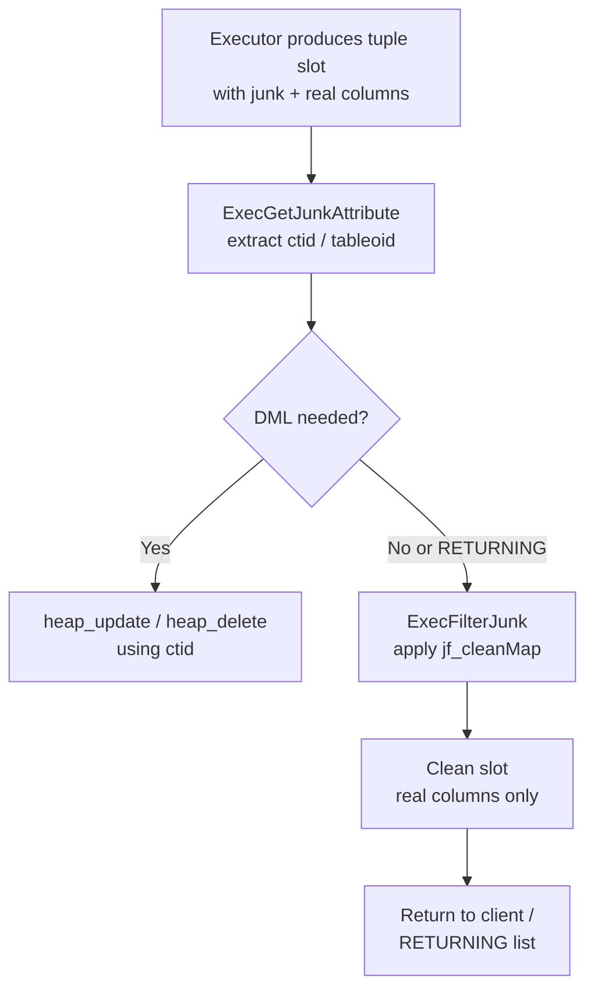

The junk filter is the executor mechanism that manages "junk attributes" — extra columns carried inside a tuple during plan execution that must never appear in query output, on disk, or in RETURNING results. These hidden columns carry routing metadata that write operations need at execution time: the heap tuple ID (`ctid`) that UPDATE and DELETE use to find the exact row to modify, the `tableoid` that identifies which partition or inheritance child a row came from, and whole-row references needed for row-level locking. Without the junk filter, this internal plumbing would leak into user-visible results.

## Junk attributes and the target list

Every `TargetEntry` node in a query's target list carries a boolean field `resjunk`. When the planner prepares a DML statement, it appends extra target entries with `resjunk = true` alongside the normal output columns. The executor evaluates and stores these entries in the tuple slot just like real columns — they participate in expression evaluation, sorting, and projection. The junk filter strips them, though, before the tuple reaches the outside world.

Common junk attributes injected by the planner or executor:

| Attribute name | Set by | Purpose |
|---|---|---|
| `ctid` | Planner (`preptlist.c`) | Heap physical location for UPDATE/DELETE on plain tables |
| `tableoid` | Planner / `nodeModifyTable.c` | Identifies the child relation for partitioned tables and inheritance |
| `wholerow` | Planner | Whole-row `Var` reference, used for row-level locking with `COPY` method |
| `ctidN`, `tableoidN` | `execMain.c` | Per-rowmark variants for multi-table row locking (`FOR UPDATE`, `FOR SHARE`) |

The naming convention for rowmark variants appends the `rowmarkId` integer (e.g., `ctid1`, `tableoid2`). This lets the executor locate the right attribute, when multiple tables are locked in one query.

## Initialization: building the clean map

The executor calls `ExecInitJunkFilter()` (`execJunk.c`) once during startup. It walks the target list, collects every non-junk entry, and builds two things:

- **`jf_cleanTupType`** — a `TupleDesc` containing only the non-junk columns. This becomes the descriptor for any tuple the executor will hand back to the caller.
- **`jf_cleanMap`** — an array of `AttrNumber` values, one per clean output column, recording which slot in the *original* (junk-inclusive) tuple holds that column's data. This is an index-remapping array, not a copy of values.

The executor stores the resulting `JunkFilter` node on `EState.es_junkFilter` for the top-level plan, so every call to `ExecutePlan()` can apply it uniformly.

`ExecInitJunkFilterConversion()` handles the more complex case of inheritance and partition routing, where the "clean" tuple descriptor is supplied by the caller rather than derived from the target list. The caller has already verified that non-deleted columns in the target descriptor align with non-junk target list entries. This variant stores zero in `jf_cleanMap` for any dropped columns. This causes `ExecFilterJunk()` to produce a NULL for that output position, matching the on-disk layout of a table that has had columns dropped.

## Locating and reading a junk attribute

Before a junk attribute's value can be used, the executor must discover which slot position it occupies. `ExecFindJunkAttribute()` scans the target list looking for a `TargetEntry` where `resjunk` is true and `resname` matches the requested name (e.g., `"ctid"` or `"tableoid"`). It returns an `AttrNumber`. The caller then caches this for the duration of execution.

Once the attribute number is known, `ExecGetJunkAttribute()` (an inline function in `executor.h`) simply calls `slot_getattr()` to extract the value from the live tuple slot. The separation of lookup from extraction is intentional: `ExecFindJunkAttribute` runs once at setup time, while `ExecGetJunkAttribute` runs for every row with minimal overhead.

`nodeModifyTable.c` calls `ExecFindJunkAttributeInTlist()` directly during `ExecInitModifyTable()` to cache the `ctid` and `tableoid` attribute numbers for the subplan's target list. At execution time it then extracts the `ctid` to form an `ItemPointer` for the heap update or delete, and reads `tableoid` to dispatch the write to the correct partition.

## Stripping junk: producing clean output

`ExecFilterJunk()` is the hot path. For each row returned by `ExecutePlan()`, it:

1. Materializes all attributes of the incoming slot with `slot_getallattrs()`.
2. Clears the result slot (a pre-allocated virtual tuple slot inside the `JunkFilter`).
3. Iterates over `jf_cleanMap`, copying each data value (or writing a NULL for zero entries) from the source slot into the result slot.
4. Returns the result slot via `ExecStoreVirtualTuple()`.

No heap allocation occurs per row. The executor reuses the result slot across calls. Callers that need to keep a clean tuple beyond the next row fetch must materialize it themselves.

## RETURNING and partitioned tables

RETURNING adds another dimension: the result of an UPDATE or INSERT must include the post-write column values in a layout that matches the root partitioned table's descriptor, not the child's. This is where `ExecInitJunkFilterConversion()` earns its keep. The conversion variant bridges the child relation's physical layout (which may have different dropped-column slots) to the root table's tuple descriptor, all while discarding junk. The `tableoid` junk attribute guides the executor to the correct `ResultRelInfo`, before the executor applies this conversion.

## See also

- [[subsystems/executor/tuple-table-slot|TupleTableSlot]] — the `TupleTableSlot` abstraction that junk filter operates on
- [[subsystems/executor/overview|Executor overview]] — where `es_junkFilter` fits in the broader executor lifecycle
- [[subsystems/storage/toast|TOAST]] — another layer of attribute transformation applied after junk removal
