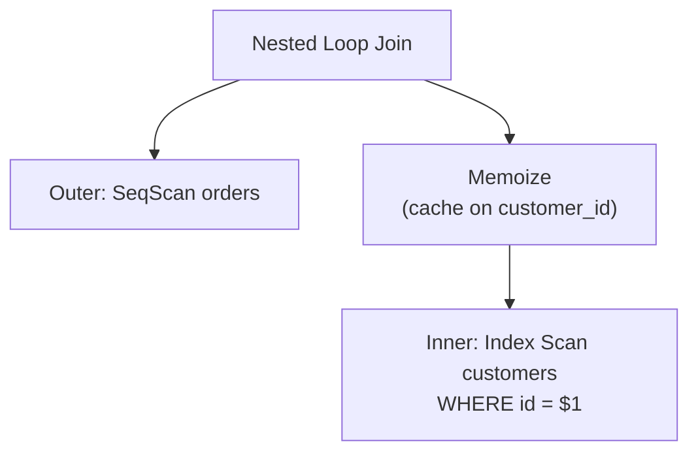
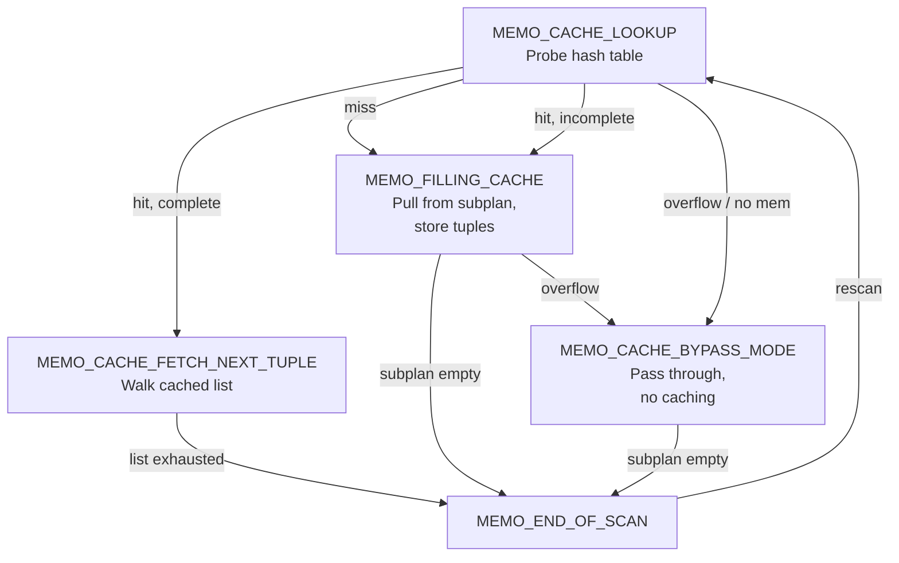

# Memoize Executor Node

The **Memoize** node caches the output of a parameterized inner-side scan in a nested-loop join, avoiding redundant re-execution when the same outer parameter value recurs. Introduced in PostgreSQL 14 (under the working name "Result Cache"), it is the only executor node whose primary purpose is amortizing the cost of a sub-plan across repeated calls with identical parameters.

## The Problem It Solves

In a nested-loop join, the nested loop rescans the inner side once per outer row. When the inner side is a parameterized index scan — for example, `WHERE customer_id = $1` — and the outer relation contains many rows with the same `customer_id`, the index scan executes repeatedly with identical inputs and returns identical results. The work is wasted.

Memoize sits between the nested-loop join node and the inner child plan, intercepting rescans. On a cache hit it returns stored tuples directly without touching the inner node at all.



The gain depends entirely on how many outer rows share a parameter value. A perfectly uniform distribution — every outer row has a unique key — yields no benefit. The cache is a pure overhead in that case. A heavily skewed distribution — most outer rows share a few common keys — makes Memoize highly effective, because Memoize serves those common keys from cache on every rescan after the first.

## When the Planner Adds Memoize

The planner only considers a Memoize node above the inner side of a nested-loop join, and only when:

- `enable_memoize` is `on` (the default).
- The inner path is parameterized: it has either parameterized join clauses (`ppi_clauses`) or lateral variables. A non-parameterized inner side has no cache key. A Materialize node handles that case better instead.
- The outer relation has at least two rows (the first scan is always a miss, so a single outer row cannot benefit).
- The join type allows the cache entry to be marked complete. For SEMI and ANTI joins, this is only possible when `inner_unique` is set. Those join operators otherwise abandon the inner scan after finding a match, leaving the cache entry incomplete.
- The cache key expressions contain no volatile functions. A cache hit would suppress calls to `random()`, `clock_timestamp()`, and so on, changing observable behavior.
- Every parameter expression has a hash operator. The planner cannot use types without a hash operator as cache keys.

`get_memoize_path()` (`src/backend/optimizer/path/joinpath.c`) implements the check. If all conditions pass, it calls `create_memoize_path()` and lets normal path comparison decide whether the resulting plan is cheaper.

### Cost Estimation

The planner estimates the Memoize cost through `cost_memoize_rescan()` (`src/backend/optimizer/path/costsize.c`). The key quantities are:

- **`ndistinct`**: the estimated number of distinct parameter values across all outer rows, computed via `estimate_num_groups()`. When statistics fall back to a default estimate, the planner pessimistically sets `ndistinct = calls`, making Memoize appear useless unless actual statistics exist.
- **`est_cache_entries`**: how many cache entries fit in `work_mem` (via `get_hash_memory_limit()`), computed from the expected per-entry byte cost.
- **`hit_ratio`**: `(calls - ndistinct) / calls * (est_cache_entries / max(ndistinct, est_cache_entries))`. This blends the raw repeat frequency with the probability that a previously cached entry is still present (i.e., has not been evicted).
- **`evict_ratio`**: the fraction of scans expected to evict an entry, nonzero when `ndistinct > est_cache_entries`.

The rescan total cost is then roughly `input_total_cost * (1 - hit_ratio) + cpu_operator_cost + eviction_cost + storage_cost`. When `hit_ratio` is high, this is far cheaper than repeating the full inner scan.

The planner also sets `est_entries = min(ndistinct, est_cache_entries)`, which seeds the initial hash table size passed to the executor.

## Data Structures

The cache is a **simplehash open-addressing hash table** (`memoize_hash`) instantiated with the `simplehash.h` template. Its element type is `MemoizeEntry` and its key type is `MemoizeKey *` (`src/backend/executor/nodeMemoize.c`).

```
MemoizeEntry (hash table slot)
  ├── key → MemoizeKey
  │          ├── params  (MinimalTuple of parameter values)
  │          └── lru_node (doubly-linked list link)
  ├── tuplehead → MemoizeTuple → MemoizeTuple → NULL
  │                 mintuple       mintuple
  ├── hash    (cached hash value)
  ├── status  (simplehash slot status)
  └── complete (bool)
```

**`MemoizeKey`** stores the parameter values as a `MinimalTuple` — the most compact heap tuple format — and embeds a `dlist_node` that anchors it in the LRU doubly-linked list. The LRU link lives in the key rather than the entry, because `simplehash.h` may relocate entry structs during table resizing. The key, by contrast, is heap-allocated, and its address is stable.

**`MemoizeTuple`** is a singly-linked list node holding one cached `MinimalTuple` plus a `next` pointer. All tuples for a given parameter value form a chain under `MemoizeEntry.tuplehead`.

**`MemoizeState`** (in `src/include/nodes/execnodes.h`) is the runtime state:

| Field | Purpose |
|---|---|
| `hashtable` | The `memoize_hash` open-addressing hash table |
| `hashkeydesc` | `TupleDesc` describing the key columns |
| `tableslot` | MinimalTuple slot for decoding stored keys during equality checks |
| `probeslot` | Virtual slot loaded with the current probe key before every hash operation |
| `cache_eq_expr` | Compiled expression for logical key equality (used in non-binary mode) |
| `param_exprs` | Expressions evaluating the current outer parameters |
| `hashfunctions` | Per-key hash functions, one per cache key column |
| `collations` | Per-key collations |
| `mem_used` | Running total of cache memory in bytes |
| `mem_limit` | Budget from `get_hash_memory_limit()` (defaults to `work_mem`) |
| `tableContext` | Dedicated `AllocSet` [[subsystems/memory/contexts|memory context]] for all cache data |
| `lru_list` | Doubly-linked list head; oldest entry is at the front |
| `singlerow` | Mark entry complete after the first tuple |
| `binary_mode` | Use bit-by-bit comparison instead of type equality operators |
| `keyparamids` | Bitmapset of parameter IDs driving cache keys |

## Hashing and Key Comparison

Every lookup begins by populating `probeslot` with the current parameter values (evaluated from `param_exprs`). It then calls into the simplehash machinery, which delegates to `MemoizeHash_hash()` and `MemoizeHash_equal()`.

### Binary mode vs. logical mode

The `cache_mode` (called `binary_mode` in the implementation) controls both hashing and equality:

**Logical mode** (`binary_mode = false`): hashing uses the type's registered hash function for each key column, called via `FmgrInfo` (the same functions used by hash joins and hash aggregation). Equality uses `cache_eq_expr`, a compiled expression built from the join's equality operators. This is the normal case when the join condition uses a standard hashable equality operator like `=` for `integer` or `text`.

**Binary mode** (`binary_mode = true`): hashing uses `datum_image_hash()` and equality uses `datum_image_eq()`. Both compare raw byte representations. Binary mode is forced when:
- The join operator is not the same as the hash equality operator for the type. This can happen with floating-point types where `-0.0` and `+0.0` are logically equal but bitwise distinct — if the join operator can distinguish them, the cache must not conflate them.
- The cache key includes lateral variables, where the semantics of the comparison are not fully known.

The final hash value fed to simplehash is `murmurhash32(combined_column_hashes)`, providing better bit distribution than the raw type hash functions alone.

## Execution State Machine

`ExecMemoize()` drives a five-state machine stored in `mstate->mstatus`:



On each rescan (`ExecReScanMemoize`), the state returns to `MEMO_CACHE_LOOKUP`. `ExecReScanMemoize` does **not** clear the hash table on rescan, unless a changed parameter falls outside the set of cache key parameters (`keyparamids`). That case — a non-key parameter changing, such as an outer join pushing a new correlation variable — invalidates the entire cache via `cache_purge_all()`.

## Single-Row vs. Multi-Row Caching

Memoize considers a cache entry complete only when it has read the inner subplan to exhaustion for that parameter value. This matters because the nested-loop join may stop consuming the inner side early (a semi-join stops after the first match). That would leave the entry incomplete.

**Single-row mode** (`singlerow = true`) handles the unique-join case: when the planner knows the join is inner-unique and the entire join condition is parameterized, it sets `singlerow`. After storing the first tuple, Memoize marks the entry `complete = true` immediately, without waiting for the subplan to signal end-of-scan. This allows the cache to serve subsequent rescans correctly even though the inner scan was never driven to completion.

For SEMI and ANTI joins that are not inner-unique, the planner cannot guarantee single-row mode. It simply declines to add a Memoize node rather than risk stale incomplete entries.

Multi-row entries build a `MemoizeTuple` linked list as tuples arrive during `MEMO_FILLING_CACHE`, then replay that list during `MEMO_CACHE_FETCH_NEXT_TUPLE` on subsequent hits.

## LRU Eviction

The cache has no disk spill path. When `mem_used` exceeds `mem_limit`, `cache_reduce_memory()` walks the LRU list from its head (the least-recently-used end) and removes entries until memory is back within budget.

Memoize maintains access order by moving an entry's `lru_node` to the tail of `lru_list` on every hit (`dlist_move_tail`), and by appending new entries to the tail. Older, less-accessed entries therefore accumulate at the head and are the first candidates for eviction.

Memory accounting is exact: Memoize mirrors every allocation and free in `mem_used`. The overhead per entry is:

```
sizeof(MemoizeEntry) + sizeof(MemoizeKey) + params->t_len   (key overhead)
sizeof(MemoizeTuple) + mintuple->t_len                       (per cached tuple)
```

**Overflow** is a distinct condition from eviction. It occurs when a single entry's tuples are so large that even after evicting every other cache entry, there is still not enough memory to store the next tuple. In this case, Memoize transitions to `MEMO_CACHE_BYPASS_MODE` for the remainder of the current scan, passing tuples through uncached. The bypass resets on the next rescan. The `cache_overflows` counter tracks these events separately from evictions.

## EXPLAIN Output

```
Memoize  (cost=0.43..8.46 rows=1 width=4) (actual rows=1 loops=950)
  Cache Key: o.customer_id
  Cache Mode: logical
  Hits: 900  Misses: 50  Evictions: 0  Overflows: 0  Memory Usage: 25kB
  ->  Index Scan using customers_pkey on customers c  (cost=0.43..8.45 rows=1 width=4)
        Index Cond: (id = o.customer_id)
```

- **Hits**: rescans that found a complete cache entry and returned results without executing the subplan.
- **Misses**: rescans that found no entry (or an incomplete entry) and had to execute the subplan.
- **Evictions**: entries removed to free memory. High evictions with low hits means the working set of distinct parameter values exceeds what fits in `work_mem`. Increasing `work_mem` or tuning the query may help.
- **Overflows**: times Memoize could not cache a parameter set at all because even a single entry's tuples were too large. If overflows are nonzero and the inner scan is expensive, the planner may have misjudged tuple widths.
- **Memory Usage**: peak bytes of cache data, reported from `stats.mem_peak`.

The "Cache Mode: logical" vs. "Cache Mode: binary" annotation in EXPLAIN corresponds directly to the `binary_mode` flag.

## Effect of enable_memoize

Setting `enable_memoize = off` causes `get_memoize_path()` to return `NULL` immediately, suppressing all Memoize paths. The nested-loop join then rescans the inner side on every outer row, exactly as it did before PostgreSQL 14. This GUC is useful for diagnosing whether Memoize is helping or hurting a specific query.

## Skewed vs. Uniform Distributions

The performance impact of Memoize is not uniform across workloads. The hit ratio formula shows why:

```
hit_ratio = (calls - ndistinct) / calls * (est_cache_entries / max(ndistinct, est_cache_entries))
```

With a **uniform distribution** — `ndistinct ≈ calls` — the numerator `(calls - ndistinct)` is near zero. Almost no outer row shares a parameter value with another, so every rescan is a miss. Memoize adds hash-table overhead with no benefit. The planner should, given accurate statistics, choose the plain nested-loop path instead.

With a **skewed distribution** — many outer rows share a small number of distinct values — `ndistinct` is far smaller than `calls`. The hit ratio approaches 1.0. The inner scan executes only `ndistinct` times instead of `calls` times. This is the case Memoize is designed for: foreign-key lookups where a handful of popular values dominate the join, or category-table lookups where a small number of categories is repeated across millions of rows.

## Limitations

- **No mark/restore support**: Memoize asserts that `EXEC_FLAG_BACKWARD` and `EXEC_FLAG_MARK` are not set. It cannot appear as the inner side of a merge join, which relies on mark/restore to handle non-unique keys.
- **Per-execution cache**: the hash table lives in a private memory context (`tableContext`) and is destroyed at query end. There is no cross-query caching.
- **Parallel queries**: each parallel worker has its own independent Memoize cache. Each worker collects its own instrumentation counters. DSM (`SharedMemoizeInfo`) aggregates them back to the leader when the worker exits. EXPLAIN ANALYZE therefore shows combined totals.
- **No spill to disk**: unlike hash joins or sort nodes, Memoize never spills to disk. Memoize simply bypasses a parameter set whose tuples do not fit in memory.

## See also

- [[subsystems/executor/joins]] — nested-loop join that contains Memoize
- [[subsystems/executor/overview]] — executor node lifecycle
- [[subsystems/planner/cost-model]] — how Memoize cost is estimated
- [[subsystems/planner/statistics]] — ndistinct estimates that drive hit-ratio calculation
- [[code-paths/explain]] — reading Memoize stats in EXPLAIN ANALYZE output
