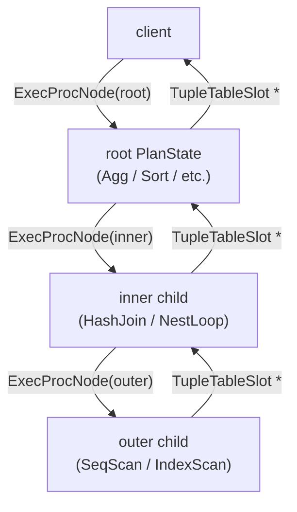
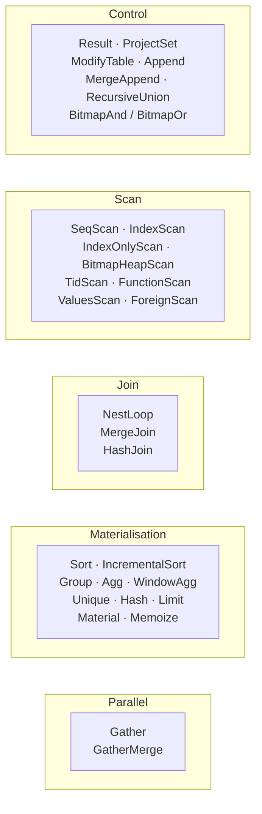
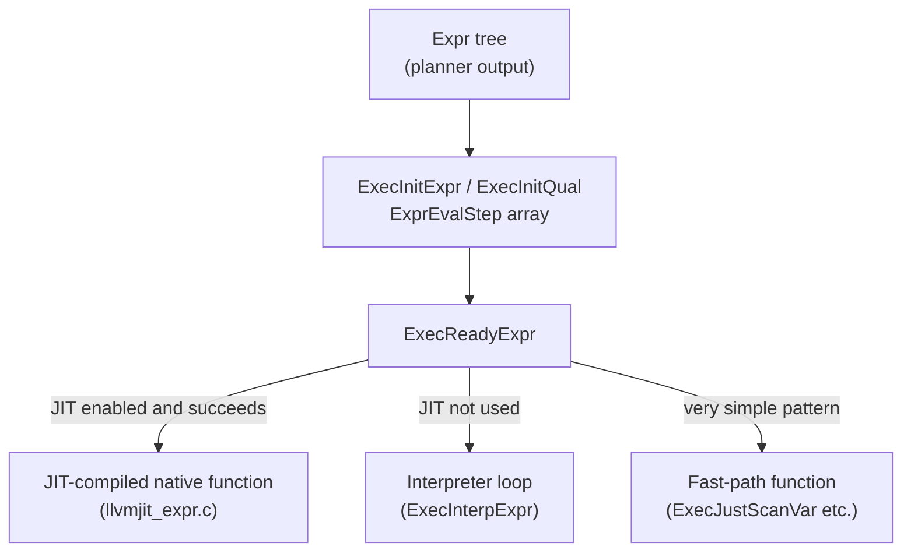
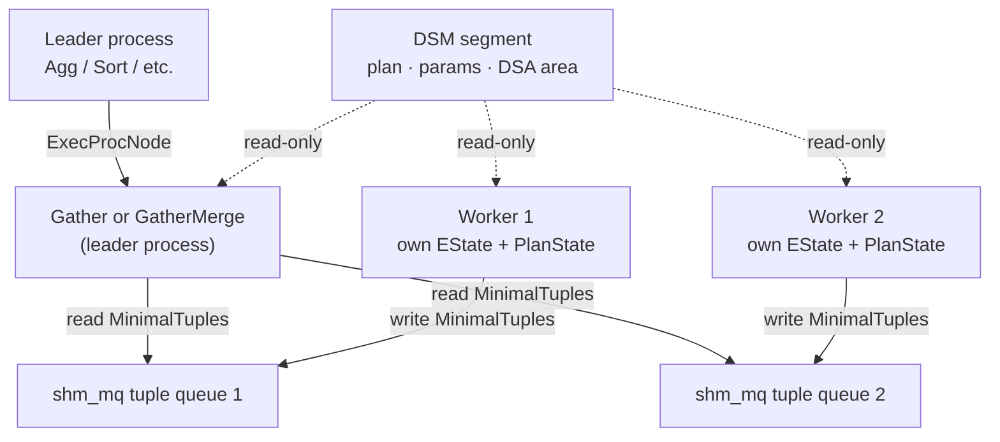

# Executor Overview

The executor takes a `PlannedStmt` produced by the planner and turns it into a stream of tuples. It knows nothing about SQL syntax, catalog structure, or access paths — the planner made those decisions upstream. Its job is to evaluate the plan tree by driving nodes that open heap scans, apply filter expressions, build hash tables, and sort results.

## The Volcano model

PostgreSQL uses a *pull* (Volcano/iterator) execution model. Every plan node exposes a single interface: "give me your next tuple." The executor calls the root node once per output row. The root node recursively pulls from its children on demand. No complete intermediate result set is ever materialised unless a node explicitly requires it (Sort, HashJoin build phase, Materialize). Rows flow from leaf scan nodes up through join and projection nodes and onto the wire as they are produced.

This model is simple to implement and extend: adding a new node type requires only an init, exec, and end function. It also composes naturally with cursors, which suspend mid-result by simply stopping calls to the root.

## EState: the shared query context

The executor anchors every query execution to an `EState` (`src/include/nodes/execnodes.h`, line 612). All nodes in the plan tree share a single `EState`. Each node reads global query properties from it. The fields that matter most:

| Field | Purpose |
|---|---|
| `es_snapshot` | MVCC snapshot; determines which heap versions are visible |
| `es_range_table` | `RangeTblEntry` list from the query; nodes look up their relation here |
| `es_relations` | Opened `Relation` pointers, one per range-table entry |
| `es_result_relations` | Target relations for INSERT / UPDATE / DELETE |
| `es_direction` | Scan direction (forward or backward; cursors use backward) |
| `es_query_cxt` | Per-query [[subsystems/memory/contexts|memory context]]; all query allocations are children of this |
| `es_per_tuple_exprcontext` | Expression context for per-tuple work (constraint checks, index computations) |
| `es_processed` | Row count for the current `ExecutorRun()` call |
| `es_jit_flags` | Bitmask of `PGJIT_*` flags copied from `PlannedStmt`; governs what JIT compilation is permitted |
| `es_jit` | `JitContext *`; non-NULL once the JIT provider has compiled at least one expression |

`ExecutorStart()` (`execMain.c`) creates the per-query memory context (`es_query_cxt`). When `ExecutorEnd()` tears down the state, deleting this context releases all per-query allocations in one shot without tracking individual objects.

## PlanState: the runtime plan tree

The planner produces a tree of `Plan` nodes (pure data, no mutable state). Before execution the executor mirrors that tree with a parallel tree of `PlanState` nodes that carry runtime state: open scan descriptors, allocated tuple slots, expression evaluation state, and instrumentation counters.

`PlanState` (`execnodes.h`, line 1033) is the common header embedded at the start of every node-specific state struct:

| Field | Purpose |
|---|---|
| `plan` | Pointer back to the immutable `Plan` node |
| `state` | Pointer to shared `EState` |
| `ExecProcNode` | Function pointer — the node's "give me a tuple" entry point |
| `ExecProcNodeReal` | The actual node function; `ExecProcNode` may be a wrapper |
| `qual` | WHERE / HAVING filter, compiled as an `ExprState` |
| `lefttree` / `righttree` | Child `PlanState` nodes (outer and inner inputs) |
| `chgParam` | Bitmask of changed parameter IDs; triggers a rescan of this node |
| `ps_ResultTupleSlot` | Slot into which this node writes its output tuple |
| `ps_ExprContext` | Expression evaluation context for this node |
| `instrument` | Optional runtime statistics (populated by EXPLAIN ANALYZE) |

Scan nodes extend `PlanState` with a `ScanState` layer that adds `ss_currentRelation` (the open `Relation`) and `ss_ScanTupleSlot` (the raw tuple from the heap before projection).

## Building and driving the plan tree

Before the first tuple can be requested, the executor walks the planner's immutable `Plan` tree and constructs a matching `PlanState` tree. Each node type has a corresponding init function that allocates the node-specific state struct, opens the relation, allocates tuple slots, and compiles expression trees. The dispatcher in `ExecInitNode()` (`execProcnode.c`) selects the right init function by switching on the `NodeTag` of each `Plan` node, then recurses into children.

Once the tree is built, every node exposes its "give me a tuple" function behind a uniform function pointer (`ExecProcNode` in the `PlanState`). On the first call to any node, a lightweight wrapper verifies stack depth. It then replaces itself so the check does not repeat. When EXPLAIN ANALYZE is active, the executor installs an instrumentation wrapper instead, which records timing and tuple counts around each real call. Without instrumentation, the init function sets the pointer directly to the node's function. The `ExecProcNode()` inline function in `executor.h` simply dereferences that pointer, so all callers drive nodes through the same interface regardless of node type.

Teardown mirrors construction. `ExecEndNode()` (`execProcnode.c`) walks the `PlanState` tree and calls the node-type-specific cleanup function for each node. It then recurses into children to close scan descriptors and release resources.

## TupleTableSlot

Nodes exchange data through `TupleTableSlot` structs rather than raw `HeapTuple` pointers. A slot is an abstraction over four tuple representations:

| Ops type | Struct | Usage |
|---|---|---|
| `TTSOpsVirtual` | `VirtualTupleTableSlot` | Datum/isnull arrays only; no backing storage |
| `TTSOpsHeapTuple` | `HeapTupleTableSlot` | In-memory `HeapTuple` |
| `TTSOpsBufferHeapTuple` | `BufferHeapTupleTableSlot` | On-disk tuple with buffer pin |
| `TTSOpsMinimalTuple` | `MinimalTupleTableSlot` | Minimal tuple (no transaction header) |

All four expose the same `tts_values` and `tts_isnull` arrays (Datum and bool respectively). Expression evaluation reads these arrays. The slot extracts attributes from the underlying tuple lazily — it deforms only the columns actually accessed, via `slot_deform_heap_tuple()` (`execTuples.c`). Projection outputs are virtual slots. This avoids building a new heap tuple for every projected row.

The scan slot for a `SeqScan` is a `TTSOpsBufferHeapTuple` because the page is still pinned in shared buffers. Upper nodes typically project into virtual slots.

## Entry points

The four public executor entry points are declared in `executor.h` with corresponding hook pointers that allow extensions to intercept execution:

| Function | `execMain.c` line | Purpose |
|---|---|---|
| `ExecutorStart()` | 129 | Allocate `EState`, set snapshot, build `PlanState` tree, open relations, check permissions |
| `ExecutorRun()` | 304 | Drive `ExecutePlan()` loop; may be called multiple times for cursor fetches |
| `ExecutorFinish()` | 402 | Fire AFTER-statement triggers; run `ModifyTable` nodes to completion |
| `ExecutorEnd()` | 462 | Recursively close all nodes; free `EState` and per-query memory |

`ExecutorStart()` and `ExecutorEnd()` always bracket an execution. `ExecutorRun()` may be called multiple times between them (each call fetches the next batch of rows). This is how `DECLARE CURSOR … FETCH` works without re-planning.

`InitPlan()` (`execMain.c`) constructs the `PlanState` tree inside `ExecutorStart()` by calling `ExecInitNode()` on the root of the plan tree.

## Node categories

Scan nodes are leaves: they open a relation (or function, or values list) and return one tuple per call. Join nodes drive two children. Materialisation nodes consume their input fully before returning results (Sort, Agg) or cache it for reuse (Material, Memoize). Control nodes handle special cases: `ModifyTable` routes inserts/updates/deletes to the table access method; `Append` fans out to multiple children for partition pruning; `RecursiveUnion` drives WITH RECURSIVE CTEs. Parallel nodes (`Gather`, `GatherMerge`) sit above a subtree that runs in background worker processes. They merge the workers' output back into the single-process Volcano stream.

## Memory structure

Each node allocates its working memory in a child context of `es_query_cxt`. The per-tuple expression context (`ps_ExprContext`) points to a short-lived context that is reset between tuples. This reset prevents accumulation of per-row allocations. Nodes that materialise large intermediate results (Sort, HashJoin) allocate their working memory in a separate context and manage its lifetime explicitly.

## EXEC_FLAG constants

`ExecutorStart()` accepts a flags bitmask (defined in `executor.h`) that signals to nodes what capabilities are required:

| Flag | Meaning |
|---|---|
| `EXEC_FLAG_EXPLAIN_ONLY` | Build plan state but do not execute (EXPLAIN without ANALYZE) |
| `EXEC_FLAG_REWIND` | The caller may call `ExecutorRewind()` to restart from the beginning |
| `EXEC_FLAG_BACKWARD` | The caller may scan in reverse order |
| `EXEC_FLAG_MARK` | Mark/restore (cursor positioning) must be supported |
| `EXEC_FLAG_SKIP_TRIGGERS` | Do not set up AFTER trigger infrastructure |

Nodes use these flags during initialisation to decide whether to allocate structures for capabilities that will not be needed.

## Expression evaluation

Every qual list, projection target list, and index predicate in the plan tree is compiled into an `ExprState` before execution begins. The compilation step — performed by `ExecInitExpr()` and `ExecInitQual()` in `execExpr.c` — walks the planner's expression tree and flattens it into a linear array of `ExprEvalStep` instructions, one struct per operation. Each step holds an opcode (`ExprEvalOp`), pointers to where the result of that step should be stored (`resvalue`, `resnull`), and a small union of inline operands.

The opcode set covers everything the expression language needs: fetching attributes from the inner, outer, or scan slot (`EEOP_INNER_VAR`, `EEOP_SCAN_VAR`), evaluating function calls (`EEOP_FUNCEXPR`, with variants for strict and statistics-tracked functions), boolean short-circuit logic (`EEOP_BOOL_AND_STEP_FIRST/LAST`, `EEOP_BOOL_OR_STEP_FIRST/LAST`), conditional jumps (`EEOP_JUMP_IF_NOT_TRUE`), NULL tests, parameter references, aggregate transition steps, and a terminal `EEOP_DONE`. A qual list compiled with `ExecInitQual()` uses the special `EEOP_QUAL` opcode. This opcode jumps to an exit block on the first false-or-null result, short-circuiting the rest of the conjunction.

The executor does not unconditionally deform attributes from the tuple before an expression runs. Instead, `EEOP_INNER_FETCHSOME` / `EEOP_OUTER_FETCHSOME` / `EEOP_SCAN_FETCHSOME` steps deform only as many attributes as the expression actually accesses. `ExecCreateExprSetupSteps()` (`execExpr.c`) inserts these steps at the front of the step array during compilation. This bounds the deforming cost to the highest-numbered column referenced.

Each step is sized to fit within 64 bytes — one cache line on common hardware — so that stepping through the array does not thrash the L1 cache.

At runtime, `ExecReadyExpr()` (`execExpr.c`) selects the execution method. It first attempts JIT compilation. If that is unavailable or disabled, it falls back to the interpreted path. The interpreter (`ExecInterpExpr()`, `execExprInterp.c`) dispatches each opcode using either a plain `switch` statement or, when the compiler supports computed gotos (`__extension__ &&label`), a direct-threaded dispatch table. In the direct-threaded form, setup code replaces each step's opcode field at setup time with the address of the corresponding code block. Dispatch then becomes a single indirect branch from a distinct site — an arrangement that is friendlier to branch predictors than a central switch. For very short expressions (a single column reference or constant), `ExecReadyInterpretedExpr()` installs a dedicated fast-path function that skips the interpreter loop entirely.

## JIT compilation

JIT compilation targets exactly the work done most often inside a tight loop: evaluating the qual and projection expressions on every tuple, and deforming those tuples from their on-disk representation. These two operations account for a significant fraction of CPU time in analytic queries that scan millions of rows. Generating native machine code for them — rather than interpreting a generic opcode stream — can meaningfully improve throughput.

The planner decides whether to JIT, not the executor. At the end of planning, `standard_planner()` (`planner.c`) compares the estimated total plan cost against three GUC thresholds:

| GUC | Default | Effect when exceeded |
|---|---|---|
| `jit_above_cost` | 100 000 | Enable JIT at all; sets `PGJIT_PERFORM` |
| `jit_inline_above_cost` | 500 000 | Inline small functions into the compiled code; sets `PGJIT_INLINE` |
| `jit_optimize_above_cost` | 500 000 | Run LLVM's O3 optimisation pass; sets `PGJIT_OPT3` |

When the plan cost clears `jit_above_cost`, the planner also sets `PGJIT_EXPR` (if `jit_expressions` is on) and `PGJIT_DEFORM` (if `jit_tuple_deforming` is on) in the `jitFlags` bitmask stored on `PlannedStmt`. `ExecutorStart()` copies these flags into `EState.es_jit_flags`.

At expression compile time, `ExecReadyExpr()` calls `jit_compile_expr()` (`jit.c`) for every `ExprState`. That function checks `es_jit_flags` for `PGJIT_PERFORM` and `PGJIT_EXPR` before doing anything. If either flag is absent, the call returns false immediately. The executor then falls back to the interpreter. When both are set, `jit_compile_expr()` loads the JIT provider shared library on the first call (lazily, so backends that never hit the threshold pay no load cost). It then delegates to its `compile_expr` callback — in practice `llvm_compile_expr()` in `src/backend/jit/llvm/llvmjit_expr.c`.

The LLVM provider generates a native function for the `ExprEvalStep` array by emitting LLVM IR for each opcode. The provider emits simple opcodes such as `EEOP_SCAN_VAR` and `EEOP_FUNCEXPR_STRICT` inline. Complex or rare operations call out to the same `ExecEval*` helper functions used by the interpreter, so the two paths share that code. When `PGJIT_DEFORM` is set and the tuple descriptor is known at compile time, the provider also emits a specialised tuple-deforming function (`slot_compile_deform()`, `llvmjit_deform.c`) that handles only the exact number and types of columns the expression needs. This avoids the generic per-attribute loop in `slot_deform_heap_tuple()`. The two are linked: the generated expression function may call the generated deforming function for `EEOP_*_FETCHSOME` steps.

`EState.es_jit` points to the `JitContext` for the query. This context holds a resource-owner registration, so LLVM-emitted functions are freed when the query ends. It also accumulates instrumentation counters (generation time, optimisation time, emission time, number of created functions) that EXPLAIN VERBOSE reports. Before `jit_compile_expr()` can store its result in `es_jit`, the context must exist. The LLVM provider creates it on the first successful compilation.

The net effect on the Volcano model is invisible at the interface level: `jit_compile_expr()` simply replaces `ExprState.evalfunc` with a pointer to the compiled native function rather than the interpreter. Every caller invokes it through the same `ExecEvalExpr()` inline. Nodes never need to know which path is in use.

JIT pays off when the executor evaluates the same expressions many millions of times — large sequential scans, big aggregations, full-table hash joins. For OLTP-style queries that touch a few rows, the compilation overhead far exceeds any runtime saving. That overhead is itself substantial, especially at `PGJIT_INLINE|PGJIT_OPT3`. This is why the default cost threshold is set high.

## Parallelism

Gather and GatherMerge are the two points where the Volcano model crosses a process boundary. Everything below these nodes runs in background worker processes. Everything above runs in the leader process and sees a single ordered stream of tuples, as if parallelism did not exist. The nodes therefore act as adapters between two separately executing Volcano trees.

When either node is first driven for a tuple (not during `ExecInitNode()`), it calls `ExecInitParallelPlan()` (`execParallel.c`) to allocate a dynamic shared memory segment. That segment holds a serialised `PlannedStmt`, the query text, serialised parameters, per-worker tuple queues (64 kB ring buffers backed by `shm_mq`), and, when EXPLAIN ANALYZE is active, per-node instrumentation arrays and a `SharedJitInstrumentation` block. `ExecInitParallelPlan()` writes the `jit_flags` value from the leader's `EState` into the fixed-size header (`FixedParallelExecutorState`) so workers apply the same JIT policy.

Each background worker starts in `ParallelQueryMain()` (`execParallel.c`). It deserialises the plan and calls `ExecutorStart()`, which builds its own independent `EState` and `PlanState` tree from scratch. It then attaches to the DSA area and runs `ExecutorRun()` to drive its subtree. Workers write completed tuples as `MinimalTuple` values into their dedicated `shm_mq` queue. The leader reads from those queues through `TupleQueueReader` handles.

The leader's `EState` and each worker's `EState` are entirely separate. There is no shared mutable per-row state. What is shared is read-only: the DSM segment contents (plan, params, relation OIDs), the DSA area (used by parallel-aware nodes such as parallel hash joins to share hash tables), and the tuple queues through which workers push results.

The difference between the two node types is purely in how they merge the worker streams:

- **Gather** (`nodeGather.c`) pulls from worker queues round-robin and interleaves tuples with any rows it produces locally (the leader may participate as a worker via `need_to_scan_locally`). Output order is arbitrary.
- **GatherMerge** (`nodeGatherMerge.c`) assumes each worker produces tuples in a defined sort order. It maintains one slot per worker (plus the leader, if participating). It reads ahead up to `MAX_TUPLE_STORE` tuples per worker into per-reader pending buffers. It uses a binary heap to emit the globally minimum tuple on each call. The sort-key comparators used by the heap are the same `SortSupport` structures that a MergeJoin or MergeAppend would use.

Tuples cross the worker boundary as `MinimalTuple` values (the compact on-disk representation without the transaction visibility header). The Gather node stores incoming tuples in a `funnel_slot` of type `TTSOpsMinimalTuple`. GatherMerge keeps them in per-reader `GMReaderTupleBuffer` arrays. Once loaded into the leader's tuple slot they are indistinguishable from locally produced tuples — the caller above the Gather node sees ordinary `TupleTableSlot *` returns.

When `ExecutorEnd()` runs in the leader, it signals workers to shut down and waits for them to finish (`WaitForParallelWorkersToFinish()`). Workers then copy their `Instrumentation` counters and JIT statistics into the shared DSM arrays. The leader reads those back with `ExecParallelRetrieveInstrumentation()` and `InstrJitAgg()`, so EXPLAIN ANALYZE can report per-worker totals.

## See also

- [[code-paths/simple-select]] — end-to-end walkthrough showing the executor in context
- [[subsystems/executor/tuple-table-slot]] — TupleTableSlot types, lazy deformation, materialisation
- [[subsystems/executor/expression-eval]] — how ExprState and the instruction interpreter work
- [[subsystems/executor/jit-llvm]] — LLVM JIT provider internals
