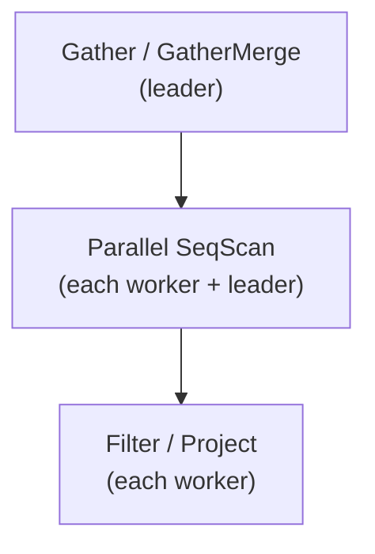
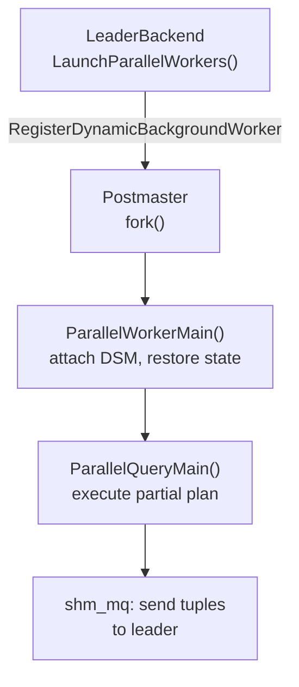
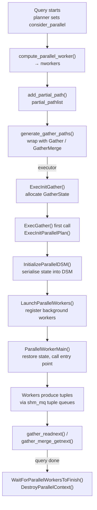

# Parallel Query Framework

PostgreSQL's parallel query framework divides a single query's work across multiple backend processes. The leader backend (the original client-connected process) spawns one or more **parallel workers** — background worker processes — each of which executes a partial copy of the plan subtree. The leader then collects and merges the results. The mechanism is built on three independent subsystems: dynamic shared memory (DSM) for shared state, shared-memory message queues for tuple transport, and the background worker infrastructure for process management.

See also [[subsystems/executor/overview]], [[subsystems/planner/overview]], and [[subsystems/executor/aggregate]] (which covers partial aggregation, a key consumer of this framework).

A sequential scan of a large table is CPU-bound at one process, one page at a time. With `N` parallel workers, each worker claims an independent block range from a shared scan position stored in DSM. All workers therefore scan disjoint stripes, saturating multiple CPU cores simultaneously. The total work does not change, but elapsed time falls roughly as `1/N` (with diminishing returns due to coordination overhead and the fact that the leader also participates by default).

## Parallel safety classification

Before the planner considers any parallel path, it must verify that every function in the query tree can safely execute inside a worker process. The classification is stored in `pg_proc.proparallel` (`src/include/catalog/pg_proc.h`, line 77) as one of three values:

| Symbol | Value | Meaning |
|---|---|---|
| `PROPARALLEL_SAFE` | `'s'` | Can run in any worker or the leader |
| `PROPARALLEL_RESTRICTED` | `'r'` | Can only run in the parallel leader (not workers) |
| `PROPARALLEL_UNSAFE` | `'u'` | Cannot run in parallel mode at all |

The planner walks the expression tree and finds the maximum hazard level (`is_parallel_safe()`, `src/backend/optimizer/util/clauses.c`). If any node is `PROPARALLEL_UNSAFE`, the query cannot use parallelism at all. If any node is `PROPARALLEL_RESTRICTED`, that expression must remain above the `Gather` node — in the leader — rather than below it in workers.

The planner checks each base relation before building any partial paths: `set_rel_consider_parallel()` (`allpaths.c`) tests the base restriction clauses and target expressions. If either check fails, `rel->consider_parallel` stays false. The planner then generates no partial paths for that relation.

## Planning for parallelism

### Estimating worker count and partial paths

`RelOptInfo` carries two path lists: `pathlist` (complete paths, one process) and `partial_pathlist` (paths that produce only a fraction of the relation's rows, intended to run in parallel workers). A partial path has `parallel_workers > 0` and `parallel_aware = true` (`src/include/nodes/pathnodes.h`).

Relation size drives the number of workers chosen for a relation — small relations do not benefit from the coordination overhead. If the relation has a `parallel_workers` storage parameter, the planner uses that value directly. Otherwise a logarithmic formula applies: the planner adds one worker for every 3× increase in page count beyond `min_parallel_table_scan_size` (with a symmetric formula for index scans using `min_parallel_index_scan_size`). The planner clamps the result to `max_parallel_workers_per_gather` (default 2), the primary user-facing knob. Setting it to 0 disables parallel query entirely. This logic lives in `compute_parallel_worker()` (`allpaths.c`).

Row count estimation for a partial path accounts for leader participation: the formula assumes the leader spends `30% × parallel_workers` of its time on worker overhead. The effective divisor used when computing per-worker row counts is:

```
parallel_divisor = parallel_workers + max(0, 1.0 − 0.3 × parallel_workers)
```

`get_parallel_divisor()` (`costsize.c`) divides a partial path's `rows` field by this divisor, so cost functions see the per-worker row estimate rather than the full relation estimate.

### Wrapping partial paths with Gather and GatherMerge

Once all partial paths are built, the planner wraps them into complete paths that the leader can execute (`generate_gather_paths()`, `allpaths.c`). The planner wraps the cheapest partial path with a plain `Gather` path, which collects worker output without preserving order. It also gives each partial path that carries non-empty `pathkeys` a `GatherMerge` path, which performs an order-preserving merge of pre-sorted worker streams. Both wrapper paths enter the normal `pathlist` so the planner can compare their costs against a serial plan.

### Plan tree overview



Every worker executes the subplan below `Gather` independently. The `Gather` node collects and merges their output streams.

## Shared state: ParallelContext and DSM

The leader's handle for a single parallel operation is `ParallelContext` (`src/include/access/parallel.h`):

```c
typedef struct ParallelContext {
    int         nworkers;            /* requested maximum */
    int         nworkers_to_launch;  /* actual to launch (may be reduced) */
    int         nworkers_launched;   /* successfully registered */
    dsm_segment *seg;                /* the DSM segment */
    shm_toc    *toc;                 /* table of contents within seg */
    ParallelWorkerInfo *worker;      /* per-worker state (bgwhandle, error_mqh) */
    ...
} ParallelContext;
```

`CreateParallelContext()` (`parallel.c`) allocates this structure in `TopTransactionContext` and records the library and entry-point function that workers will call. It does not yet allocate shared memory. `InitializeParallelDSM()` (`parallel.c`) creates and populates the DSM segment. It serialises all state that workers need to replicate the leader's environment. The segment is organised as a table of contents (`shm_toc`) keyed by `PARALLEL_KEY_*` constants:

| TOC key | Content |
|---|---|
| `PARALLEL_KEY_FIXED` | `FixedParallelState`: database OID, user IDs, security context, leader's `PGPROC*`, timestamps, serializable transaction handle |
| `PARALLEL_KEY_GUC` | Serialised GUC state (`SerializeGUCState`) |
| `PARALLEL_KEY_TRANSACTION_SNAPSHOT` | Serialised transaction snapshot (for REPEATABLE READ / SERIALIZABLE) |
| `PARALLEL_KEY_ACTIVE_SNAPSHOT` | Serialised active snapshot |
| `PARALLEL_KEY_COMBO_CID` | Combo command-ID map (`SerializeComboCIDState`) |
| `PARALLEL_KEY_TRANSACTION_STATE` | Transaction nesting state |
| `PARALLEL_KEY_LIBRARY` | Loaded shared libraries |
| `PARALLEL_KEY_RELMAPPER_STATE` | Relation-file OID map for catalog relations |
| `PARALLEL_KEY_ERROR_QUEUE` | Array of per-worker error message queues (16 kB each) |
| `PARALLEL_KEY_ENTRYPOINT` | Library name + function name string |
| `PARALLEL_KEY_SESSION_DSM` | Handle to the per-session DSM segment (for record typmods) |

If the DSM segment cannot be created (for example, because the system-wide limit on segments is reached), the leader sets `nworkers` to 0, and execution falls back to private memory. Parallelism is silently disabled rather than returning an error (`parallel.c`).

## Worker launch and environment restoration

Workers are registered as dynamic background workers by `LaunchParallelWorkers()` (`parallel.c`):

```c
worker.bgw_flags = BGWORKER_SHMEM_ACCESS
                 | BGWORKER_BACKEND_DATABASE_CONNECTION
                 | BGWORKER_CLASS_PARALLEL;
worker.bgw_function_name = "ParallelWorkerMain";
worker.bgw_main_arg = UInt32GetDatum(dsm_segment_handle(pcxt->seg));
```

The DSM segment handle is the only argument passed to each worker. The worker discovers everything else through the TOC. Registration can fail silently if `max_worker_processes` is exhausted. Callers must be prepared to receive fewer workers than requested.

A parallel worker is a fresh process that shares no inherited session state with the leader. It must reconstruct the leader's environment from the DSM snapshot before it can execute any query work. On startup, the worker attaches to the DSM segment and deserialises, in order, the loaded libraries, GUC state, transaction state, combo CID map, snapshots, user identity, temporary namespace, relation mapper state, and serializable transaction handle. The worker also attaches to its dedicated error queue and redirects protocol output there. It joins the leader's lock group (via `BecomeLockGroupMember()`) before acquiring any heavyweight lock. This ensures lock conflict detection operates correctly across the group. Only after this full restoration does the worker call the actual entry point. For parallel query this is `ParallelQueryMain()`, registered in `InternalParallelWorkers[]` (`parallel.c`).



## Shared-memory message queues

Each parallel worker has a dedicated **send queue** to transmit tuples to the leader. There is no shared queue. Each worker writes independently. The leader reads from all queues in round-robin fashion. A separate set of queues — the error queues, 16 kB each (`PARALLEL_ERROR_QUEUE_SIZE`, `parallel.c`) — carries PostgreSQL protocol messages (errors, notices, notify) from workers.

The `shm_mq` API (`shm_mq.c`; declared in `src/include/storage/shm_mq.h`) provides single-reader, single-writer queues initialised in caller-supplied memory. Before any I/O, the sender calls `shm_mq_set_sender(mq, MyProc)`. The receiver calls `shm_mq_set_receiver(mq, MyProc)`. `shm_mq_attach()` creates a backend-local `shm_mq_handle` with the DSM pin and optional background-worker handle for latch signalling.

| Function | Direction | Blocking |
|---|---|---|
| `shm_mq_send()` | Writer → reader | Optional (`nowait`) |
| `shm_mq_sendv()` | Writer → reader (scatter) | Optional |
| `shm_mq_receive()` | Reader ← writer | Optional |

Return values are `SHM_MQ_SUCCESS`, `SHM_MQ_WOULD_BLOCK`, or `SHM_MQ_DETACHED`. A `DETACHED` result means the other end closed its connection — the primary mechanism for detecting worker exit without error.

`HandleParallelMessages()` (`parallel.c`) drains error messages from workers. `CHECK_FOR_INTERRUPTS()` triggers it whenever the `PROCSIG_PARALLEL_MESSAGE` signal sets `ParallelMessagePending`. It re-throws worker errors in the leader with a `"parallel worker"` context line appended.

## Inter-process tuple transport mechanisms

Two complementary mechanisms move tuples across process boundaries in a parallel query. The framework uses tuple queues for streaming — each worker continuously pushes result tuples to the leader as it produces them. It uses shared tuple stores for materialization — multiple workers build a shared, disk-backed collection that all workers later scan in parallel.

### Tuple queues

`tqueue.c` provides a thin layer on top of `shm_mq` that speaks the executor's slot/tuple idiom. On the writer side, `CreateTupleQueueDestReceiver()` returns a standard `DestReceiver` (type `DestTupleQueue`) backed by a `TQueueDestReceiver`. When the executor calls `receiveSlot`, the receiver fetches the slot's `MinimalTuple` representation and hands it verbatim to `shm_mq_send()`. The message body is exactly the `MinimalTuple` bytes — no header, no additional framing.

On the reader side, `CreateTupleQueueReader()` wraps the same `shm_mq_handle` in a `TupleQueueReader`. `TupleQueueReaderNext()` calls `shm_mq_receive()` and casts the returned byte pointer directly to `MinimalTuple`. This makes the tuple zero-copy: the data lives in the queue's shared-memory ring buffer until the next receive call overwrites it. Callers must copy the tuple if they need it to survive that window.

The `DestReceiver` abstraction is what allows the same plan node to write to either a local tuple store or a remote queue without any change to executor code. `execParallel.c` swaps in the `DestTupleQueue` receiver when initialising a worker's plan.

### Shared tuple stores

`sharedtuplestore.c` implements a parallel-aware, disk-spilling tuple store backed by `BufFile` files in a `SharedFileSet`. Workers use it where multiple workers must build a common set of tuples that all workers will later scan. The primary consumers are parallel hash join and parallel hash aggregate, where workers cooperatively materialize the hash-join inner relation before the probe phase begins.

The shared state that lives in DSM is small: a `SharedTuplestore` header containing the participant count, a name, optional per-tuple metadata size, and one `SharedTuplestoreParticipant` record per worker. Each participant record holds an [[subsystems/locking/lwlocks|LWLock]], a write page count, and a shared read-head pointer. The actual tuple data lives in per-participant `BufFile` files, not in DSM.

Each participant writes exclusively to its own file, appending tuples in fixed-size chunks of four 8 kB pages (`STS_CHUNK_PAGES = 4`, giving 32 kB chunks). This eliminates write-side contention entirely — no lock is needed while writing. The store splits tuples larger than one chunk across sequential overflow chunks. The first chunk's `overflow` field records how many overflow chunks follow, allowing readers to skip the entire run in a single step.

Reading is parallel. After all writers call `sts_end_write()`, any participant calls `sts_begin_parallel_scan()` and then repeatedly calls `sts_parallel_scan_next()`. Each call acquires a participant's LWLock, claims the next chunk range from that participant's `read_page` counter, and releases the lock. Multiple readers therefore race to consume chunks from any participant's file with minimal contention. A reader starts with its own file (for cache locality) and then walks round-robin through other participants' files until it has completed a full circle.

The store places optional per-tuple metadata of a fixed size (used by parallel hash to store the hash value alongside each tuple) immediately before the tuple bytes in each chunk. `sts_parallel_scan_next()` returns this metadata alongside the tuple.

## Gather node

`nodeGather.c` implements the `Gather` executor node, which collects tuples from workers without preserving order.

### Leader participation and deferred worker launch

The `Gather` node degrades gracefully: if no workers can be launched, it simply runs the entire subplan itself. `parallel_leader_participation` (GUC, default `on`) controls whether the leader also participates alongside workers. It allows the leader to contribute scan work in addition to reading from worker queues. The `single_copy` flag overrides this. When set, the plan is not parallel-aware, and exactly one process runs it.

The `Gather` node deliberately defers worker launch to the first call to retrieve tuples rather than to initialisation. At that point the system attempts to launch workers (`ExecInitParallelPlan()` sets up the executor's DSM state and tuple queues, `LaunchParallelWorkers()` starts the workers, and `ExecParallelCreateReaders()` creates one `TupleQueueReader` per launched worker). If the system registers zero workers successfully, it forces `need_to_scan_locally` true. The node then becomes a simple pass-through that runs the entire plan in the leader — no error, no retry needed.

### Interleaving worker and leader output

The `Gather` node interleaves tuples from worker queues and, when leader participation is active, from the leader's own execution of the subplan. The `Gather` node polls worker queues in round-robin order in non-blocking mode (`gather_readnext()`, `nodeGather.c`). When all active readers would block and no local work remains, the leader waits on `MyLatch` (`WAIT_EVENT_EXECUTE_GATHER`). When a worker finishes it signals readerdone, removing itself from the active reader set.

Worker errors arrive asynchronously via the error queues. The leader re-throws them the next time `CHECK_FOR_INTERRUPTS()` fires inside the retrieval loop. This means the leader may notice an error in one worker after it has already consumed tuples from another, but the overall query will still fail.

## GatherMerge node

`nodeGatherMerge.c` implements order-preserving merge across worker outputs. It applies when the partial path already produces sorted output — for example, a parallel index scan or a sort executed within each worker. The planner only emits a `GatherMerge` path for partial paths with non-empty `pathkeys` that match the merge sort order (`allpaths.c`). Because of this, the merge node needs no re-sort. The guarantee is structural rather than runtime.

### Merging sorted streams with a binary heap

Merging K sorted streams optimally requires tracking only the current front element of each stream, not loading all tuples into memory. The node maintains one `TupleTableSlot` per participant (workers plus the leader's local scan) and a binary heap keyed by the query's sort-key comparator (`heap_compare_slots()` applies the `gm_sortkeys` sort support structs directly to slot attribute values). Before it returns the first tuple, `gather_merge_init()` (`nodeGatherMerge.c`) primes the heap by fetching the first tuple from each participant.

Each subsequent call to `ExecGatherMerge` pops the participant with the globally smallest current tuple from the heap. It advances that participant by one tuple, then re-inserts it (or removes it if exhausted). This produces a globally sorted stream in O(log N) per tuple (where N = worker count). To amortize latch wake-ups, the node pre-fetches up to `MAX_TUPLE_STORE = 10` additional tuples from a worker queue in nowait mode whenever a tuple is consumed (`load_tuple_array()`, `nodeGatherMerge.c`).

## Parallel-aware executor nodes

Nodes that have a parallel-aware variant coordinate through DSM to avoid duplicate work. `execParallel.c` dispatches to per-node `Estimate`, `Initialize`, `ReInitialize`, and `ReportInstrumentation` callbacks based on `planstate->plan->parallel_aware`.

| Node | Parallel-aware behaviour |
|---|---|
| `SeqScan` | Workers claim block ranges from a shared `ParallelBlockTableScanDesc` in DSM |
| `IndexScan` | Workers claim ranges of index pages from a shared scan descriptor |
| `IndexOnlyScan` | Same coordination as IndexScan |
| `BitmapHeapScan` | Workers share a pre-built bitmap; each worker claims heap blocks via shared state |
| `HashJoin` | Workers cooperatively build a shared hash table (parallel hash); each worker probes independently |
| `Hash` | Maintains shared instrumentation even when not parallel-aware |
| `Append` | Parallel-aware `AppendState` distributes sub-plans across workers |
| `ForeignScan` | Delegated to FDW callbacks |
| `CustomScan` | Delegated to extension callbacks |

Nodes that cannot appear below a `Gather`:

| Node | Reason |
|---|---|
| `ModifyTable` | Writes require leader-only visibility and conflict detection |
| `LockRows` | Row-level locking requires the leader's transaction context |
| `Limit` / `Offset` | Global row count is not knowable inside a worker |
| `SetOp` | Requires global duplicate tracking |
| `RecursiveUnion` | Working table is not shared |
| Subquery correlated with outer query | Cross-process parameter passing not supported below Gather |

The planner enforces these restrictions by never setting `consider_parallel` for queries containing DML (`planner.c`), and by classifying functions that access sequences, `txid_current()`, etc. as `PROPARALLEL_UNSAFE` or `PROPARALLEL_RESTRICTED`.

## Lifecycle summary



## Key GUCs

| GUC | Default | Effect |
|---|---|---|
| `max_parallel_workers_per_gather` | 2 | Upper bound on workers per Gather node |
| `max_parallel_workers` | 8 | Pool size for all parallel operations globally |
| `min_parallel_table_scan_size` | 8 MB | Minimum relation size to consider parallelism |
| `min_parallel_index_scan_size` | 512 kB | Minimum index size to consider parallelism |
| `parallel_setup_cost` | 1000 | Planner cost of setting up workers (added to startup cost) |
| `parallel_tuple_cost` | 0.1 | Per-tuple cost of passing tuples between processes |
| `parallel_leader_participation` | on | Whether the leader also runs the subplan |
| `force_parallel_mode` | off | Developer GUC to force parallel paths for testing |

## Related Topics

- [[subsystems/planner/parallel-query|Parallel Query Planning]] — covers how the planner generates partial paths, estimates parallel worker counts, and wraps them with Gather and GatherMerge paths.
- [[subsystems/background/bgworker|Background Workers]] — the dynamic background worker infrastructure that parallel query uses to spawn and manage worker processes.
- [[subsystems/storage/dsm-impl|Dynamic Shared Memory]] — the DSM segment and table-of-contents mechanism used by ParallelContext to share state between the leader and workers.
- [[subsystems/executor/hash-join-spill|Hash Join Spill]] — parallel hash join relies on the shared tuple store and cooperative hash table build described in this framework.
- [[subsystems/executor/append-node|Append Node]] — the parallel-aware Append node distributes sub-plans across workers using the same Gather infrastructure.
- [[subsystems/partitioning/partition-wise-join|Partition-Wise Join]] — partition-wise parallelism composes with this framework so each partition pair can be joined by a separate worker.
- [[subsystems/executor/aggregate|Aggregate]] — partial aggregation is a primary consumer of the parallel query framework, splitting aggregate work across workers before the leader finalises results.
