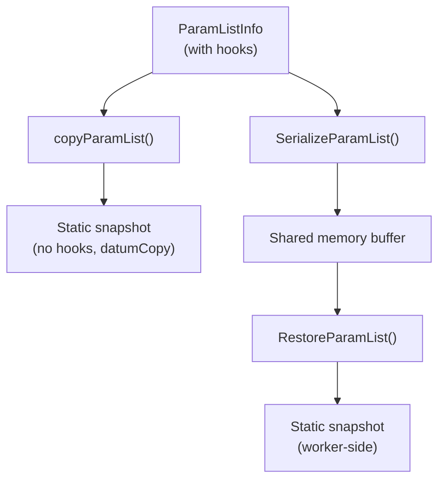

The executor carries query parameters — the `$1`, `$2`, … placeholders in a parameterized SQL statement — through a `ParamListInfo` struct defined in `src/include/nodes/params.h`. `src/backend/nodes/params.c` manages this struct. The infrastructure has two distinct parameter namespaces: external parameters supplied by the client, and internal exec-parameters used to pass values between a parent query and its correlated subqueries. Understanding how these are represented, copied, and serialized explains both how the wire protocol connects to plan execution and how parallel workers receive parameter values.

## Two Parameter Namespaces

PostgreSQL separates query parameters into two completely distinct namespaces that happen to share similar field names but differ in indexing and lifecycle.

**External parameters** (`PARAM_EXTERN`) correspond to the `$1`/`$2` placeholders visible in SQL. They are numbered **1-based**. The executor receives them in a `ParamListInfo` passed in from outside — typically assembled by `exec_bind_message()` in the extended query protocol (see [[code-paths/extended-query]]) or by `EvaluateParams()` for SQL-level `EXECUTE` statements (see [[code-paths/prepared-statements]]).

**Exec-parameters** (`PARAM_EXEC`) are an internal mechanism. They carry values across plan-node boundaries: an InitPlan (a subplan executed once) deposits its result into a slot. The parent node then reads it from there. Correlated subqueries use the same channel. These parameters are **0-based**. They live in a flat `ParamExecData` array in the executor state (`EState.es_param_exec_vals`). A `ParamExecData` slot either holds a ready `Datum`/`isnull` pair or, if `execPlan` is non-NULL, points to a `SubPlanState` that must be executed lazily to produce the value. The two namespaces never overlap: a `PARAM_EXTERN` node and a `PARAM_EXEC` node carry different `paramkind` values and look up parameters through entirely separate mechanisms.

## The ParamListInfo Container

`ParamListInfoData` is a C99 flexible-array struct (`params.h`). A single allocation holds both the control fields and the trailing `params[]` array of `ParamExternData` records. `ParamListInfo` is a pointer typedef to the struct, so the whole thing moves around as a single pointer.

Each `ParamExternData` slot holds:
- `value` (Datum) — the parameter value, using PostgreSQL's standard pass-by-value or pass-by-reference Datum encoding
- `isnull` (bool) — whether the value is SQL NULL
- `ptype` (Oid) — the datatype OID; `InvalidOid` marks the slot as unused, allowing gaps in the array without error
- `pflags` (uint16) — flag bits; the only defined flag is `PARAM_FLAG_CONST` (0x0001)

`numParams` gives the upper bound on the 1-based paramid range. The array may legally contain slots with `ptype == InvalidOid`. Callers that iterate the array must skip those.

### Static and Dynamic Access

`ParamListInfo` supports two access modes, chosen per-instance:

In **static mode**, the `params[]` array is fully populated before the executor sees the struct. `paramFetch` is NULL. This is what `copyParamList()` and `RestoreParamList()` always produce.

In **dynamic mode**, `paramFetch` is a callback that the executor invokes to fetch each slot on demand. The array may be zero-length. `numParams` is still set to the logical count. The hook receives `(ParamListInfo params, int paramid, bool speculative, ParamExternData *workspace)`. When `speculative` is true, the hook must return an invalid entry rather than risking an error. This allows callers to probe whether a parameter is available without committing to a fetch that could fail mid-query.

Any code that needs a parameter value should first check `paramFetch != NULL`. It should call the hook if present, falling back to direct array access otherwise. This pattern repeats identically in `copyParamList`, `EstimateParamListSpace`, `SerializeParamList`, and `BuildParamLogString`.

### The Hook Trio

Beyond `paramFetch`, `ParamListInfo` carries two more hook slots:

`execExpr.c` consults `paramCompile` when it compiles a `PARAM_EXTERN` Param node into an expression evaluation step. If set, it typically emits an `EEOP_PARAM_CALLBACK` step instead of the default array-lookup step. This is the extension point used by [[subsystems/executor/jit-llvm|JIT]] compilation and by PL/pgSQL, which can satisfy parameter lookups from its own local-variable storage without going through the `params[]` array.

`parserSetup` is called when a cached query must be re-parsed or re-planned. It reinstalls the parse-time parameter-resolution hook (`p_paramref_hook`) on the fresh `ParseState`. Without this, re-parsing would not know how to resolve `$N` references. `makeParamList()` installs a built-in default, `paramlist_parser_setup`, which wires up `paramlist_param_ref` as the resolution hook. That hook validates the param number, calls `paramFetch` if present, and checks that `ptype` is valid. It then returns a `Param` node with `paramtypmod = -1` and collation from `get_typcollation()`. It returns NULL for out-of-range or untyped references rather than raising an error, leaving it to the parser to produce the appropriate diagnostic.

## PARAM_FLAG_CONST and Plan Selection

`PARAM_FLAG_CONST` on a `ParamExternData` slot tells the planner it may treat the value as a constant for the purpose of generating a plan. The planner can then plug the actual value into selectivity estimates and produce a plan optimized for that specific value — this is exactly what custom plan selection does.

`exec_bind_message()` sets the flag for all parameters arriving via the extended query wire protocol, because a Bind message commits parameter values for the lifetime of that portal. Those values will not change. The executor reads the actual `value`/`isnull` fields at runtime regardless of whether the flag is set. `PARAM_FLAG_CONST` is purely a planning hint, not an execution constraint. A parameter can carry the flag in one execution and lack it in another if the caller rebuilds the `ParamListInfo`.

The interaction between this flag, the 5-execution warmup period, and the cost threshold that governs generic-vs-custom plan selection is covered in detail in [[code-paths/extended-query]] and [[subsystems/planner/generic-plans]].

## Type Binding and Coercion

Each `ParamExternData` carries its own type OID in `ptype`. There is no global "parameter type list" separate from the per-slot records. When the parser resolves a `$N` reference, it reads `ptype` from the corresponding slot to construct the `Param` node's `paramtype` field. The type is fixed at parse time. If the type changes between executions (possible with some PL/pgSQL usage patterns), the query must be re-parsed.

The params infrastructure does not perform coercion. The type attached to a slot must already match what the query expects, or the planner must insert an explicit cast. `paramlist_param_ref` sets `paramtypmod = -1` unconditionally. Any typmod coercion happens in the expression tree above the `Param` node, not during parameter resolution.

When `ptype` is `InvalidOid` in a slot, the parser treats it as "no valid parameter here". It may raise a generic error. This allows `ParamListInfo` arrays to have logical gaps without every slot needing to be filled before parsing begins.

## Copying and Serialization

`copyParamList()` produces a **static, self-contained snapshot**. For each slot it calls `paramFetch` if present (with `speculative=false`) to materialise the value, then copies pass-by-reference Datums with `datumCopy()`. The result has all hook pointers set to NULL. The copy does not include `paramValuesStr`.

This design is deliberate: a copied parameter list is meant to be long-lived and standalone, free of any callbacks. Such callbacks might reference memory contexts that no longer exist. The same invariant applies to the deserialized form produced by `RestoreParamList()`.

Serialization exists to support [[subsystems/planner/parallel-query|parallel query]]. The leader calls `EstimateParamListSpace()` to compute the required buffer size, then `SerializeParamList()` to write the list into shared memory. The wire format is a 4-byte count followed by per-slot records of (4-byte OID, 2-byte pflags, serialized Datum). `SerializeParamList()` does not write hook pointers or `paramValuesStr`. Each worker calls `RestoreParamList()` to reconstruct a static `ParamListInfo` and executes its plan partition independently.

## Error Reporting and Logging

`BuildParamLogString()` constructs a human-readable string like `$1 = 'foo', $2 = NULL` suitable for error context lines and slow-query logging. It refuses to run if `paramFetch` is non-NULL (materialising hook-provided values mid-error is unsafe) or if the current transaction is already aborted. Callers may pass a `knownTextValues` array of pre-decoded strings to avoid re-invoking type output functions. An optional `maxlen` argument truncates individual values with an ellipsis. The function uses a temporary [[subsystems/memory/contexts|memory context]] to call output functions safely.

`ParamsErrorCbData` and `ParamsErrorCallback` work together as a standard `ErrorContextCallback`. The callback appends an `errcontext` line naming the portal and its parameter values — but only if `params->paramValuesStr` is already populated. The params infrastructure never populates that field itself. The caller (e.g., `exec_bind_message()` in `postgres.c`) must set it after calling `BuildParamLogString()`. Until that happens, `ParamsErrorCallback` is a silent no-op. `BuildParamLogString` explicitly does not return the cached `paramValuesStr` even when it exists, because the cached string may have been built with a different `maxlen`.

## SQL Injection Prevention

The parameterized protocol boundary is not enforced inside `params.c` — that is the wrong layer to look. SQL injection safety comes from the separation of parse and bind phases in the extended query protocol. The parser parses the query text once, producing a fixed parse tree and plan. Parameter values arrive separately at Bind time. The bind handler decodes them into typed Datums (`OidInputFunctionCall` for text format, `OidReceiveFunctionCall` for binary) and stores them in `ParamExternData` slots. The executor never interpolates parameter values into SQL text or re-parses them. It substitutes Datums directly into expression evaluation. There is no string concatenation that an attacker could exploit. `params.c` is the data structure layer for that substitution. The protocol separation is what makes it safe.

## Related Topics

- [[code-paths/extended-query]] — wire-protocol assembly of ParamListInfo at Bind time
- [[code-paths/prepared-statements]] — EvaluateParams, generic vs custom plan selection
- [[subsystems/planner/generic-plans]] — how PARAM_FLAG_CONST affects plan choice
- [[subsystems/memory/contexts]] — memory context usage in copyParamList and BuildParamLogString
- [[subsystems/executor/jit-llvm]] — paramCompile hook and EEOP_PARAM_CALLBACK
