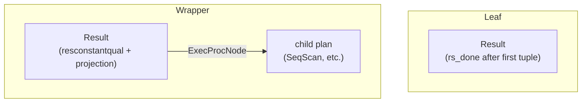

The Result node is the simplest executor node: it evaluates a projection and an optional qualification without reading from any heap. It appears either as a leaf — when a query has no FROM clause and everything in the target list is a constant expression — or as a wrapper above a child node to apply a projection or inject a qual that the child cannot handle directly.

## Two roles: leaf and wrapper

When there is no outer child plan, the Result node produces exactly one tuple and then stops. This covers `SELECT 1 * 2`, single-row `INSERT INTO t VALUES (...)` (where the executor needs a plan tree that generates the new row), and any query whose target list is entirely composed of constants or parameter references. The `rs_done` flag in `ResultState` enforces the one-tuple limit: the node sets it to `true` immediately after the first `ExecProject()` call when no outer plan is present. The next call then returns NULL.

When an outer child is present, the Result node behaves as a pass-through wrapper. On each call it pulls one tuple from the outer plan. It loads that tuple into the expression context as `ecxt_outertuple`, then calls `ExecProject()` to compute the output. This pattern arises when the planner needs to impose a projection that the child node cannot produce on its own, or when a constant qual (see below) needs to guard an otherwise normal scan.



## The one-time qual: resconstantqual

`resconstantqual` is a qual expression that contains no `Var` references — its value cannot change from one tuple to the next. Rather than re-evaluating it on every row, the Result node checks it exactly once, on the first invocation after each (re)scan. The `rs_checkqual` flag tracks whether the check is still pending.

If `resconstantqual` evaluates to false, the node sets `rs_done` and immediately returns NULL without ever touching its child plan. EXPLAIN labels this a "One-Time Filter." If it evaluates to true, the node clears `rs_checkqual`, and ordinary tuple processing continues.

The planner identifies Var-free qual clauses and moves them into `resconstantqual` when emitting a Result node. A query like `SELECT * FROM emp WHERE 2 > 1` becomes:

```
Result  (One-Time Filter: true)
  →  SeqScan on emp
```

and a query like `SELECT * FROM emp WHERE 2 > 3` short-circuits the entire SeqScan without reading a single page.

The same flag-reset logic runs in `ExecReScanResult()`, so a rescanned Result node re-evaluates the one-time qual at the start of the next scan rather than carrying a stale result from the previous one.

## Execution loop

Each call to the node's exec function proceeds in three steps:

1. **One-time qual check.** If `rs_checkqual` is set, evaluate `resconstantqual`. On failure set `rs_done` and return NULL. On success clear `rs_checkqual` and continue.
2. **Get the next input.** If there is an outer plan, pull a tuple via `ExecProcNode`. If the child returns NULL (or there is no child and `rs_done` is already true), return NULL. If there is no child plan, set `rs_done = true` so the next call terminates.
3. **Project.** Call `ExecProject()` on `ps_ProjInfo` to compute the output tuple from the expression context and return the resulting slot.

`ExecResult` resets the per-tuple [[subsystems/memory/contexts|memory context]] between steps 1 and 2 to reclaim storage from the previous projection cycle.

Because the Result node only ever has an outer child (never an inner), initialisation asserts that `innerPlan` is NULL. The node delegates mark/restore operations directly to the outer plan when one exists.

## Relationship to ProjectSet

When any expression in the target list is a set-returning function (SRF), the planner cannot use Result: a single input tuple may expand into many output tuples. The Result node's one-output-per-input-tuple contract would silently truncate the extra rows. The planner emits a [[subsystems/executor/overview|ProjectSet]] node instead, which drives the SRF expansion loop. Result and ProjectSet share the same conceptual role — applying a target-list projection without a join or aggregation — but ProjectSet carries the additional machinery for iterating through sets. The presence of any SRF in the target list is sufficient to force the switch from Result to ProjectSet.

## Initialisation and teardown

`ExecInitResult()` allocates a `ResultState` and initialises the child node (if any) via `ExecInitNode()`. It sets up the result tuple slot as a virtual slot (`TTSOpsVirtual`), then compiles both the regular qual list and `resconstantqual` with `ExecInitQual()`. `ExecInitResult()` sets the `rs_checkqual` flag to `true` only when `resconstantqual` is non-NULL. If there is no one-time qual, the exec function never enters the check block.

Teardown frees the expression context and clears the result slot. It then calls `ExecEndNode()` on the outer plan.

## See also

- [[subsystems/executor/overview|Executor overview]] — the Volcano model and how Result fits into the node taxonomy
- [[subsystems/executor/expression-eval|Expression evaluation]] — how `ExecProject` and `ExecInitQual` compile and evaluate expressions
