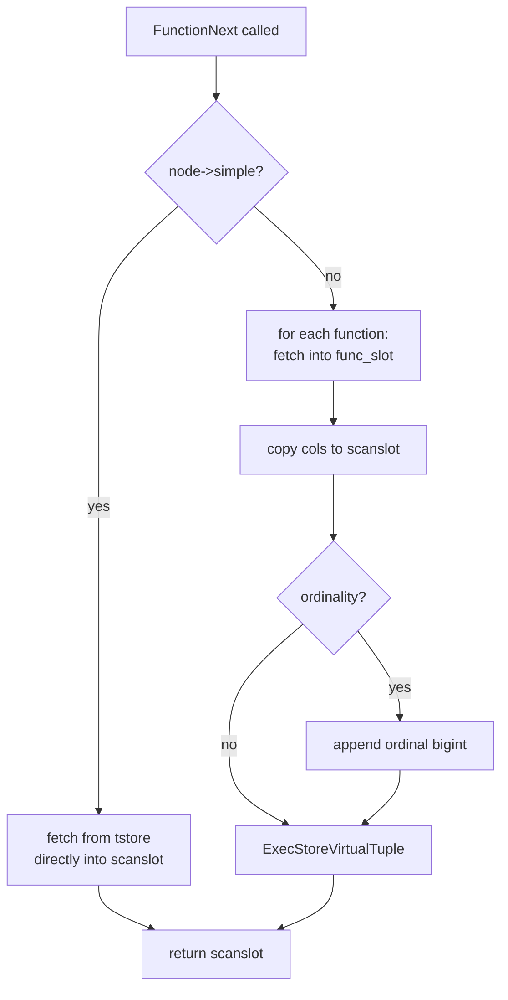

Set-returning functions (SRFs) are PostgreSQL functions declared with `RETURNS SETOF` or `RETURNS TABLE(...)` that can emit zero or more rows per invocation rather than a single scalar value. Because ordinary expression evaluation produces exactly one value per input tuple, SRFs require dedicated executor infrastructure to drive repeated calls and collect multiple output rows. The `ProjectSet` plan node handles SRFs that appear in a `SELECT` list. The `FunctionScan` plan node handles SRFs that appear in a `FROM` clause.

## The per-call invocation model

SRFs do not run to completion in a single call. The executor calls the underlying C function repeatedly, once per output row, until the function signals it is done. Each call shares the same `FunctionCallInfo` structure, so the function can maintain state across iterations. The `SetExprState.setArgsValid` flag tells the executor not to re-evaluate argument expressions on subsequent calls, since the argument values must remain stable for the entire series.

`ReturnSetInfo`, a struct passed via `fcinfo->resultinfo`, coordinates the protocol between caller and function. The function sets `ReturnSetInfo.isDone` to one of three `ExprDoneCond` values:

- `ExprSingleResult` — the function returned one value and is done.
- `ExprMultipleResult` — the function returned one value and has more to produce.
- `ExprEndResult` — the function has nothing more to return.

Functions that implement the **value-per-call** (`SFRM_ValuePerCall`) protocol return one datum per call and use `isDone` to communicate whether more rows follow. Functions that prefer to produce all rows at once use the **materialize** (`SFRM_Materialize`) protocol. They fill a `Tuplestorestate` attached to `ReturnSetInfo.setResult` on the first call and signal `ExprSingleResult`. The executor then drains that store row by row. The executor allocates the [[subsystems/executor/tuplestore|tuplestore]] used for materialized results in the per-query [[subsystems/memory/contexts|memory context]], bounded by [[subsystems/executor/work-mem-and-spill|work_mem]].

Built-ins like `generate_series()`, `unnest()`, and `json_array_elements()` all work through this mechanism. `generate_series()` maintains its current value and limit in per-call state inside the function and signals `ExprMultipleResult` on each call until the series is exhausted. `unnest()` and `json_array_elements()` typically use the materialize mode: they construct a tuplestore over the input array or JSON document on the first call and let the executor consume it.

## SetExprState: the per-SRF execution state

`SetExprState` is the execution-time counterpart of a `FuncExpr` or `OpExpr` node that returns a set. It holds:

- `func` — the resolved `FmgrInfo` for the target function.
- `fcinfo` — the `FunctionCallInfo` that persists across the call series, including the saved argument values.
- `funcReturnsSet` — whether the function is actually declared `SETOF`; the same struct is reused for single-row functions inside `ROWS FROM(...)`.
- `setArgsValid` — when true, the `fcinfo` already contains valid argument datums and argument expressions must not be re-evaluated.
- `funcResultStore` / `funcResultSlot` — for materialize-mode SRFs, the tuplestore being drained and the slot used to read rows from it.
- `funcResultDesc` — the expected `TupleDesc` for composite-returning functions, prepared at init time.
- `shutdown_reg` — whether a cleanup callback has been registered with the expression context to release the tuplestore or clear `setArgsValid` if the query is aborted before the SRF is exhausted.

## The ProjectSet node: SRFs in the SELECT list

When a `SELECT` list contains one or more SRFs, the planner inserts a `ProjectSet` node above the scan or join that supplies the input rows. The planner cannot use `ProjectSet` without an underlying plan node. In the simplest case — `SELECT generate_series(1, 10)` with no table — it wraps a `Result` node that produces a single dummy tuple, giving `ProjectSet` one input row to expand into many output rows.

`ProjectSetState` maintains a parallel array of expression states (`elems`) and per-element done flags (`elemdone`). SRF entries are `SetExprState` nodes. Non-SRF entries are ordinary `ExprState` nodes. On each call to `ExecProjectSet`, the node first checks `pending_srf_tuples`. If true, it continues extracting from the current input tuple by calling `ExecProjectSRF` with `continuing = true`. Once all SRFs report `ExprEndResult` for the current input tuple, it fetches the next input tuple from the outer plan and resets.

`ProjectSet` uses a separate `argcontext` [[subsystems/memory/contexts|memory context]] (distinct from the per-tuple context) to hold evaluated argument values across the entire call series for a single input tuple. The per-tuple context is reset between output rows, but arguments must survive until the SRF signals `ExprEndResult`.

## Multiple SRFs in the same SELECT list produce a zip

When two or more SRFs appear in the same `SELECT` list, PostgreSQL does **not** compute a cross-product. Instead, it advances all SRFs in lockstep. On each iteration, it calls every SRF once and emits the row with the current values. When a shorter SRF is exhausted before others, ProjectSet pads subsequent positions for that SRF with `NULL`. This zipper behavior is what allows patterns like:

```sql
SELECT unnest(ARRAY[1,2,3]), unnest(ARRAY['a','b','c']);
```

to produce three rows rather than nine. The implementation is in `ExecProjectSRF`: when `continuing` is true and an element's `elemdone` is already `ExprEndResult`, `ExecProjectSRF` sets the slot position to `NULL` rather than calling the SRF again.

## The FunctionScan node: SRFs in the FROM clause

The `FunctionScan` executor node (nodeFunctionscan.c) handles SRFs placed in the `FROM` clause — via `FROM func(...)` or `FROM ROWS FROM(...)`. Unlike `ProjectSet`, `FunctionScan` is a leaf node with no outer or inner child. It appears in the plan tree in the same position as a sequential scan.

`ExecInitFunctionScan` allocates one `FunctionScanPerFuncState` record per function in the list. Each record holds a `SetExprState` (initialized via `ExecInitTableFunctionResult`), a `TupleDesc` describing the function's result columns, a `colcount`, a `Tuplestorestate` pointer (initially `NULL`), and a `rowcount` for backward-scan bookkeeping. The tuplestore pointer being `NULL` is the sentinel that triggers actual function execution: on the first call to `FunctionNext`, the node invokes `ExecMakeTableFunctionResult` to run the function and collect all output into a tuplestore. It then rewinds the tuplestore to the start. Subsequent calls simply advance the tuplestore cursor. This means a FROM-clause SRF always runs to completion in one shot, regardless of whether the function internally uses value-per-call or materialize mode. The rest of the executor sees it as a plain store of already-materialized rows.

`ExecInitFunctionScan` creates a dedicated `argcontext` [[subsystems/memory/contexts|memory context]] for argument evaluation (nodeFunctionscan.c). It is separate from the per-tuple context, which is reset too frequently, and from the query-lifespan context, which would leak evaluation results for the duration of the query.

### Simple versus composite result paths

`ExecInitFunctionScan` distinguishes a **simple** case — exactly one function with no `WITH ORDINALITY` clause — from the general case. In the simple path, the function result tupdesc matches the scan output tupdesc directly, so `FunctionNext` fetches rows straight into the shared scan slot (`ss_ScanTupleSlot`) without any per-function intermediate slot or column copying. The general path allocates a separate `func_slot` (a minimal-tuple slot) per function and copies column values from each function's slot into the combined scan slot attribute-by-attribute (FunctionNext, nodeFunctionscan.c).



### ROWS FROM() and the zipper semantics

`ROWS FROM(f1(...), f2(...))` places multiple functions side by side, expanding them as parallel columns in a single scan. The node tracks one `FunctionScanPerFuncState` per function. On each call to `FunctionNext`, it advances every function's tuplestore by one position. When a shorter function is exhausted, the executor records its final `rowcount` (stored as one past the last valid ordinal so backward positioning works) and fills its output columns with `NULL` for remaining rows. The scan continues until every function's tuplestore is exhausted, matching the zip semantics that `ProjectSet` applies when multiple SRFs appear in a `SELECT` list.

The node tracks the ordinal counter (`node->ordinal`) even when `WITH ORDINALITY` is not requested. It needs this counter to detect when a short function should resume contributing `NULL` values during a backward scan. During a backward scan, if `fs->rowcount` is known and the previous position was beyond that function's last row, the executor skips the tuplestore read and clears the function slot rather than attempting a read past the store's end.

### Rescanning and parameter changes

`ExecReScanFunctionScan` resets the ordinal counter. It then either rewinds existing tuplestores or discards them, depending on whether any function's parameter set has changed (tracked via `chgParam` bitmapsets on the plan node). If a function's arguments reference a changed parameter — detected by `bms_overlap(chgParam, rtfunc->funcparams)` — `ExecReScanFunctionScan` drops its tuplestore and resets `rowcount` to `-1`, so the executor re-executes the function on the next fetch. `ExecReScanFunctionScan` simply rewinds functions whose arguments are unaffected via `tuplestore_rescan`, avoiding redundant re-execution.

### Tuple descriptor construction

At init time, `ExecInitFunctionScan` builds the scan `TupleDesc` from the component function descriptors. For the simple case it copies the single function's tupdesc and strips the rowtype label (setting `tdtypeid = RECORDOID`). For the general case it concatenates columns from each function's tupdesc in order, then appends a `bigint` column at the end if `WITH ORDINALITY` was specified. Column type resolution handles three cases: an explicit `coldeflist` in the range table function entry (used when the function returns `RECORD`), a named composite type resolved via `get_expr_result_type`, and a scalar base type for which a synthetic one-column tupdesc is created.

## Architectural contrast: FunctionScan versus ProjectSet

The two nodes solve different problems. `ProjectSet` is a **one-to-many amplifier**: it takes each row from its outer plan and fans it out into multiple output rows by repeatedly evaluating SRF expressions. It operates row-by-row and drives the SRF through the `ExprDoneCond` protocol directly. `FunctionScan` is a **leaf data source**: it materializes function output once into a tuplestore and then presents that store as a scannable relation. The key consequence is that a FROM-clause SRF is always fully materialized before the parent node receives any rows. A SELECT-list SRF, by contrast, produces rows incrementally as the outer plan supplies input tuples.

This also means a FROM-clause function that produces a very large result set will always spill to disk via the tuplestore's work_mem limit. A SELECT-list SRF in value-per-call mode, by contrast, holds only one row in memory at a time. Choosing between `SELECT func()` and `FROM func()` is therefore not merely syntactic. It has memory and performance implications for large result sets.

## Related Topics

- [[subsystems/executor/tuplestore|Tuplestore]]
- [[subsystems/executor/expression-eval|Expression Evaluation]]
- [[subsystems/executor/sql-language-functions|SQL Language Functions]]
- [[subsystems/executor/work-mem-and-spill|work_mem and spill-to-disk]]
- [[subsystems/memory/contexts|Memory Contexts]]
