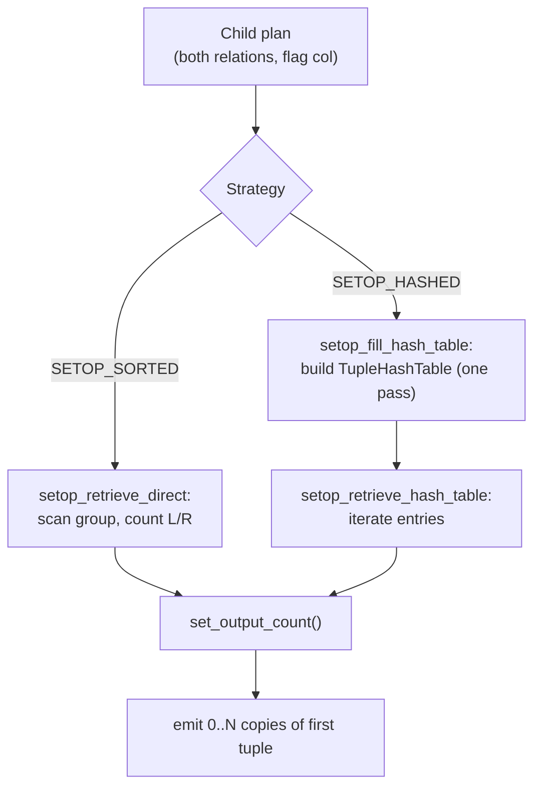

The SetOp executor node implements `INTERSECT`, `INTERSECT ALL`, `EXCEPT`, and `EXCEPT ALL`. For each distinct tuple group, it counts how many copies came from each input relation, then emits the number of output copies prescribed by the SQL standard. The planner does not use it for `UNION` or `UNION ALL`. Those need no such counting. `Append` handles them more cheaply. The node supports two execution strategies — sorted and hashed — mirroring the same sort/hash duality found in aggregation and duplicate elimination.

## The Junk Flag Column

The planner feeds both input relations through a single child plan node, interleaved into one stream. To let the SetOp node tell the two apart, the planner injects a *junk* integer attribute — the flag column — alongside the real columns. Its value is `0` for tuples from the left relation and `1` for tuples from the right. `fetch_tuple_flag()` reads this attribute by position (`node->flagColIdx`) on every incoming tuple. SetOp never copies the flag to the output. It performs no projection, so it emits the raw non-junk portion of the first-arriving tuple in the group.

For `EXCEPT` the planner guarantees the left relation is delivered first (flag 0). For `INTERSECT` it tries to deliver the smaller relation first to minimise hash-table size in hashed mode (`firstFlag` on the plan node records which flag value leads).

## Output Count Semantics

Once a group's `numLeft` and `numRight` counts are known, `set_output_count()` applies the four SQL rules:

| Command | Rule |
|---|---|
| `INTERSECT` | 1 copy if both sides have at least one; otherwise 0 |
| `INTERSECT ALL` | `min(numLeft, numRight)` copies |
| `EXCEPT` | 1 copy if left has at least one and right has none; otherwise 0 |
| `EXCEPT ALL` | `max(0, numLeft − numRight)` copies |

`set_output_count()` stores the result in `setopstate->numOutput`. The main dispatch function `ExecSetOp()` decrements the count and re-returns the same `resultTupleSlot` pointer for each additional copy, without re-fetching from the child plan. This is why the output tuple is always the first tuple seen for that group.

## Sorted Strategy

In `SETOP_SORTED` mode the child plan has already sorted its output on all non-junk columns, so identical tuples from both sides arrive consecutively. `setop_retrieve_direct()` processes one group per call:

1. If no first-tuple is buffered, fetch one from the outer plan and materialize it as a heap tuple copy (`grp_firstTuple`). This copy survives across calls.
2. Load the copy into `resultTupleSlot` and initialize a single `SetOpStatePerGroupData` (allocated once at init time in `setopstate->pergroup`).
3. Scan forward, counting each tuple with `advance_counts()`, until either the outer plan is exhausted or `ExecQualAndReset()` detects a group boundary by comparing the current tuple against `resultTupleSlot` using the precompiled equality expression (`setopstate->eqfunction`). This step saves the first tuple of the next group back to `grp_firstTuple`.
4. Call `set_output_count()` and, if `numOutput > 0`, return `resultTupleSlot`.

The slot type is `TTSOpsHeapTuple` in sorted mode because `ExecCopySlotHeapTuple()` produces a heap tuple. The node does not call `heap_freetuple()` explicitly. Instead it relies on `ExecStoreHeapTuple(..., true)`, which registers the tuple for deletion when the slot is cleared.

## Hashed Strategy

`SETOP_HASHED` mode trades the sort requirement for an in-memory hash table built during a mandatory first pass over all input. This two-phase structure means the node is not purely pull-based during the build: the first call to `ExecSetOp()` when `!table_filled` blocks until `setop_fill_hash_table()` has consumed the entire outer plan.

**Build phase.** `setop_fill_hash_table()` iterates through every tuple. For tuples belonging to the first relation (flag == `firstFlag`), it looks up or creates a `TupleHashEntryData` in the hash table and increments the appropriate counter in the `SetOpStatePerGroupData` attached as `entry->additional`. For tuples from the second relation it only looks up existing entries and increments their counters. The build phase never creates entries for second-relation tuples, because a value that appears only on the right can never contribute to the output. This asymmetry avoids inserting entries that will deterministically produce zero output rows.

**Probe phase.** `setop_retrieve_hash_table()` iterates through the hash table with `ScanTupleHashTable()`, calling `set_output_count()` for each entry and returning the entry's `firstTuple` (a `MinimalTuple`) when `numOutput > 0`. The slot type is `TTSOpsMinimalTuple` in hashed mode.

The build phase constructs the hash table with `BuildTupleHashTableExt()`, using equality function OIDs (`eqfuncoids`) and hash functions (`hashfunctions`) precomputed from the plan node's `dupOperators` array. A dedicated [[subsystems/memory/contexts|memory context]] (`setopstate->tableContext`) holds the hash table so it can be cleanly destroyed and rebuilt by `ExecReScanSetOp()` without leaking memory.

## Memory and Rescan

The hash table lives in `tableContext`, a child of `CurrentMemoryContext` created at init time (`ExecInitSetOp()`, `nodeSetOp.c`). On rescan, if the outer plan's parameters have not changed (`outerPlan->chgParam == NULL`), the hashed path simply resets the iterator and re-scans the existing table without rebuilding it. If parameters have changed, `MemoryContextResetAndDeleteChildren()` wipes the context. The next build phase then allocates a fresh hash table. This is the same pattern used by the [[subsystems/executor/hash-join-spill|hash join]] node to manage its batch context.

The sorted path has no analogous memory context. Its only cross-call allocation is the `grp_firstTuple` heap tuple. `ExecReScanSetOp()` frees this tuple with `heap_freetuple()` at rescan time if it has been saved.

Neither strategy does qual checking or projection (`ps_ProjInfo` is `NULL`). The node also rejects `EXEC_FLAG_BACKWARD` and `EXEC_FLAG_MARK` at init time — it is a forward-only, non-markable node.

## Key Data Structures

| Symbol | Purpose |
|---|---|
| `SetOpStatePerGroupData` | Per-group counters: `numLeft` and `numRight` (both `long`) |
| `SetOpState.pergroup` | Pointer to a single `SetOpStatePerGroupData` in sorted mode |
| `SetOpState.grp_firstTuple` | Buffered first tuple of the current/next group (sorted mode) |
| `SetOpState.hashtable` | `TupleHashTable`; non-NULL only in hashed mode |
| `SetOpState.tableContext` | Memory context owning the hash table; deleted in `ExecEndSetOp` |
| `SetOpState.numOutput` | Remaining copies of current group to emit |
| `SetOpState.table_filled` | Guards the single build-phase call in hashed mode |
| `SetOp.flagColIdx` | Attribute number of the junk flag column in the child's output |
| `SetOp.firstFlag` | Expected flag value of the first-arriving relation (0 or 1) |
| `SetOp.dupColIdx` / `dupOperators` | Column positions and equality operators for grouping |

## Related Topics

- [[subsystems/executor/overview|Executor overview]] — the Volcano pull model and PlanState lifecycle
- [[subsystems/executor/hash-join-spill|Hash join spill]] — similar TupleHashTable usage and memory management patterns
- [[subsystems/executor/work-mem-and-spill|work_mem]] — governs hash table sizing for the hashed strategy
