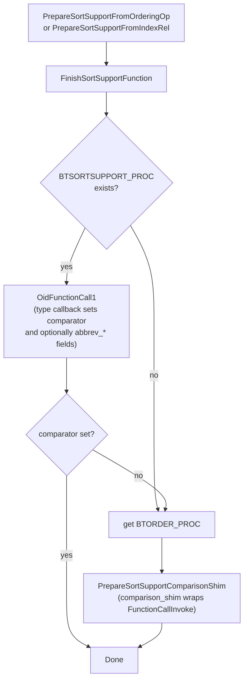

The SortSupport interface lets data types register accelerated comparison routines that bypass the generic `FunctionCallInvoke` overhead, dramatically reducing the per-comparison cost in sorts and sort-keyed operations. The traditional path calls the B-tree `BTORDER_PROC` through the full fmgr machinery on every pair of values. A type that provides a `BTSORTSUPPORT_PROC` amproc entry can instead install a C function pointer directly into the `SortSupportData` struct, eliminating multiple layers of dispatch. Types may additionally supply an *abbreviated key* scheme that compresses values into a single pointer-sized `Datum`. This lets the hot comparison path operate on native integers rather than heap-allocated data.

## The SortSupportData Struct

`SortSupportData` (sortsupport.h) is the central control block. Callers zero-fill it, populate a few required fields, then call one of the `PrepareSortSupport*` functions. These functions invoke the type's `BTSORTSUPPORT_PROC` callback if one exists, or fall back to a shim.

| Field | Direction | Purpose |
|---|---|---|
| `ssup_cxt` | caller fills | [[subsystems/memory/contexts|Memory context]] for allocations that must survive the sort |
| `ssup_collation` | caller fills | Collation OID; available to the callback for locale-sensitive setup |
| `ssup_reverse` | set by Prepare* | True for descending sorts; `ApplySortComparator` applies `INVERT_COMPARE_RESULT` |
| `ssup_nulls_first` | caller fills | NULL ordering; handled entirely inside `ApplySortComparator` |
| `ssup_attno` | caller fills | Column number being sorted; used by callers, not the callback |
| `ssup_extra` | callback | Opaque pointer for per-type private state, allocated in `ssup_cxt` |
| `comparator` | callback | Primary comparison function pointer; either the abbreviated or authoritative comparator |
| `abbreviate` | caller fills | Hint to the callback that abbreviated keys are desired (typically only for the leading sort key) |
| `abbrev_converter` | callback | Converts an original `Datum` to its abbreviated form |
| `abbrev_abort` | callback | Cost-model probe; returns true if abbreviation should be abandoned |
| `abbrev_full_comparator` | callback | Authoritative comparator used when abbreviated comparison is inconclusive |

The `comparator` field is the only function pointer that is mandatory. If a type's `BTSORTSUPPORT_PROC` does not set it, `FinishSortSupportFunction()` (sortsupport.c) falls back to `PrepareSortSupportComparisonShim()`. This wraps the traditional `BTORDER_PROC` in a thin `comparison_shim` that calls `FunctionCallInvoke` via a pre-initialized `FunctionCallInfoBaseData`.

## Abbreviated Keys

The abbreviated key optimisation is the most impactful part of the interface. The idea is that many types—particularly variable-length ones such as `text`—require a heap fetch and locale-aware comparison on every call. Abbreviated keys avoid this for the majority of comparisons by packing a representative prefix of the value into a pointer-sized `Datum`.

The rules are strict:

1. **Order-consistency**: if `abbrev(a) < abbrev(b)` then `full(a) < full(b)` must hold. The sort treats a non-zero result from the abbreviated comparator as definitive.
2. **Tie semantics differ from full equality**: when the abbreviated comparator returns zero, that means only "I cannot determine the order from the prefix alone". The sort then calls `ApplySortAbbrevFullComparator()` to resolve the tie using `abbrev_full_comparator`.
3. **Pass-by-value**: the abbreviated `Datum` must fit in a machine word; no pointer chasing in the hot path.

For `text`, the callback derives the abbreviated key from `strxfrm` output or ICU collation keys, truncated to fit a `Datum`. For fixed-width numeric types (int2, int4, int8, float4, float8), the callback uses the value itself or a sign-magnitude-flipped variant directly. No abbreviation is needed in the traditional sense — the `comparator` is simply a fast C comparison. For `timestamp`, `timestamptz`, and `date`, the underlying `int64`/`int32` representation maps directly. For `uuid`, `macaddr`, and `inet`, the callback packs the leading bytes of the binary representation.

Core code (tuplesort.c) tests the `abbrev_converter` callback as the boolean indicator that abbreviation is active. A NULL pointer means abbreviation is off.

## The Abort Mechanism

Abbreviated keys are only a win when the abbreviated comparison is usually decisive. If the input has many duplicate values (high collision rate among abbreviated keys), every abbreviated comparison returns zero. The sort must then follow it with a full comparison, paying both costs instead of one. The `abbrev_abort` callback exists to detect this.

[[subsystems/executor/sort|tuplesort.c]] calls `abbrev_abort` periodically with the current tuple count. The callback inspects its private statistics (stored in `ssup_extra`) and returns `true` if the collision rate exceeds a threshold. When this happens, core code sets `comparator` back to `abbrev_full_comparator` and sets `abbrev_converter` to NULL. The remainder of the sort then proceeds without abbreviated keys. This dynamic abort prevents the pathological case—sorting a column of identical strings—from being slower than the non-abbreviated path.

## Initialisation Paths

The planner uses `PrepareSortSupportFromOrderingOp()` when an ordering operator drives the sort (the common query-sort path). It resolves the operator to an opfamily and sets `ssup_reverse` based on whether the strategy is `BTGreaterStrategyNumber`. `PrepareSortSupportFromIndexRel()` is the equivalent entry point for index builds. `PrepareSortSupportFromGistIndexRel()` handles GiST sorts, which use `GIST_SORTSUPPORT_PROC` and do not fall back to a shim.

## Consumer Sites

SortSupport is the comparison substrate for all high-performance sorting in PostgreSQL:

- **tuplesort.c** — the engine behind `ORDER BY`, `DISTINCT`, `CREATE INDEX`, and external sorts. It calls `PrepareSortSupportFromOrderingOp` for each sort key and drives `abbrev_converter` during the load phase. It periodically calls `abbrev_abort`.
- **nodeIncrementalSort.c** — [[subsystems/executor/incremental-sort|Incremental sort]] uses SortSupport to compare the prefix keys that define group boundaries.
- **B-tree index builds** — `PrepareSortSupportFromIndexRel` is called once per key column before the sort phase of index construction.
- **BRIN index builds** — use SortSupport for the internal sort of block summaries.

Types that do not register a `BTSORTSUPPORT_PROC` fall back transparently to the `comparison_shim`. This means any type with a valid B-tree opclass can participate, just without the performance benefits.

## Related Topics

- [[subsystems/executor/sort]]
- [[subsystems/executor/incremental-sort]]
- [[subsystems/memory/contexts]]
- [[subsystems/executor/work-mem-and-spill]]
