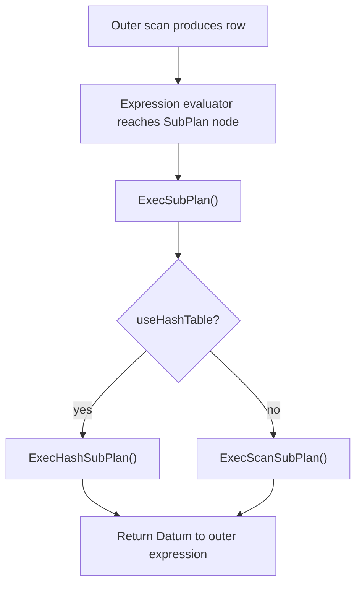
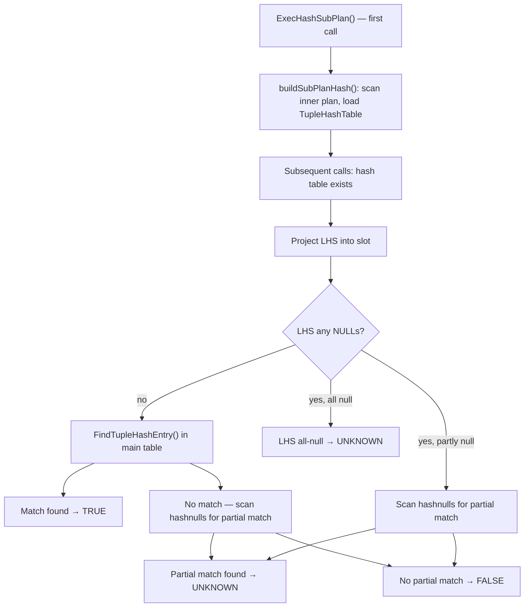

Subqueries that appear inside expressions — `WHERE x = (SELECT ...)`, `WHERE EXISTS (SELECT ...)`, `WHERE x = ANY (SELECT ...)` — are not executed as joins. The planner represents them as either an **InitPlan** (evaluated once per query execution, result cached) or a **SubPlan** (re-evaluated for every outer row). The split between the two is the difference between a constant-time lookup and an O(N) nested loop hidden inside an expression.

## SubLink to SubPlan: the planner's classification

The parser emits `SubLink` nodes wherever a subquery appears in an expression. These are converted to `SubPlan` nodes during `SS_process_sublinks()` in `subselect.c`. The actual classification — InitPlan or SubPlan — happens inside `build_subplan()`. This function examines the `plan_params` list that `subquery_planner()` accumulates while planning the inner query. Any column of the outer query referenced inside the subquery ends up in `plan_params` as a `PlannerParamItem`. If `plan_params` is empty after planning, the subquery is uncorrelated and eligible to become an InitPlan for most `SubLinkType` values.

The `SubLinkType` enum covers every SQL syntax form that generates a subquery expression:

| `SubLinkType`        | SQL form                         | Can be InitPlan | Hash possible |
|----------------------|----------------------------------|-----------------|---------------|
| `EXISTS_SUBLINK`     | `EXISTS (SELECT ...)`            | yes             | indirect      |
| `EXPR_SUBLINK`       | `(SELECT scalar ...)`            | yes             | no            |
| `ARRAY_SUBLINK`      | `ARRAY(SELECT ...)`              | yes             | no            |
| `ROWCOMPARE_SUBLINK` | `(a, b) = (SELECT a, b ...)`     | yes             | no            |
| `MULTIEXPR_SUBLINK`  | row-constructor target in UPDATE | sometimes       | no            |
| `ANY_SUBLINK`        | `x = ANY (SELECT ...)`           | no              | yes           |
| `ALL_SUBLINK`        | `x > ALL (SELECT ...)`           | no              | no            |
| `CTE_SUBLINK`        | `WITH` query (internal)          | —               | —             |

`ANY_SUBLINK` and `ALL_SUBLINK` cannot become InitPlans even when uncorrelated, because their semantics require scanning the subplan output once per outer row to apply the combining operator. They remain as SubPlan nodes, though uncorrelated `ANY` can still benefit from hashing.

The `SubPlan` struct (`primnodes.h`) carries all state needed by both paths:

| Field          | Purpose |
|----------------|---------|
| `subLinkType`  | Which SQL form this subplan implements |
| `testexpr`     | Combining operator tree for `ANY`/`ALL`/`ROWCOMPARE`; NULL for InitPlans |
| `paramIds`     | `PARAM_EXEC` IDs embedded in `testexpr`, one per subquery output column |
| `setParam`     | For InitPlans: IDs of `PARAM_EXEC` params where results are stored |
| `parParam`     | For SubPlans: IDs of `PARAM_EXEC` params carrying outer correlation values |
| `args`         | Expressions evaluated in outer context to populate `parParam` |
| `useHashTable` | Whether to use the hashed ANY path |
| `unknownEqFalse` | Whether SQL UNKNOWN can be returned as FALSE (suppresses null tracking) |
| `plan_id`      | 1-based index into `PlannedStmt.subplans` |

## Uncorrelated subplans: evaluate once

When a subquery qualifies as an InitPlan, the planner removes the `SubPlan` node from the expression tree. It replaces the node with a `Param` node (`paramkind = PARAM_EXEC`). The `SubPlan` itself goes onto the parent plan node's `initPlan` list. `SubPlan.setParam` records which `PARAM_EXEC` IDs the initplan will produce. `SubPlan.parParam` is empty.

Evaluation is lazy. During `ExecInitSubPlan()`, for each ID in `setParam`, the executor sets `prm->execPlan = sstate` in the `EState.es_param_exec_vals` array. When the expression evaluator first encounters the `PARAM_EXEC` Param, `ExecEvalParamExec()` finds `execPlan` non-null. It then calls `ExecSetParamPlan()` to run the subplan. After that single execution, `ExecSetParamPlan()` clears `execPlan` to NULL. The value then lives in `prm->value` for the rest of the query.

```c
/* execExprInterp.c */
void
ExecEvalParamExec(ExprState *state, ExprEvalStep *op, ExprContext *econtext)
{
    ParamExecData *prm = &(econtext->ecxt_param_exec_vals[op->d.param.paramid]);
    if (unlikely(prm->execPlan != NULL))
    {
        ExecSetParamPlan(prm->execPlan, econtext);
        Assert(prm->execPlan == NULL);
    }
    *op->resvalue = prm->value;
    *op->resnull = prm->isnull;
}
```

`ExecSetParamPlan()` (`nodeSubplan.c`) runs the subplan to completion. It writes output values into `ecxt_param_exec_vals`. For `EXISTS` the result is a boolean. For `EXPR` it is a scalar (error if more than one row). For `ARRAY`, `ExecSetParamPlan()` collects all rows. It assembles them into a PostgreSQL array datum. For `ROWCOMPARE`, it writes multiple params, one per column. `ExecSetParamPlan()` allocates the results in `ecxt_per_query_memory`. As a result, they persist for the lifetime of the query.

An InitPlan is never executed if it is never referenced. This can happen when it sits behind a short-circuit `OR`. The `OR` can be satisfied before evaluation reaches the param.

## SubPlan: correlated subqueries re-evaluated per outer row

A regular SubPlan node stays inline in the expression tree. Every time the parent plan node evaluates the expression containing it, the executor calls `ExecSubPlan()`:



`ExecScanSubPlan()` begins each outer-row invocation by pushing correlation values into the shared `PARAM_EXEC` array. It walks the `SubPlan.parParam` and `SubPlan.args` lists in parallel. It evaluates each expression in `args` against the outer `ExprContext`. It writes each result into `ecxt_param_exec_vals[parParam[i]]`. Each write also adds the param ID to `planstate->chgParam`.

```c
/* nodeSubplan.c — correlation setup */
forboth(l, subplan->parParam, pvar, node->args)
{
    int           paramid = lfirst_int(l);
    ParamExecData *prm = &(econtext->ecxt_param_exec_vals[paramid]);

    prm->value = ExecEvalExprSwitchContext((ExprState *) lfirst(pvar),
                                           econtext, &(prm->isnull));
    planstate->chgParam = bms_add_member(planstate->chgParam, paramid);
}
ExecReScan(planstate);
```

`ExecReScan()` propagates the `chgParam` flag down the subplan tree. This forces each scan node that depends on those parameters to rewind its position. The inner plan then executes from scratch with the new correlation values.

The scan loop applies different combining logic depending on `subLinkType`:
- `EXISTS`: returns `true` on the first row, skips the rest.
- `EXPR`: copies the first tuple, continues scanning to verify no second row exists (cardinality violation).
- `ARRAY`: accumulates all first-column values using `ArrayBuildStateAny`.
- `ANY`: evaluates `testexpr` per row, short-circuits on first `true`, accumulates `UNKNOWN` from NULLs.
- `ALL`: evaluates `testexpr` per row, short-circuits on first `false`, accumulates `UNKNOWN` from NULLs.
- `ROWCOMPARE`: copies the first tuple, errors on a second.

The outer-column values referenced by the subquery's `WHERE` clause become Var nodes pointing at `PARAM_EXEC` params inside the inner plan. Because both the outer `ExprContext` and the inner `ExprContext` reference the same `EState.es_param_exec_vals` array, a write in the outer context is immediately visible to the inner plan. The inner plan sees it as soon as it evaluates its expressions.

## The hashed ANY subplan

For `x = ANY (SELECT col FROM t)` when the subquery is uncorrelated and estimated to fit in memory, the planner sets `SubPlan.useHashTable = true`. This materializes the subquery result into a `TupleHashTable` on the first call. It then answers subsequent outer-row probes in O(1).

`build_subplan()` enables hashing when all conditions hold:
1. `subLinkType == ANY_SUBLINK`
2. `parParam == NIL` (uncorrelated)
3. The combining operator supports hashing (`testexpr_is_hashable()`)
4. The estimated result size fits: `plan_rows * (MAXALIGN(plan_width) + MAXALIGN(SizeofHeapTupleHeader)) <= get_hash_memory_limit()`

`get_hash_memory_limit()` returns `work_mem * hash_mem_multiplier` (the multiplier, added in PostgreSQL 13, defaults to 2.0). The size formula uses heap tuple header overhead as a fudge factor for hash table bookkeeping. As a result, the effective threshold is somewhat below the raw `work_mem` ceiling.

At execution time `buildSubPlanHash()` scans the inner plan once, inserting each row into `node->hashtable` (fully non-null rows) or `node->hashnulls` (rows containing any null). The engine needs the null-tracking table for correct three-valued logic. `x = ANY (SELECT ...)` must return UNKNOWN, not FALSE, when an unmatched NULL is present in the subquery output. Setting `unknownEqFalse = true` suppresses `hashnulls` entirely. The planner sets this flag for `NOT IN` contexts, where UNKNOWN can safely be FALSE.

For each outer row, `ExecHashSubPlan()` projects the LHS expression into a tuple slot. It then calls `FindTupleHashEntry()`. The probe logic:

- LHS all non-null, hash match → TRUE
- LHS all non-null, no match, `havenullrows` true, `findPartialMatch()` succeeds → UNKNOWN
- LHS all non-null, no match otherwise → FALSE
- LHS all null → UNKNOWN
- LHS partly null → scan `hashnulls` for partial match; found → UNKNOWN, not found → FALSE

`findPartialMatch()` cannot use the hash key for a null-containing LHS because null hashes are not meaningful for equality. It performs a full scan of the `hashnulls` table, testing each entry with `execTuplesUnequal()`. This function skips null columns rather than treating them as non-equal. The engine expects this scan to be rare and over a small table.



The hash table persists in `node->hashtablecxt` across outer rows. The engine rebuilds it only when `planstate->chgParam` is non-null. For a truly uncorrelated hashed subplan, this never happens. As a result, the single build amortizes over all outer rows.

## AlternativeSubPlan: deferred choice between scan and hash

For correlated `EXISTS` subqueries that can be restructured as `= ANY`, the planner does not know at plan time whether hashing will pay off. It depends on how many times the outer query will invoke the subplan. `make_subplan()` calls `convert_EXISTS_to_ANY()` to attempt the restructuring. It then generates both a plain-scan SubPlan and a hashed ANY SubPlan, wrapping them in an `AlternativeSubPlan` node.

`setrefs.c` resolves the `AlternativeSubPlan` before the plan reaches the executor, in `fix_alternative_subplan()`. It computes `startup_cost + num_exec * per_call_cost` for each candidate, where `num_exec` comes from the estimated outer row count at the expression's location. It then picks the cheaper option. By execution time, `AlternativeSubPlan` nodes no longer exist in the plan tree.

## Invalidating cached subplan results

An InitPlan result normally lives for the full query. But an InitPlan can appear inside a rescannable context — for example, inside a subquery that a NestLoop or Gather node loops over. In that case, the cached value must be invalidated when the outer loop restarts. `ExecReScanSetParamPlan()` handles this by writing `prm->execPlan = node` back into each output-parameter slot. This re-arms the lazy-evaluation trigger for the next access.

This function differs from the SubPlan rescan path. An InitPlan has `parParam == NIL` and `setParam != NIL`. The function asserts `parParam == NIL` at the top. As a result, it would error on a correlated SubPlan. The `chgParam` mechanism correctly rescans a correlated SubPlan instead.

## EXPLAIN output

`EXPLAIN` shows InitPlans and SubPlans indented under the plan node whose expression references them. The label comes from `SubPlan.plan_name`. `build_subplan()` assigns it as `"InitPlan N"` or `"SubPlan N"`, where N is the 1-based `plan_id`. InitPlans append `(returns $M, ...)` to show which `PARAM_EXEC` IDs they produce:

```sql
-- Uncorrelated scalar subquery → InitPlan
EXPLAIN
SELECT * FROM orders
WHERE customer_id = (SELECT id FROM customers WHERE name = 'ACME');

--  Seq Scan on orders
--    Filter: (customer_id = $0)
--    InitPlan 1 (returns $0)
--      ->  Seq Scan on customers
--            Filter: ((name)::text = 'ACME'::text)
```

```sql
-- Correlated subquery → SubPlan, re-run per outer row
EXPLAIN
SELECT * FROM employees e
WHERE salary > (SELECT avg(salary) FROM employees
                WHERE department_id = e.department_id);

--  Seq Scan on employees e
--    Filter: (salary > (SubPlan 1))
--    SubPlan 1
--      ->  Aggregate
--            ->  Seq Scan on employees
--                  Filter: (department_id = e.department_id)
```

In `EXPLAIN ANALYZE`, the actual execution count for any node inside a SubPlan appears as `(actual ... loops=N)`. N equals the number of outer rows for which the executor evaluated the expression. A large `loops` count on an aggregate node is the signature of a correlated subplan executing O(N) times.

## Performance implications and alternatives

A correlated SubPlan with an aggregate over a large table executes that aggregate once per outer row. With N outer rows and M inner rows, the cost is O(N × M). The planner cannot convert such a subplan to a join if the subquery contains aggregates, set operations, `LIMIT`, `FOR UPDATE`, window functions, or volatile functions.

When the subquery is a simple lookup (no aggregates, just a filter on an indexed column), the per-execution cost drops to O(log M + k), making O(N log M) total often acceptable. Check `EXPLAIN ANALYZE` to confirm that the inner scan is using an index and that the loop count is not unexpectedly large.

The planner attempts two rewrites before creating a SubPlan node:

**Join promotion** (`convert_ANY_sublink_to_join()`, `convert_EXISTS_sublink_to_join()` in `prepjointree.c`): Rewrites `= ANY (SELECT ...)` as a semijoin or `EXISTS (SELECT ...)` as a semijoin. The planner lifts the subquery into the range table. Its WHERE clause becomes a join condition. The planner then considers hash join, merge join, and nested-loop strategies as it would for any other join. This fires when the subquery has no aggregates, no `DISTINCT ON`, no `LIMIT`, and its WHERE clause references the outer query. That reference gives the join something to join on.

**EXISTS-to-ANY restructuring** (`convert_EXISTS_to_ANY()` in `subselect.c`): Applies after join promotion fails. Produces an `AlternativeSubPlan` giving the cost model a chance to choose the hashed path at finalization time.

When neither rewrite applies and the correlated SubPlan is unavoidable, the common workaround is to express the intent as a `LATERAL` subquery in `FROM`. A `LATERAL` subquery becomes a proper join node that the planner can combine with the outer scan using any join strategy:

```sql
-- Correlated SubPlan (may be O(N×M))
SELECT e.name, e.salary
FROM employees e
WHERE e.salary > (SELECT avg(salary) FROM employees
                  WHERE department_id = e.department_id);

-- Equivalent with LATERAL (becomes a join, optimizer has more choices)
SELECT e.name, e.salary
FROM employees e
JOIN LATERAL (SELECT avg(salary) AS avg_sal
              FROM employees
              WHERE department_id = e.department_id) d
  ON e.salary > d.avg_sal;
```

The `LATERAL` form does not guarantee better performance in all cases. If the optimizer cannot find a smarter strategy, it still evaluates the inner aggregation per outer row. But the `LATERAL` form exposes the structure to the planner as a join. This enables parallelism, index-nested-loop rewrites, and other transformations that are unavailable when the subquery is buried inside an expression.

## Related Topics

- [[subsystems/executor/overview|Executor Overview]] — covers how plan nodes are initialized and executed, the context in which SubPlan and InitPlan nodes run.
- [[subsystems/executor/query-parameters|Query Parameters]] — explains `PARAM_EXEC` and `PARAM_EXTERN` parameter kinds, the `ParamExecData` array, and how correlation values flow between plan levels.
- [[subsystems/planner/subqueries|Subqueries]] — planner-side treatment of subquery flattening, semijoin conversion, and the conditions under which SubLinks become SubPlans or joins.
- [[subsystems/planner/lateral-joins|Lateral Joins]] — how `LATERAL` subqueries avoid the SubPlan path and are exposed as proper join nodes with richer optimization opportunities.
- [[subsystems/planner/ctes|CTEs]] — covers `CTE_SUBLINK` and how `WITH` queries interact with the SubPlan machinery vs. inlined CTEs.
- [[subsystems/executor/tuple-hash-table|Tuple Hash Table]] — internals of `TupleHashTable`, the structure used by the hashed `ANY` subplan path.
- [[code-paths/explain|EXPLAIN]] — how InitPlan and SubPlan nodes appear in `EXPLAIN` and `EXPLAIN ANALYZE` output, including loop counts and parameter references.
