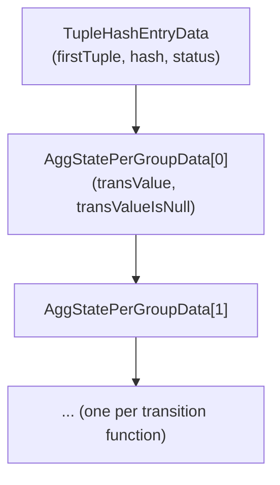

`TupleHashTable` is a shared executor utility for mapping a group key — defined as a subset of tuple columns — to an arbitrary per-group payload. Hash aggregation (`Agg`), set operations (`SetOp` for `INTERSECT`/`EXCEPT`), `RecursiveUnion` (for duplicate elimination in `UNION`), and hashed subplan nodes (`nodeSubplan.c`) all consume it, rather than each embedding its own copy in one plan node. The abstraction separates key management, hashing, and memory ownership from the callers. Callers only need to define which columns form the key and what payload data each group needs.

## Key structure

`TupleHashTableData` (`execnodes.h`) holds the underlying open-addressing table (`tuplehash_hash *hashtab`), the column list and hash/equality functions for the key, and three [[subsystems/memory/contexts|memory contexts]] with distinct lifetimes. `TupleHashEntryData` is the element type stored in that table:

```c
typedef struct TupleHashEntryData
{
    MinimalTuple firstTuple;   /* copy of first tuple in this group */
    void        *additional;   /* user data */
    uint32       status;       /* hash status (used by simplehash.h) */
    uint32       hash;         /* cached hash value */
} TupleHashEntryData;
```

`firstTuple` is the canonical representative for the group — a `MinimalTuple` copy of the first input row seen for that key. `additional` is an opaque pointer through which callers attach their per-group payload. The Agg node instead uses a contiguous-allocation approach described below. The `hash` field caches the computed hash so that the open-addressing implementation can compare hashes before calling the more expensive equality expression.

## MinimalTuple as the stored key

The table stores keys as `MinimalTuple` rather than full heap tuples. A `MinimalTupleData` omits all heap system columns (transaction ids, OID, `ctid`, and the `HeapTupleHeaderData` fields that precede `t_infomask2`). It preserves the null bitmap and attribute data in exactly the same layout as a heap tuple from `t_infomask2` onwards. This makes the in-memory representation smaller and cheaper to copy (`ExecCopySlotMinimalTuple`). It still allows the same attribute access machinery to decode it. Because system columns are never part of a grouping key, nothing is lost.

## Memory ownership and reset

`BuildTupleHashTableExt` accepts three memory context parameters with different roles:

- `metacxt` — holds the `TupleHashTableData` header itself and the compiled comparison expression. This context is typically long-lived and is not reset between batches.
- `tablecxt` — holds all `TupleHashEntryData` objects and the `MinimalTuple` copies they reference. Callers reset this context to discard the entire table contents cheaply, without walking individual entries.
- `tempcxt` — a short-lived scratch context used for hash function and equality function evaluation. The caller is responsible for resetting it, typically once per input tuple.

`ResetTupleHashTable` calls `tuplehash_reset` on the underlying open-addressing array, logically emptying the table. For a clean reset the caller must also reset `tablecxt`. Otherwise, the `MinimalTuple` copies allocated there accumulate as leaked memory. The `Ext` in `BuildTupleHashTableExt` signals that `metacxt` and `tablecxt` are supplied separately. The older `BuildTupleHashTable` wrapper passes the same context for both. This is correct for single-use tables, but it prevents leak-free reset.

## Hashing multi-column keys

Each key column contributes via its type's hash operator, looked up from the equality operator's operator class by `execTuplesHashPrepare`. For each column in order, the algorithm rotates the running hash left by one bit position. It then XOR-combines the result with the column's hash value (treating NULLs as contributing zero). The algorithm then passes the combined value through `murmurhash32` to improve bit mixing. Using a per-column rotate-and-XOR scheme means column order matters — `(a, b)` and `(b, a)` produce different table hashes. The scheme also handles multi-column keys uniformly without special-casing.

The table also stores a hash initialisation vector (`hash_iv`) in `TupleHashTableData`. When the table is built with `use_variable_hash_iv = true`, the builder sets the IV to a hash of the parallel worker number (`murmurhash32(ParallelWorkerNumber)`). This prevents all workers from laying out their separate hash tables identically. Identical layouts would cause imbalanced partition sizes when the table overflows and needs to spill.

## The simplehash.h open-addressing implementation

`lib/simplehash.h` generates the underlying hash table — a macro-driven "template" that produces a self-contained, type-specific implementation from a set of `SH_*` parameters. `execnodes.h` declares the `tuplehash` variant. `execGrouping.c` defines it:

```c
#define SH_PREFIX        tuplehash
#define SH_ELEMENT_TYPE  TupleHashEntryData
#define SH_KEY_TYPE      MinimalTuple
#define SH_KEY           firstTuple
#define SH_HASH_KEY(tb, key)  TupleHashTableHash_internal(tb, key)
#define SH_EQUAL(tb, a, b)    TupleHashTableMatch(tb, a, b) == 0
#define SH_STORE_HASH
#define SH_GET_HASH(tb, a)  a->hash
```

Because `SH_STORE_HASH` is defined, each entry caches its hash. The generated `tuplehash_insert_hash` and `tuplehash_lookup_hash` variants accept a pre-computed hash. They compare hashes before invoking `SH_EQUAL`, short-circuiting the equality expression for most non-matching buckets.

`simplehash.h` uses robin-hood open addressing. On insert, if the probe distance of the candidate entry exceeds the probe distance of the current bucket's occupant, the table displaces the occupant to free the slot. On delete, the table shifts subsequent elements backwards if they are not already at their optimal bucket, avoiding tombstones. The result is bounded average probe lengths even at high load factors, with CPU-cache-friendly sequential access patterns — a meaningful advantage over `dynahash`'s chained approach for small, frequently accessed entries.

## Looking up and creating entries

`LookupTupleHashEntry` is the primary entry point. The caller loads an input tuple into a `TupleTableSlot`. It passes the tuple along with a `bool *isnew` pointer. When `isnew` is non-NULL, the call is a find-or-create. On a miss, the function allocates a new `TupleHashEntryData` in `tablecxt`, sets its `firstTuple` to a `MinimalTuple` copy of the input slot, and sets `*isnew` to true. On a hit, `*isnew` is false. The function returns the existing entry. When `isnew` is NULL, the call is lookup-only. On a miss, the function creates no entry and returns NULL.

`LookupTupleHashEntryHash` is the variant for callers that have already computed the hash with `TupleHashTableHash`. It skips the hashing step. It calls `tuplehash_insert_hash` or `tuplehash_lookup_hash` directly. The [[subsystems/executor/aggregate|Agg node]] uses this when processing spilled batches, where the hash value has been recorded earlier and can be reused.

`FindTupleHashEntry` is a lookup-only variant that also accepts caller-supplied hash and equality functions. This enables cross-type searches where the input tuple has a different type than the stored entries. Hashed subplan nodes use this variant. They probe a table built from the subquery's rows using the outer query's parameter types.

## How the Agg node embeds per-group state

When a caller invokes `BuildTupleHashTableExt` with a non-zero `additionalsize`, the table allocates each element in the open-addressing array as `sizeof(TupleHashEntryData) + additionalsize` bytes. For hash aggregation (`nodeAgg.c`), `additionalsize` is `numtrans * sizeof(AggStatePerGroupData)`. As a result, an inline array of per-transition-function accumulators immediately follows each entry in memory. After `LookupTupleHashEntry` returns a newly created entry, the Agg node casts `entry + 1` (treating the entry as a pointer past the header) to `AggStatePerGroup`. It then initialises each accumulator to its aggregate's starting value. On a hit, the accumulators are already in place. The transition functions advance them directly. This layout avoids a separate allocation per group and keeps the accumulators co-located with the key, improving cache behaviour during the aggregation scan.



## Related Topics

- [[subsystems/executor/aggregate|Aggregate Execution]]
- [[subsystems/executor/joins|Hash Join]]
- [[subsystems/executor/setop-node|SetOp Node (INTERSECT / EXCEPT)]]
- [[subsystems/memory/contexts|Memory Contexts]]
- [[subsystems/executor/work-mem-and-spill|work_mem and Spill to Disk]]
