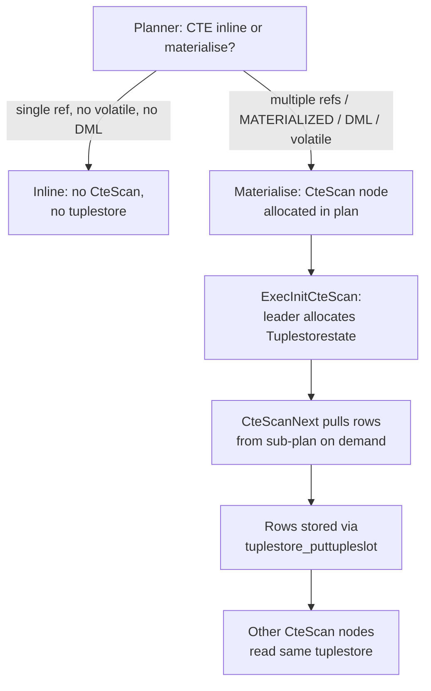

Every time the PostgreSQL executor produces a result row, it needs somewhere to send it. A client query routes tuples to the network via the libpq protocol layer. An `EXPLAIN ANALYZE` discards them. A `COPY TO` serialises them as text or binary. The abstraction that makes all of these interchangeable is `DestReceiver` (dest.h). It is a small struct of four function pointers — `receiveSlot`, `rStartup`, `rShutdown`, and `rDestroy` — that the executor calls without knowing anything about the downstream consumer. The tuplestore receiver (`tstoreReceiver.c`) is one concrete implementation of this interface. Its job is to capture every tuple emitted by a sub-plan into a [[subsystems/executor/tuplestore|Tuplestorestate]]. There, the tuple can be held in memory (or spilled to disk) and replayed later by a different part of the same query.

## The DestReceiver abstraction

`DestReceiver` is defined in `dest.h` as a plain struct with function pointer fields and a `CommandDest` tag:

```c
struct _DestReceiver {
    bool  (*receiveSlot)(TupleTableSlot *slot, DestReceiver *self);
    void  (*rStartup)(DestReceiver *self, int operation, TupleDesc typeinfo);
    void  (*rShutdown)(DestReceiver *self);
    void  (*rDestroy)(DestReceiver *self);
    CommandDest mydest;
};
```

`CommandDest` is an enum that names all recognised destination kinds. The full list includes `DestNone` (discard), `DestRemote` (send to the client frontend), `DestSPI` (SPI manager), `DestIntoRel` (CREATE TABLE AS), `DestCopyOut` (COPY TO), `DestSQLFunction` (SQL-language function result caching), and `DestTuplestore` (the tuplestore receiver). `CreateDestReceiver()` in `dest.c` acts as a factory that returns the right implementation given a `CommandDest` code. For `DestTuplestore`, it delegates directly to `CreateTuplestoreDestReceiver()`.

The executor interacts with a `DestReceiver *` uniformly through those four pointers. As a result, callers can swap receivers without changing plan execution logic. The same `ExecutorRun()` call that sends tuples to a connected client can instead fill a tuplestore simply by substituting the receiver before the call.

Concrete receiver implementations that need local state embed `DestReceiver` as their first field. They add private fields after it. The caller allocates and configures the private state. It then passes only the `DestReceiver *` to the executor. The executor casts that pointer back to the concrete type inside the callbacks to reach the private fields. `TStoreState` (`tstoreReceiver.c`) follows this pattern exactly: the public `pub` field is first, followed by pointers to the target `Tuplestorestate`, a [[subsystems/memory/contexts|memory context]], the optional detoast flag, and workspace for tuple conversion.

## The tuplestore receiver internals

`CreateTuplestoreDestReceiver()` allocates a zeroed `TStoreState`, installs the four callbacks, sets `mydest = DestTuplestore`, and returns a `DestReceiver *`. At this point the receiver is not yet usable — it has no `Tuplestorestate` to write into. The caller must follow up with `SetTuplestoreDestReceiverParams()`, which records:

- `tStore` — the `Tuplestorestate *` where tuples should land.
- `tContext` — the memory context that owns the tuplestore. The receiver switches into this context when calling `tuplestore_putvalues`, ensuring tuples are allocated in the right arena.
- `detoast` — whether to forcibly fetch any out-of-line [[subsystems/storage/toast|TOAST]] values before storing. Needed for cursors `WITH HOLD`, because the underlying table may be dropped before the cursor is closed and the external TOAST datum would then become dangling.
- `target_tupdesc` — an optional target row type. If the producing plan's row type differs from what the consumer expects, the receiver applies `convert_tuples_by_position()`. It maps each slot through a `TupleConversionMap` before storing. `detoast` and `target_tupdesc` are mutually exclusive. No current caller needs both.

`tstoreStartupReceiver()` runs once at the start of each executor run. It inspects the incoming `TupleDesc`. It then selects one of three `receiveSlot` implementations:

- `tstoreReceiveSlot_notoast` — the common case. Calls `tuplestore_puttupleslot()` directly with no extra work.
- `tstoreReceiveSlot_detoast` — walks every varlena column and fetches any external TOAST pointer via `detoast_external_attr()`. It then builds a clean `Datum` array in `myState->outvalues`, calls `tuplestore_putvalues()` in the tuplestore's memory context, and frees the temporarily detoasted values.
- `tstoreReceiveSlot_tupmap` — remaps the slot through a `TupleConversionMap` into a scratch `mapslot`. It then calls `tuplestore_puttupleslot()` on the mapped slot.

`tstoreShutdownReceiver()` frees workspace arrays and the conversion map. It does not touch the `Tuplestorestate` itself — that is owned and managed by the caller.

## Where the receiver is used

### Materialised CTEs

When the planner decides a CTE must be materialised (see [[sql-features/ctes]] for the inlining rules), the executor runs the CTE's sub-plan as an `InitPlan` subquery. The first `CteScan` node to initialise for that CTE (`ExecInitCteScan()`, `nodeCtescan.c`) allocates a `Tuplestorestate` with `tuplestore_begin_heap(true, false, work_mem)` — the `true` enables random access (REWIND). Random access is required because the tuplestore must tolerate rescanning. Subsequent `CteScan` nodes for the same CTE allocate additional read pointers via `tuplestore_alloc_read_pointer()`, each starting at the beginning.

`CteScanNext()` drives the CTE sub-plan lazily: it first tries `tuplestore_gettupleslot()`. Only when the tuplestore is empty or exhausted does it call `ExecProcNode(node->cteplanstate)` to pull one more row from the underlying plan. It then appends that row to the tuplestore with `tuplestore_puttupleslot()` and returns a copy to the caller. The copy is necessary because other `CteScan` nodes sharing the same tuplestore might advance the sub-plan before the current node is called again.

Notice that this mechanism does not go through the `DestReceiver` interface at all — the `CteScan` node writes directly into the shared tuplestore using `tuplestore_puttupleslot`. The tuplestore receiver is used in other contexts described below. For CTEs, the `CteScan` node is both the consumer and the producer of the shared buffer.

### RETURNING clauses and data-modifying CTEs

`INSERT`, `UPDATE`, and `DELETE` statements with `RETURNING` produce a result set just like a `SELECT`. When such a query is executed through a portal, `PortalGetType()` classifies it as `PORTAL_ONE_RETURNING` (a plain DML-with-RETURNING) or `PORTAL_ONE_MOD_WITH` (a data-modifying CTE). Both strategies share the same `FillPortalStore()` path (`pquery.c`).

`FillPortalStore()` creates a new `Tuplestorestate` via `PortalCreateHoldStore()`, allocates a tuplestore receiver pointing at it, and then calls `PortalRunMulti()` with that receiver as the destination for the primary query. The executor routes every `RETURNING` row through `receiveSlot` into the tuplestore. Once the portal is filled, subsequent `FETCH` commands read from the tuplestore via `RunFromStore()` rather than re-running the DML. The DML has already committed its side effects. The tuplestore is the only way the rows are accessible to the client.

### Cursors WITH HOLD

An ordinary cursor holds a live `QueryDesc` and executor state for the duration of its transaction. A cursor declared `WITH HOLD` must survive transaction commit. `HoldPortal()` (`portalcmds.c`) materialises the remaining result set before commit. It creates a tuplestore receiver with `detoast = true`, calls `ExecutorRun()` to drain whatever the plan has left, then shuts down the executor. From that point on, the portal reads from the tuplestore rather than from live executor state. The mandatory detoasting ensures that no TOAST pointer into a table survives the transaction boundary — all data is self-contained in the buffer.

### PL/pgSQL RETURN QUERY

A PL/pgSQL function declared `RETURNS SETOF` accumulates its return set in an `estate->tuple_store`. When the function body executes a `RETURN QUERY` statement, `exec_stmt_return_query()` (`pl_exec.c`) creates a tuplestore receiver pointing at `estate->tuple_store`. It passes the receiver as the destination to `SPI_execute_plan_extended()`. The SPI layer runs the query with the executor. The executor calls `receiveSlot` for every produced tuple, accumulating them all in the function's tuplestore. This is where the optional `target_tupdesc` parameter comes into play. If the sub-query's column types do not exactly match the declared function return type, the receiver applies the conversion map on the fly rather than requiring the planner to emit an explicit type-cast node.

### SQL-language functions

SQL-language functions (`functions.c`) use `DestSQLFunction`, a closely related but distinct receiver. That receiver also writes into a `Tuplestorestate` (`fcache->tstore`). But it manages the tuplestore entirely internally and does not expose `SetTuplestoreDestReceiverParams`. The separation exists because SQL functions have additional semantics (caching across multiple calls, lazy vs. eager execution, strict NULL short-circuiting) that would not fit cleanly into the generic `TStoreState` parameters.

## Memory and spill behaviour

The tuplestore receiver imposes no memory policy of its own. The `Tuplestorestate` the caller provides and the `work_mem` limit (or custom budget) passed to `tuplestore_begin_heap` together control memory management. As the receiver calls `tuplestore_puttupleslot()` or `tuplestore_putvalues()`, the tuplestore tracks `availMem`. When it drops to zero, the tuplestore spills to a temporary `BufFile`. It then writes subsequent tuples directly to disk. The receiver is unaware of this transition — it calls the same tuplestore API regardless.

For the CTE case the limit is `work_mem * 1024L` bytes, the standard executor budget. For `WITH HOLD` portals and `PORTAL_ONE_RETURNING` portals, `work_mem` also bounds the tuplestore. PL/pgSQL `RETURN QUERY` uses whatever tuplestore the function already has. As a result, the effective limit depends on how the function initialised it. If any of these tuplestores spill, the client or caller sees no difference in results — the [[subsystems/executor/work-mem-and-spill|spill to disk]] is transparent through the `Tuplestorestate` API.

## CTE fencing and the materialization decision

A materialized CTE forms an optimization fence. The planner cannot push predicates from the outer query through the CTE boundary. The CTE sub-plan runs as an isolated unit. This is the intended behaviour for CTEs containing volatile functions, DML, or multiple references to the same result set.

Since PostgreSQL 12 the planner inlines single-reference, non-volatile, non-DML CTEs by default. When the planner inlines a CTE, there is no `CteScan` node and no tuplestore at all — the planner folds the CTE body into the surrounding query graph as if it were a subquery. Only when the planner decides to materialise (due to the rules in `CTEMaterialize`, multiple references, `MATERIALIZED` keyword, or the presence of volatile functions or DML) does a `CteScan` node appear in the plan. At that point the executor also allocates a tuplestore. The tuplestore receiver itself is not involved in that decision. It is simply the mechanism that makes materialised result capture efficient once the decision is made.



## Related Topics

- [[subsystems/executor/tuplestore|Tuplestore and Tuplesort Variants]]
- [[sql-features/ctes|Common Table Expressions]]
- [[subsystems/executor/work-mem-and-spill|work_mem and Spill to Disk]]
- [[subsystems/storage/toast|TOAST]]
- [[subsystems/executor/set-returning-functions|Set-Returning Functions]]
- [[subsystems/executor/sql-language-functions|SQL-Language Functions]]
