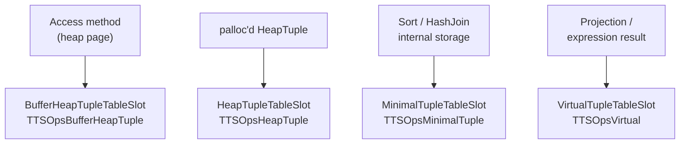
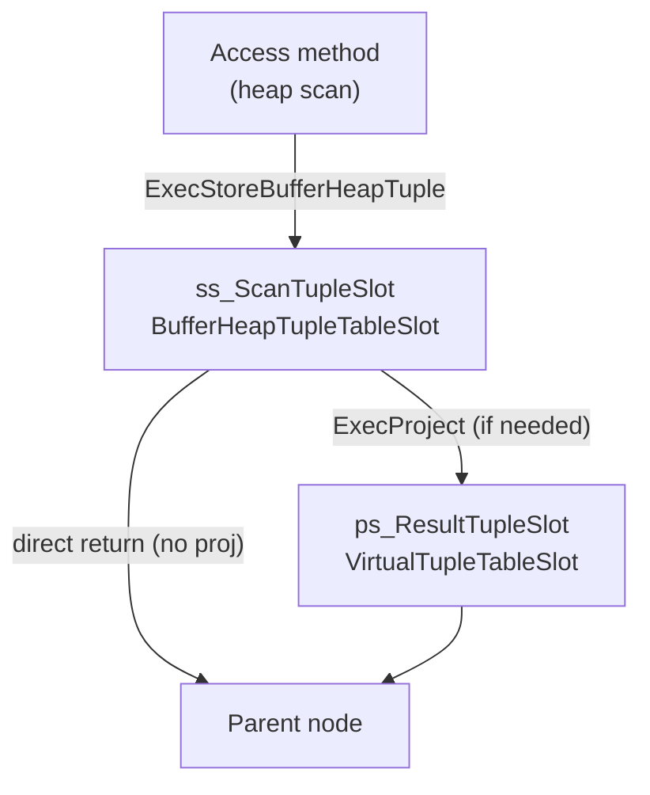

# Tuple Table Slot

Plan nodes do not pass raw heap tuples to each other. Instead they exchange `TupleTableSlot` pointers — a thin abstraction that decouples the tuple representation stored on disk from the Datum arrays that expression evaluation and projection actually need. The executor's expression evaluator works on arrays of `Datum` values and `bool` null flags. But a heap tuple on disk is a packed binary record with its own header, alignment padding, and MVCC visibility fields — not a Datum array. Converting every tuple into a Datum array on the way up the plan tree would be wasteful. Most queries project only a few columns from a wide table. A WHERE clause also filters out many tuples before projection ever happens. The diversity of tuple sources compounds the problem: a `SeqScan` reads tuples directly from buffer pool pages, a `Sort` works with minimal tuples that have the MVCC header stripped to save memory, and a projection node computes new column values from expressions that have no physical tuple behind them at all. Without a common abstraction, each pair of adjacent plan node types would need bespoke handoff code. Slots solve both problems. They present a single interface regardless of what is underneath. They also defer the translation from packed bytes to Datums until a column is actually requested, and only for the columns that are requested.

## Slot structure

The base `TupleTableSlot` struct carries the fields that all code shares (`tuptable.h`):

| Field | Purpose |
|---|---|
| `tts_ops` | Pointer to the vtable (`TupleTableSlotOps`) that implements this slot type |
| `tts_tupleDescriptor` | Schema of the tuple: column types, count, alignment info |
| `tts_values` | Datum array, one entry per column; entries `0..tts_nvalid-1` are valid |
| `tts_isnull` | Null flag array, parallel to `tts_values` |
| `tts_nvalid` | How many leading columns have been deformed into `tts_values` |
| `tts_flags` | Bitmask: `TTS_FLAG_EMPTY`, `TTS_FLAG_SHOULDFREE`, `TTS_FLAG_SLOW`, `TTS_FLAG_FIXED` |
| `tts_tid` | Item pointer of the tuple on disk (where applicable) |
| `tts_tableOid` | OID of the table the tuple came from |
| `tts_mcxt` | [[subsystems/memory/contexts|Memory context]] that owns the slot's allocations |

`tts_nvalid` is the key to lazy deformation. A fresh slot starts at zero. When expression evaluation needs column `k`, it calls `slot_getsomeattrs(slot, k+1)`. This call deforms columns up to `k` if not already done, advancing `tts_nvalid`. Columns beyond `tts_nvalid` remain packed inside the underlying tuple.

When a slot is given a fixed `TupleDesc` at creation time, `MakeTupleTableSlot` allocates the struct, the `tts_values` array, and the `tts_isnull` array in a single palloc, keeping them contiguous in memory and saving two separate allocations (`execTuples.c`).

## Four slot types

Each slot type targets a different source of tuple data and owns its backing storage accordingly. The concrete slot structs extend `TupleTableSlot` with type-specific fields (`tuptable.h`):

**`TTSOpsBufferHeapTuple` / `BufferHeapTupleTableSlot`** — the output of access methods like `SeqScan` and `IndexScan`. The tuple lives directly in a buffer pool page. The slot holds a `Buffer` handle. It keeps the buffer pinned for as long as the slot is live. When the slot is cleared, `tts_buffer_heap_clear` releases the pin with `ReleaseBuffer`. This is the most common slot type seen during normal query execution. Because the tuple is not copied, there is zero per-tuple allocation cost. The price is that the slot must hold the buffer pin until it is done with the tuple.

**`TTSOpsHeapTuple` / `HeapTupleTableSlot`** — holds a heap tuple in palloc'd memory, not pinned to any buffer page. Used for tuples constructed on the fly (e.g., after a DML operation returns a tuple to a `RETURNING` clause, or when a tuple is explicitly materialized). When `TTS_FLAG_SHOULDFREE` is set, clearing the slot calls `heap_freetuple`.

**`TTSOpsMinimalTuple` / `MinimalTupleTableSlot`** — holds a `MinimalTuple`, which is a heap tuple with the `HeapTupleHeaderData` MVCC fields stripped off. `Sort` and `HashJoin` use minimal tuples internally to reduce memory consumption. Because system columns (`ctid`, `xmin`, etc.) are absent, minimal tuple slots cannot satisfy `slot_getsysattr` requests. The slot maintains a `HeapTupleData minhdr` workspace that pretends the minimal tuple has a normal header offset, allowing the same `slot_deform_heap_tuple` code path to process it (`execTuples.c`).

**`TTSOpsVirtual` / `VirtualTupleTableSlot`** — carries no underlying packed tuple at all. The `tts_values` and `tts_isnull` arrays are the authoritative data. This is the output format for projections. When a node computes new column values from expressions, it writes results directly into `tts_values`/`tts_isnull`. It then calls `ExecStoreVirtualTuple()` to mark the slot valid. `tts_nvalid` is set to `natts` immediately — there is nothing to deform lazily. Virtual slots also cannot return system columns. Because pass-by-reference Datum values in a virtual slot typically point into storage owned by a lower node's slot or by a per-tuple expression context, the slot does not own them. Calling `ExecMaterializeSlot` on a virtual slot copies all by-reference values into the slot's own memory context.

The `tts_ops` pointer encodes the type identity of a slot. The convenience macros `TTS_IS_BUFFERTUPLE(slot)`, `TTS_IS_HEAPTUPLE(slot)`, `TTS_IS_MINIMALTUPLE(slot)`, and `TTS_IS_VIRTUAL(slot)` compare `tts_ops` against the global `TTSOpsXxx` constants.

## The TupleTableSlotOps vtable

`TupleTableSlotOps` is the interface each slot type implements (`tuptable.h`). The struct contains function pointers rather than a C++ vtable. But the design is equivalent:

| Method | Called by | Purpose |
|---|---|---|
| `init` | `MakeTupleTableSlot` | One-time setup of type-specific fields. Virtual and heap slots have no-op `init`; the minimal tuple slot sets `mslot->tuple = &mslot->minhdr` to establish its header-overlay trick |
| `release` | `ExecDropSingleTupleTableSlot` / `ExecResetTupleTable` | Final destruction of type-specific resources beyond what `clear` handles |
| `clear` | `ExecClearTuple` | Empty the slot, freeing owned tuple memory or releasing the buffer pin. Sets `TTS_FLAG_EMPTY` and resets `tts_nvalid` to zero |
| `getsomeattrs` | `slot_getsomeattrs` | Deform the underlying tuple into `tts_values`/`tts_isnull` up to column `natts`. Virtual slots error if called, since their arrays are always fully populated |
| `getsysattr` | `slot_getsysattr` | Return a system column (e.g., `xmin`, `cmin`) as a Datum. Virtual and minimal tuple slots raise an error; heap and buffer heap slots delegate to `heap_getsysattr` |
| `materialize` | `ExecMaterializeSlot` | Force the slot to own its data independently of any external resource. For a buffer heap slot this copies the tuple into palloc'd memory and releases the buffer pin. For a virtual slot it copies by-reference Datums into the slot's memory context |
| `copyslot` | `ExecCopySlot` | Copy the contents of a source slot into the destination slot's own context. The destination's implementation is used, so the copy is adapted to the destination slot type |
| `get_heap_tuple` | `ExecFetchSlotHeapTuple` | Return a `HeapTuple` owned by the slot (zero-copy). NULL if the slot type cannot own a heap tuple (virtual, minimal) |
| `get_minimal_tuple` | `ExecFetchSlotMinimalTuple` | Return a `MinimalTuple` owned by the slot. Only implemented by the minimal tuple slot |
| `copy_heap_tuple` | callers needing ownership | Return a freshly palloc'd `HeapTuple` copy of the slot's contents. Always implemented |
| `copy_minimal_tuple` | callers needing ownership | Return a freshly palloc'd `MinimalTuple` copy. Always implemented |

The `base_slot_size` field in `TupleTableSlotOps` tells `MakeTupleTableSlot` how many bytes to allocate for the concrete slot struct. This size varies by type.

## Lazy deformation and tts_values

`slot_deform_heap_tuple` (`execTuples.c`) unpacks a heap tuple's packed binary layout into the `tts_values` Datum array. The heap, buffer-heap, and minimal tuple slot types all share this function. The function is an incremental version of `heap_deform_tuple`. It resumes from `slot->tts_nvalid` rather than starting over. As a result, repeated attribute fetches advance rather than repeat work.

The inner loop handles two regimes. For fixed-width columns at predictable offsets — integers, OIDs, and similar — the code caches the byte offset in `attcacheoff` on first access. On subsequent calls, it jumps directly to the right position. Variable-width columns (`attlen == -1`) require reading the actual varlena header to know the value's size. When a tuple contains nulls or after encountering any variable-length column, the code sets `TTS_FLAG_SLOW` to suppress the `attcacheoff` fast path for subsequent columns, because offsets are no longer predictable.

The deformed Datum values for by-reference types (variable-length or pass-by-pointer fixed-width) are pointers directly into the tuple's on-disk bytes — no copy is made. This is safe as long as the underlying tuple remains live. The buffer pin guarantees this for `TTSOpsBufferHeapTuple` slots. It is the reason that materialising a slot must re-deform from scratch: if the source tuple were freed or the buffer unpinned first, the existing Datum pointers would dangle.

## slot_getattr vs slot_getallattrs

`slot_getattr(slot, attnum, isnull)` is the single-column access function. It calls `slot_getsomeattrs(slot, attnum)` to ensure the target column is deformed. It then returns `tts_values[attnum - 1]`. Because deformation is incremental, accessing column 3 after having accessed column 2 only processes column 3.

`slot_getallattrs(slot)` calls `slot_getsomeattrs(slot, natts)`, forcibly deforming every column. It is appropriate when a node will access most or all columns anyway — for example, when constructing an output HeapTuple from a virtual slot or when writing a tuple into a tuplestore. Using `slot_getallattrs` in a tight loop that only needs two of twenty columns wastes work. Using `slot_getattr` per column in a loop that needs all twenty wastes vtable dispatch overhead.

Both functions are inlined in non-frontend code. `slot_getsomeattrs` is itself inline, dispatching to `slot_getsomeattrs_int` (which calls the vtable) only when `tts_nvalid < attnum`. The fast-path check costs a single comparison.

## Copying and moving slots

Two operations address the need to transfer slot contents across lifetimes or ownership boundaries.

`ExecCopySlot(dstslot, srcslot)` copies the contents of one slot into another. `ExecCopySlot` calls the destination's `copyslot` vtable method. As a result, the copy is adapted to the destination type. For a virtual destination, `tts_virtual_copyslot` calls `slot_getallattrs` on the source to fully deform it. It copies the Datum/isnull arrays, then immediately materialises the result. As a result, the destination's by-reference Datums are self-contained copies, not pointers into the source (`execTuples.c`). For a buffer-heap destination copying from an identical buffer-heap source, the implementation re-pins the same buffer rather than copying the tuple bytes.

`ExecMaterializeSlot(slot)` forces a slot to become self-sufficient in place, without involving a second slot. For a buffer-heap slot, this copies the heap tuple into palloc'd memory. It also releases the buffer pin. This is the right call before a node returns a slot to a caller that might advance to the next tuple. Advancing clears the scan slot, which releases the buffer pin. That, in turn, would invalidate any Datum pointers pointing into the page. Nodes like `Limit` and `LockRows` call `ExecMaterializeSlot` when they need to hold a tuple across a scan advance.

`ExecCopySlotHeapTuple` and `ExecCopySlotMinimalTuple` return freshly palloc'd tuple copies in the caller's current memory context. The slot itself is unaffected. Callers use these when a tuple must go into a longer-lived structure such as a tuplestore or a hash table.

## How plan nodes pass tuples

Each plan node that reads from a child uses an **input slot** (or scan slot) to receive the child's output, and an **output slot** (result tuple slot) to hold whatever it will return to its own parent. For scan nodes, these two slots are often different. `ss_ScanTupleSlot` receives raw tuples from the access method, while `ps_ResultTupleSlot` holds the projected output. If no projection is needed — the node returns its scan tuple unchanged — it returns the scan slot directly. `ps_ResultTupleSlot` goes unused for that row.

This design means that a lower node may physically own a slot pointer passed up the plan tree. Upper nodes must not call `ExecClearTuple` on a slot they received from a child. They can read it freely until the child is called again (which implicitly clears and reuses the slot). If an upper node needs to retain a tuple across multiple child calls — for example, a merge join that must revisit an inner tuple — it must copy or materialise first.

## Per-node slot initialization

During `ExecutorStart`, each node's `ExecInitXxx` function allocates and registers its slots. The two central helpers are (`execTuples.c`):

`ExecInitResultTupleSlotTL(planstate, tts_ops)` — derives a `TupleDesc` from the plan node's target list by calling `ExecInitResultTypeTL`. It then calls `ExecInitResultSlot` to allocate a slot of the given type and assign it to `planstate->ps_ResultTupleSlot`. Most nodes that perform projection use `TTSOpsVirtual` here, since `ExecProject` writes computed Datums directly into `tts_values`.

`ExecInitScanTupleSlot(estate, scanstate, tupledesc, tts_ops)` — allocates the scan tuple slot. It records the slot in `scanstate->ss_ScanTupleSlot`. The slot type matches what the underlying table access method will produce. For heap tables this is `TTSOpsBufferHeapTuple`. The access method calls `ExecStoreBufferHeapTuple` to place each tuple into the slot.

Both helpers register their slots via `ExecAllocTableSlot`, which appends the slot to `estate->es_tupleTable`. At `ExecutorEnd`, `ExecResetTupleTable` clears and frees every slot in that list. As a result, individual nodes do not need explicit slot cleanup code.

## Allocation and lifetime

Slots come in two flavors depending on how they are managed:

- `ExecAllocTableSlot(&estate->es_tupleTable, desc, ops)` — adds the slot to the executor's central tuple table. Lifetime is tied to the query. `ExecutorEnd` cleans up automatically. This is the right choice for slots that belong to plan nodes.
- `MakeSingleTupleTableSlot(tupdesc, ops)` / `ExecDropSingleTupleTableSlot(slot)` — creates and destroys a standalone slot not associated with any tuple table. Used for utility operations (EXPLAIN, SHOW) and callers outside the executor proper.

When a `TupleDesc` is supplied at creation time, `MakeTupleTableSlot` allocates the slot struct and both arrays in one contiguous block. It also pins the descriptor. The `TTS_FLAG_FIXED` flag marks the slot as having an immutable descriptor. `ExecSetSlotDescriptor` asserts against calling it on a fixed slot.

## See also

- [[subsystems/executor/overview]] — how slots fit into the plan node interface
- [[subsystems/executor/expression-eval]] — how `ExprState` reads Datums from slots
- [[subsystems/storage/visibility-map]] — buffer pinning that slot lifetimes depend on
