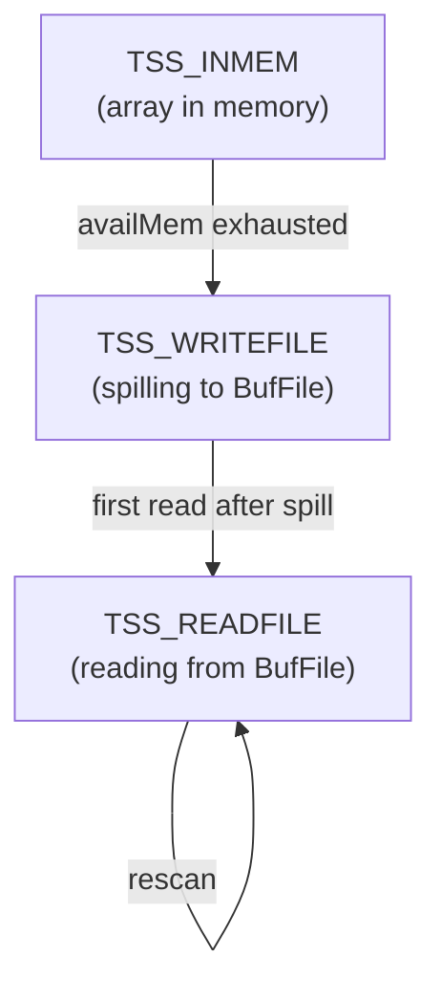

A **tuplestore** is a sequential container that accumulates an unbounded sequence of tuples in memory, spilling to a temporary file when the memory budget is exceeded. It is the mechanism behind every executor node that must buffer its input before producing output: [[subsystems/executor/sort|sort]], Materialize, window aggregation, CTEs, and set-returning functions all use the same `Tuplestorestate` abstraction. **Tuplesort variants** are a closely related facility: they layer sort logic on top of the same spill-to-disk infrastructure, with typed front-ends for heap tuples, index tuples, and plain Datums.

## Tuplestore internals

A `Tuplestorestate` moves through three states during its lifetime (`tuplestore.c`):

In `TSS_INMEM`, the tuplestore stores incoming tuples in a palloc'd array of `void *` pointers inside its [[subsystems/memory/contexts|memory context]]. Each tuple is a palloc'd copy of the incoming slot's heap tuple. The tuplestore tracks available memory with `availMem`. When it drops below zero, `dumptuples()` serialises the entire in-memory array to a `BufFile` (a temporary file that can span multiple 1 GB segments). It then transitions to `TSS_WRITEFILE`.

In `TSS_WRITEFILE`, the tuplestore writes further incoming tuples directly to the file as length-prefixed heap tuples. There is no in-memory array at this point — every tuple goes straight to disk.

When any read pointer requests a tuple, the tuplestore transitions to `TSS_READFILE`. Subsequent reads seek the file and deserialise tuples on demand. Switching between write and read modes requires flushing the current file position, because the file cursor is shared between the write head and the active read pointer.

The `maxKBytes` parameter passed to `tuplestore_begin_heap` is the approximate memory budget. It maps to `allowedMem` in bytes. The tuplestore tracks the actual memory used by the tuple copies by decrementing `availMem` as tuples are copied in. Tuplestore does not use [[subsystems/executor/work-mem-and-spill|work_mem]] directly. Callers typically pass `work_mem * 1024L` as the limit, but set-returning function calls and some window aggregate uses pass a more constrained budget.

### Multiple read pointers

A tuplestore supports multiple independent read pointers, allocated with `tuplestore_alloc_read_pointer`. Each pointer has its own `eof_reached` flag and position (array index in memory, or file/offset on disk). `tuplestore_select_read_pointer` selects the active read pointer.

The window aggregation executor node (`nodeWindowAgg.c`) uses multiple pointers. It needs to maintain a "current row" pointer and a "frame start" pointer simultaneously within the same buffered partition. `tuplestore_copy_read_pointer` saves the position of one pointer to another. This is how mark/restore works.

When none of the read pointers needs to go backward and rewind is disabled for all of them, `tuplestore_trim` can release the portion of the file or array behind the oldest active read pointer, keeping memory consumption bounded for streaming queries.

### Where tuplestore is used

| Executor node / feature | How tuplestore is used |
|---|---|
| `Materialize` node | Buffers the child node's output for re-scanning (e.g. nested loop inner side) |
| CTE scan (`nodeCtescan.c`) | The CTE's results land in a tuplestore shared by all CTE scan nodes that reference it |
| Recursive union (`nodeRecursiveunion.c`) | Two tuplestores hold the "working table" and "intermediate table" for each recursive iteration |
| Window aggregation (`nodeWindowAgg.c`) | Buffers the current partition's rows with multiple read pointers for frame navigation |
| Set-returning functions (`execSRF.c`) | Collects all rows returned by a SRF in one call before returning them one at a time |
| SQL-language functions (`functions.c`) | Caches the function's result set across multiple calls within a query |

## Tuplesort variants (tuplesortvariants.c)

The generic sort engine in `tuplesort.c` handles external merge sort using logical tapes (spilled runs). A set of function pointers (`comparetup`, `writetup`, `readtup`) parameterises it. These differ depending on what is being sorted. `tuplesortvariants.c` provides four concrete instantiations of these callbacks, each with a typed `tuplesort_begin_*` constructor:

| Constructor | Sorted item | Use |
|---|---|---|
| `tuplesort_begin_heap` | `HeapTuple` | `ORDER BY`, `DISTINCT`, external sort in executor |
| `tuplesort_begin_index_btree` | `IndexTuple` | `CREATE INDEX` for B-tree (uses btree comparison) |
| `tuplesort_begin_index_hash` | `IndexTuple` | `CREATE INDEX` for hash indexes |
| `tuplesort_begin_index_gist` | `IndexTuple` | `CREATE INDEX` for GiST indexes |
| `tuplesort_begin_datum` | `Datum` | Single-column sorts (used for some aggregate operations) |
| `tuplesort_begin_cluster` | `HeapTuple` + index | `CLUSTER` — sorts by index key order |

PostgreSQL 15 introduced the separation between `tuplesort.c` (the sort algorithm) and `tuplesortvariants.c` (the type-specific adapters) to keep the generic engine clean. Before that, all variants lived in a single large file.

For heap tuple sorts, the `comparetup_heap` function evaluates the sort key expressions against the `SortTuple`'s `datum1` fast path. The engine extracts the first sort key and stores it directly in the `SortTuple` struct to avoid repeated deforming during comparisons. If the abbreviated key optimisation is active (for text, numeric, and a few other types), the `datum1` slot holds a machine-word-sized abbreviation that provides fast approximate comparison, with the full comparison invoked only when abbreviations are equal.

## Related Topics

- [[subsystems/executor/sort|Sort Node]]
- [[subsystems/executor/work-mem-and-spill|work_mem and Spill to Disk]]
- [[subsystems/executor/window-functions|Window Functions]]
- [[subsystems/storage/temp-files|Temporary Files]]
- [[sql-features/ctes|CTEs (Common Table Expressions)]]
