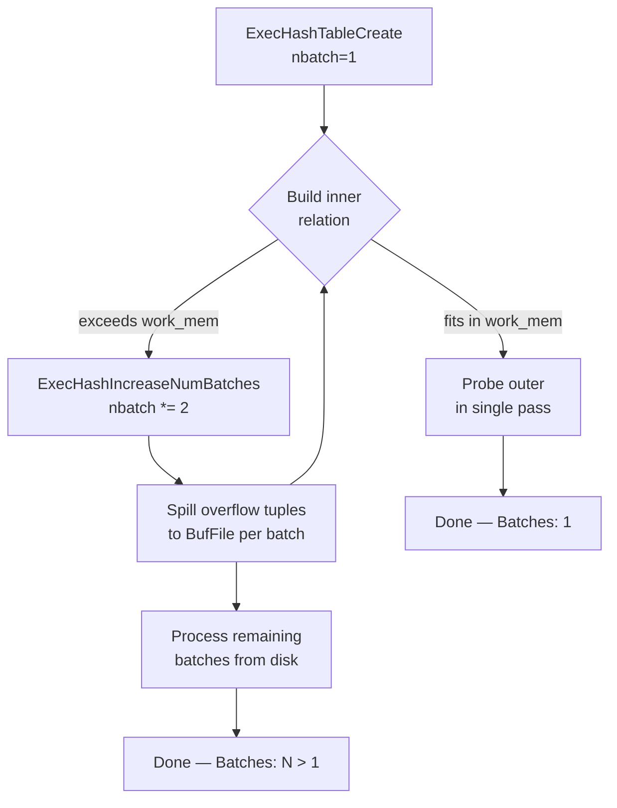

`work_mem` is the per-operation memory budget for sort and hash operations in the PostgreSQL executor. The critical point engineers frequently miss: it is **not a per-query limit**. A single query plan containing five Sort nodes can consume up to `5 × work_mem` simultaneously. With hash joins, hash aggregates, and subplan sorts added in, a single connection can easily allocate ten or more `work_mem` grants at once. This makes global increases of `work_mem` dangerous on busy servers.

When an operation exhausts its `work_mem` grant, PostgreSQL does not error — it spills to disk via temporary files managed by `buffile.c`. The spill is transparent to the application but carries a 2–10× performance penalty due to the cost of writing and re-reading data from the operating system's filesystem.

## How Sorts Use work_mem: tuplesort

The entry point for an executor sort is `tuplesort_begin_heap` (and its siblings `tuplesort_begin_index_*` for index builds). The caller passes the `work_mem` value in kilobytes. `tuplesort_begin_heap` stores it in the `Tuplesortstate` as `allowedMem`.

**In-memory path.** The sort appends tuples into a dynamically grown array (`memtuples`). After all tuples are read, the caller calls `tuplesort_performsort`. If the total memory used is within `allowedMem`, the sort completes with a quicksort (via `qsort_tuple`) entirely in RAM. It creates no files.

**Spill path.** As tuples arrive, the code tracks `availMem`. When `availMem` drops to zero or below, the code calls `tuplesort_performsort` mid-stream to flush the current in-memory run to a `LogicalTape`. A `LogicalTapeSet` is a single underlying `BufFile` (a buffered temporary file backed by `buffile.c`) divided into logical streams. Each flush produces one sorted run on tape.

After all input is consumed, the sort transitions to a **polyphase merge sort**: it merges runs from multiple input tapes onto output tapes, cycling until one run remains. The number of merge passes depends on how many initial runs were created. With `k` tapes and `n` initial runs, the number of merge passes is approximately `log_k(n)`. PostgreSQL defaults to `MAXTAPES = 7` logical tapes per sort, giving a merge fan-in of up to 6.

```c
/* simplified flow in tuplesort_performsort */
if (state->status == TSS_BUILDRUNS) {
    /* already spilling: merge existing runs */
    mergeruns(state);   /* polyphase merge into final sorted output */
} else {
    /* fits in memory: in-place quicksort */
    qsort_tuple(state->memtuples, state->memtupcount, ...);
    state->status = TSS_SORTEDINMEM;
}
```

The `TuplesortInstrumentation` struct captures `spaceUsed`, `spaceType` (memory vs. disk), and `sortMethod` (in-memory quicksort, top-N heapsort, or external merge). This data surfaces in `EXPLAIN ANALYZE`.

## How Hash Joins Use work_mem: nodeHash.c

Hash joins operate in two phases: build (inner relation) and probe (outer relation).

**Build phase.** `ExecHashTableCreate` sizes the initial hash table based on the planner's row-count and width estimates and the `work_mem` limit. It calculates `nbuckets` (number of hash buckets) and `nbatch` (number of batches). When the planner estimate is accurate and the inner relation fits in `work_mem`, `nbatch` remains 1. The entire join then completes in a single pass.

**Batch overflow.** During the build phase, if actual tuple sizes cause the hash table to exceed `work_mem`, the hash join calls `ExecHashIncreaseNumBatches`. This function doubles the batch count (`nbatch *= 2`), then re-partitions the existing in-memory tuples: tuples whose hash value maps to batch 0 stay in memory. The node writes all others to inner-relation temp files (`BufFile`), one per batch. During the probe phase, the node similarly writes outer tuples destined for non-zero batches to outer-relation temp files.

After the first batch (batch 0) completes the join in memory, PostgreSQL cycles through batches 1 through `nbatch - 1`. It reads each inner batch file back into a fresh hash table. Then it reads the corresponding outer batch file to probe it. This process can repeat recursively if a batch itself overflows. That is rare.



## Reading EXPLAIN ANALYZE for Spill Detection

### Sort spill

```
Sort  (cost=...) (actual rows=... loops=1)
  Sort Key: last_name
  Sort Method: external merge  Disk: 18432kB
```

`Sort Method: external merge` means the sort spilled. `Disk: NkB` is the peak on-disk footprint of the temporary files. An in-memory sort shows `Sort Method: quicksort  Memory: NkB` or `Sort Method: top-N heapsort`.

### Hash join spill

```
Hash  (cost=...) (actual rows=... loops=1)
  Buckets: 131072  Batches: 8  Memory Usage: 4096kB
```

`Batches: 1` means no spill. Any `Batches: N` where `N > 1` indicates the hash table spilled. PostgreSQL partitioned the inner and outer relations into `N` temp files each. `Memory Usage` reflects peak RAM for the in-memory batch.

### Hash aggregate spill

`HashAggregate` nodes use `work_mem` similarly. When the hash table overflows, it writes groups to disk. `EXPLAIN ANALYZE` reports:

```
HashAggregate  (cost=...) (actual rows=... loops=1)
  Group Key: customer_id
  Batches: 4  Memory Usage: 4096kB
  Disk Usage: 12288kB
```

## Cost of Spilling

An in-memory sort or hash join reads each tuple once. A spilling sort writes every tuple to disk at least once and reads it back once per merge pass. A hash join with `N` batches reads the inner relation `N` times: once from the original source, then once per non-zero batch from disk. It reads the outer relation twice: once to distribute to batches, once per batch. Empirically, spilling operations run **2–10× slower** than their in-memory counterparts, with the multiplier depending on I/O bandwidth, batch count, and whether `temp_tablespaces` lands on SSD or spinning disk.

## Practical Guidance

**Per-session tuning for expensive queries.** The safest way to increase `work_mem` is within a transaction or session, immediately before the expensive query:

```sql
SET work_mem = '256MB';
EXPLAIN ANALYZE SELECT ...;  -- now sorts/hashes have 256 MB each
RESET work_mem;
```

**Avoid global increases without capacity math.** Before raising `work_mem` in `postgresql.conf`, calculate the worst case: `max_connections × max_parallel_workers_per_gather × work_mem`. On a server with 200 connections, 4 workers, and `work_mem = 64MB`, the theoretical RAM ceiling is `200 × 4 × 64MB = 51GB`. RAM pressure causes OS swapping. Swapping is worse than spilling through PostgreSQL's own temp file path.

**Identify spill-prone queries with [[subsystems/observability/pg-stat-statements|pg_stat_statements]].**

```sql
SELECT query, temp_blks_written, temp_blks_read,
       round(temp_blks_written * 8.0 / 1024, 1) AS temp_mb_written
FROM pg_stat_statements
WHERE temp_blks_written > 0
ORDER BY temp_blks_written DESC
LIMIT 20;
```

`temp_blks_written` accumulates 8 kB block writes to temporary files, covering both sort runs and hash batch files.

**temp_buffers is unrelated.** `temp_buffers` controls the buffer pool for user-created temporary tables (`CREATE TEMP TABLE`). It has no effect on sort or hash spill. Do not raise `temp_buffers` hoping to reduce spill — adjust `work_mem` instead.

**When spill is unavoidable.** If a sort or hash must process more data than can fit in any reasonable `work_mem`, consider:
- Rewriting the query to reduce the input set earlier (predicate pushdown, partial aggregation).
- Adding an index to avoid the sort entirely (see [[subsystems/planner/sort-avoidance]]).
- Partitioning the table so the planner operates on smaller partition scans.
- Using `temp_tablespaces` to direct temp files to faster storage.

**Parallel query and work_mem.** Each parallel worker gets its own `work_mem` grant. A query using `max_parallel_workers_per_gather = 4` workers plus the leader can consume `5 × work_mem` for a single Parallel Sort node, independent of any other nodes in the plan.

## Related Topics

- [[subsystems/executor/hash-join-spill|Hash Join Spill]] — deep dive into batch overflow mechanics and the BufFile layer that backs hash join temp files
- [[subsystems/executor/sort|Sort Node]] — how the Sort executor node invokes tuplesort and surfaces spill instrumentation to EXPLAIN ANALYZE
- [[subsystems/executor/aggregate|Aggregate Node]] — covers HashAggregate spill, which follows the same work_mem budget and batch-overflow model as hash joins
- [[subsystems/storage/temp-files|Temporary Files]] — the underlying temp-file infrastructure (BufFile, LogicalTapeSet) that both sort and hash spill write to
- [[subsystems/planner/sort-avoidance|Sort Avoidance]] — planner strategies that eliminate Sort nodes entirely, removing the need to budget work_mem for them
- [[subsystems/observability/pg-stat-statements|pg_stat_statements]] — tracks temp_blks_written and temp_blks_read per query, the primary signal for identifying spill-prone workloads
- [[subsystems/executor/parallel|Parallel Query Execution]] — explains how each parallel worker receives its own work_mem grant, multiplying the effective memory footprint of parallel sort and hash operations
- [[subsystems/executor/joins|Joins]] — overview of executor join strategies (nested loop, merge, hash) that consume separate work_mem grants when hash joins are involved.
