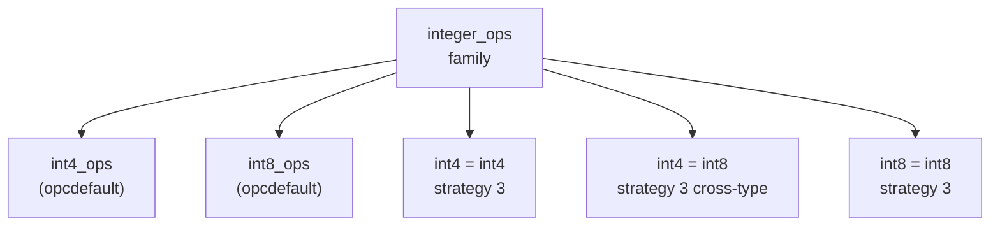

# Custom Operators and Operator Classes

A custom operator is a SQL-level symbol — `@@`, `===`, `!!>`, or any other sequence of operator characters — that the parser dispatches to an ordinary function. The operator itself carries no new logic. PostgreSQL registers it in `pg_operator` as an alias. This makes `a @@ b` a valid expression that calls some underlying function. That by itself is syntactic sugar. The deeper value of operators emerges when they are enrolled in operator families and operator classes. At that point, the planner and index access methods gain the ability to exploit them for index scans, join strategies, and cross-type comparisons.

`CREATE OPERATOR` calls `DefineOperator()` in `operatorcmds.c`, which validates the arguments and delegates to `OperatorCreate()` in the catalog layer. The mandatory prerequisite — noted in the `operatorcmds.c` header — is that the underlying function must be created before the operator that references it.

## pg_operator: what an operator records

Every operator, built-in or custom, occupies one row in `pg_operator` (`pg_operator.h`). The key fields:

| Column | Meaning |
|---|---|
| `oprname` | The operator symbol, stored as a `Name` |
| `oprleft` | OID of the left argument type; zero for prefix operators |
| `oprright` | OID of the right argument type |
| `oprresult` | OID of the result type |
| `oprcode` | OID of the implementing function in `pg_proc` |
| `oprcom` | OID of the commutator operator, or zero |
| `oprnegate` | OID of the negator operator, or zero |
| `oprcanmerge` | True if this operator can drive a merge join |
| `oprcanhash` | True if this operator can drive a hash join |
| `oprkind` | `'b'` for infix (binary), `'l'` for prefix |

`oprcom` and `oprnegate` are optimizer hints rather than executable logic. Declaring that `A @@ B` commutes with `B @@^ A` allows the planner to rewrite join conditions so that they match available index scan directions. Declaring that `!@@` negates `@@` allows the planner to simplify `NOT (a @@ b)` to `a !@@ b`, enabling tighter selectivity estimates. The planner trusts these declarations. Getting them wrong produces incorrect query plans, not just inefficient ones.

Two additional columns — `oprrest` and `oprjoin` — name selectivity estimator functions. These are optional but important for production operators. Without them, the planner falls back to a generic default estimate. That often leads to poor join order choices.

A minimal operator definition looks like:

```sql
CREATE FUNCTION mytype_contains(mytype, mytype) RETURNS bool
    AS 'MODULE_PATHNAME', 'mytype_contains'
    LANGUAGE C IMMUTABLE STRICT;

CREATE OPERATOR @> (
    LEFTARG  = mytype,
    RIGHTARG = mytype,
    FUNCTION = mytype_contains,
    COMMUTATOR = <@
);
```

## Operator families and operator classes

An **operator family** (`pg_opfamily`) groups operators and support functions that together implement a coherent ordering or hashing strategy, possibly across multiple data types. The built-in `integer_ops` btree family is the canonical example: it contains `<`, `<=`, `=`, `>=`, `>` operators for every combination of `int2`, `int4`, and `int8`, plus the comparison functions that make cross-type ordering consistent.

An **operator class** (`pg_opclass`) is a named subset of an operator family scoped to a specific data type and access method. `pg_opclass` columns:

| Column | Meaning |
|---|---|
| `opcmethod` | The index AM this class serves (FK to `pg_am`) |
| `opcname` | The class name |
| `opcfamily` | The containing operator family |
| `opcintype` | The data type this class indexes |
| `opcdefault` | True if this is the default class for `(opcmethod, opcintype)` |
| `opckeytype` | Type stored in the index, if different from `opcintype` |

The distinction matters. The family defines the complete algebra. The class is the entry point the planner consults when it needs to find operators and support functions for a given type in a given AM.

### pg_amop: operators in a family

`pg_amop` links operator families to specific operators at specific strategy numbers. Every row records:

- `amopfamily` — the operator family
- `amoplefttype` / `amoprighttype` — the operator's input types (copied from `pg_operator`)
- `amopstrategy` — the AM-assigned slot number for this operator
- `amoppurpose` — `'s'` for search, `'o'` for ordering
- `amopopr` — the `pg_operator` OID

Strategy numbers are not universal. Each AM defines its own numbering. For btree: 1 = `<`, 2 = `<=`, 3 = `=`, 4 = `>=`, 5 = `>`. GiST defines strategies per extension — `&&` might be strategy 3 for one extension's geometry type and something else for another. A custom operator enrolled at strategy 3 in a btree family is telling the btree AM "this operator is equality."

### pg_amproc: support functions in a family

`pg_amproc` maps operator families to support functions at support procedure numbers (`amprocnum`). Support functions are not query operators — they are internal routines the AM calls during index construction and scanning. The schema mirrors `pg_amop`:

- `amprocfamily`, `amproclefttype`, `amprocrighttype` — family and type scope
- `amprocnum` — the AM-defined slot
- `amproc` — the `pg_proc` OID

Required support functions by AM:

| AM | Proc# | Role |
|---|---|---|
| btree | 1 | Comparison function returning `int4` (-1 / 0 / +1) |
| btree | 2 | Sort support function (optional, accelerates sorting) |
| hash | 1 | Hash function returning `int4` |
| hash | 2 | Extended hash function returning `int8` (optional) |
| GiST | 1 | `consistent` — does an entry satisfy the query? |
| GiST | 2 | `union` — compute bounding value for a set of entries |
| GiST | 3 | `compress` — convert a datum to index storage form |
| GiST | 4 | `decompress` — reverse of compress |
| GiST | 5 | `penalty` — cost of inserting into a subtree |
| GiST | 6 | `picksplit` — split an overfull index page |
| GiST | 7 | `equal` — are two index entries identical? |
| GiST | 8 | `distance` (optional) — for KNN ordering scans |
| GIN | 1 | `compare` — compare two keys |
| GIN | 2 | `extractValue` — extract keys from an indexed value |
| GIN | 3 | `extractQuery` — extract keys from a query value |
| GIN | 4 | `consistent` — does entry satisfy query? |
| GIN | 5 | `comparePartial` (optional) — for partial-match queries |

## Creating an operator class for a new type

The typical sequence for a custom type that needs btree index support:

```sql
-- 1. Comparison function (must exist first)
CREATE FUNCTION mytype_cmp(mytype, mytype) RETURNS int4
    AS 'MODULE_PATHNAME', 'mytype_cmp'
    LANGUAGE C IMMUTABLE STRICT;

-- 2. Operators (must reference the comparison semantics)
CREATE OPERATOR < (LEFTARG=mytype, RIGHTARG=mytype, FUNCTION=mytype_lt,
                   COMMUTATOR=>, NEGATOR>=, RESTRICT=scalarltsel, JOIN=scalarltjoinsel);
-- ... similarly for <=, =, >=, >

-- 3. Operator family (optional explicit step; CREATE OPERATOR CLASS creates one implicitly)
CREATE OPERATOR FAMILY mytype_btree_ops USING btree;

-- 4. Operator class
CREATE OPERATOR CLASS mytype_btree_ops
    DEFAULT FOR TYPE mytype USING btree FAMILY mytype_btree_ops AS
        OPERATOR 1 <,
        OPERATOR 2 <=,
        OPERATOR 3 =,
        OPERATOR 4 >=,
        OPERATOR 5 >,
        FUNCTION 1 mytype_cmp(mytype, mytype);
```

`DefineOpClass()` in `opclasscmds.c` validates that the required strategy numbers and support function numbers for the named AM are satisfied before writing to `pg_opclass`, `pg_amop`, and `pg_amproc`.

For hash indexes, replace the operator list with a single `=` operator at strategy 1 and supply a hash function at support function 1:

```sql
CREATE OPERATOR CLASS mytype_hash_ops
    DEFAULT FOR TYPE mytype USING hash AS
        OPERATOR 1 =,
        FUNCTION 1 mytype_hash(mytype);
```

## Default operator classes and index creation

When `CREATE INDEX USING btree ON t(col)` omits an explicit operator class, PostgreSQL looks up `pg_opclass` for a row where `opcmethod` matches btree's AM OID, `opcintype` matches `col`'s type, and `opcdefault = true`. A custom operator class becomes the default for a type only when declared with the `DEFAULT` keyword. Without it, the class exists but must be named explicitly:

```sql
CREATE INDEX ON t USING btree (col mytype_btree_ops);
```

If two extensions both declare a default operator class for the same `(AM, type)` pair, `CREATE INDEX` will fail with an ambiguity error. The `pg_opclass` header notes that this uniqueness constraint is not enforced by an index on the catalog. As a result, the conflict surfaces only at index creation time.

## Cross-type operators in operator families

An operator family can contain operators whose left and right types differ. In `pg_amop`, these cross-type rows have `amoplefttype != amoprighttype`, whereas the single-type rows have them equal. The btree `integer_ops` family uses this mechanism to let an `int4` index satisfy `WHERE int4_col = $1::int8` without casting. The planner finds an `int4 = int8` operator in the same family, confirms that the comparison is consistent with the family's ordering, and uses the existing index.



Cross-type operators in a family also feed `pg_amproc`. A family may supply comparison functions for each cross-type pair, so the AM can perform ordered comparisons between `int4` and `int8` entries during merge joins and index range scans.

Use `ALTER OPERATOR FAMILY ... ADD` to add cross-type operators to an existing family, rather than create a new one:

```sql
ALTER OPERATOR FAMILY mytype_btree_ops USING btree ADD
    OPERATOR 1 < (mytype, mytype2),
    FUNCTION 1 mytype_mytype2_cmp(mytype, mytype2);
```

## Practical use cases

**Custom geometric types.** A type representing a bounding box needs a GiST operator class before `CREATE INDEX USING gist` will work on it. Without the class, `CREATE INDEX` fails at the step where the AM looks up the operator class for the column type.

**Case-insensitive text.** The built-in `text` btree operators are byte-order sensitive. An extension can define a separate operator class — without marking it `DEFAULT` — that provides `<`, `=`, etc. using a case-folding comparison function. Queries that create an index with this explicit class will then use case-insensitive ordering throughout.

**Locale-aware collations.** PostgreSQL 12+ introduces nondeterministic collations for Unicode-aware case and accent insensitivity. Some use cases still benefit from a custom operator class that encapsulates locale logic as a C comparison function, avoiding the per-call overhead of ICU collation lookups.

**Range type extensions.** Custom range types automatically inherit range operators (`&&`, `@>`, `<@`, `-|-`, etc.) through the range type machinery. A domain-specific range over a custom subtype still needs its own GiST or SP-GiST operator class, with appropriate `consistent` and `union` support functions, to be indexable.

**Full-text search variants.** Extensions like `pg_trgm` add `%` and `<%` operators and enroll them in GIN and GiST families, making trigram similarity searchable via index. This follows exactly the same pattern: operators declared in `pg_operator`, enrolled in `pg_amop` at the GIN/GiST strategy numbers, backed by the required support functions in `pg_amproc`.

## See also

- [[subsystems/extensions/overview|Extension System]] — how extensions register operators, types, and index classes as a unit
- [[subsystems/catalog/core-catalogs|Core Catalogs]] — pg_depend and how custom operators become extension-owned objects
- [[code-paths/create-index|CREATE INDEX]] — how the planner resolves the default operator class at index creation time
