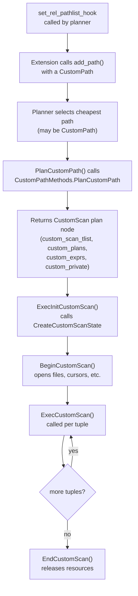

# Custom Scan Providers

A custom scan provider is an extension that introduces a new scan node into the query plan tree. Rather than patching the core executor, the extension participates as a first-class citizen in planning and execution: it proposes a `CustomPath` during the planning phase, receives a callback to turn that path into a `CustomScan` plan node, and then drives execution through a `CustomScanState` that the executor manages alongside all other plan nodes.

This is the mechanism that columnar storage engines (Citus Columnar, Hydra), distributed query layers, and scan accelerators use to replace or augment the heap access path without touching core code. The design is analogous to how foreign data wrappers extend PostgreSQL with `ForeignScan`. Custom scans, however, are for any access method — not only remote sources.

## Path → Plan → State Lifecycle

The three-phase lifecycle mirrors the standard planning and execution pipeline. Each phase is driven by a distinct callback table.



### Planning side

The extension registers `set_rel_pathlist_hook` in `_PG_init()`. This hook fires after the core planner has built its initial set of paths for a base relation. The extension inspects the `RelOptInfo`, checking the relation's OID, reloptions, or table access method. If it can handle the relation, it constructs a `CustomPath` and calls `add_path()` to inject the path into the relation's path list.

`CustomPath` embeds a standard `Path` header (carrying the cost estimates and row count that the planner uses for comparison) along with `custom_paths` (child paths for sub-operations, such as an inner index scan that the custom scan will drive), `custom_private` (opaque planner data, such as a list of column group identifiers), and a pointer to `CustomPathMethods`. The planner treats a `CustomPath` exactly like any other path. It competes on cost, and the cheapest-overall path wins. If the custom scan is not cheaper, `add_path()` in `pathnode.c` discards it automatically — the function prunes paths that are dominated on both cost and row count by existing alternatives (`pathnodes.h`).

The `flags` bitmask on `CustomPath` communicates capabilities to the planner. `CUSTOMPATH_SUPPORT_BACKWARD_SCAN` signals that the scan can run in reverse order. Some `ORDER BY` plans need this. `CUSTOMPATH_SUPPORT_MARK_RESTORE` signals support for mark/restore, needed for merge joins. `CUSTOMPATH_SUPPORT_PROJECTION` indicates that the extension evaluates its own target list and does not need the executor to apply projection on top.

Extensions can also inject into join planning via `set_join_pathlist_hook`. This hook fires when the planner is building paths for a join relation. It allows an extension to propose a custom join strategy — useful for distributed query executors that want to push joins down to remote nodes.

### Plan-building side

When the planner selects a `CustomPath` as the best path for a relation, it calls `PlanCustomPath()` from `createplan.c`. This invokes the `CustomPathMethods.PlanCustomPath` callback, which the extension must implement. The callback receives the planner's `root`, the `RelOptInfo`, the chosen `CustomPath`, the target list, the restriction clauses, and any child plans already converted to `Plan` nodes. It returns a `CustomScan *` plan node.

The `CustomScan` node carries four data lists that survive into execution (`plannodes.h`):

| Field | Purpose |
|---|---|
| `custom_scan_tlist` | Describes the tuple format produced by the scan. If empty, the base relation's row type is used. |
| `custom_plans` | Subplan nodes that the custom scan drives (for example, an inner index scan). |
| `custom_exprs` | Expressions that the core executor will walk during `EXPLAIN`, `COPY`, and parallel query setup. Any expressions the extension evaluates at runtime that contain `Var` references must appear here so the core infrastructure can handle them correctly. |
| `custom_private` | Opaque planner data passed through to execution without interpretation. Typically holds serialized configuration, column group lists, or filter parameters. |

The `CustomScan` node also carries a `custom_relids` bitmask identifying which range table entries this scan touches, and a pointer to the registered `CustomScanMethods` struct. The methods pointer is how the executor locates the correct execution callbacks at runtime without a switch statement over node types.

When constructing a `CustomScan`, the extension calls `make_customscan()` to allocate the node and then fills in its fields. The target list on the scan plan must match what `BeginCustomScan` and `ExecCustomScan` will actually produce — mismatches between the declared `custom_scan_tlist` and the tuples returned at runtime cause incorrect results or crashes.

### Execution side

`ExecInitCustomScan()` in `nodeCustom.c` drives executor initialization. It calls `cscan->methods->CreateCustomScanState(cscan)` to let the extension allocate its `CustomScanState`. The extension must return a struct whose first field is a `CustomScanState` — a common C embedding pattern that lets the extension store arbitrary per-scan state after the standard fields without a separate allocation. The extension sets `css->methods` to its `CustomExecMethods` pointer inside `CreateCustomScanState`.

After the extension returns its state object, the core code sets `css->ss.ps.ExecProcNode = ExecCustomScan` so the standard executor dispatch loop can call the node without any special-casing. It then sets up expression contexts, determines the scan tuple descriptor from `cscan->custom_scan_tlist` (or from the base relation if the list is empty), initializes the result slot, and sets up projection info. Finally it calls `css->methods->BeginCustomScan(css, estate, eflags)` so the extension can open files, establish cursors, or prepare any other runtime state.

During execution the standard dispatch path calls the static `ExecCustomScan()` wrapper, which immediately forwards to `node->methods->ExecCustomScan(node)`. The extension returns a filled `TupleTableSlot *` for each tuple, or NULL when the scan is exhausted. The core does not apply any filtering inside this dispatch path. The extension is responsible for evaluating any pushed-down predicates that it claims to handle. The core evaluates `qual` expressions from the plan node on top of the returned tuples.

If the executor needs to re-execute the scan — for a nested-loop inner side, for a cursor scroll, or after a subplan parameter change — it calls `ExecReScanCustomScan`. `ExecReScanCustomScan` forwards to `ReScanCustomScan`. The extension must reset its scan position to the beginning and prepare to deliver tuples from the start again.

## Callback Tables

### CustomPathMethods

Registered at plan time. The only required callback is `PlanCustomPath`, which converts the chosen path into a `CustomScan` plan node. An optional `ReparameterizeCustomPathByChild` callback supports reparameterizing the path when the planner is building a parameterized path for a child of an append relation (`extensible.h`).

### CustomScanMethods

Registered globally via `RegisterCustomScanMethods()`. Contains a single required callback:

| Callback | Purpose |
|---|---|
| `CreateCustomScanState` | Allocate the `CustomScanState` (or a larger struct that embeds it). Must set the node tag and `methods` pointer. |

The `CustomName` string in this struct is the identity that ties a serialized `CustomScan` plan back to the correct implementation. It must be unique across all loaded extensions. If two extensions register the same name, `GetCustomScanMethods()` will return the wrong implementation.

### CustomExecMethods

Attached to the `CustomScanState` at `CreateCustomScanState` time, not registered globally. All four required methods must be non-NULL:

| Callback | Required | Purpose |
|---|---|---|
| `BeginCustomScan` | Yes | Initialize the scan: open storage, set up cursors, acquire locks. |
| `ExecCustomScan` | Yes | Return the next tuple as a `TupleTableSlot *`, or NULL when done. |
| `EndCustomScan` | Yes | Release all resources acquired in `Begin`. Called once per scan. |
| `ReScanCustomScan` | Yes | Reset the scan to the beginning for re-execution (nested loops, CURSOR SCROLL). |
| `MarkPosCustomScan` | No | Record the current scan position so it can be restored. Requires `CUSTOMPATH_SUPPORT_MARK_RESTORE` flag. |
| `RestrPosCustomScan` | No | Restore a position previously saved by `MarkPos`. |
| `ExplainCustomScan` | No | Emit additional lines in `EXPLAIN` output for this scan node. |
| `EstimateDSMCustomScan` | No | Return the number of bytes of dynamic shared memory this scan needs in a parallel worker. |
| `InitializeDSMCustomScan` | No | Populate the allocated DSM segment in the leader process. |
| `ReInitializeDSMCustomScan` | No | Re-initialize the DSM segment for a rescan in parallel context. |
| `InitializeWorkerCustomScan` | No | Read from the DSM segment inside a parallel worker. |
| `ShutdownCustomScan` | No | Called in each worker when it finishes, before the worker exits. |

## Registration

An extension registers its scan provider in `_PG_init()`:

```c
static const CustomScanMethods my_scan_methods = {
    .CustomName            = "MyExtScan",
    .CreateCustomScanState = my_create_scan_state,
};

void
_PG_init(void)
{
    RegisterCustomScanMethods(&my_scan_methods);

    /* hook the planner to inject CustomPath nodes */
    prev_set_rel_pathlist = set_rel_pathlist_hook;
    set_rel_pathlist_hook = my_set_rel_pathlist;
}
```

`RegisterCustomScanMethods()` stores the methods struct in a process-local hash table keyed by `CustomName`. When the executor initializes a `CustomScan` plan node it calls `GetCustomScanMethods(cscan->methods->CustomName, false)` to look up the live function pointers (`extensible.h`). There is no separate registration step for `CustomExecMethods`. `CreateCustomScanState` attaches those directly to the `CustomScanState` it allocates, so the executor reaches them through the state object.

Because plan trees are serialized to shared memory for parallel workers and cached across `PREPARE`/`EXECUTE` cycles, the `CustomName` must survive the serialize/deserialize round-trip and match the name registered by the loaded library. An extension that changes its `CustomName` between versions will cause plan-cache failures. For the same reason, the library providing the named methods must be present in `shared_preload_libraries` or otherwise loaded before the plan is executed.

The planner hook must follow the standard [[subsystems/extensions/hooks|chaining convention]]: save the previous hook value, install the extension's function, and call the saved pointer at the end of the hook body so that multiple extensions coexist. Failing to chain silently drops later-loaded extensions' path injections.

## Parallel Query Support

By default, a custom scan node forces the query to use a single worker. To participate in parallel execution, the extension implements the five parallel callbacks (`EstimateDSM`, `InitializeDSM`, `ReInitializeDSM`, `InitializeWorker`, `ShutdownCustomScan`) and sets `CUSTOMPATH_SUPPORT_BACKWARD_SCAN` and other capability flags on the `CustomPath` as appropriate.

The coordination model mirrors what PostgreSQL's built-in parallel sequential scan uses: the leader estimates and allocates a shared memory segment via the dynamic shared memory (DSM) table-of-contents mechanism, then each worker looks up its segment by plan node ID and begins scanning an independent range. The extension owns the coordination protocol inside that segment. Without the `EstimateDSM` callback, the executor cannot arrange workers and falls back to a single process.

## EXPLAIN Support

Implementing `ExplainCustomScan` lets the extension append lines to `EXPLAIN` output that describe internal details — which column groups are being read, what filters were pushed down, statistics about block skipping, and so on. The callback receives the `ExplainState` and a list of ancestor nodes. It calls `ExplainPropertyText`, `ExplainPropertyInteger`, and related helpers to emit structured output that respects `EXPLAIN (FORMAT JSON)` and `EXPLAIN (FORMAT XML)` as well as the default text format.

Without this callback, `EXPLAIN` shows only the standard plan-node fields and does not reveal any extension-specific information.

## CustomScanState Layout

`CustomScanState` is defined in `execnodes.h` and embeds a `ScanState`, which in turn embeds a `PlanState`. Extensions define their private execution state by declaring a struct that starts with a `CustomScanState` as its first member:

```c
typedef struct MyExtScanState
{
    CustomScanState css;    /* must be first */

    /* extension-private fields */
    MyExtColumnFile *column_file;
    int              current_stripe;
    TupleTableSlot  *batch_slot;
} MyExtScanState;
```

The `CustomScanState.slotOps` field lets the extension specify a non-default `TupleTableSlotOps` for the scan tuple slot. Extensions that return tuples in a buffer-pinned or minimal format set this before `ExecInitCustomScan` calls `ExecInitScanTupleSlot`. If left NULL, the executor uses virtual slots. Choosing the right slot type avoids unnecessary tuple deformation passes between the scan and upstream plan nodes.

`ExecInitCustomScan` populates the `css.ss.ss_currentRelation` field when `cscan->scan.scanrelid > 0`, giving the extension an open relation descriptor. Extensions that do not scan any single heap relation set `scanrelid = 0` and manage any required relation opens themselves in `BeginCustomScan`.

## Cost Estimation and Selectivity

For the planner to choose a `CustomPath` over the heap sequential scan or index scans, the path's cost fields must be realistic. The extension fills `path.startup_cost`, `path.total_cost`, and `path.rows` before calling `add_path()`. Underestimating cost produces plans that look better than they are. Overestimating cost causes the planner to discard the custom scan even when it would be faster.

Extensions that implement column-group skipping can estimate `rows` by examining per-stripe or per-row-group min/max statistics against the query's restriction clauses, producing a lower row estimate than the full table cardinality. Startup cost should reflect any connection or file-open overhead, while total cost accounts for bytes read and CPU work per tuple. The planner's cost model is built for generic I/O. Extensions with novel access characteristics (SIMD decompression, GPU offload, network round-trips) should calibrate their cost constants against real execution times, so the planner's choice is well-grounded.

## Real-World Usage

Columnar storage extensions are the canonical example. Citus Columnar and Hydra intercept the heap scan path for columnar tables by registering a `set_rel_pathlist_hook`. When the relation is a columnar table, they add a `CustomPath` whose cost reflects reading only the relevant column groups rather than full row pages. The resulting `CustomScan` node drives an executor that reads column-oriented files directly, skipping entire row groups based on min/max statistics. These extensions implement `ExplainCustomScan` to show which column groups were scanned and how many row groups were skipped by predicate pushdown.

Foreign data wrappers use a parallel mechanism (`ForeignScan` / `FdwRoutine`) rather than `CustomScan`. The structural design — path proposal, plan node construction, executor state allocation — is essentially the same. The FDW API is older and more prescriptive. The custom scan API was introduced in PG 9.5 to give extensions the same capability in a more flexible form that does not require catalog entries in `pg_foreign_data_wrapper`.

Extensions like `pg_hint_plan` influence which paths the planner considers by using `planner_hook` or the finer-grained path hooks. They do not necessarily inject `CustomPath` nodes — instead, they steer the planner toward existing paths rather than introducing new scan methods. The distinction matters. A hint changes the planner's decision among existing paths. A custom scan provider introduces a path that would not otherwise exist.

## See Also

- [[subsystems/extensions/hooks]] — set_rel_pathlist_hook and planner hook registration
- [[subsystems/extensions/overview]] — extension lifecycle, _PG_init, RegisterCustomScanMethods
- [[subsystems/executor/overview]] — ExecInitNode and the executor dispatch mechanism
- [[subsystems/planner/overview]] — how paths are costed and selected

## Related Topics

- [[subsystems/extensions/foreign-data-wrappers|Foreign Data Wrappers]] — parallel API using ForeignScan/FdwRoutine; same path→plan→state lifecycle as custom scans
- [[subsystems/planner/cost-model|Cost Model]] — how startup_cost, total_cost, and rows are evaluated when the planner chooses among competing paths
- [[subsystems/executor/seq-scan|Sequential Scan]] — the heap scan path that custom scan providers commonly replace or augment
- [[subsystems/executor/parallel|Parallel Query]] — DSM coordination model that custom scans must implement to support parallel workers
- [[subsystems/indexes/index-am|Index Access Method]] — the analogous extension API for custom index types
- [[subsystems/planner/selectivity-estimation|Selectivity Estimation]] — how row-count estimates feed into path costing, relevant for column-group skipping
