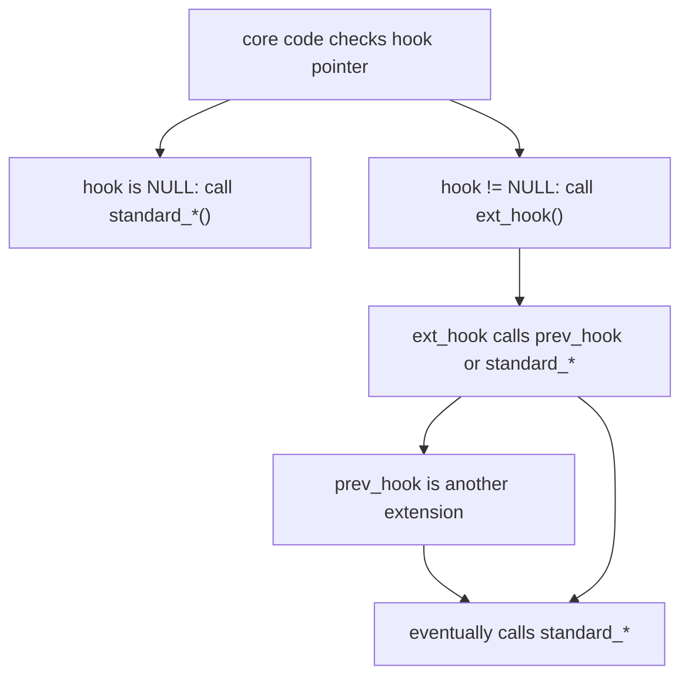

PostgreSQL's hook system is a set of global function pointers scattered throughout the backend. Extensions can override these pointers to intercept or augment core processing. Each hook is a `PGDLLIMPORT`-exported global variable of a specific function-pointer type. When the pointer is non-NULL, the core code calls it instead of (or in addition to) its standard implementation.

## The hook pattern

Every extension that installs a hook follows the same convention: save the current pointer value into a module-static `prev_*` variable, then replace it with the extension's own function. This forms a linked chain. When the extension's function runs, it must call the saved pointer before or after doing its own work. Failing to do so silently drops every other extension that installed the same hook earlier in the loading sequence.

```c
/* Module-static storage for the previous hook */
static ExecutorEnd_hook_type prev_ExecutorEnd = NULL;

void
_PG_init(void)
{
    prev_ExecutorEnd = ExecutorEnd_hook;
    ExecutorEnd_hook = my_ExecutorEnd;
}

static void
my_ExecutorEnd(QueryDesc *queryDesc)
{
    /* do work before or after */
    if (prev_ExecutorEnd)
        prev_ExecutorEnd(queryDesc);
    else
        standard_ExecutorEnd(queryDesc);
}
```

The `else standard_*` branch is important: if this extension is first in the chain (no previous hook), it must still invoke the standard implementation. Extensions that wrap the planner or executor and omit this call will silently skip all query execution.



## Extension lifecycle

The hook installation point is `_PG_init()`, the entry function that PostgreSQL's dynamic loader (`dfmgr.c`) calls once when a shared library is first loaded. `_PG_init` is called exactly once per backend process per library. There is a symmetric `_PG_fini()` that runs when the library is unloaded. PostgreSQL backends do not normally unload libraries during their lifetime, so `_PG_fini` is rarely used in practice.

For hooks that need to be active from the very start of a session — before any user code runs — the library must be listed in `shared_preload_libraries`. This causes `_PG_init` to run during the postmaster's startup sequence, so every forked backend inherits the hook pointer already set. Libraries loaded on demand via `session_preload_libraries` or explicit `LOAD` install their hooks only for the current session.

The order of entries in `shared_preload_libraries` determines chain order. The last library to call `_PG_init` ends up at the head of the chain, so it runs first. When two extensions both wrap the same hook, the one listed last in `shared_preload_libraries` takes outermost control.

## Executor lifecycle hooks

The four executor hooks bracket every query execution. Their declarations are in `src/include/executor/executor.h`.

| Hook | Signature | Standard fallback | When called |
|---|---|---|---|
| `ExecutorStart_hook` | `(QueryDesc *, int eflags)` | `standard_ExecutorStart` | Before plan tree is initialized |
| `ExecutorRun_hook` | `(QueryDesc *, ScanDirection, uint64 count, bool once)` | `standard_ExecutorRun` | During tuple retrieval |
| `ExecutorFinish_hook` | `(QueryDesc *)` | `standard_ExecutorFinish` | After last tuple, before cleanup |
| `ExecutorEnd_hook` | `(QueryDesc *)` | `standard_ExecutorEnd` | During resource release |

`ExecutorStart` is the only place where an extension can add instrumentation options before the plan tree is initialized. `auto_explain` uses this to set `queryDesc->instrument_options` to `INSTRUMENT_TIMER` or `INSTRUMENT_ROWS` when a query requests per-node timing. If it waited until `ExecutorEnd`, the instrumentation infrastructure would never have been allocated.

`ExecutorEnd` is the natural place to read timing results because `queryDesc->totaltime` and per-node `Instrumentation` structs have been finalized. Both `auto_explain` and `pg_stat_statements` call `InstrEndLoop(queryDesc->totaltime)` at this point to flush any outstanding counters before reading `totaltime->total`.

`ExecutorRun` wraps the actual row-fetching loop. Extensions that need an accurate nesting depth counter (to distinguish top-level queries from subqueries) increment and decrement a static counter here, using `PG_TRY`/`PG_FINALLY` to guarantee the decrement even on error.

## Planner hook

`planner_hook` (`src/include/optimizer/planner.h`) replaces the entire top-level planner call. Its signature matches `standard_planner`:

```c
typedef PlannedStmt *(*planner_hook_type) (Query *parse,
                                            const char *query_string,
                                            int cursorOptions,
                                            ParamListInfo boundParams);
```

Unlike the executor hooks, `planner_hook` is a complete replacement: the hook is called *instead of* `standard_planner`, not in addition to it. An extension that wants to tweak hints but otherwise use the standard planner must explicitly call either `prev_planner_hook` or `standard_planner` to produce a plan. `pg_hint_plan` uses this hook to rewrite the `Query` node with hints before handing it to the standard planner.

Note in the source comment: "`standard_planner()` scribbles on its `Query` input" — the Query tree is not preserved across planning. Extensions must not assume the Query is immutable inside `planner_hook`.

### Finer-grained planner hooks

Two additional hooks operate inside the standard planner rather than replacing it:

- `set_rel_pathlist_hook` (`src/include/optimizer/paths.h`): called after the core code has built initial paths for a base relation. Extensions can add custom paths without replacing the entire planning pipeline.
- `create_upper_paths_hook` (`src/include/optimizer/planner.h`): called when the planner is building paths for an upper relation (aggregation, sort, window functions). The `stage` argument identifies which upper-rel phase is being processed.
- `join_search_hook` (`src/include/optimizer/paths.h`): replaces the join-order search entirely. When set, the standard dynamic programming or GEQO algorithm is bypassed.

These hooks are additive: an extension adds paths; the planner still chooses the cheapest. `planner_hook` is destructive: the extension controls the entire output.

## Post-parse analysis hook

The post-parse analysis hook (`post_parse_analyze_hook`, `src/include/parser/analyze.h`) fires at the end of parse analysis, after the raw parse tree has been transformed into a `Query` node but before planning begins.

```c
typedef void (*post_parse_analyze_hook_type) (ParseState *pstate,
                                               Query *query,
                                               JumbleState *jstate);
```

`pg_stat_statements` uses this hook to capture the `queryId` computed by the query jumbler. The `JumbleState` argument, introduced to replace an older mechanism, carries information about literal constant positions so that the extension can record a normalized query text with `$1`, `$2`, etc. substituted for constants.

The hook fires before planning, which means the `Query` node is still modifiable. Extensions must be careful: modifying the Query here affects the plan that will be produced. The hook is not called for utility statements that bypass parse analysis.

## Utility statement hook

The utility statement hook (`ProcessUtility_hook`, `src/include/tcop/utility.h`) intercepts all DDL and utility commands — everything that is not a `SELECT`, `INSERT`, `UPDATE`, `DELETE`, or `MERGE`. This includes `CREATE TABLE`, `DROP INDEX`, `VACUUM`, `EXPLAIN`, `COPY`, `SET`, `BEGIN`, `COMMIT`, and so on.

```c
typedef void (*ProcessUtility_hook_type) (PlannedStmt *pstmt,
                                           const char *queryString,
                                           bool readOnlyTree,
                                           ProcessUtilityContext context,
                                           ParamListInfo params,
                                           QueryEnvironment *queryEnv,
                                           DestReceiver *dest,
                                           QueryCompletion *qc);
```

The `readOnlyTree` flag signals whether the caller expects the `PlannedStmt` to stay unmodified. This flag matters for extensions that rewrite the utility statement tree. `ProcessUtilityContext` distinguishes top-level calls from calls made recursively by other utility commands (e.g., `ALTER TABLE` may call internal `CREATE INDEX` paths).

`pg_stat_statements` installs a `ProcessUtility_hook` to track utility statement execution times and assign queryIds to trackable utility commands (like `CALL`, `PREPARE`, `EXECUTE`).

## Object access hook

The object access hook (`object_access_hook`, `src/include/catalog/objectaccess.h`) fires at well-defined points during object lifecycle operations. The `ObjectAccessType` enum defines the events:

| Event | When |
|---|---|
| `OAT_POST_CREATE` | Just after an object is created |
| `OAT_DROP` | Just before an object is deleted |
| `OAT_POST_ALTER` | Just after an object is altered |
| `OAT_NAMESPACE_SEARCH` | Before a name lookup under a schema |
| `OAT_FUNCTION_EXECUTE` | Before a function is called via fmgr |
| `OAT_TRUNCATE` | Before a table is truncated |

```c
typedef void (*object_access_hook_type) (ObjectAccessType access,
                                          Oid classId,
                                          Oid objectId,
                                          int subId,
                                          void *arg);
```

The `arg` pointer is cast to an event-specific struct (`ObjectAccessPostCreate`, `ObjectAccessDrop`, `ObjectAccessPostAlter`, `ObjectAccessNamespaceSearch`) depending on the event type. The `classId` is the OID of the system catalog that owns the object (e.g., `RelationRelationId` for tables, `ProcedureRelationId` for functions).

An additional `object_access_hook_str` variant accepts a string object identifier instead of an OID, for objects identified by name rather than catalog OID.

Audit-logging extensions use `object_access_hook` to record who created or dropped which catalog objects. Unlike `ProcessUtility_hook`, this hook fires even for objects created internally (e.g., the implicit index created by `PRIMARY KEY`). The `is_internal` flag in the argument struct distinguishes user-initiated operations from internal ones.

`OAT_NAMESPACE_SEARCH` is unusual: it is called before a name lookup in a schema. The hook can deny the search by setting `result = false` in the `ObjectAccessNamespaceSearch` arg. This is how row-level security and label-based access control extensions intercept schema visibility.

## Authentication hook

The authentication hook (`ClientAuthentication_hook`, `src/include/libpq/auth.h`) is called at the end of client authentication, after PostgreSQL has determined whether the client's credentials are valid.

```c
typedef void (*ClientAuthentication_hook_type) (Port *port, int status);
```

`status` is `STATUS_OK` if authentication succeeded or `STATUS_ERROR` if it failed. The hook runs regardless of outcome, allowing extensions to log both successful and failed logins. An extension can reject a connection that would otherwise have succeeded by calling `ereport(FATAL, ...)` inside the hook — the connection will be terminated.

Because this hook runs inside the authentication code path, it executes before the session is fully set up. Extensions must not perform operations that require a valid transaction context.

## Log emission hook

The log emission hook (`emit_log_hook`, `src/include/utils/elog.h`) intercepts every log message that would be sent to the server log, before the message reaches any configured log destinations.

```c
typedef void (*emit_log_hook_type) (ErrorData *edata);
```

The `ErrorData` struct contains the error level, message, detail, hint, SQL state code, location information, and flags controlling which destinations will receive the message. An extension can suppress a message by setting `edata->output_to_server = false`, redirect it by calling an external logging API, or enrich it by appending to `edata->message`.

The hook fires only for messages that would go to the server log (`edata->output_to_server` is true at the time of the call). Client-only messages do not trigger it.

Log-routing extensions such as `pg_log_json` and connection monitors use this hook to send structured log output to external systems. Care is needed: calling any function that might itself log from inside `emit_log_hook` can recurse.

## Password check hook

The password check hook (`check_password_hook`, `src/include/commands/user.h`) is called when a plaintext password is provided to `CREATE ROLE` or `ALTER ROLE`. It receives the role name, the shadow password (already in the storage format, e.g., SCRAM verifier), the password type enum, and the optional expiry timestamp.

```c
typedef void (*check_password_hook_type) (const char *username,
                                           const char *shadow_pass,
                                           PasswordType password_type,
                                           Datum validuntil_time,
                                           bool validuntil_null);
```

Password policy extensions throw an error from inside this hook to reject a password that does not meet complexity requirements. The hook is not called for `md5` passwords set via the pre-hashed `PASSWORD 'md5...'` syntax, because PostgreSQL cannot inspect the cleartext at that point. This is a well-known limitation of password-policy enforcement in PostgreSQL.

## Shared memory hooks

Extensions that maintain data in shared memory need two additional hooks. `shmem_request_hook` (`src/include/miscadmin.h`) is called during postmaster startup when shared memory is being sized; the extension calls `RequestAddinShmemSpace` here. `shmem_startup_hook` (`src/include/storage/ipc.h`) is called after shared memory has been allocated; the extension calls `ShmemInitStruct` to carve out its segment.

`pg_stat_statements` is the canonical example: it reserves space for its hash table of query statistics via `shmem_request_hook` and initializes the hash table's structure via `shmem_startup_hook`.

## Security implications

A hook installed by a shared library runs in the backend process with full backend privileges — the same privileges as the PostgreSQL server process itself. There is no permission check on `shared_preload_libraries`; any library listed there runs as the server. This means a malicious or buggy library installed via `shared_preload_libraries` can read arbitrary memory, bypass row-level security, or intercept every query. Superuser access is required to change `shared_preload_libraries`, but the implication is that any shared library on the filesystem that the server can load is a potential trust boundary.

Extensions loaded on-demand (not via `shared_preload_libraries`) also run with full backend privileges, but only after a superuser or trusted-extension mechanism has allowed them to load.

## Reference: major hooks at a glance

| Hook variable | Header | Chaining required | Can replace standard impl |
|---|---|---|---|
| `ExecutorStart_hook` | `executor/executor.h` | Yes | Yes |
| `ExecutorRun_hook` | `executor/executor.h` | Yes | Yes |
| `ExecutorFinish_hook` | `executor/executor.h` | Yes | Yes |
| `ExecutorEnd_hook` | `executor/executor.h` | Yes | Yes |
| `ExecutorCheckPerms_hook` | `executor/executor.h` | Yes | Partial |
| `planner_hook` | `optimizer/planner.h` | Yes | Yes (full replacement) |
| `create_upper_paths_hook` | `optimizer/planner.h` | Yes | No (additive) |
| `set_rel_pathlist_hook` | `optimizer/paths.h` | Yes | No (additive) |
| `join_search_hook` | `optimizer/paths.h` | Yes | Yes (full replacement) |
| `post_parse_analyze_hook` | `parser/analyze.h` | Yes | No (observe/annotate) |
| `ProcessUtility_hook` | `tcop/utility.h` | Yes | Yes |
| `object_access_hook` | `catalog/objectaccess.h` | No (single slot) | No (observe/deny) |
| `ClientAuthentication_hook` | `libpq/auth.h` | No (single slot) | No (observe/deny) |
| `emit_log_hook` | `utils/elog.h` | No (single slot) | No (observe/suppress) |
| `check_password_hook` | `commands/user.h` | No (single slot) | No (enforce/reject) |
| `shmem_startup_hook` | `storage/ipc.h` | Yes | No |
| `shmem_request_hook` | `miscadmin.h` | Yes | No |
| `get_relation_stats_hook` | `utils/selfuncs.h` | Yes | Yes |
| `get_index_stats_hook` | `utils/selfuncs.h` | Yes | Yes |

Hooks marked "No (single slot)" in the chaining column do not prevent chaining — nothing stops an extension from saving and restoring those pointers — but the conventional usage is a single consumer because the semantics (deny, suppress, observe) do not compose naturally between multiple extensions. In practice, `object_access_hook` is the most common exception: security extensions do chain it, using the same pattern as the executor hooks.

## pg_stat_statements and auto_explain as canonical examples

`pg_stat_statements` is the most instructive example of multi-hook coordination. Its `_PG_init` installs six hooks simultaneously: `post_parse_analyze_hook`, `planner_hook`, `ExecutorStart_hook`, `ExecutorRun_hook`, `ExecutorFinish_hook`, `ExecutorEnd_hook`, and `ProcessUtility_hook`. The flow is:

1. `post_parse_analyze_hook` fires after parse analysis and stamps `query->queryId` using the jumbler's hash. It also pre-creates the normalized query string entry in the shared hash table when the query has literal constants.
2. `planner_hook` wraps `standard_planner` to optionally track planning time as a separate metric.
3. `ExecutorStart_hook` allocates a `totaltime` `Instrumentation` node on the query's [[subsystems/memory/contexts|memory context]] so timing accumulates throughout execution.
4. `ExecutorEnd_hook` reads `queryDesc->plannedstmt->queryId` and `queryDesc->totaltime->total`, then calls `pgss_store` to update the statistics entry in shared memory. It calls `prev_ExecutorEnd` or `standard_ExecutorEnd` after its own work.

`auto_explain` uses the same four executor hooks but for a different purpose. It needs `ExecutorStart` to conditionally activate per-node instrumentation (`INSTRUMENT_TIMER`) before the plan tree is initialized, and `ExecutorEnd` to call `ExplainPrintPlan` on the finished plan before the `QueryDesc` is torn down. Without the `ExecutorStart` hook, the per-node timing data would not exist by the time `ExecutorEnd` ran.

The interplay between these two extensions illustrates why chaining is non-negotiable: if `auto_explain` failed to call `prev_ExecutorEnd` after printing its plan, `pg_stat_statements` would never see the completed query and its statistics would silently go unrecorded.

## Related Topics

- [[subsystems/extensions/overview|Extensions Overview]] — broader survey of PostgreSQL's extension infrastructure, of which the hook system is one component.
- [[subsystems/observability/auto-explain|auto_explain]] — canonical multi-hook extension that uses ExecutorStart and ExecutorEnd hooks to conditionally capture per-node timing and emit EXPLAIN output.
- [[subsystems/observability/pg-stat-statements|pg_stat_statements]] — the most instructive example of coordinating six hooks simultaneously to track query statistics across parse, plan, and execution phases.
- [[subsystems/executor/overview|Executor Overview]] — describes the QueryDesc lifecycle and instrumentation infrastructure that executor hooks intercept.
- [[subsystems/planner/overview|Planner Overview]] — covers the planning pipeline that planner_hook, set_rel_pathlist_hook, and create_upper_paths_hook extend.
- [[subsystems/extensions/injection-points|Injection Points]] — a newer, more structured alternative to hooks for adding custom behavior at named points in the backend.
- [[subsystems/auth/overview|Authentication Overview]] — covers the authentication flow that ClientAuthentication_hook taps into at session startup.
