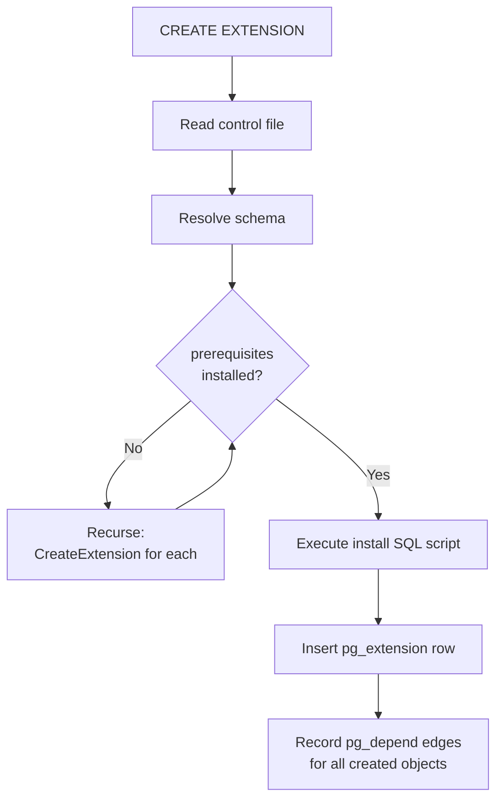

# Extension System

PostgreSQL extensions are named, versioned bundles of SQL objects — functions, types, operators, indexes, casts, tables, and more — plus an optional shared library (`.so`/`.dll`). The extension system provides atomic lifecycle management: install, upgrade, and removal in a single transaction. `pg_depend` tracks every created object, so `DROP EXTENSION` can cleanly remove everything the extension owns.

Extensions are the sanctioned mechanism for adding new capabilities without patching the core server. They can define entirely new data types, new index access methods, new query operators, new background workers, custom GUC parameters, and executor hooks — while remaining independently versioned and distributable.

## Anatomy of an Extension

An extension is described by three things on disk: a control file, one or more SQL scripts, and optionally a shared library.

### Control file

The control file lives in `$sharedir/extension/` and has the same syntax as `postgresql.conf`. The server reads it when processing `CREATE EXTENSION`:

```
# $sharedir/extension/pg_trgm.control
comment = 'text similarity measurement and index searching based on trigrams'
default_version = '1.6'
module_pathname = '$libdir/pg_trgm'
relocatable = true
```

Key fields:

| Field | Purpose |
|---|---|
| `default_version` | Version string used when `CREATE EXTENSION` omits `VERSION` |
| `comment` | One-line description shown by `\dx+` |
| `module_pathname` | Path to the shared library; `$libdir` expands to the PostgreSQL library directory |
| `requires` | Comma-separated prerequisite extension names |
| `schema` | Fixed target schema for non-relocatable extensions |
| `relocatable` | Whether the schema can be changed later with `ALTER EXTENSION SET SCHEMA` |
| `superuser` | Whether installation requires superuser (default: true) |
| `trusted` | Whether non-superusers with CREATE privilege can install (PG 13+) |

### SQL scripts

SQL scripts live alongside the control file:

| Filename pattern | Purpose |
|---|---|
| `extname--version.sql` | Install script |
| `extname--oldver--newver.sql` | Upgrade script |
| `extname--unpackaged--version.sql` | Adopt pre-existing objects into the extension |

Scripts are plain SQL executed within the same transaction as `CREATE EXTENSION`. They may use `@extschema@` as a placeholder for the target schema. The server expands this placeholder before execution (extension.c). The global variable `creating_extension` is set to true during script execution so that object-creation hooks can detect that they are running inside an extension install.

Scripts may also use `MODULE_PATHNAME` as a placeholder that expands to the value of `module_pathname` from the control file. This lets a single script work across different build configurations without hardcoding the library path:

```sql
CREATE FUNCTION my_func(text) RETURNS text
    AS 'MODULE_PATHNAME', 'my_func'
    LANGUAGE C STRICT;
```

The server substitutes `MODULE_PATHNAME` before parsing the SQL, so the resulting `CREATE FUNCTION` statement contains the literal library path.

## CREATE EXTENSION Lifecycle



`CreateExtension()` in extension.c orchestrates the process:

1. The control file is parsed. The schema is resolved: if `schema` is set in the control file, that schema is used; otherwise, if `relocatable=true`, the first element of `search_path` is used.
2. Each extension listed in `requires` is checked. Missing prerequisites trigger a recursive `CreateExtension` call so that dependency order is handled automatically.
3. The install script runs via `execute_sql_string`. Every object created during this phase is automatically linked to the new `pg_extension` row because `creating_extension` and `CurrentExtensionObject` are set (extension.c).
4. A row is inserted into `pg_extension`. All created objects already have `DEPENDENCY_EXTENSION` edges pointing at this row in `pg_depend`.

### pg_extension catalog

| Column | Purpose |
|---|---|
| `oid` | Extension OID |
| `extname` | Extension name |
| `extowner` | Owner role OID |
| `extnamespace` | Schema OID where the extension's objects live |
| `extrelocatable` | Whether schema can be changed |
| `extversion` | Installed version string |
| `extconfig` | Array of regclass for configuration tables preserved by `pg_dump` |
| `extcondition` | Per-table WHERE clauses for `extconfig` dump filtering |

### DROP EXTENSION and pg_depend

Every object created by the install script carries a `DEPENDENCY_EXTENSION` (`e`) edge in `pg_depend` pointing at the `pg_extension` row. `DROP EXTENSION` follows these edges and drops all owned objects in reverse dependency order. This is effectively always a cascade — the extension owns its objects.

Objects added later with `ALTER EXTENSION extname ADD object` gain the same dependency edge. Objects removed with `ALTER EXTENSION extname DROP object` lose the edge and become independent, surviving a subsequent `DROP EXTENSION`.

### Configuration Tables and pg_dump

An extension can mark some of its tables as "configuration tables" — tables whose rows should be included in `pg_dump` output even though the tables themselves are owned by the extension and therefore not dumped as `CREATE TABLE` statements. This is the mechanism that allows `pg_hba_file_rules` or a custom ACL table to survive `pg_dump` / `pg_restore` cycles.

To register a configuration table, the extension calls `pg_extension_config_dump(relname, where_clause)` from its install script. This records the table's OID in `pg_extension.extconfig` and optionally an associated WHERE clause in `pg_extension.extcondition`. `pg_dump` then emits `COPY` or `INSERT` statements for matching rows during the data phase, after the extension has been re-created.

The WHERE clause is useful when an extension pre-populates a table with built-in data during install (rows with `is_builtin = true`, for example) and wants `pg_dump` to export only the user-added rows.

### ALTER EXTENSION UPDATE

`ALTER EXTENSION pg_trgm UPDATE TO '1.6'` finds the shortest path of upgrade scripts from the current version to the target using a graph search over available `--oldver--newver.sql` files (extension.c). Each script in the chain executes in sequence within a single transaction. `pg_extension.extversion` is updated at the end.

## Loading a Shared Library

If `module_pathname` is set in the control file, the shared library is loaded on demand by fmgr the first time a function from the extension is called. It can also be loaded explicitly via the `LOAD` command, or at server start via `shared_preload_libraries`.

The loading is handled by `internal_load_library()` in dfmgr.c. The function calls `dlopen()` with `RTLD_NOW | RTLD_GLOBAL`, making all exported symbols immediately available to other libraries. A process-level linked list of loaded `DynamicFileList` entries prevents double-loading: the inode and device number of the file are compared, so even symlinks to the same `.so` are detected as duplicates.

## ABI Verification with PG_MODULE_MAGIC

A shared library compiled against one version of PostgreSQL's internal headers may be structurally incompatible with a different version: field layouts, constants like `FUNC_MAX_ARGS` or `NAMEDATALEN`, and calling conventions may all differ. Loading such a library silently would cause data corruption or crashes. The magic block mechanism catches these mismatches at load time with a clear error message rather than undefined behaviour at runtime.

`PG_MODULE_MAGIC` is a macro defined in fmgr.h that every C extension must include exactly once in its source. It expands to a static function named `Pg_magic_func` that returns a pointer to a `Pg_magic_struct` compiled into the library at build time. The struct records:

- `len` — the size of the struct itself, detecting layout changes
- `version` — the PostgreSQL major version number
- `funcmaxargs` — the `FUNC_MAX_ARGS` compile-time constant
- `indexmaxkeys` — `INDEX_MAX_KEYS`
- `namedatalen` — `NAMEDATALEN`
- `float8byval` — whether `float8` is passed by value on this platform
- `abi_extra` — an additional ABI tag from `pg_config_manual.h`

When `internal_load_library()` opens the library, the first thing it does after `dlopen()` is call `dlsym()` to find `Pg_magic_func`. If the symbol is absent, the library is rejected immediately with a hint suggesting the extension add `PG_MODULE_MAGIC`. If found, `internal_load_library()` calls the function and compares its returned struct byte-for-byte with the server's own magic block compiled into dfmgr.c. Any mismatch causes the load to abort with a descriptive error that names exactly which fields differ (dfmgr.c, `incompatible_module_error()`). Version mismatches are reported first since a version difference makes the rest of the block meaningless to compare.

Because the magic function is a function rather than a data symbol, `dlsym()` is guaranteed to locate it portably — some platforms do not support looking up data symbols across shared library boundaries.

## Library Initialisation and Teardown

After confirming the magic block, `internal_load_library()` looks for a symbol named `_PG_init` via `dlsym()` and calls it if present (dfmgr.c). This function is the extension's single opportunity to run code at library load time, before any SQL-callable function has been invoked. The declaration `extern void _PG_init(void)` is provided centrally in fmgr.h so extensions do not need to declare it themselves.

`_PG_init` is where an extension registers anything that must exist for the lifetime of the backend process:

- **Background workers**: `RegisterBackgroundWorker()` must be called from `_PG_init` when using `shared_preload_libraries`, because background workers must be registered before any backends fork from the postmaster.
- **Custom GUC parameters**: `DefineCustomBoolVariable()`, `DefineCustomIntVariable()`, and their siblings register new `postgresql.conf`-style parameters. GUCs defined here are available for `SET` and `SHOW` immediately.
- **Server hooks**: Hook variables like `planner_hook`, `ExecutorRun_hook`, `post_parse_analyze_hook`, and many others are plain function pointers in the server. An extension saves the old hook value, installs its own function, and chains to the old one — producing a stackable hook chain if multiple extensions are loaded.
- **Custom resource managers** (PG 15+): `RegisterCustomRMgr()` registers a WAL resource manager for extensions that write their own WAL records.

`_PG_fini`, declared similarly in fmgr.h, is the counterpart called on library unload. In practice, PostgreSQL currently has no mechanism to unload a shared library from a running backend — the comment in dfmgr.c notes that hook un-registration, GUC cleanup, and background worker deregistration would all be required before it could be safe. `_PG_fini` therefore serves mainly as a forward-compatibility hook and for extensions loaded via `LOAD` in testing contexts.

## Rendezvous Variables

Two extension libraries loaded into the same backend can share state without either knowing the other's internal types by using the rendezvous variable mechanism in dfmgr.c. `find_rendezvous_variable(varName)` returns a `void **` — a pointer to a pointer — keyed by a string name in a process-global hash table. Both libraries call this function with the same agreed-upon name and each gets a pointer to the same `void *` slot. One extension places a struct pointer or function table into that slot; the other reads it out.

This mechanism allows optional cooperation between extensions without introducing a compile-time dependency between them. The convention is purely by agreement on the variable name and the pointed-to layout.

## Writing C Extension Functions

### The V1 Calling Convention

All C functions callable by fmgr must conform to the version-1 calling convention, which uses a single `FunctionCallInfo` argument and returns a `Datum`. The `PG_FUNCTION_INFO_V1(funcname)` macro (fmgr.h) does two things: it generates a companion function `pg_finfo_funcname()` that returns a `Pg_finfo_record` with `api_version = 1`, and it provides an `extern` declaration for the function itself. When fmgr first looks up a function symbol by name via `dlsym()`, it also looks up `pg_finfo_funcname` to confirm the calling convention before dispatching any calls.

The function signature always looks like:

```c
PG_FUNCTION_INFO_V1(my_function);

Datum
my_function(PG_FUNCTION_ARGS)
{
    /* ... */
}
```

`PG_FUNCTION_ARGS` expands to `FunctionCallInfo fcinfo`. The `fcinfo` struct (defined in fmgr.h as `FunctionCallInfoBaseData`) carries the argument array `fcinfo->args[]`, each element being a `NullableDatum` with a `value` field and an `isnull` flag. It also carries `fcinfo->flinfo`, a pointer to the `FmgrInfo` lookup struct that contains the function's OID, [[subsystems/memory/contexts|memory context]] (`fn_mcxt`), and a `fn_extra` slot for per-call-site cached state.

### Datum: the Universal Value Carrier

`Datum` is defined in postgres.h as `uintptr_t` — a type wide enough to hold either a scalar value directly or a pointer to a heap-allocated value. This single type is used for all arguments and return values across the fmgr interface, regardless of the actual SQL type. The design avoids the overhead of a discriminated union at every function boundary while still supporting both small and large values.

For **pass-by-value** types (integers, booleans, OIDs, and on 64-bit platforms with `USE_FLOAT8_BYVAL` also `float8` and `int64`), the value is stored directly in the `Datum`. The conversion macros such as `DatumGetInt32()` and `Int32GetDatum()` are simple inline casts (postgres.h). The `PG_GETARG_INT32(n)` macro composes these: it reads `fcinfo->args[n].value` and casts it to `int32`.

For **pass-by-reference** types (text, bytea, arrays, composite types, and any user-defined type too large to fit in a pointer), the `Datum` holds a pointer to the actual data in palloc'd memory. The extension retrieves these with `PG_GETARG_POINTER(n)` or type-specific wrappers. The distinction is compile-time: the server's type catalog records whether a type is pass-by-value. fmgr ensures the argument is packed appropriately before the call.

Return values mirror this pattern. `PG_RETURN_INT32(x)` wraps an integer into a `Datum` with `Int32GetDatum()`; `PG_RETURN_TEXT_P(x)` wraps a pointer to a `text` struct with `PointerGetDatum()`. To return SQL NULL, `PG_RETURN_NULL()` sets `fcinfo->isnull = true` and returns `(Datum) 0`.

The `float8` and `int64` types are special because their 64-bit width equals the pointer width on 64-bit platforms but not on 32-bit. PostgreSQL handles this with `USE_FLOAT8_BYVAL`: when enabled (the default on modern 64-bit builds), these types are pass-by-value and their `DatumGetFloat8`/`Float8GetDatum` conversions use a union to reinterpret bits without a memory round-trip. When disabled, they fall back to pass-by-reference with a palloc (postgres.h).

### Toasting and Detoasting

Variable-length types (all varlena types — text, bytea, arrays, user-defined types marked with `STORAGE extended`) may be stored in compressed or out-of-line [[subsystems/storage/toast|TOAST]] form. When the server passes a varlena argument to a C function, the `Datum` may be a pointer to a toasted representation rather than the live data. An extension function must detoast it before accessing the contents.

`PG_DETOAST_DATUM(datum)` calls `pg_detoast_datum()`, which returns the original datum unchanged if it is not toasted, or a palloc'd decompressed/fetched copy otherwise. For code that does not require word alignment (which is safe for most byte-oriented operations), `PG_DETOAST_DATUM_PACKED(datum)` is preferred — it avoids an unnecessary copy for datums that already use the 1-byte short varlena header, accessible via `VARSIZE_ANY` and `VARDATA_ANY`. To obtain a definitely writable copy regardless of toast status, use `PG_DETOAST_DATUM_COPY`.

The convenience macros such as `PG_GETARG_TEXT_PP(n)` already incorporate `PG_DETOAST_DATUM_PACKED`, so most code detoasts implicitly. Extensions that work with index support functions are expected to release detoasted copies explicitly using `PG_FREE_IF_COPY(ptr, n)` to avoid memory leaks during index operations (fmgr.h).

### Null Handling and Strict Functions

Unless a function is declared `STRICT` in its `CREATE FUNCTION`, it may receive NULL arguments. A non-strict function must check `PG_ARGISNULL(n)` before calling any `PG_GETARG_*` macro for argument `n`; calling a getter on a null argument yields undefined behaviour since the `isnull` flag is set but the `value` field is meaningless. Strict functions have fmgr short-circuit them before dispatch: if any argument is null, NULL is returned without the C function being called at all.

### Set-returning Functions

A C function can return a set of rows rather than a single value by using the `SRF_*` macros from funcapi.h. The pattern uses a `FuncCallContext` maintained across repeated calls by fmgr:

```c
PG_FUNCTION_INFO_V1(my_srf);
Datum
my_srf(PG_FUNCTION_ARGS)
{
    FuncCallContext *funcctx;
    if (SRF_IS_FIRSTCALL()) {
        funcctx = SRF_FIRSTCALL_INIT();
        /* allocate per-call state in funcctx->multi_call_memory_ctx */
    }
    funcctx = SRF_PERCALL_SETUP();
    if (funcctx->call_cntr < funcctx->max_calls) {
        SRF_RETURN_NEXT(funcctx, result_datum);
    } else {
        SRF_RETURN_DONE(funcctx);
    }
}
```

On the first call `SRF_IS_FIRSTCALL()` is true; `SRF_FIRSTCALL_INIT()` allocates the `FuncCallContext` in a memory context that persists across calls. Subsequent calls re-enter the function and `SRF_PERCALL_SETUP()` restores the context. `SRF_RETURN_NEXT` returns one row and signals that more are available; `SRF_RETURN_DONE` signals exhaustion. The function must be declared `RETURNS SETOF type` or `RETURNS TABLE(...)` in SQL.

### Memory Allocation

All allocations inside an extension function should use `palloc` and friends rather than `malloc`. Palloc allocates from the current memory context, which is typically the per-expression `ExprContext` memory. When the context is reset (at query end or expression evaluation end), all palloc'd memory in it is freed automatically with no explicit `pfree` required. This is critical for correctness: returning a pointer into a freed context yields dangling-pointer bugs.

For results that must outlive the current expression evaluation, allocate in `fcinfo->flinfo->fn_mcxt` (the function's own cache context) or switch contexts explicitly with `MemoryContextSwitchTo`.

### Error Handling

C extensions report errors through the same infrastructure as the server core. `elog(ERROR, "message")` is the simple form — it throws a PostgreSQL error that unwinds the call stack via `longjmp` back to the nearest error recovery point (a subtransaction savepoint or the top-level transaction abort handler).

`ereport()` is the structured form, attaching an SQLSTATE error code, detail, hint, and context fields:

```c
ereport(ERROR,
        (errcode(ERRCODE_INVALID_PARAMETER_VALUE),
         errmsg("value %d is out of range", val),
         errhint("Use a value between 1 and 100.")));
```

When a C extension needs to call server code that might raise an error and wants to handle it rather than propagate it, `PG_TRY` / `PG_CATCH` / `PG_END_TRY` mirrors the server's internal setjmp-based exception mechanism. Any error raised inside the `PG_TRY` block can be caught in `PG_CATCH`, inspected via `CopyErrorData()`, and either re-thrown with `PG_RE_THROW()` or swallowed after cleanup. Swallowing an error requires calling `FlushErrorState()` first; leaving error state active after a catch block is a bug that will corrupt subsequent error handling.

## Defining Custom Types

A base type in PostgreSQL is defined by SQL, but its I/O functions are almost always C. The minimal requirement is an input function that parses a text representation into the internal form and an output function that serialises the internal form back to text. Both must follow the V1 convention.

Because the type does not yet exist when the input and output functions are compiled, those functions use the pseudo-type `cstring` where the real type would appear. The registration sequence is always: define the I/O functions first, then `CREATE TYPE` referencing them:

```sql
CREATE FUNCTION mytype_in(cstring) RETURNS mytype
    AS 'MODULE_PATHNAME' LANGUAGE C IMMUTABLE STRICT;
CREATE FUNCTION mytype_out(mytype) RETURNS cstring
    AS 'MODULE_PATHNAME' LANGUAGE C IMMUTABLE STRICT;
CREATE TYPE mytype (
    INPUT  = mytype_in,
    OUTPUT = mytype_out,
    INTERNALLENGTH = 16,   -- or VARIABLE
    ALIGNMENT = double
);
```

The input function actually receives three arguments — `(cstring, oid, int4)`: the text string, the type's own OID (useful for polymorphic types), and the typmod. It returns a `Datum` pointing to the internal representation and should call `ereport(ERROR, ...)` for invalid input. The output function receives the internal `Datum` and returns a `cstring` allocated with `palloc`.

For binary protocol efficiency (used by the wire protocol in binary mode and by `COPY BINARY`), extensions can optionally supply send and receive functions. The receive function takes a `StringInfo` buffer and a typmod and must read exactly as many bytes as the send function will write. The send function returns a `bytea`. Providing these avoids text round-tripping when copying data between databases and when using the binary wire protocol.

Type modifiers (the number in `NUMERIC(10,2)`) are handled by optional `typmod_in` and `typmod_out` functions. `typmod_in` receives a `cstring[]` of the modifier tokens and returns an `int4` encoding them in whatever format the type finds convenient; `typmod_out` turns that `int4` back into a display string. The `int4` typmod is stored in `pg_attribute.atttypmod` for columns of the type.

The `INTERNALLENGTH` and `ALIGNMENT` fields in `CREATE TYPE` control physical storage. Fixed-length types specify `INTERNALLENGTH = N`; variable-length types use `INTERNALLENGTH = VARIABLE`, in which case the C struct must begin with a standard varlena header (`VARHDRSZ` bytes) so the TOAST infrastructure can manage it. The `STORAGE` parameter (`plain`, `external`, `extended`, `main`) controls whether the type participates in TOAST compression and out-of-line storage; `extended` (the default for varlena types) enables both.

### Operators and Operator Classes

Defining operators over a custom type (`CREATE OPERATOR`) teaches the parser how to apply the type's semantics to expressions. Operators map to underlying C functions — an operator is essentially named syntactic sugar over a function. Commutativity (`COMMUTATOR`) and negation (`NEGATOR`) hints let the planner use algebriac rewrites; declaring them correctly improves join planning.

For the planner and index access methods to exploit those operators efficiently, they must be organised into an operator class (`CREATE OPERATOR CLASS`). An operator class binds a type's operators and support functions to a specific index access method using numbered strategy slots. For a B-tree operator class, the strategies are `<` (1), `<=` (2), `=` (3), `>=` (4), `>` (5), plus a comparison support function (support function 1) and optionally a sort-order support function (support function 2). A GiST or GIN operator class uses a completely different set of strategy numbers and support functions defined by that AM's API.

The association between an operator class and an AM is what allows `CREATE INDEX ... USING btree` on a custom type — the planner knows that the registered operators fulfill the B-tree AM's comparison semantics. It can then estimate selectivity and construct index scans accordingly. Without an operator class, index creation will succeed but the planner cannot use the index.

### Casts

`CREATE CAST` defines how PostgreSQL converts between two types. The context in which a cast applies has three levels:

- **Implicit** casts are applied automatically anywhere a type mismatch appears, including in expressions with no explicit cast syntax. These should be used conservatively; promiscuous implicit casts cause hard-to-understand query parsing surprises and can break function overload resolution.
- **Assignment** casts are applied when inserting or assigning to a column of the target type but not in general expressions. This is a reasonable default when the conversion is lossless but not universally desired.
- **Explicit** casts require `CAST(x AS type)` or the `x::type` syntax. This is the safest default for new types with potentially lossy conversions.

A cast implemented by a C function must name the function in `CREATE CAST`. Binary-compatible casts — where the in-memory representation is identical and no transformation is needed — can be created with `WITHOUT FUNCTION`; the server will accept the `Datum` as-is. Casts using `WITH INOUT` round-trip through text using the types' existing I/O functions.

## Custom Index Access Methods

Since PG 9.6, extensions can introduce entirely new index access methods by registering a row in `pg_am` and implementing the `IndexAmRoutine` structure. The routine is a C struct of function pointers returned by an AM handler function whose OID is stored in `pg_am.amhandler`. It tells the executor and planner everything they need to know about the AM: what features it supports, how to cost scans, and how to perform every index operation.

The AM handler function itself uses the `PG_FUNCTION_INFO_V1` convention but returns a `Datum` wrapping an `IndexAmRoutine *` allocated with `palloc`. Index AMs implemented entirely in extensions are indistinguishable from built-in ones (btree, hash, GiST, etc.) once registered. The `bloom` extension in the PostgreSQL contrib tree is the canonical example of a complete extension-provided AM.

Key callbacks in `IndexAmRoutine` that an extension AM must populate include:

| Callback | Role |
|---|---|
| `ambuild` | Construct a new index from a heap scan |
| `ambuildempty` | Create an empty index (for `CREATE INDEX CONCURRENTLY`) |
| `aminsert` | Insert one tuple into the index |
| `amgettuple` | Fetch the next tuple from a scan (for ordered index scans) |
| `amgetbitmap` | Return a `TIDBitmap` of matching TIDs (for bitmap index scans) |
| `ambulkdelete` | Bulk-delete dead TIDs during VACUUM |
| `amvacuumcleanup` | Post-VACUUM cleanup and statistics update |
| `amcostestimate` | Estimate the cost of an index scan for the planner |
| `amoptions` | Parse and validate `WITH (...)` index storage options |

An AM that supports only bitmap scans can leave `amgettuple` as NULL. An AM that does not support ordered scans sets `amcanorder = false` in the routine struct, freeing it from implementing the ordering-related callbacks. The boolean flags in `IndexAmRoutine` (`amcanunique`, `amcanmulticol`, `amoptionalkey`, etc.) precisely describe what the AM supports so the planner and DDL commands can enforce constraints without special-casing the AM.

## Trusted Extensions

Before PG 13, installing any extension required superuser. This was an obstacle in managed cloud environments where users should self-serve common extensions but the platform cannot grant them full superuser. The `trusted` control file field bridges this gap: when `superuser=false` and `trusted=true` are both set, a non-superuser who holds `CREATE` privilege on the target schema and `CREATE` privilege on the database can install the extension.

The security model works by briefly escalating privileges during script execution (extension.c). The install script runs under a temporarily elevated security context — effectively as the bootstrap superuser — while the calling user's identity is saved and restored around the script execution. The resulting `pg_extension.extowner` records the non-superuser who issued `CREATE EXTENSION`, so ownership is correct. This means the install script can create objects that ordinarily require superuser (such as adding entries to `pg_authid`, creating event triggers, or defining casts) without granting the installing user permanent elevated access.

The trust escalation applies only to install and upgrade scripts, never to functions the extension defines. When an extension's C function runs at query time, it executes under the privileges of the calling session, exactly as any other function call. The temporary superuser escalation during script execution does not bleed into runtime behaviour.

The two conditions must be set simultaneously: `superuser=false` and `trusted=true`. Setting `superuser=true` (the default) already controls who can install, so `trusted` is only meaningful when superuser is not required. An extension with `superuser=false` and `trusted=false` can be installed by any role that owns the target schema — less restrictive than a trusted extension but without the privilege escalation.

An extension should only declare `trusted=true` if its install script has been carefully reviewed for safety at superuser privilege level, since any SQL in the script runs with elevated privileges. The canonical example is `pgcrypto`, which ships with `trusted=true` in modern PostgreSQL.

## Event Triggers and Extension Lifecycle

PostgreSQL fires event triggers around DDL statements, including those that create and drop extensions. Three event types are relevant to extension lifecycle:

- `ddl_command_start` fires before the statement executes. An event trigger function can inspect `TG_TAG` to see the command type (`CREATE EXTENSION`, `ALTER EXTENSION`, `DROP EXTENSION`) and abort the operation by raising an error. No information about the objects being created is available yet at this point, making it most useful for policy enforcement — blocking installation of certain extensions, for example.
- `ddl_command_end` fires after the statement succeeds but before the transaction commits. The `pg_event_trigger_ddl_commands()` set-returning function returns the objects created or modified during the statement, including the extension row itself and all objects created by the install script. This is the right place for auditing, logging, or post-install validation.
- `sql_drop` fires after `DROP EXTENSION` (and other drop statements) and before the transaction commits. The `pg_event_trigger_dropped_objects()` function returns the list of objects that were dropped, including the extension's member objects in order. Extensions can use this to react to other extensions being removed.
- `table_rewrite` fires when `ALTER TABLE` rewrites a table's storage.

**PostgreSQL 17:** A new `login` event type fires immediately after a client successfully authenticates, before the first query is processed. An event trigger on `login` can enforce session-level policies, set configuration variables, or record audit information. The trigger function sees the fully authenticated session and can call `ereport(FATAL, ...)` to reject the connection. This event type complements the lower-level `ClientAuthentication_hook` available to C extensions — the event trigger approach requires no compiled C code and works from any trusted procedural language.

Event trigger functions have the signature `RETURNS event_trigger` (a special pseudo-type) and are declared with `CREATE EVENT TRIGGER ... ON <event> EXECUTE FUNCTION ...`. They receive no arguments from fmgr; context is available through special functions like `pg_event_trigger_ddl_commands()` and the session-level special variables `TG_TAG` and `TG_EVENT`.

Event triggers fire even for objects created inside extension install scripts, because the install script runs as ordinary SQL within the same transaction as the `CREATE EXTENSION` statement. An extension's install script should not install event triggers that would interfere with its own install. That said, a meta-extension — one whose purpose is to audit or react to other extensions being managed — can install event triggers in its own SQL script and then observe subsequent `CREATE EXTENSION` calls from other users. Event trigger functions must be written in a trusted procedural language or in C; a C implementation follows the standard `PG_FUNCTION_INFO_V1` pattern with the function returning `(Datum) 0` after performing its side effects.

## PGXS Build Infrastructure

Extensions outside the PostgreSQL source tree use PGXS (`src/makefiles/pgxs.mk`) to build against an installed PostgreSQL. The `pg_config` tool provides all necessary compiler flags, library paths, and installation directories:

```makefile
EXTENSION = myext
DATA = myext--1.0.sql
MODULE_big = myext
OBJS = myext.o

PG_CONFIG = pg_config
PGXS := $(shell $(PG_CONFIG) --pgxs)
include $(PGXS)
```

`make install` places the shared library in `$(pg_config --pkglibdir)` and the SQL scripts and control file in `$(pg_config --sharedir)/extension/`. No server restart is required; the new extension is immediately available to any backend on the next `CREATE EXTENSION`.

Common PGXS variables:

| Variable | Purpose |
|---|---|
| `EXTENSION` | Extension name (matches the control file base name) |
| `MODULE_big` | Name of the shared library to build (without suffix) |
| `OBJS` | Object files to link into the shared library |
| `DATA` | SQL scripts to install into `$sharedir/extension/` |
| `DATA_built` | SQL scripts that are generated during the build |
| `REGRESS` | Names of regression test scripts under `sql/` |
| `HEADERS_big` | Header files to install into `$includedir/server/extension/` |

When building extensions that export header files for use by downstream extensions, `HEADERS_big` installs them into the server's include directory so other extensions can `#include` them without carrying a copy.

## Relocatable vs Non-relocatable

A **relocatable** extension (`relocatable=true`) places its objects in the schema chosen at install time. That schema can later be moved with `ALTER EXTENSION SET SCHEMA`. The install script must reference objects only via `@extschema@` or unqualified names resolved through `search_path`.

A **non-relocatable** extension hardcodes its schema in the install script. Extensions that contribute to `pg_catalog` are necessarily non-relocatable — for example, [[subsystems/observability/pg-stat-statements|pg_stat_statements]], which creates views in `pg_catalog`. So are extensions whose objects reference each other by schema-qualified names.

The `no_relocate` field in the control file is a more targeted mechanism: it lists prerequisite extensions that must not be relocated away from where the current extension expects them. This handles the case where extension A's install script references objects from extension B using qualified names — A marks B as `no_relocate` so that `ALTER EXTENSION B SET SCHEMA` is blocked while A is installed.

## See also

- [[subsystems/background/bgworker|Background Workers]] — registering background worker processes from `_PG_init`
- [[subsystems/guc|GUC System]] — `DefineCustomBoolVariable` and other GUC registration functions
- [[subsystems/catalog/core-catalogs|Core Catalogs]] — pg_depend and dependency tracking
- [[code-paths/create-function|CREATE FUNCTION]] — how CREATE FUNCTION in install scripts creates pg_proc rows
