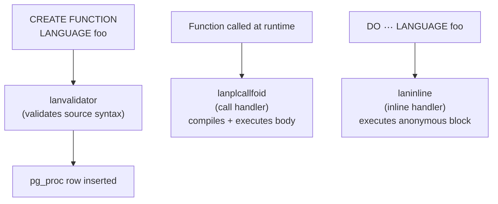

Procedural languages extend PostgreSQL's function system by allowing functions and triggers to be written in languages other than SQL and C. Each language is registered in the `pg_language` catalog as a thin descriptor that points to a set of C handler functions; those handlers bridge PostgreSQL's internal calling convention and the language runtime. The registration mechanism is what `CREATE LANGUAGE` and the language-packaging extensions (`CREATE EXTENSION plpgsql`, `CREATE EXTENSION plpython3u`) ultimately invoke.

## The pg_language Catalog

Every language available in a database — including the built-in `sql` and `internal` pseudo-languages — has a row in `pg_language` (`src/include/catalog/pg_language.h`). The important fields are:

| Column | Type | Meaning |
|---|---|---|
| `lanname` | `name` | The language name used in `CREATE FUNCTION … LANGUAGE foo` |
| `lanispl` | `bool` | True for user-defined procedural languages; false for `sql` and `internal` |
| `lanpltrusted` | `bool` | Whether the language is trusted (see below) |
| `lanplcallfoid` | `oid` | OID of the call handler function in `pg_proc` |
| `laninline` | `oid` | OID of the inline handler for `DO` blocks (zero if unsupported) |
| `lanvalidator` | `oid` | OID of the validator called at `CREATE FUNCTION` time (zero if none) |
| `lanacl` | `aclitem[]` | Access privileges; trusted languages get a PUBLIC EXECUTE grant automatically |

The three handler OIDs are the entire interface contract between PostgreSQL and the language implementation. A language that supplies only a call handler is minimally functional; the inline and validator entries are optional extensions that improve usability.

## Trusted vs. Untrusted Languages

The `lanpltrusted` flag encodes a security boundary. A trusted language (PL/pgSQL, PL/Tcl) is sandboxed: the language implementation deliberately restricts what user code can do, confining it to operations expressible through the SQL API. Any database role granted `EXECUTE` on the language can write trusted-language functions, so the database owner can safely deploy PL/pgSQL for ordinary users.

An untrusted language (PL/PythonU, PL/PerlU — the trailing "U" convention signals untrusted) places no such restrictions on user code. A Python function can open files, make network connections, call `os.system()`, or import arbitrary modules. Because these capabilities are equivalent to running arbitrary code as the backend's OS user, only superusers can create functions in untrusted languages. The database enforces this at `CREATE FUNCTION` time, not at registration time.

The distinction matters for extension packaging too. `plpgsql` is distributed as a trusted language, so a database owner can run `CREATE EXTENSION plpgsql` in their own database. `plpython3u` is untrusted. Even though its `.so` is installed system-wide, only a superuser can install it or create functions with it.

## The Three Handler Functions

Each language handler is an ordinary PostgreSQL C function registered in `pg_proc`. The three roles are distinct:

**Call handler** (`lanplcallfoid`): invoked every time a function written in that language is called. It receives a `FunctionCallInfo` struct — the same structure used for native C functions — and is responsible for locating the function source, compiling or interpreting it, marshalling argument values into the language's native representation, executing the body, and converting the return value back to a PostgreSQL `Datum`. The call handler's C signature must return `language_handler` (a special pseudotype). This return type prevents it from being called directly from SQL.

**Inline handler** (`laninline`): invoked when a `DO` block is executed. The key difference from the call handler is that there is no persistent `pg_proc` entry for the anonymous code block — the handler receives an `InlineCodeBlock` struct (passed as an `internal` argument) containing the source text and the language OID. The handler compiles and executes the block without caching it in any catalog. A language that does not register an inline handler simply cannot be used with `DO`.

**Validator** (`lanvalidator`): invoked at `CREATE FUNCTION` time, before the function is committed to the catalog. It receives the new function's OID and can inspect `pg_proc` to retrieve the source text and signature. A validator typically parses the function body and reports syntax errors early, giving the user immediate feedback instead of a runtime error on first call. Validation is advisory — a language with no validator entry skips this step entirely.

## How CREATE LANGUAGE Registers a Language

`CreateProceduralLanguage()` in `src/backend/commands/proclang.c` is the implementation of `CREATE LANGUAGE`. The steps it takes reflect what the catalog expects:

1. Only superusers may register a custom procedural language. The restriction is unconditional and separate from whether the language will be trusted.
2. The call handler function must already exist in `pg_proc` and must return `language_handler`. This type check is enforced before the catalog is touched.
3. The inline handler, if specified, must accept a single `internal` argument. The validator must accept a single `oid` argument. Return types for both are ignored, since the results are never used directly.
4. `CreateProceduralLanguage()` inserts a new row into `pg_language`, with `lanispl = true` and `lanpltrusted` set from the `TRUSTED` clause in the statement. `OR REPLACE` semantics allow updating the handler OIDs of an existing language without changing its OID, owner, or ACL.
5. `CreateProceduralLanguage()` writes dependency records linking the language to each of its three handler functions. These records block dropping a handler function before the language itself is dropped.

Notably, `CreateProceduralLanguage()` does not automatically grant `EXECUTE` on trusted languages. That grant is applied by the language extension's SQL script (the `.sql` file that `CREATE EXTENSION` runs), not by the core DDL command. This separation keeps the core command policy-neutral.

## PL/pgSQL as a Built-in Language

PL/pgSQL occupies a special position: it is compiled directly into the `postgres` binary rather than loaded from a separate shared library. `initdb` registers its call handler (`plpgsql_call_handler`), inline handler (`plpgsql_inline_handler`), and validator (`plpgsql_validator`) in the initial catalog data it installs. When `CREATE EXTENSION plpgsql` runs in a new database, it does not load a `.so` — it issues a `CREATE LANGUAGE` that points to functions already present in `pg_proc` from the bootstrap data.

Other languages (PL/Python, PL/Perl, PL/Tcl) ship as separate shared libraries. Their call handlers live in `.so` files that `dlopen` loads on first use. The `pg_language` row is what triggers the load: when PostgreSQL needs to invoke a handler, it resolves the `lanplcallfoid` OID to a `pg_proc` row, reads the `probin` field for the library path, and calls `pg_dlopen`. Subsequent calls in the same backend session reuse the already-loaded library.

## Security Implications

The call handler runs with the privileges of the backend process, not the privileges of the SQL user. This is unavoidable — the handler is C code that calls into a language runtime. For trusted languages, the security model depends entirely on the handler implementation correctly restricting what the interpreted code can do. PostgreSQL itself cannot audit or sandbox the interpreted code; it trusts the handler to enforce the isolation.

For untrusted languages, this means a superuser writing a PL/PythonU function can do anything the OS user running the backend can do: read files, write files, make network connections, or load additional native libraries. The `lanpltrusted = false` flag is therefore a signal to `CREATE FUNCTION` to require superuser privilege, acting as a coarse access control. It does not make the language safer — it restricts who can use it.

Because `CREATE LANGUAGE` requires superuser privilege regardless of `TRUSTED`, the set of languages available in a database is always under superuser control. A database owner who is not a superuser relies on a superuser to install languages; they cannot add new ones themselves, even trusted ones.

## Related Topics

- [[code-paths/create-function|CREATE FUNCTION]] — how function bodies are stored and validated after language registration
- [[subsystems/extensions/overview|Extensions Overview]] — how `CREATE EXTENSION` orchestrates language installation as part of a broader package
- [[subsystems/extensions/funcapi|Function API (funcapi)]] — the `Datum`/`FunctionCallInfo` calling convention that language call handlers must implement
- [[subsystems/catalog/core-catalogs|System Catalog]] — the catalog infrastructure that `pg_language` is part of
