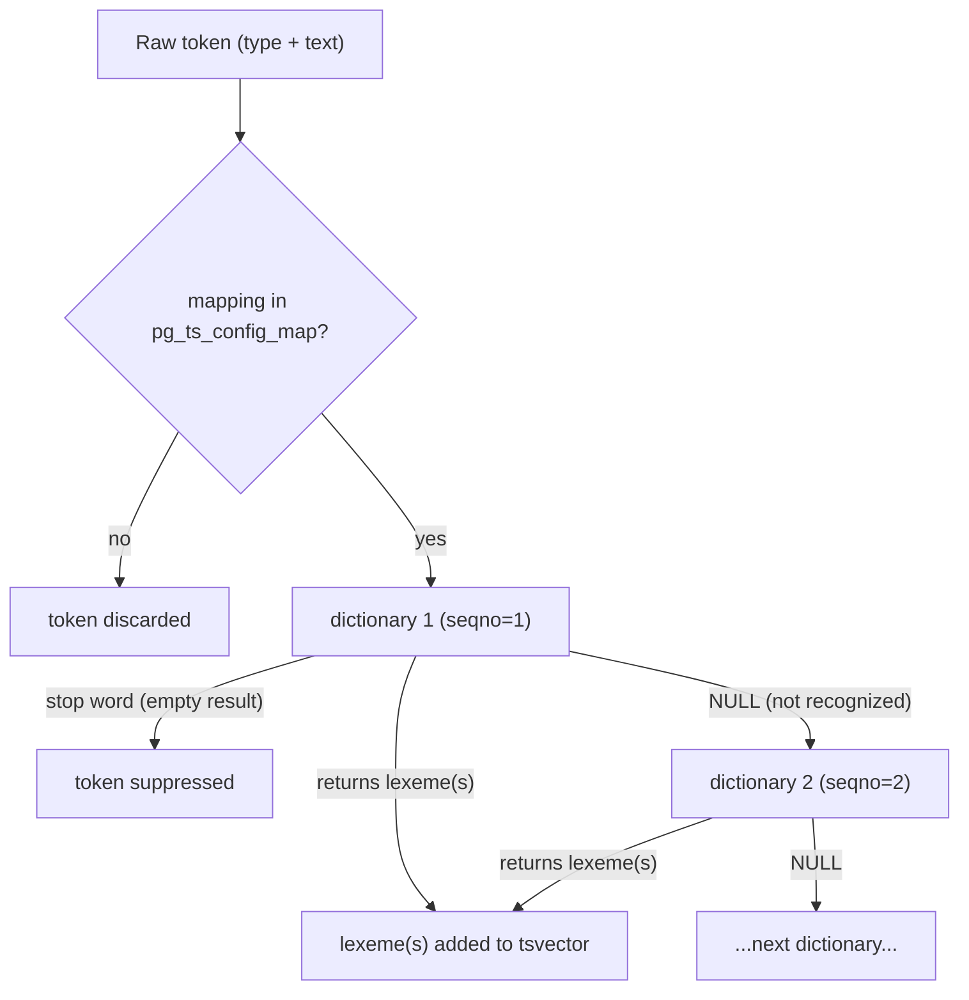

A text search configuration in PostgreSQL is the administrative layer that wires together a parser and a set of dictionaries. It controls exactly how raw text becomes a searchable `tsvector`. Every call to `to_tsvector()` or `to_tsquery()` consults one configuration. Which configuration runs — at index time and at query time — determines whether documents and queries end up in the same normalised form. The DDL commands that create and modify these objects (`CREATE TEXT SEARCH CONFIGURATION`, `ALTER TEXT SEARCH DICTIONARY`, and so on) are implemented in `src/backend/commands/tsearchcmds.c` and write directly into four system catalogs.

## The Four Catalog Objects

The text search system is composed from four independently named catalog objects, each with a dedicated system table.

**Parsers** (`pg_ts_parser`) are responsible for splitting raw text into typed tokens. A parser is a set of C functions: a start/end pair, a `gettoken` iterator, a `lextypes` introspection function, and an optional `headline` function used by `ts_headline()`. Because parsers are defined entirely in C and require superuser to create (`DefineTSParser()`, `tsearchcmds.c`), nearly all deployments use the built-in `pg_catalog.default` parser. A parser defines a vocabulary of token types — `word`, `hword`, `url`, `email`, `int`, `float`, and about twenty others for the default parser. These token types are the raw material that dictionaries then normalise.

**Templates** (`pg_ts_template`) are reusable dictionary algorithms. Each template supplies an optional init function and a required lexize function. Templates also require superuser to create (`DefineTSTemplate()`). The built-in templates are `simple`, `synonym`, `thesaurus`, `ispell`, and `snowball`. A template is not parameterised; its parameters are fixed at the point where a dictionary is created from it.

**Dictionaries** (`pg_ts_dict`) are instances of a template, parameterised with options stored in `pg_ts_dict.dictinitoption` as a serialised key-value list. The `DefineTSDictionary()` function stores the template OID and the serialised option string, then calls the template's init function immediately to validate the options. If the options are invalid, the `CREATE` fails rather than surfacing an error at query time. Any schema user with `CREATE` privilege can create a dictionary; ownership resides with the creator. Altering a dictionary (`AlterTSDictionary()`) merges the new option list with the existing one and re-runs validation before writing it back.

**Configurations** (`pg_ts_config` + `pg_ts_config_map`) bind a parser to an ordered list of dictionaries for each token type. The `pg_ts_config` row records the parser OID; the associated `pg_ts_config_map` rows each carry `(config_oid, token_type, seqno, dict_oid)`. The seqno is the key: the pipeline tries each dictionary in seqno order and stops as soon as one returns a non-empty lexeme list. The `DefineTSConfiguration()` function accepts either a `PARSER` option or a `COPY` option; `COPY` duplicates an existing configuration's `pg_ts_config_map` rows wholesale into the new configuration. This is how the built-in language configurations (`english`, `french`, etc.) are derived in practice.

## Token-Type Mappings: The Core Design Decision

The configuration mapping is the main lever that controls normalisation behaviour. `ALTER TEXT SEARCH CONFIGURATION ... ADD/ALTER MAPPING FOR` is how that lever is operated. Internally, this goes through `MakeConfigurationMapping()` in `tsearchcmds.c`, which:

1. Translates token type names into numeric IDs by calling the parser's `lextypes` function.
2. Inserts one `pg_ts_config_map` row per `(token_type, seqno)` pair, one row for each dictionary in the list.
3. Re-records all catalog dependencies so that dropping a dictionary used by a configuration is caught by the dependency system.

A token type with no mapping in a configuration is silently discarded — no lexemes are generated for it. This is how stop words are achieved: tokens of type `word` that match a stop-word dictionary return an empty result, halting the pipeline at that step. Types like `url` or `email` are often left unmapped in document-search configurations because they are noise; a configuration for web crawl metadata might map them instead.

The `DROP MAPPING FOR` form (`DropConfigurationMapping()`) deletes matching rows from `pg_ts_config_map`. The `IF EXISTS` variant suppresses the error when no mapping is found.

One important consequence of the mapping design: a configuration that lacks a mapping for a token type cannot match documents indexed with a configuration that does map that type. If the index-time configuration emits lexemes for `hword_part` tokens but the query-time configuration does not, those lexemes are simply absent from the `tsquery`. The query silently fails to match. This is the most common cause of "configuration mismatch" failures in deployments.



## Built-in Dictionary Templates

The five built-in templates cover the main normalisation strategies.

The **simple** template lowercases every token and optionally filters stop words from a file. It carries no stemming logic. It is appropriate for data that does not need linguistic normalisation — identifiers, codes, or languages for which a stemmer is not available.

The **synonym** template replaces exact single-word matches with one or more substitute words, as defined in a plain `.syn` file. Each line maps one word to one replacement. It is one-to-one at the level of a single token: synonym processing happens before the next dictionary in the chain sees the token.

The **thesaurus** template extends the synonym idea to phrases and is described in detail below.

The **ispell** (and compatible hunspell) template uses an affix file and a dictionary word list to derive base forms from inflected tokens. This is the most linguistically complete normalisation available: `running`, `runs`, and `ran` all reduce to `run`. The dictionaries and affix files are language-specific and must be supplied separately; PostgreSQL ships none of its own.

The **snowball** template applies algorithmic stemming rules derived from the Snowball compiler project. It is available for about two dozen languages and needs no external files. Snowball is less accurate than ispell/hunspell (it applies heuristic suffix-stripping rules rather than consulting a word list) but is easier to deploy and covers more languages out of the box. Both `english` and many other built-in configurations use a Snowball stemmer as the final dictionary in the chain, after a stop-word filter.

## The Thesaurus Dictionary in Depth

The thesaurus template (`src/backend/tsearch/dict_thesaurus.c`) implements phrase-to-phrase substitution: a sequence of input tokens can be replaced by one or more output lexemes. This is its essential difference from the synonym dictionary, which operates on a single token in isolation.

### File Format

A `.ths` file is a text file where each non-comment line has the form:

```
phrase1 phrase2 ... : substitute1 substitute2 ...
```

The left side of the colon is a whitespace-separated sequence of sample words. The right side is the replacement. A `?` on the left side stands for a stop word in that position — the matching token at that position in the input stream is consumed but does not constrain the match. A `*` prefix on the right side causes the substitute to be passed directly to the next dictionary (`DT_USEASIS` flag) rather than being re-lexised; without `*`, all substitute words go through the sub-dictionary for normalisation.

A concrete example for a medical thesaurus:

```
myocardial infarction : heart attack
heart attack : myocardial infarction
```

When the parser emits tokens `myocardial` followed by `infarction`, the thesaurus matches them as a phrase and emits the single index entry `heart attack` (as two lexemes if not further normalised). The two-word input is collapsed into a single representation, enabling searches for either phrase to match both.

### Initialization and the Sub-dictionary

The thesaurus dictionary requires two parameters: `DictFile` (the `.ths` file path) and `Dictionary` (the name of a subdictionary to use for normalising both the sample words and the substitutes).

When `thesaurus_init()` is called during `CREATE TEXT SEARCH DICTIONARY`, it reads the `.ths` file with `thesaurusRead()`, building raw `TheLexeme` and `TheSubstitute` arrays in memory. It then calls `compileTheLexeme()`, which passes every sample word through the subdictionary's `lexize` function. If a sample word is not recognised by the subdictionary, or is a stop word (and no `?` placeholder was used), `thesaurus_init()` raises an error. After compilation, the `TheLexeme` array is sorted and deduplicated; entries sharing the same lexeme are linked into a chain through `LexemeInfo.nextentry`. The `compileTheSubstitute()` pass normalises the right-hand side in the same way. The compiled `DictThesaurus` structure is the `dictData` pointer cached in the dictionary entry and reused for every subsequent lexize call in that session.

This means the cost of parsing and compiling the `.ths` file is paid once per session per dictionary, at the first call. Large thesaurus files can make the first query noticeably slow; subsequent queries within the same session pay only the in-memory binary search cost.

### Phrase Matching at Query Time

The thesaurus lexize function (`thesaurus_lexize()`) is stateful across multiple token calls, coordinated through the `DictSubState` mechanism that the text search pipeline provides to phrase-aware dictionaries. On each call, the function receives one token and the persistent `dstate->private_state` pointer, which it uses to track which partial phrase matches are still possible.

Each incoming token is first passed through the subdictionary. The resulting lexeme is looked up with a binary search in the sorted `TheLexeme` array (`findTheLexeme()`). The match candidates are then tested for phrase coherence by `findVariant()`, which checks that consecutive tokens correspond to consecutive positions in the same thesaurus entry. The function returns `NULL` and sets `dstate->getnext = true` when a phrase is only partially matched and more tokens are needed; it returns the substitute lexemes when a complete phrase is matched.

A thesaurus dictionary can only appear as the first dictionary in a token-type mapping. Because it is phrase-sensitive and stateful, nesting it after another dictionary would break the position-tracking assumption.

## Configuration Consistency Between Index and Query Time

The single most operationally important rule in text search configuration is this: the same configuration must be used when building a `tsvector` for the index and when building a `tsquery` for the query. If they differ, the normalised forms on either side may not match even when the raw text would logically agree.

A common scenario: a column is indexed with `to_tsvector('english', body)` and a query uses `to_tsquery('simple', :term)`. The `english` configuration stems `running` to `run`; the `simple` configuration does not. The index contains `'run'`; the query contains `'running'`. The GIN index finds no match.

The `default_text_search_config` GUC controls what `to_tsvector(text)` (the single-argument form) uses when no explicit configuration is given. Different clients connecting with different `search_path` or session settings can inadvertently produce differently-normalised index entries if the GUC is inconsistent. Always passing an explicit configuration name as the first argument to `to_tsvector()` and `to_tsquery()` eliminates this class of bugs.

## Practical Setup for Multilingual Applications

For applications that store content in multiple languages, the standard approach is one text search configuration per language. PostgreSQL ships configurations for about two dozen languages (`english`, `french`, `german`, `spanish`, etc.) in `pg_catalog`; each can be copied and customised.

```sql
-- Create a language-specific configuration based on the built-in English one
CREATE TEXT SEARCH CONFIGURATION myapp_english (COPY = pg_catalog.english);

-- Add unaccent preprocessing for accent-insensitive matching
CREATE TEXT SEARCH DICTIONARY english_unaccent (
    TEMPLATE = unaccent,
    RULES = 'unaccent'
);
ALTER TEXT SEARCH CONFIGURATION myapp_english
    ALTER MAPPING FOR hword, hword_part, word
    WITH english_unaccent, english_stem;
```

The `unaccent` extension provides a dictionary template that strips diacritics before passing the result to the next dictionary in the chain. Placing it first in the mapping list means `café` and `cafe` both produce the lexeme `cafe` and therefore match each other. Without it, accented characters produce distinct lexemes and searches must explicitly account for both forms.

For each indexed column, store the language identifier alongside the text and use it to select the configuration:

```sql
-- At index time
to_tsvector(lang_config::regconfig, body)

-- At query time (must match)
to_tsquery(lang_config::regconfig, :term)
```

The `regconfig` cast turns a configuration name like `'myapp_english'` into the OID that `to_tsvector` expects. Using a table column for this avoids hard-coding the configuration in the query and makes it easy to vary the configuration per row. This flexibility matters when a single table holds multilingual content.

## Related Topics

- [[subsystems/full-text-search|Full-Text Search Internals]] — tsvector/tsquery types, the parsing pipeline, GIN indexing, and ranking
- [[subsystems/indexes/gin|GIN Index Internals]] — how the inverted index that text search relies on works internally
- [[subsystems/catalog/core-catalogs|System Catalogs]] — general overview of the catalog tables that text search objects live in
