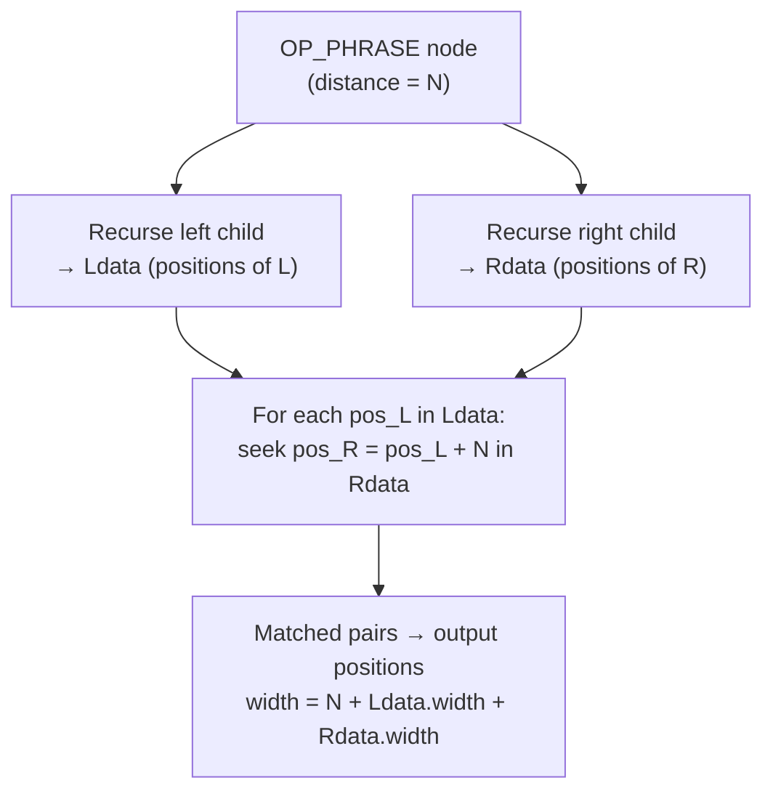

# tsquery Operators and Matching Internals

A [[subsystems/full-text-search|tsquery]] is a boolean expression tree stored in a compact binary format. Four operators — `&` (AND), `|` (OR), `!` (NOT), and `<->` / `<N>` (phrase) — are the only combinators. Everything that makes full-text search powerful in PostgreSQL flows from how those operators are parsed into a `QueryItem` array, how `@@` walks that array against a `tsvector`'s lexeme list, and how optional post-processing (rewriting, ranking) consumes the same tree structure.

## QueryItem: the Node Format

The on-disk representation of a `tsquery` (`TSQueryData`, ts_type.h) is a flat array of `QueryItem` values in prefix (Polish) order, followed by a block of null-terminated lexeme strings. Every element of the array is one of three roles:

- `QI_VAL` (value 1) — a leaf operand (`QueryOperand`). Stores the lexeme's byte length and its offset into the string block, a 32-bit CRC (`valcrc`) used for fast pre-filtering, a weight bitmask, and a prefix flag (`:*`).
- `QI_OPR` (value 2) — an operator node (`QueryOperator`). Stores the operator code and, for binary operators, a `left` offset. The right child of any binary operator is always at `item + 1` in the array; the left child is at `item + item->qoperator.left`. `OP_NOT` has only one child at `item + 1`. `OP_PHRASE` additionally stores a `distance` field (`int16`) giving the required positional gap.
- `QI_VALSTOP` (value 3) — an internal sentinel used only during parsing; never appears in a finalised stored query.

The four operator codes are `OP_NOT = 1`, `OP_AND = 2`, `OP_OR = 3`, `OP_PHRASE = 4`. The ordering is meaningful: `OP_PHRASE` being the numerically highest code matters for simplification logic in `tsquery_cleanup.c`, which treats it as the highest-priority operator.

Operator precedence is encoded in `tsearch_op_priority[]` (tsquery.c):

| Operator | Code | Priority |
|----------|------|----------|
| `!` (NOT) | `OP_NOT` | 4 (highest) |
| `<->` / `<N>` (PHRASE) | `OP_PHRASE` | 3 |
| `&` (AND) | `OP_AND` | 2 |
| `\|` (OR) | `OP_OR` | 1 (lowest) |

The parser in `tsquery.c` uses a shunting-yard algorithm that reads these values via `OP_PRIORITY()` when deciding whether to emit a pending operator. The result is that `!a & b | c` parses as `((!a) & b) | c`, matching intuitive mathematical precedence: NOT binds tightest, then PHRASE, then AND, then OR.

## Building Queries: to_tsquery vs plainto_tsquery vs websearch_to_tsquery

The choice of input function determines what kind of `QueryItem` tree gets produced. That choice has permanent structural consequences:

**`to_tsquery(config, text)`** requires explicit operator syntax (`&`, `|`, `!`, `<->`, parentheses). Each lexeme is run through the full dictionary pipeline. If a term normalises to a stop word, `cleanup_tsquery_stopwords()` in tsquery_cleanup.c rewrites the tree: an AND node whose left child became empty is replaced by its right child; an OR node with an empty child becomes the constant `TRUE`. This means the structure you write is the structure you get, minus stop words.

**`plainto_tsquery(config, text)`** accepts free prose and connects every surviving lexeme with AND. "quick brown fox" becomes `'quick' & 'brown' & 'fox'`. There is no way to express OR or phrase constraints in the input string; the result is always a chain of `OP_AND` nodes.

**`phraseto_tsquery(config, text)`** connects lexemes with the phrase operator at distance 1. "quick brown fox" becomes `'quick' <-> 'brown' <-> 'fox'`, demanding that the three words appear in sequence in the document.

**`websearch_to_tsquery(config, text)`** accepts Google-style input. Quoted phrases map to `OP_PHRASE` chains. Words separated by whitespace map to `OP_AND`. The keyword `OR` maps to `OP_OR`. A leading `-` maps to `OP_NOT`. "quick -fox OR cat" becomes `('quick' & !'fox') | 'cat'`. Because this function tokenises on whitespace and special characters rather than requiring proper boolean syntax, it is safe to expose directly to end-user input without risk of parse errors.

The practical rule: use `websearch_to_tsquery` for user-facing search boxes, `plainto_tsquery` when you want a single AND-query from programmatic input, and `to_tsquery` when you need precise control over the query structure.

## The QTNode In-Memory Tree

Code that creates or transforms queries works with the `QTNode` pointer tree rather than the flat `QueryItem` array. `QT2QTN()` (tsquery_util.c) converts the prefix-order array into a tree of `QTNode` structs by recursing through the flat array: for a `QI_OPR` node it allocates a `QTNode`, recurses into `in + 1` for the right child, and recurses into `in + in->qoperator.left` for the left child. `QTN2QT()` does the reverse, serialising back into prefix order.

Each `QTNode` carries a `sign` field: a 32-bit bloom filter computed as the OR of `(1 << (valcrc % 32))` over all leaf nodes in the subtree. This propagates upward from leaves to the root so that `QTNEq()` can short-circuit subtree comparisons: if `(a->sign & b->sign) != a->sign`, the trees cannot be equal without further inspection.

Two normalisation functions prepare a `QTNode` tree for reliable structural comparison:

- **`QTNTernary()`** flattens nested associative operators. `OR(a, OR(b, c))` becomes a three-child OR node. This is the canonical in-memory form.
- **`QTNSort()`** sorts the children of AND and OR nodes into a deterministic order using `QTNodeCompare()`. After sorting, two structurally equivalent trees compare equal child-by-child. Note that PHRASE nodes are explicitly excluded from sorting because operand order is semantically significant.

Before serialisation back to disk, **`QTNBinary()`** converts n-ary AND/OR nodes back to left-leaning binary trees, since the flat `QueryItem` format requires exactly two children per binary operator.

The operators `tsquery_and()`, `tsquery_or()`, `tsquery_not()`, and `tsquery_phrase()` / `tsquery_phrase_distance()` in tsquery_op.c implement the SQL `&&`, `||`, `!!`, and `<->` / `<N>` operators. They all follow the same pattern: call `join_tsqueries()` to allocate a new root `QTNode` with the specified operator code and two children derived from `QT2QTN()` on each operand, then call `QTN2QT()` to serialise. The `distance` field of an `OP_PHRASE` node is set to 1 by `tsquery_phrase()` and to the caller-supplied value by `tsquery_phrase_distance()`; distances outside `[0, MAXENTRYPOS]` are rejected immediately.

## The Boolean Matching Algorithm

The SQL `@@` operator dispatches to `ts_match_vq()` (tsvector_op.c), which sets up a `CHKVAL` struct pointing at the `tsvector`'s `WordEntry` array and operand string block, then calls `TS_execute()`. `ts_match_qv()` simply reverses the argument order.

`TS_execute()` calls `TS_execute_recurse()` and maps the ternary result to a boolean: any result other than `TS_NO` is true. `TS_execute_recurse()` walks the flat `QueryItem` array in prefix order without building an in-memory tree:

```
For QI_VAL: invoke chkcond callback → TS_YES / TS_NO / TS_MAYBE
For OP_NOT: recurse into child; invert YES↔NO, propagate MAYBE
For OP_AND: recurse left; short-circuit to TS_NO if left is NO;
            recurse right; return TS_NO if right is NO,
            return lmatch if right is YES, return MAYBE if either MAYBE
For OP_OR:  recurse left; short-circuit to TS_YES if left is YES;
            recurse right; return lmatch if right is NO,
            return TS_YES if right is YES, return MAYBE if either MAYBE
For OP_PHRASE: delegate to TS_phrase_execute()
```

The left child is at `curitem + curitem->qoperator.left`; the right child is always at `curitem + 1`. This right-threaded encoding means the traversal is purely pointer arithmetic.

The callback for plain `tsvector` matching is `checkcondition_str()`. It binary-searches the sorted `WordEntry` array for the query lexeme using `tsCompareString()`. If the operand has the prefix flag set, it continues scanning forward through the sorted array collecting all entries that share the prefix. For each matching `WordEntry`, `checkclass_str()` checks the weight bitmask filter and, if the caller supplied an `ExecPhraseData` struct, collects the `WordEntryPos` array for position-based phrase checking.

### Ternary Logic and GIN Rechecks

Three-valued logic (`TS_YES`, `TS_NO`, `TS_MAYBE`) exists because GIN index evaluation cannot always give a definitive answer. A GIN posting list records only *which rows* contain a lexeme, not the positions. When `checkcondition_gin()` is the callback:

- If the lexeme is present and no weight filter or phrase constraint applies, return `TS_YES`.
- If the lexeme is absent, return `TS_NO`.
- If a weight filter or position check is needed, return `TS_MAYBE`.

`TS_MAYBE` propagates through the tree via `TS_execute_ternary()` (used by `gin_tsquery_consistent()` in tsginidx.c). When any subtree returns `TS_MAYBE`, the consistent function sets `*recheck = true`, causing the `BitmapHeapScan` to fetch the actual heap tuple and re-evaluate `@@` against it using `checkcondition_str()`. Pure term-only queries without weight filters produce exact GIN results and skip the heap recheck entirely.

## The Phrase Distance Operator

`<->` is syntactic sugar for `<1>`. `<N>` demands that the left lexeme appears at position `p` and the right lexeme appears at position `p + N` in the same `tsvector`. The required distance lives in `QueryOperator.distance` (ts_type.h, an `int16`). Values must be in `[0, MAXENTRYPOS]`; `tsquery_phrase_distance()` enforces this bound.

`TS_phrase_execute()` (tsvector_op.c) handles phrase matching. `TS_execute_recurse()` invokes it whenever it encounters an `OP_PHRASE` node. `TS_phrase_execute()` uses an `ExecPhraseData` struct to thread position information up the recursive call stack:



For nested phrase expressions such as `'a' <2> ('b' <-> 'c')`, the recursion evaluates the inner `<->` first, collecting the positions at which `b` is followed immediately by `c`. Those positions are passed upward as the right operand's `ExecPhraseData`. The outer `<2>` then checks whether `a` appears at positions that are exactly 2 before those combined positions. The `width` field in `ExecPhraseData` accumulates across nesting levels, allowing the parent phrase operator to compute the correct offset into the compound match.

Position arrays in a `tsvector` are capped at 256 entries per lexeme (`MAXNUMPOS`). The all-pairs scan inside `TS_phrase_output()` is therefore O(256 × 256) at worst for a binary phrase node — bounded and fast. Positions beyond 16,383 (`MAXENTRYPOS`) are silently clamped during `tsvector` assembly, so phrase queries against documents with very long token streams may produce false negatives for lexemes appearing past that position.

When position information is unavailable (stripped `tsvector`, or GIN context), `TS_phrase_execute()` returns `TS_MAYBE` rather than `TS_NO`. This triggers a heap recheck.

## The tsquery Rewrite System

`tsquery_rewrite(query tsquery, from tsquery, to tsquery)` and its query-driven variant `tsquery_rewrite_query(query tsquery, select_sql text)` transform a query by substituting one subexpression for another anywhere it appears in the tree. The primary use case is synonym expansion: a search for `'automobile'` can be rewritten to `'automobile' | 'car' | 'vehicle'` at query time without changing the stored `tsvector`.

The implementation in tsquery_rewrite.c follows three steps:

1. Convert the input query and the pattern to `QTNode` trees. Call `QTNTernary()` and `QTNSort()` on both to put them in canonical form.
2. Call `findsubquery()`, which calls `dofindsubquery()` recursively. At each node, `findeq()` checks whether the node equals the pattern (full subtree match) or whether — for AND and OR nodes, which are commutative and associative — the pattern's children form a subset of the node's children. If a match is found, the matching subtree or subset of children is replaced by a copy of the substitution.
3. After each substitution, clear `QTN_NOCHANGE` flags on all nodes, re-apply `QTNTernary()` and `QTNSort()`, and continue until no further matches are found or the tree becomes empty.

The subset matching for AND/OR is possible because the children are sorted: `findeq()` does a single linear scan through both child lists to identify matches (O(m + n) where m and n are the child counts). This handles the case where `A & B & C` contains the pattern `A & B` — the matched children are collapsed out and replaced by the substitution, leaving `C & substitution`.

The query-driven variant uses SPI to execute the supplied SQL string, which must return two `tsquery` columns (pattern, substitution). It fetches rows in batches of 100, applying each row's substitution in turn. This lets applications maintain synonym tables in ordinary PostgreSQL tables and apply them at query time:

```sql
-- Synonym table
CREATE TABLE synonyms (pattern tsquery, substitute tsquery);
INSERT INTO synonyms VALUES (to_tsquery('automobile'), to_tsquery('automobile | car | vehicle'));

-- At query time
SELECT tsquery_rewrite(to_tsquery('cheap automobile'), 'SELECT pattern, substitute FROM synonyms');
-- Result: 'cheap' & ( 'automobile' | 'car' | 'vehicle' )
```

The sign bloom filter on `QTNode` acts as a fast pre-check: `findeq()` verifies `(node->sign & ex->sign) == ex->sign` before attempting a full `QTNEq()` comparison. If the pattern contains a lexeme whose bit is absent from the candidate node's sign, the subtree is skipped without recursion.

## Ranking Implications of Query Structure

Ranking in PostgreSQL's full-text search is not uniform across equivalent boolean expressions. The `ts_rank()` function (tsrank.c) uses a different code path depending on whether the query contains multiple distinct positive terms:

- If `SortAndUniqItems()` finds two or more distinct positive lexemes, `calc_rank_and()` runs. It computes pairwise proximity scores across all matching positions for each pair of terms, accumulating with `1 - (1 - prev)(1 - curw)`. Terms that co-occur within a few positions score near 1.0; widely scattered terms contribute nearly nothing. The result rises with the number of closely co-occurring term pairs.
- If there is only one distinct lexeme (or the query reduces to a single unique term after deduplication), `calc_rank_or()` runs instead. It scores by summing `weight(position) / j²` over all occurrences of each term, giving diminishing returns for repeated matches.

This means that `to_tsquery('cat & cat')` and `to_tsquery('cat')` will rank identically: both reduce to a single unique lexeme and use `calc_rank_or()`. But `to_tsquery('cat & dog')` and `to_tsquery('cat | dog')` may rank the same document differently even if that document contains both terms: the AND query activates `calc_rank_and()`, which rewards proximity. The OR query activates `calc_rank_or()`, which rewards frequency.

A query with many `&` operators does not guarantee higher scores than a query with few. What matters is the proximity between the matched lexemes in the document, not the operator count. A document where "cat" and "dog" appear within three words of each other will score much higher under `calc_rank_and()` than one where they appear in separate paragraphs. `ts_rank_cd()` reinforces this: it computes cover density — the score is dominated by the smallest window of text that contains all query terms, so query structure matters only in determining which lexemes must be present.

When building search UIs, the practical consequence is: prefer `websearch_to_tsquery` or `plainto_tsquery` for AND-structured queries on user input, apply `ts_rank()` with normalisation flag `0x01` (log-length normalisation), and reserve OR-structured queries for controlled synonym expansion via `tsquery_rewrite`.

## Related Topics

- [[subsystems/full-text-search|Full-Text Search Internals]] — tsvector format, dictionary pipeline, GIN indexing, ranking algorithms, and the full `@@` match path
- [[subsystems/indexes/gin|GIN Index]] — how GIN posting lists are scanned and how the consistent function integrates with ternary logic
- [[subsystems/full-text-search-configuration|Text Search Configuration]] — parser and dictionary chain configuration
- [[subsystems/indexes/tsgistidx|GiST Index for tsquery]] — tsquery containment operators and signature-based GiST indexing
