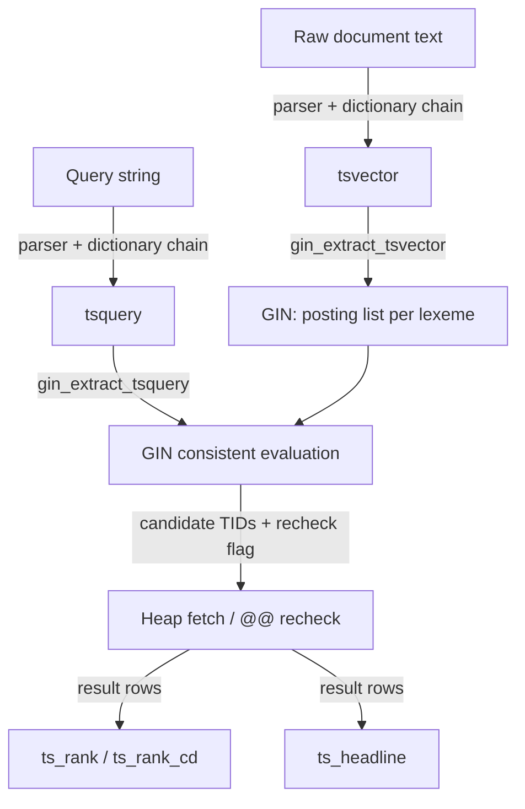
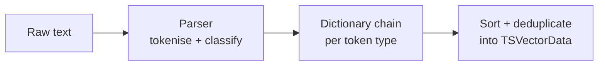
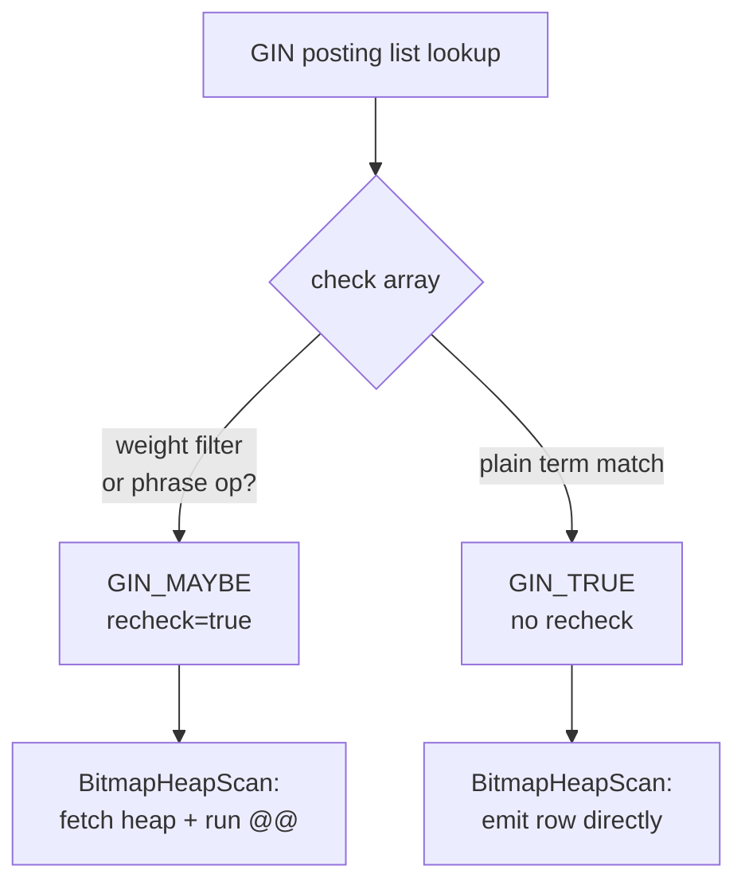

# Full-Text Search Internals

PostgreSQL's full-text search answers the question "does this document contain the concept expressed by this query?" — something a plain `LIKE` or substring match cannot do reliably. The system understands that "running", "runs", and "ran" all express the same root concept, that "the" is noise, and that a query for `'database & performance'` should rank a document that uses both words close together higher than one that scatters them across separate paragraphs.

The mechanism rests on two dedicated types — `tsvector` and `tsquery` — that pre-process documents and queries into a canonical, matchable form. Pre-processing happens once at write time for documents. A GIN index stores those pre-processed forms cheaply. The system reduces queries to the same canonical space before matching. Ranking and highlighting are computed on demand after the match filter reduces the candidate set.



## tsvector: the Processed Document

A `tsvector` is a sorted, deduplicated list of *lexemes* extracted from a piece of text. A lexeme is the normalised root form of a word — "running", "runs", and "ran" all map to "run". Beside each lexeme the vector stores the positions where that lexeme appeared in the original text and, optionally, a weight label (A, B, C, or D) attached to each position.

Position data is not cosmetic. It enables phrase queries to verify that two terms appear within a required distance of each other. It also allows the ranking functions to reward documents where query terms cluster together. Weights let applications signal structural importance: the title of an article might be indexed with weight A, section headings with B, and body text with D, so that a query matching a term in the title ranks higher than one matching the same term only in footnotes.

### On-Disk Layout

The physical layout (`TSVectorData`, ts_type.h) is a varlena with three contiguous regions:

1. A 4-byte `size` field recording the number of lexemes.
2. A fixed-stride array of `WordEntry` descriptors, one per lexeme, sorted lexicographically by lexeme string. Each `WordEntry` is a packed 32-bit integer with three bit fields:

   | Field    | Bits | Range  | Meaning |
   |----------|------|--------|---------|
   | `haspos` | 1    | 0–1    | whether position data follows this lexeme |
   | `len`    | 11   | 0–2047 | byte length of the lexeme string |
   | `pos`    | 20   | 0–1 M  | byte offset from end of descriptor array to the lexeme string |

3. A variable-length block of per-lexeme data. For each lexeme: the raw string bytes (not null-terminated), then if `haspos` is set, a 2-byte alignment pad if needed, a `uint16` position count, and a `WordEntryPos[]` array.

Each `WordEntryPos` is a `uint16` whose top 2 bits encode the weight (D=0, C=1, B=2, A=3) and whose lower 14 bits hold the 1-based position number (`WEP_GETWEIGHT` and `WEP_GETPOS` macros, ts_type.h). The sorted `WordEntry` array makes locating a single lexeme a binary search — O(log n) in the number of distinct lexemes — which is the core of `find_wordentry()` in tsrank.c.

Macros `ARRPTR(x)` and `STRPTR(x)` give direct pointers into these two regions; `_POSVECPTR(x, e)` navigates from a `WordEntry` to its associated position vector by adding the `pos` offset and applying a short-align correction.

### Structural Limits

The 11-bit `len` field caps any single lexeme at 2,047 bytes. The 14-bit position field caps position numbers at 16,383; tokens beyond that position are silently clamped to `MAXENTRYPOS - 1` by the `LIMITPOS()` macro. Each lexeme may have at most 256 positions (`MAXNUMPOS`). The entire datum is a standard varlena subject to the general 1 GB ceiling, but documents large enough to approach that are better split into chunks before indexing.

### Deduplication During Assembly

When the same lexeme appears multiple times in a document, the parser collects all `(lexeme, position, weight)` triples into a temporary `WordEntryIN` array. Before packing into the final `TSVectorData`, `uniqueentry()` in tsvector.c sorts the array by lexeme string and merges adjacent duplicates: if two entries share the same lexeme, their position lists are concatenated. Each merged position list then goes through `uniquePos()`, which sorts it and removes exact duplicates. When two records share the same position but carry different weights, the higher weight is retained — a deliberate design choice that lets authors assign the most prominent occurrence's label to a position without losing it in the merge. The list is then truncated at `MAXNUMPOS` if it exceeds 256 entries.

## The Text Search Pipeline

`to_tsvector(config, text)` drives a three-stage pipeline. The same pipeline — applied to query terms rather than document text — underlies `to_tsquery()`, ensuring that both sides of a `@@` match share identical normalisation. A term that appears as "Running" in a document normalises to "run". The same dictionary chain normalises the query term "Running" to "run" before any comparison is made.



### Stage 1: Parsing and Token Classification

The parser splits a string into tokens and assigns each token a *type*. The type is the routing key that determines which dictionary chain processes the token. The default parser (`pg_catalog.default`, implemented in wparser_def.c) recognises 23 token types across several categories:

| Category | Example types |
|----------|---------------|
| Word forms | `asciiword`, `word`, `hword`, `hword_part` |
| Numbers | `unsignedint`, `signedint`, `decimal`, `sfloat` |
| Structured | `email`, `url`, `host`, `protocol`, `url_path` |
| Markup | `tag`, `xmlentity` |
| Other | `filepath`, `version` |

Hyphenated words (`hword`) receive special treatment: the parser emits the full compound form *and* each component part as separate tokens, so dictionaries get a chance to match either the joined or split form.

The parser is pluggable. `pg_ts_parser` holds registered parsers; a custom extension can provide its own tokeniser by implementing the `prsstart`, `prstoken`, `prsend`, `prslextype`, and `prsheadline` callback functions. The wparser.c layer resolves the configured parser by OID and dispatches through these callbacks.

### Stage 2: Dictionary Lookup

For each token type the text search configuration (`pg_ts_config_map`) holds an ordered list of dictionaries. The lookup algorithm (ts_parse.c, `LexizeData` state machine) tries each dictionary in sequence:

- If a dictionary *accepts* the token, it returns one or more normalised lexemes. Those lexemes are appended to the output and the remaining dictionaries are skipped.
- If a dictionary returns an *empty* lexeme list, the token is treated as a stop word — it is discarded entirely.
- If a dictionary *passes through* (returns NULL), the next dictionary in the chain is tried.
- If no dictionary claims the token, it is silently dropped.

Stop-word elimination is why common words like "the", "and", and "of" disappear from a `tsvector`. The `simple` dictionary ships with stop-word lists for many languages; placing it first in the chain filters noise before more expensive morphological analysis runs.

Dictionary types differ in how they normalise tokens:

| Type | Approach | Source |
|------|----------|--------|
| `simple` | Lowercase; check against stop-word file | dict_simple.c |
| `synonym` | Exact string replacement via a `.syn` file | dict_synonym.c |
| `thesaurus` | Multi-word phrase substitution via a `.ths` file | dict_thesaurus.c |
| `ispell` / `hunspell` | Full morphological analysis via `.affix` + `.dict` | spell.c |
| `snowball` | Algorithmic language-specific stemming | (Snowball library) |

The ispell/hunspell dictionary compiles its affix and word files into an `IspellDict` at load time (spell.c). Affix rules are stored in two prefix tries — one for suffixes, one for prefixes — enabling fast lookup even for large dictionaries. The compiled structure is cached per session so repeated calls avoid re-reading and re-compiling the files.

### Stage 3: Assembly

After all tokens have been processed, the surviving triples of `(lexeme, position, weight)` are sorted by lexeme string, merged, and deduplicated (to_tsany.c, `uniqueWORD()`), then packed into the `TSVectorData` binary format described above.

## tsquery: the Search Expression

A `tsquery` represents a boolean expression over lexemes. The expression `'fat & (rat | cat)'` has two binary operator nodes (AND, OR) and three leaf nodes. Leaf nodes can carry a weight filter bitmask (e.g., `':AB'` restricts matching to positions with weight A or B) and a prefix flag for prefix matching (`':*'`). Operator precedence is NOT (4) > PHRASE (3) > AND (2) > OR (1), encoded in `tsearch_op_priority[]` (tsquery.c).

### Storage Layout

The on-disk format (`TSQueryData`, ts_type.h) stores a flat array of `QueryItem` values in prefix (Polish) notation, followed by a contiguous block of null-terminated lexeme strings. A `QueryItem` is a union of:

- `QueryOperand` for leaf nodes (`QI_VAL`): holds a CRC of the lexeme string for fast pre-filtering, a weight bitmask, a prefix flag, and a `(distance, length)` pair that locates the lexeme in the string block.
- `QueryOperator` for internal nodes (`QI_OPR`): holds the operator code (`OP_AND`, `OP_OR`, `OP_NOT`, `OP_PHRASE`) and a `left` offset. The right child of a binary operator is always at `item + 1`; the left child is at `item + item->left`. This right-threaded encoding makes tree traversal simple with integer arithmetic — no pointers needed.

During parsing, `makepol()` in tsquery.c builds the nodes in a list using a shunting-yard algorithm, converts operator precedence to Polish order, then `findoprnd()` does a final pass to fill in the `left` offsets. If any query term reduced to a stop word, `cleanup_tsquery_stopwords()` simplifies the tree — an AND with a stop word becomes the other operand, an OR with a stop word becomes TRUE, etc.

`to_tsquery()` applies the full dictionary pipeline to each lexeme, so "running" in a query normalises to "run" exactly as it does in a document. `plainto_tsquery()` accepts free-form prose and connects all resulting lexemes with AND. `phraseto_tsquery()` connects them with the PHRASE operator at distance 1. `websearch_to_tsquery()` accepts Google-style syntax: quoted phrases, `-exclusions`, and `OR` written as a keyword.

### The PHRASE Operator

The PHRASE operator `<->` (and its generalised form `<N>`) matches when two lexemes appear at positions exactly N apart in the document. `<->` is sugar for `<1>`. The required distance is stored in the `distance` field of the `QueryOperator` node. During `@@` evaluation the position lists for both lexemes are retrieved from the `tsvector` and all pairs of positions are checked for the distance constraint. Position arrays are capped at 256 entries each, bounding the O(m × n) scan.

Phrase nesting is evaluated recursively: `'a' <2> ('b' <-> 'c')` requires 'a' at position p, 'b' at position p+2, and 'c' at position p+3. The `TS_execute()` framework propagates a `ExecPhraseData` structure through the tree to thread position information between phrase operands.

## tsquery Tree Manipulation

Code that needs to transform a `tsquery` — rewriting it, simplifying it, or comparing two queries — works with the `QTNode` tree rather than the flat `QueryItem` array stored on disk. `QT2QTN()` (`tsquery_util.c`) converts the flat prefix-order array into a pointer-based tree; `QTN2QT()` serialises it back. The round-trip is used by operators like `tsquery_phrase()` and `tsquery_and()` that construct new queries from existing ones.

Several utilities operate on `QTNode` trees:

- **`QTNSort()`** canonicalises the children of AND and OR nodes into a deterministic order. This makes structural equality checks reliable: after sorting, two queries are equivalent if and only if their trees compare equal under `QTNodeCompare()`.
- **`QTNTernary()`** flattens nested ANDs and ORs: `OR(a, OR(b, c))` becomes `OR(a, b, c)` with three children. This is the in-memory working form.
- **`QTNBinary()`** is the inverse: it converts n-ary AND/OR nodes back to left-leaning binary trees, which is the only form the flat `QueryItem` format supports (each operator node has exactly two children in the serialised representation).
- **`QTNEq()`** tests structural equality using the `sign` bitmask as a fast pre-filter: the sign is a 32-bit bloom filter over the CRC values of the leaf lexemes. If the signs differ, the trees cannot be equal without comparing their full structure.

The `sign` field propagates upward from leaves to operators, so `sign & child_sign != child_sign` can short-circuit subtree comparisons before recursion. This optimisation matters for large, deeply nested queries generated by ORM search builders.

## The @@ Match Operator

The `@@` operator evaluates a `tsquery` against a `tsvector` without any index. It recurses through the `QueryItem` flat array in prefix order, evaluating operator nodes by combining the results of their sub-trees. Each `QI_VAL` leaf is resolved by a binary search (`find_wordentry()`, tsrank.c) over the sorted `WordEntry` array.

For prefix operands (the `:*` flag), the binary search locates the first entry whose string is a prefix match, then scans forward collecting all entries that share the prefix until `tsCompareString()` in prefix mode returns non-zero.

A ternary logic is used internally: `TS_YES`, `TS_NO`, and `TS_MAYBE`. `TS_MAYBE` propagates when a weight filter or phrase constraint cannot be definitively answered without position information that may not be available (for example, during GIN index evaluation where only the presence of a lexeme, not its positions, is known). The `TS_execute_ternary()` function handles this three-valued propagation; `TS_execute()` collapses `TS_MAYBE` to true by arranging for a heap recheck.

## GIN Indexing

A GIN index on a `tsvector` column is the standard way to make full-text queries fast. The index holds one posting list per distinct lexeme across all indexed rows. Each posting list is a sorted array of heap TIDs for rows containing that lexeme. Intersection and union of posting lists gives the candidate set for AND and OR queries respectively.

### Index Build and Key Extraction

At index-build time the GIN AM calls `gin_extract_tsvector()` (tsginidx.c) for each row's `tsvector`. This function iterates the `WordEntry` array and emits each lexeme string as a separate text datum — these become the GIN keys. The row's TID is appended to the posting list for each key.

At query time, `gin_extract_tsquery()` decomposes the `tsquery` into its `QI_VAL` leaf operands, emitting each as a text datum. Leaves with the prefix flag set are marked `partialmatch = true`, causing the GIN AM to use `gin_cmp_prefix()` during the index scan — a comparison function that continues scanning as long as the index key is a prefix of the query term, enabling prefix queries to run efficiently without a full-index scan.

If the query has no required positive terms (e.g., `! 'foo'`), `tsquery_requires_match()` returns false and `gin_extract_tsquery()` sets `*searchMode = GIN_SEARCH_MODE_ALL`. This forces the AM to scan every row in the index since there is no posting list for "rows not containing foo". Such queries should be rare in production; a compound query like `bar & ! foo` still has a positive required term (`bar`) and avoids the full scan.

### Consistent Evaluation and Rechecks

GIN does not call `@@` directly. After its internal machinery has determined for each leaf operand whether the candidate row's posting lists contain that lexeme, it passes the results to `gin_tsquery_consistent()` (tsginidx.c) in a `check[]` array. The consistent function calls `TS_execute_ternary()` to reconstruct the boolean tree, mapping each `check[j]` entry through `checkcondition_gin()`.

The key subtlety is in what GIN knows vs. what it does not. The posting list records only *which rows* contain a lexeme, not the positions at which it appears. Therefore, if any leaf operand has a weight filter (`val->weight != 0`) or if position information is needed to verify a phrase constraint, `checkcondition_gin()` downgrades the result from `GIN_TRUE` to `GIN_MAYBE`. When any part of the tree returns `GIN_MAYBE`, the consistent function sets `*recheck = true`, causing the BitmapHeapScan node to re-evaluate `@@` against the heap tuple before accepting the row. The heap recheck has access to the full `tsvector` including positions, so phrase and weight constraints are resolved exactly there.

For queries without phrase operators or weight filters, the index scan produces exact results and no heap recheck is needed. This lets the engine use the [[subsystems/storage/visibility-map|visibility map]] for index-only access in some cases.



## Ranking

Ranking is not index-accelerated; it is computed per result row after the index or sequential scan has identified candidates. Two distinct algorithms are provided, targeting different relevance models.

### ts_rank: Proximity-Weighted Term Frequency

`ts_rank()` scores a document based on how often each query term appears, at what weight level it appears, and how close the matching terms are to each other (tsrank.c). The default weight vector assigns `{D=0.1, C=0.2, B=0.4, A=1.0}`.

For AND-structured queries with more than one distinct term, `calc_rank_and()` iterates over all pairs of matching query terms and accumulates a pairwise proximity score:

```
curw = sqrt(weight(pos_i) * weight(pos_j) * word_distance(distance))
```

where `word_distance(d) = 1 / (1.005 + 0.05 * exp(d/1.5 - 2))`. This function falls off smoothly: terms within a few words of each other score near 1.0; terms more than about 100 positions apart contribute essentially nothing (clamped to 1e-30). Individual pair scores are combined with the formula `1 - (1 - prev)(1 - cur)`, an asymptotic accumulator that approaches 1 as more evidence accumulates without exceeding it.

For OR-structured queries, `calc_rank_or()` scores by summing over all matching occurrences of a term: the contribution of the j-th occurrence (1-based) is `weight(pos_j) / j²`. This gives extra credit to the first occurrence and to higher-weight positions, while diminishing returns apply to repeated occurrences. The theoretical bound is π²/6 ≈ 1.645, which the algorithm uses as the normalisation denominator.

### ts_rank_cd: Cover Density

`ts_rank_cd()` uses a *cover density* model, which rewards documents where the complete set of query terms appears as a tight cluster (tsrank.c, `calc_rank_cd()`). The algorithm first builds a `DocRepresentation` — a sorted list of `(position, query-item)` pairs for all query terms found in the document — then repeatedly calls `Cover()` to find minimal spans of text that contain all query terms.

For each cover span `[p, q]`, the contribution is:

```
Cpos = (number of positions in span) / (sum of inverse weights)
Wdoc += Cpos / (1 + number of noise words in span)
```

Shorter covers (fewer noise words between query terms) thus dominate the score. A document that uses all query terms within a three-word window scores much higher than one that scatters them across a paragraph.

### Length Normalisation

Both functions accept a `normalization` bitmask as an optional argument. Without normalisation, a long document that contains many occurrences of a query term dominates simply by virtue of length. The bitmask flags adjust the raw score:

| Flag | Value | Effect |
|------|-------|--------|
| `RANK_NORM_LOGLENGTH` | 0x01 | divide by `log₂(document_length + 1)` |
| `RANK_NORM_LENGTH` | 0x02 | divide by document length |
| `RANK_NORM_EXTDIST` | 0x04 | divide by mean inter-cover distance (`ts_rank_cd` only) |
| `RANK_NORM_UNIQ` | 0x08 | divide by number of unique lexemes |
| `RANK_NORM_LOGUNIQ` | 0x10 | divide by `log₂(unique lexemes + 1)` |
| `RANK_NORM_RDIVRPLUS1` | 0x20 | transform: `rank / (rank + 1)` |

Flags are combined with bitwise OR; `0x00` applies no normalisation. Flag `0x01` is the most commonly useful single choice: it penalises very long documents moderately without aggressively suppressing them.

## Highlighting

`ts_headline()` solves a presentation problem: given a raw document string and a matching query, return a fragment of text with matching terms marked up for human display. It operates on the original plain-text string rather than on a pre-built `tsvector`, which means it can show the original inflected word form ("running") rather than the normalised lexeme ("run").

The function re-parses the document using the same text search parser configured for the operation to get a list of tokens and their byte offsets in the original string (wparser.c, `ts_headline_byid_opt()`). It then runs the dictionary chain to determine which parsed tokens correspond to query lexemes, noting their positions. A fragment selection algorithm picks one or more windows of text that maximise the number of covered query terms while respecting the `MinWords`, `MaxWords`, and `MaxFragments` options. `ts_headline()` stitches adjacent fragments together with the `FragmentDelimiter` string (default ` ... `). It wraps matching terms in `StartSel`/`StopSel` markup (defaulting to `<b>` and `</b>`).

Because `ts_headline` re-parses the entire raw document for every result row, it is substantially more expensive than ranking. It should always be applied *after* the result set has been reduced by `@@` matching and ranked, not across an unfiltered table.

## Text Search Configurations

A text search configuration is a named catalog object (`pg_ts_config`) that binds a parser to a set of token-type → dictionary-list mappings (`pg_ts_config_map`). Changing the configuration changes both which token types are processed and how each type is normalised. Two documents indexed with different configurations are not directly comparable, so applications should be consistent.

The `default_text_search_config` GUC selects the configuration used when `to_tsvector` and `to_tsquery` are called without an explicit config argument. It defaults to `pg_catalog.english` in a fresh database, but multilingual applications must either set it per-session or pass an explicit configuration to every call.

Configurations are cached in `TSConfigCacheEntry` structures (ts_cache.h), so repeated calls avoid re-reading system catalogs. The cache is invalidated on `ALTER TEXT SEARCH CONFIGURATION` commands.

## Statistics and the Query Planner

The planner needs to estimate how many rows a `@@` filter will match in order to choose between an index scan and a sequential scan. `ts_typanalyze()` (ts_typanalyze.c) computes statistics over a `tsvector` column — the most-common lexemes and the average number of lexemes per document. The selectivity estimator `ts_match_sel()` (ts_selfuncs.c) uses these statistics to estimate the fraction of rows matching a given `tsquery`.

When a GIN index exists the planner weighs index scan cost against sequential scan cost using this estimate. Highly selective queries (rare lexemes) make the GIN index attractive; queries matching most of the table are cheaper to satisfy with a sequential scan and inline `@@` evaluation.

## Key Data Structures

| Type | File | Purpose |
|------|------|---------|
| `TSVectorData` / `WordEntry` / `WordEntryPos` | ts_type.h | On-disk format for tsvector |
| `TSQueryData` / `QueryItem` / `QueryOperand` / `QueryOperator` | ts_type.h | On-disk format for tsquery |
| `TSConfigCacheEntry` | ts_cache.h | Cached text search configuration |
| `LexizeData` | ts_parse.c | State for iterating the dictionary chain |
| `IspellDict` | spell.c | Compiled ispell/hunspell dictionary |
| `DocRepresentation` | tsrank.c | Position-indexed document form used by ts_rank_cd |
| `GinChkVal` | tsginidx.c | Bridges GIN check array to TS_execute ternary evaluator |
| `HeadlineParsedText` | ts_utils.h | Parser output buffer for ts_headline |

## Operator and Function Reference

| Symbol | Description |
|--------|-------------|
| `@@` | Match tsvector against tsquery |
| `to_tsvector(cfg, text)` | Tokenise, normalise, and pack text into a tsvector |
| `to_tsquery(cfg, text)` | Parse and normalise a boolean query expression |
| `plainto_tsquery(cfg, text)` | Convert free-form text to an AND-query |
| `phraseto_tsquery(cfg, text)` | Convert text to a phrase query using `<->` |
| `websearch_to_tsquery(cfg, text)` | Accept Google-style query syntax |
| `<->` / `<N>` | Phrase operator: adjacent lexemes at distance N |
| `tsvector \|\| tsvector` | Concatenate two tsvectors, adjusting position offsets |
| `ts_rank(tsvector, tsquery [, norm])` | Score by proximity-weighted term frequency |
| `ts_rank_cd(tsvector, tsquery [, norm])` | Score by cover density |
| `ts_headline(cfg, text, tsquery [, opts])` | Format matching fragments from original text |
| `ts_parse(parser, text)` | Debug: show raw parser output |
| `ts_debug(cfg, text)` | Debug: show full pipeline output including dictionary decisions |
| `ts_lexize(dict, token)` | Debug: test a single dictionary against one token |

## Relationship to the Rest of the System

Full-text queries flow through the standard query pipeline without special treatment at the executor level. When a GIN index is present and the planner selects it, the plan contains a `BitmapIndexScan` that drives the GIN AM's consistent function, followed by a `BitmapHeapScan` that fetches matching heap rows and applies the `@@` recheck where needed. For queries without weight filters or phrase operators the recheck is skipped entirely and the BitmapHeapScan can use the visibility map for index-only access.

The GIN index for `tsvector` is exactly the same GIN implementation used for `jsonb`, `hstore`, and array containment. All type-specific behaviour lives in the four support functions — `gin_extract_tsvector`, `gin_extract_tsquery`, `gin_tsquery_consistent`, `gin_cmp_tslexeme` (tsginidx.c). The GIN AM's internal machinery for posting list storage, fast-update pending lists, and vacuum is shared unchanged.

See [[subsystems/indexes/gin|GIN Index]] for the index AM internals, [[subsystems/storage/buffer-manager|Buffer Manager]] for how heap pages are fetched during rechecks, and [[subsystems/planner/overview|Planner Overview]] for how index cost estimates interact with the query plan.

## Related Topics

- [[subsystems/indexes/gin|GIN Index]] — the index access method that stores per-lexeme posting lists and drives the consistent evaluation function used by full-text search queries
- [[subsystems/indexes/tsgistidx|GiST Full-Text Index]] — alternative index strategy for tsvector using GiST, with different trade-offs for update and query cost
- [[subsystems/full-text-search-configuration|Text Search Configuration]] — catalog objects (pg_ts_config, pg_ts_parser, pg_ts_dict) that bind a parser to dictionary chains and govern the normalisation pipeline
- [[subsystems/full-text-search-operators|Text Search Operators]] — the operator and function surface (@@, ||, tsvector arithmetic) that wraps the internal match and ranking machinery
- [[subsystems/types/text-search-dictionaries|Text Search Dictionaries]] — implementation details for the simple, synonym, thesaurus, ispell/hunspell, and snowball dictionary types invoked by the pipeline
- [[subsystems/types/text-search-parser|Text Search Parser]] — how the default parser tokenises and classifies raw text into the 23 token types that the dictionary chain consumes
- [[subsystems/types/tsquery-processing|tsquery Processing]] — parsing, stop-word cleanup, and tree manipulation utilities (QT2QTN, QTNSort, QTNBinary) for tsquery expressions
