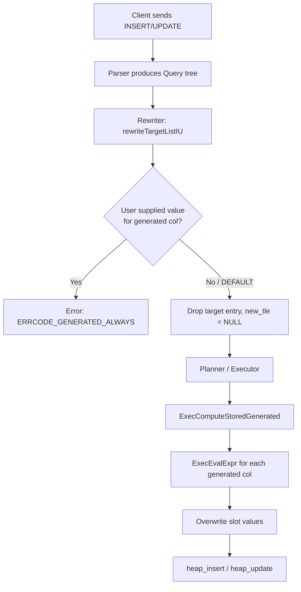

# Generated Columns

A generated column is a column whose value is always computed from an expression over other columns in the same row, never supplied directly by the user. PostgreSQL 12 introduced `GENERATED ALWAYS AS (expr) STORED`. PostgreSQL evaluates the expression on every `INSERT` and `UPDATE` and stores the result in the heap exactly like a regular column value.

The SQL standard permits both STORED and VIRTUAL variants. A VIRTUAL column derives its value on every read without storing anything. PostgreSQL implemented only STORED through PG17. The tradeoff is deliberate: materializing the value on write makes reads free of any special handling — every heap access method, index, and client sees the generated column as an ordinary attribute. Implementing VIRTUAL requires threading expression evaluation into every tuple-fetch path, complicating MVCC, index access, and serialization. STORED also means that historical values (as seen through time-travel queries or WAL replay) are always correct without re-evaluating expressions against a potentially different schema.

**PostgreSQL 18:** Virtual generated columns are now supported. A virtual column's value is computed at read time and never stored on disk. `GENERATED ALWAYS AS (expr)` without a trailing keyword now defaults to `VIRTUAL`; `STORED` still works explicitly. Virtual columns avoid write amplification and storage overhead — no recomputation on every `INSERT` or `UPDATE` — but at the cost of evaluating the expression on every read. Because nothing is materialized, virtual columns cannot be indexed directly and are excluded from logical replication by default.

## Catalog Storage

Two catalog locations record a generated column and hold its expression.

`pg_attribute` carries the field `attgenerated` (declared as `char attgenerated` in `pg_attribute.h`). For a stored generated column it holds `'s'`, the constant `ATTRIBUTE_GENERATED_STORED`. An ordinary column has `'\0'`. This single byte is the universal fast-path check: the executor, rewriter, COPY path, and logical replication all branch on `attgenerated` without joining to any other catalog. The `atthasdef` flag is also set in `pg_attribute`, as it is for any column that has a row in `pg_attrdef`.

**PostgreSQL 18:** Virtual generated columns use a distinct value for `attgenerated` (the constant `ATTRIBUTE_GENERATED_VIRTUAL`) rather than `'s'`. Code that previously checked `attgenerated != '\0'` to detect any generated column continues to work; code that specifically checked for `'s'` must also handle the virtual case.

`pg_attrdef` stores the expression as a `nodeToString()` serialization in `adbin`, exactly as it does for column defaults. The difference is not encoded in a separate catalog column — the `attgenerated` value in `pg_attribute` is what distinguishes a generation expression from a plain default. `StoreAttrDefault()` in `pg_attrdef.c` flattens the expression tree to a string and writes the `pg_attrdef` row. After writing to `pg_attrdef`, `StoreAttrDefault()` updates the `pg_attribute` row to set `atthasdef = true`.

The semantic difference from a plain default is fundamental: a default expression is evaluated only when no value is supplied for the column; a generation expression is always evaluated. Any value the client attempts to supply is rejected. The rejection happens in the rewriter, not the executor — the rewriter strips user-supplied values for generated columns from the target list before the query tree reaches plan construction.

Because the expression is stored as a string in `adbin` and deserialized on demand by `build_column_default()`, the catalog does not carry any pre-parsed or pre-planned form. Every query that needs to evaluate a generated column expression goes through `build_column_default()` → `stringToNode()` → `expression_planner()` → `ExecPrepareExpr()`. The compiled `ExprState` is cached on `ResultRelInfo` for the duration of one query execution and then discarded; it is not shared across transactions or backends.

Generated columns are not supported on typed tables (tables created with `OF type_name`). The parser rejects this combination with an explicit error during `CREATE TABLE` processing. They are also not permitted on views or foreign tables, which have no heap storage for the materialized value.

## Write Path Overview



## Expression Validation

Validation runs in `cookDefault()` in `heap.c`, called when processing column definitions for both `CREATE TABLE` and `ALTER TABLE … ADD COLUMN`. Two checks apply only to generated columns.

**Immutability.** After the expression is parsed and the planner runs constant-folding, `contain_mutable_functions_after_planning()` scans the expression tree. Any function that is not `IMMUTABLE` — including `STABLE` functions such as `now()` and `VOLATILE` functions such as `random()` — causes the creation to fail with "generation expression is not immutable". Running the check after planning rather than directly after parsing catches cases where an inlined wrapper is volatile but its expanded form is constant.

**Structural restrictions.** The expression is parsed under `EXPR_KIND_GENERATED_COLUMN`, which tells `transformExpr()` in the parser to reject subqueries, aggregate function calls, and window function calls. These constructs require access to rows other than the current one and are incompatible with per-row expression evaluation.

**No chained generated columns.** `check_nested_generated_walker()` in `heap.c` walks the expression tree after parsing. If any `Var` node refers to a column whose `attgenerated` is non-zero — tested via `get_attgenerated()` against the live catalog — the error "cannot use generated column in column generation expression" is raised with the detail "A generated column cannot reference another generated column." The prohibition is absolute: there is no topological-sort mechanism that would allow safe chaining. A whole-row `Var` (`varattno == 0`) is also rejected with the detail "This would cause the generated column to depend on its own value." System column references are rejected earlier by the parser under `EXPR_KIND_GENERATED_COLUMN`.

After validation, `cookDefault()` applies assignment-coercion to confirm the expression result is assignable to the declared column type. If the column has a collation different from the expression's collation, `get_generated_columns()` in `rewriteHandler.c` wraps the expression in a `CollateExpr` node when building the synthetic target list for rule rewrites.

## Executor Initialization

`ExecInitStoredGenerated()` in `nodeModifyTable.c` compiles the generation expressions into executable `ExprState` trees and caches them on `ResultRelInfo`. It is called lazily on the first write operation — it runs only if `tupdesc->constr->has_generated_stored` is set, so tables without generated columns pay no cost.

The function maintains two separate expression-state arrays:

- `ri_GeneratedExprsI` / `ri_NumGeneratedNeededI` — used for `INSERT`
- `ri_GeneratedExprsU` / `ri_NumGeneratedNeededU` — used for `UPDATE`

The separation exists because `MERGE` can perform both an `INSERT` and an `UPDATE` against the same result relation in one statement. Cross-partition `UPDATE` operations also issue a delete on the old partition and an insert on the new one internally, requiring both modes for a single result relation.

For `UPDATE`, the function applies an optimization: it intersects the set of columns being updated (`ExecGetUpdatedCols()`) with the set of input columns referenced by each generation expression (`pull_varattnos()`). If a generated column's expression does not depend on any column being updated, that expression is skipped — its stored value is already correct and does not need recomputation. This optimization is suppressed when the relation has a `BEFORE ROW UPDATE` trigger, because the trigger might modify additional columns beyond the optimizer's knowledge.

Each required expression is fetched from the catalog via `build_column_default()`, then compiled with `ExecPrepareExpr()` and stored in the per-query [[subsystems/memory/contexts|memory context]]. For `UPDATE`, the attribute number of each recomputed generated column is added to `ri_extraUpdatedCols`, making it visible to downstream code such as triggers and logical decoding.

## Evaluation at Write Time

`ExecComputeStoredGenerated()` in `nodeModifyTable.c` runs after the input tuple slot is fully assembled — all non-generated columns have their final values — but before `heap_insert()` or `heap_update()` is called.

The function calls `slot_getallattrs()` to materialize all attribute values into the slot's arrays, allocates fresh `values[]` and `nulls[]` arrays, and copies the existing attribute values in. For each generated column that has a compiled `ExprState`, it sets `econtext->ecxt_scantuple` to the current slot and calls `ExecEvalExpr()`. The result datum is copied with `datumCopy()` to ensure it survives beyond the per-tuple memory context, then placed into the `values[]` array at the column's position. The slot is then rebuilt from the merged arrays with `ExecStoreVirtualTuple()` / `ExecMaterializeSlot()`.

`ExecComputeStoredGenerated()` is called from three sites within `nodeModifyTable.c`: after building the `INSERT` tuple, after building the `UPDATE` tuple, and in the `MERGE` path for each write operation. It is also called from `execReplication.c` when the logical replication apply worker writes incoming rows, and from `copyfrom.c` when `COPY FROM` processes each input line.

The function is a no-op if `tupdesc->constr->has_generated_stored` is false, which covers the common case where a table has no generated columns at all. The `constr` pointer itself can be NULL for system catalogs and certain internal relations; a NULL `constr` implies no generated columns. This two-level guard means ordinary INSERT/UPDATE operations on non-generated tables add no overhead from this path — the check is a single pointer dereference and bit test.

Because `ExecComputeStoredGenerated()` overwrites the slot in place, any value that the rewriter left in the slot for a generated column's position is silently replaced. In practice the rewriter has already set the position to NULL (by dropping the `TargetEntry`), but the executor does not rely on that: it unconditionally overwrites the position for every generated column that has a compiled expression.

## Reading Generated Columns

From the reader's perspective a stored generated column is indistinguishable from a regular column. `SELECT`, index scans, sequential scans, and cursors all read the stored value directly from the heap tuple. There is no mechanism to read the expression text at runtime other than querying `pg_attrdef` or using `pg_get_expr()`.

**PostgreSQL 18:** Virtual generated columns are evaluated at read time by injecting the expression into the tuple-fetch path. The heap tuple contains no value for the column; instead, the expression is evaluated each time the column is accessed. Because no value is stored, virtual columns cannot appear in index definitions and are not candidates for direct indexing. The repeated evaluation cost is the main tradeoff relative to stored columns.

The `DEFAULT` keyword in a `SELECT` context does not apply to generated columns — `DEFAULT` is only meaningful as the source value in `INSERT` or `UPDATE`, where it signals to the rewriter that the generated expression should be used. In all other contexts, `DEFAULT` is a syntax error.

## Rewriter Interaction

The rewriter enforces the user-facing rule that generated columns cannot receive explicit values and handles the complications of rule and view rewrites.

In `rewriteTargetListIU()` in `rewriteHandler.c`, for each attribute of the target relation:

- During `INSERT`: if the target list contains a non-`DEFAULT` entry for a generated column, the rewriter raises `ERRCODE_GENERATED_ALWAYS` ("cannot insert a non-DEFAULT value into column"). If the entry is `DEFAULT` (`SetToDefault`) or the column is absent from the target list, the rewriter sets `new_tle = NULL`, dropping the entry. The generation expression then provides the value during executor evaluation.
- During `UPDATE`: the same restriction applies — a non-`DEFAULT` update to a generated column raises "column … can only be updated to DEFAULT". Again, a `DEFAULT` entry or absence results in `new_tle = NULL`.

The error code `ERRCODE_GENERATED_ALWAYS` is the same code used for identity columns defined as `GENERATED ALWAYS`, so both features share consistent client-visible error handling. Unlike identity columns, there is no `OVERRIDING SYSTEM VALUE` option for generated columns — the expression always wins.

Rule-rewrite context adds another subtlety. A rule body can reference `NEW.col` for any column, including generated ones that were stripped from the target list. `rewriteRuleAction()` calls `get_generated_columns()` to build a list of synthetic `TargetEntry` nodes — one per generated column, each holding the expression from `pg_attrdef` with column references adjusted to the correct range table index. These entries are prepended to the rewrite target list before `ReplaceVarsFromTargetList()` runs, so `NEW.generated_col` resolves to the correct expression when processing rule sub-actions. The same mechanism appears in the DO ALSO/DO INSTEAD rewrite path in `rewriteTargetListUD()`.

## Interaction with Other Features

**Indexes.** A stored generated column can be indexed. The stored value is indexed as-is; index access methods require no special handling. Functional indexes over stored generated columns are technically redundant (since the generation expression is already evaluated), but are permitted. **PostgreSQL 18:** Virtual generated columns cannot be indexed directly, because there is no materialized value available to the index AM. A functional index on the same expression is possible but is a separate index definition.

**Partitioning.** A generated column cannot be used as a partition key. Partition routing must be performed from the user-supplied row values before `ExecComputeStoredGenerated()` runs. Using a generated value as a partition key would require evaluating the expression before routing (to determine the target partition) and again after routing (as part of `ExecComputeStoredGenerated()`). `tablecmds.c` rejects this at table creation and at `ADD COLUMN` time with an explicit error message.

**Inheritance.** `MergeAttributes()` in `tablecmds.c` propagates the `attgenerated` flag and generation expression into child definitions. A child column inheriting from a generated column must itself be generated; it cannot be redeclared as a plain column with a default or identity. Conversely, a column that is not generated in the parent cannot be made generated in the child. These constraints are enforced during `MergeAttributes()` and during `ALTER TABLE … ATTACH PARTITION`.

**Foreign keys.** A generated column can appear as the referencing column in a foreign key. However, the `ON UPDATE SET NULL`, `ON UPDATE SET DEFAULT`, `ON UPDATE CASCADE`, `ON DELETE SET NULL`, and `ON DELETE SET DEFAULT` actions are forbidden when any referencing column is generated. These actions attempt to write a specific value directly into the referencing column, which would conflict with the generation expression. The check runs in `tablecmds.c` during constraint creation.

**Logical replication.** Stored generated column values are not transmitted in the logical replication stream by default. In `proto.c`, the function that serializes tuple data for `INSERT`, `UPDATE`, and `DELETE` WAL messages skips attributes where `attgenerated` is set, treating them identically to dropped columns. The count of live attributes sent in the message header also excludes generated columns. **PostgreSQL 18:** The publisher can be configured to include stored generated column values in the stream. Setting `publish_generated_columns = true` on the publication causes stored generated values to be serialized and sent. An explicit column list on the publication can also name individual stored generated columns to include. Virtual generated columns are never replicated — they carry no stored value.

On the subscriber side, `execReplication.c` calls `ExecComputeStoredGenerated()` after assembling the incoming tuple from the WAL data, so the subscriber re-evaluates the generation expression locally when no value is provided. The subscriber must have the same generation expression defined. There is no mechanism to replicate the expression definition itself or to verify that publisher and subscriber expressions match — schema divergence between publisher and subscriber generated column expressions will silently produce different stored values.

During initial table synchronization, `tablesync.c` excludes generated columns from the `SELECT` column list in the `COPY (SELECT …)` query used to seed the subscriber. The catalog query that fetches the remote table's attribute list filters with `a.attgenerated = ''` for publishers running PG 12 and above (the filter is omitted for older publishers). The subscriber's apply path then recomputes generated values locally when inserting the seeded rows.

**COPY.** `COPY TO` outputs stored values for generated columns because it reads the heap directly, with no special treatment. `COPY FROM` rejects generated columns in its column list ("column … is a generated column") because the stored value is controlled by the expression, not by input data. Generated columns are also prohibited in `COPY FROM … WHERE` conditions because the row filter runs before `ExecComputeStoredGenerated()` and the stored value does not yet exist at that point.

## Altering Generated Columns

`ALTER TABLE … ALTER COLUMN` is restricted for generated columns in several ways.

You cannot add a plain `DEFAULT` or `IDENTITY` attribute to a column while it is defined as generated — the two specifications conflict. The check in `tablecmds.c` raises an error before any catalog change is attempted.

You cannot specify a `USING` clause when changing the column's data type. The `USING` clause provides an explicit type conversion expression, which conflicts with the existing generation expression. The `ATExecAlterColumnType()` path in `tablecmds.c` enforces this restriction specifically for generated columns.

Changing the data type of a non-generated column that a generated column's expression references is also blocked. `tablecmds.c` walks the dependencies during `ALTER TABLE … ALTER COLUMN TYPE` and raises "cannot alter type of a column used by a generated column" with the detail identifying both columns.

To replace the generation expression, the only supported path is to drop and re-add it: `ALTER COLUMN … DROP DEFAULT` removes the `pg_attrdef` row and clears `atthasdef`; then `ALTER COLUMN … SET GENERATED ALWAYS AS (new_expr) STORED` writes the new expression and triggers a full table rewrite. The rewrite is required because every stored value must be recomputed from the new expression. `tablecmds.c` sets the `AT_REWRITE_DEFAULT_VAL` flag to request the rewrite.

Storage settings (`PLAIN`, `EXTERNAL`, `MAIN`, `EXTENDED`) can be changed without a rewrite, as for any column. `DROP COLUMN` works normally and removes both the `pg_attribute` row and the associated `pg_attrdef` entry.

## Inspecting Generated Columns

To find which columns of a table are generated and view their expressions:

```sql
SELECT a.attname,
       a.attgenerated,
       pg_catalog.pg_get_expr(d.adbin, d.adrelid) AS generation_expr
FROM   pg_catalog.pg_attribute a
JOIN   pg_catalog.pg_attrdef d
       ON d.adrelid = a.attrelid AND d.adnum = a.attnum
WHERE  a.attrelid = 'mytable'::regclass
  AND  a.attgenerated <> '';
```

**PostgreSQL 18:** The `attgenerated` column returns `'s'` for stored and `'v'` for virtual. Filtering with `attgenerated = 's'` isolates stored columns; `attgenerated = 'v'` isolates virtual ones. The query above uses `<> ''` to return both kinds. `pg_get_expr()` decompiles the stored `adbin` node tree back to a human-readable expression. The `information_schema.columns` view exposes generated column information in the `is_generated` and `generation_expression` columns for applications that prefer the standard interface.

## Expression Restrictions at a Glance

| Construct | Permitted |
|---|---|
| Non-generated columns of the same table | Yes |
| Generated columns of the same table | No |
| `IMMUTABLE` functions | Yes |
| `STABLE` or `VOLATILE` functions | No |
| Subqueries | No |
| Aggregate functions | No |
| Window functions | No |
| System columns (`ctid`, `tableoid`, etc.) | No |
| Whole-row variable | No |
| Cross-table column references | No |

## Version History

**PostgreSQL 12:** `GENERATED ALWAYS AS (expr) STORED` introduced. Only the STORED variant was supported.

**PostgreSQL 18:** Virtual generated columns added. `GENERATED ALWAYS AS (expr)` without a storage keyword now defaults to VIRTUAL. The `STORED` keyword continues to work explicitly. Stored generated column values can now be included in logical replication via `publish_generated_columns` on the publication or an explicit column list.

## Related Topics

- [[code-paths/alter-table|ALTER TABLE]] — covers the `ALTER TABLE … ALTER COLUMN` paths that restrict type changes and expression replacement for generated columns
- [[subsystems/catalog/core-catalogs|Core Catalogs]] — describes `pg_attribute` and `pg_attrdef`, the two catalog tables that store generated column metadata and expressions
- [[subsystems/executor/expression-eval|Expression Evaluation]] — explains how `ExecEvalExpr` and `ExprState` trees execute the generation expression at write time
- [[subsystems/rewriter/overview|Query Rewriter]] — covers `rewriteTargetListIU`, which enforces the rule that generated columns cannot receive explicit values
- [[subsystems/partitioning/overview|Partitioning]] — explains why generated columns cannot serve as partition keys and the routing-vs-evaluation ordering constraint
- [[code-paths/copy|COPY]] — details the `COPY FROM` and `COPY TO` handling that skips or rejects generated columns in the input column list
- [[subsystems/indexes/expression-indexes|Expression Indexes]] — related mechanism for indexing derived values; functional indexes over the same expression are the virtual-column alternative to direct indexing
- [[code-paths/create-table|CREATE TABLE]] — how column defaults and generated expressions are stored during `CREATE TABLE`
- [[subsystems/table-inheritance|Table Inheritance]] — inheritance propagation for column definitions
- [[subsystems/replication/logical|Logical Replication]] — logical replication architecture and the subscriber apply path
- [[subsystems/triggers|Triggers]] — interaction between `BEFORE ROW UPDATE` triggers and the generated column optimization in `ExecInitStoredGenerated`
