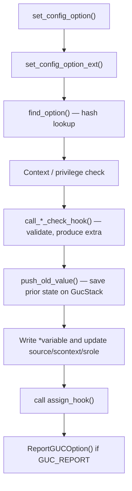
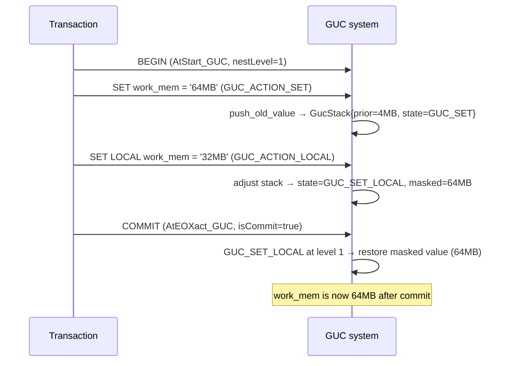
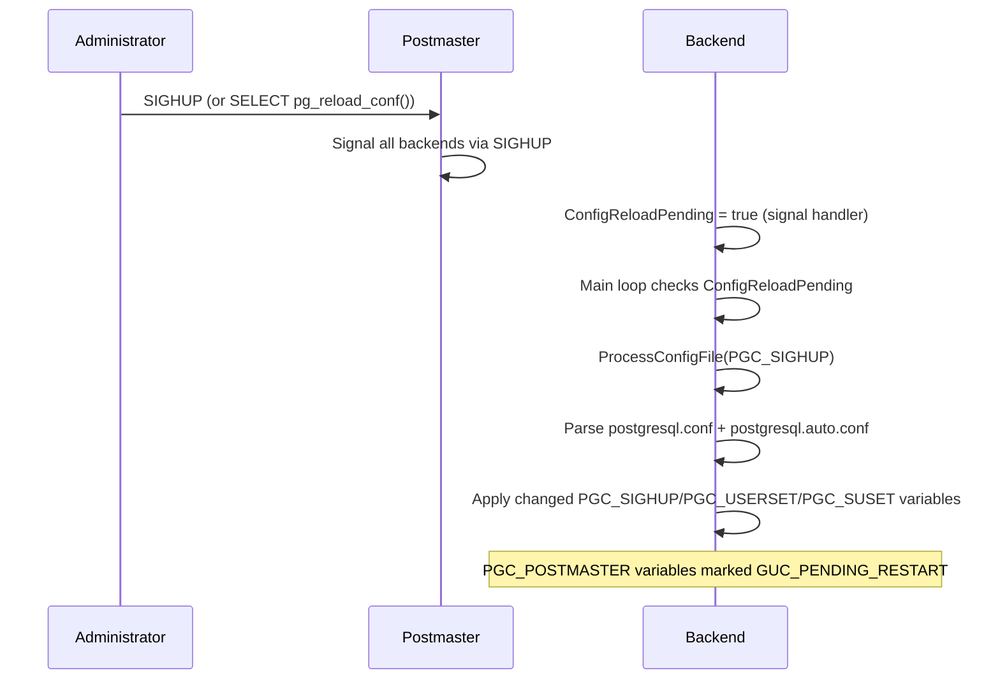

# GUC: Grand Unified Configuration

The Grand Unified Configuration system is PostgreSQL's runtime parameter infrastructure. Every knob exposed through `postgresql.conf`, `ALTER SYSTEM`, `SET`, and `SHOW` — from `work_mem` to `search_path` to extension-defined settings — is a GUC variable. The system provides uniform access, validation, source tracking, privilege enforcement, and transaction-aware rollback for all of them through a single set of data structures and entry points in `src/backend/utils/misc/guc.c`.

GUC was introduced as a replacement for ad hoc global variables. Its defining property is that every parameter carries enough metadata to know who can change it, how to validate a proposed value, what source it came from, and how to undo a change when a transaction rolls back.

## Variable types

GUC supports five types, defined by the `config_type` enum (`src/include/utils/guc_tables.h`):

| Type | C storage | Example parameter |
|---|---|---|
| `PGC_BOOL` | `bool` | `enable_seqscan` |
| `PGC_INT` | `int` | `work_mem` |
| `PGC_REAL` | `double` | `random_page_cost` |
| `PGC_STRING` | `char *` | `search_path` |
| `PGC_ENUM` | `int` (mapped via a name table) | `client_min_messages` |

Integer and real variables can carry unit annotations in their flags (`GUC_UNIT_KB`, `GUC_UNIT_MS`, etc.) so that values like `128MB` or `5min` are parsed and stored in the canonical unit automatically.

## Data structures

### config_generic — the common header

Every GUC variable begins with a `struct config_generic` (`src/include/utils/guc_tables.h`), a fixed header that carries all type-independent metadata:

| Field | Purpose |
|---|---|
| `name` | Parameter name string; also the hash key |
| `context` | `GucContext` — when/who may set this variable |
| `group` | Display grouping for `pg_settings` |
| `short_desc` / `long_desc` | Human-readable descriptions |
| `flags` | Bitfield controlling visibility, units, behaviour |
| `vartype` | The `config_type` enum value |
| `status` | Transient bits: `GUC_IS_IN_FILE`, `GUC_PENDING_RESTART`, `GUC_NEEDS_REPORT` |
| `source` | `GucSource` — where the current value came from |
| `reset_source` | Source of the value that RESET will restore |
| `scontext` / `reset_scontext` | `GucContext` that established the current / reset value |
| `srole` / `reset_srole` | Role OID that established the current / reset value |
| `stack` | Linked list of `GucStack` entries for transaction-aware rollback |
| `extra` | Opaque pointer created by a `check_hook` and consumed by an `assign_hook` |
| `sourcefile` / `sourceline` | Location in the config file when `source == PGC_S_FILE` |

The five typed structs — `config_bool`, `config_int`, `config_real`, `config_string`, `config_enum` — each embed `config_generic` as their first member, so a pointer to any of them can be cast to `struct config_generic *`. Each adds a pointer to the live C variable (`variable`), a `boot_val`, optional range bounds (`min`/`max` for numeric types), the three hook function pointers, and a `reset_val` for RESET semantics.

### Runtime lookup

All GUC variables are registered in a hash table (`guc_hashtab`) keyed on the parameter name. The hash table holds `GUCHashEntry` structs containing a `const char *gucname` and a `struct config_generic *gucvar`. Built-in variables are registered from five static arrays (`ConfigureNamesBool[]`, `ConfigureNamesInt[]`, etc. in `guc_tables.c`) at server startup via `build_guc_variables()`. Extension variables registered via `DefineCustom*Variable()` are inserted into the same hash table.

Three supplemental singly/doubly linked lists allow efficient iteration over the small subsets of variables that currently need attention: variables with a non-default source (`guc_nondef_list`), variables with a non-empty transaction stack (`guc_stack_list`), and variables whose current value needs to be reported to the client (`guc_report_list`).

### Flags reference

The `flags` field of `config_generic` is a bitfield. Notable bits:

| Flag | Meaning |
|---|---|
| `GUC_LIST_INPUT` | Value may be a comma-separated list |
| `GUC_NO_SHOW_ALL` | Omit from `SHOW ALL` |
| `GUC_NO_RESET` | Disallow RESET and SAVE |
| `GUC_REPORT` | Auto-report value changes to the client |
| `GUC_DISALLOW_IN_FILE` | Cannot be set in `postgresql.conf` |
| `GUC_CUSTOM_PLACEHOLDER` | Placeholder for an as-yet-undefined custom variable |
| `GUC_SUPERUSER_ONLY` | Hide from non-superusers unless they have `pg_read_all_settings` |
| `GUC_NOT_WHILE_SEC_REST` | Disallow when security-restricted operation is active |
| `GUC_DISALLOW_IN_AUTO_FILE` | Cannot be set in `postgresql.auto.conf` via ALTER SYSTEM |
| `GUC_ALLOW_IN_PARALLEL` | Can be set inside a parallel worker |
| `GUC_UNIT_KB` / `GUC_UNIT_MB` / ... | Memory unit for integer values |
| `GUC_UNIT_MS` / `GUC_UNIT_S` / ... | Time unit for integer values |

## GucContext: when a variable can be changed

`GucContext` encodes the minimum privilege and lifecycle moment required to set a parameter:

| Context | Who can set it and when |
|---|---|
| `PGC_INTERNAL` | Only internal code during startup. Users cannot change these (e.g. `server_version`). |
| `PGC_POSTMASTER` | Only from `postgresql.conf` or the postmaster command line before any backend is launched. Changes require a server restart. |
| `PGC_SIGHUP` | Postmaster startup or a SIGHUP-triggered config reload. Backends pick up new values on the next reload. |
| `PGC_SU_BACKEND` | Config file or connection startup packet, superuser only. Fixed for the life of the backend once started. |
| `PGC_BACKEND` | Config file or connection startup packet. Any user; fixed for the life of the backend. |
| `PGC_SUSET` | Config file, SIGHUP reload, or SQL `SET` command by a superuser (or a role with `pg_read_all_settings`). |
| `PGC_USERSET` | Config file, SIGHUP reload, or SQL `SET` by any user. |

The enforcement happens inside `set_config_option_ext()` (`guc.c`), which compares the variable's `context` field against the `context` argument the caller passes, rejecting combinations that would violate the hierarchy.

## GucSource: where a value came from

`GucSource` tracks the origin of the current value. A lower source value loses to a higher one: the config file cannot override the postmaster command line.

| Source | Origin |
|---|---|
| `PGC_S_DEFAULT` | Hard-wired `boot_val`; used by RESET as the fallback |
| `PGC_S_DYNAMIC_DEFAULT` | Default computed during initialization (shows as "default" in `pg_settings`) |
| `PGC_S_ENV_VAR` | Postmaster environment variable (`PGPORT`, `PGDATESTYLE`, etc.) |
| `PGC_S_FILE` | `postgresql.conf` (or an included file) |
| `PGC_S_ARGV` | Postmaster command-line argument |
| `PGC_S_GLOBAL` | `pg_db_role_setting` with no database or role restriction |
| `PGC_S_DATABASE` | `ALTER DATABASE ... SET` |
| `PGC_S_USER` | `ALTER ROLE ... SET` |
| `PGC_S_DATABASE_USER` | `ALTER ROLE ... IN DATABASE ... SET` |
| `PGC_S_CLIENT` | Connection startup packet (`PGOPTIONS`) |
| `PGC_S_OVERRIDE` | Forced override (used internally, e.g. locking `data_directory`) |
| `PGC_S_TEST` | Validation test during `ALTER DATABASE/ROLE` — assign hooks may behave differently |
| `PGC_S_SESSION` | SQL `SET` command in the current session |

Sources at or below `PGC_S_OVERRIDE` set the `reset_val` as well as the active value, so RESET returns to that level.

## Setting a variable: set_config_option

`set_config_option()` (`guc.c`) is the central workhorse. Every code path that changes a GUC — `SET` commands, config file loading, connection startup — eventually calls it or its more general sibling `set_config_option_ext()`.



The caller supplies:
- `name` and `value` (value `NULL` means "reset to default")
- `context` — the `GucContext` of the calling environment
- `source` — the `GucSource` to stamp on the value
- `action` — `GUC_ACTION_SET`, `GUC_ACTION_LOCAL`, or `GUC_ACTION_SAVE`
- `changeVal` — if false, only validate without applying

`SetConfigOption()` is a thin wrapper that calls `set_config_option()` with `GUC_ACTION_SET` and `changeVal=true`, used by non-SQL callers that just want to assert a value.

## Transaction-aware GUCs: the GucStack

Any `SET` issued inside a transaction must be rolled back if the transaction aborts. `SET LOCAL` must revert at commit. This is handled through a per-variable stack of `GucStack` entries allocated in `TopTransactionContext`.

### GucStack layout

| Field | Purpose |
|---|---|
| `prev` | Pointer to the next older entry on this variable's stack |
| `nest_level` | Transaction nesting depth at the time of the push |
| `state` | `GUC_SAVE`, `GUC_SET`, `GUC_LOCAL`, or `GUC_SET_LOCAL` |
| `source` / `scontext` / `srole` | Source attributes of the prior value |
| `prior` | The value (and `extra`) that was in effect before this entry |
| `masked` | For `GUC_SET_LOCAL`: the SET value to restore at commit |
| `masked_scontext` / `masked_srole` | Attributes of the masked (SET) value |

### Nesting level accounting

`GUCNestLevel` is a process-global counter. `AtStart_GUC()` sets it to 1 at main transaction start. `NewGUCNestLevel()` increments it on subtransaction entry or function proconfig entry. `AtEOXact_GUC(isCommit, nestLevel)` is called at the end of any nest level.

`push_old_value()` is called by `set_config_option_ext()` before writing a new value. It allocates a `GucStack` entry, records the prior value, and links it onto `gconf->stack`. Variables with non-empty stacks are tracked in `guc_stack_list` for O(1) iteration at commit/abort.

### Commit and abort behaviour

`AtEOXact_GUC()` walks `guc_stack_list` and, for each entry at or above `nestLevel`, decides what to do:

| Stack state | On abort | On commit at nest level 1 |
|---|---|---|
| `GUC_SET` | Restore prior value | Keep current active value; discard prior |
| `GUC_LOCAL` | Restore prior value | Restore prior value |
| `GUC_SET_LOCAL` | Restore prior value | Restore the masked (SET) value, discarding the LOCAL value |
| `GUC_SAVE` | Restore prior value | Restore prior value |

For subtransaction commit (nest level > 1), entries are merged downward rather than fully resolved, preserving correct semantics when an outer transaction later aborts.



## SIGHUP reload

When an administrator sends SIGHUP (or calls `pg_reload_conf()`), the signal handler in the postmaster sets `ConfigReloadPending = true` and signals each backend. Backends test `ConfigReloadPending` in their main loop and call `ProcessConfigFile(PGC_SIGHUP)` at a safe point (`src/backend/tcop/postgres.c`).

`ProcessConfigFile()` delegates to `ProcessConfigFileInternal()`, which:
1. Parses `postgresql.conf` into a `ConfigVariable` linked list.
2. Parses `postgresql.auto.conf` and appends its entries (later entries override earlier ones).
3. Marks all live GUC variables as not-in-file, then re-sets the `GUC_IS_IN_FILE` bit for each variable found in the files.
4. For variables that have been removed from the file since the last load, resets their `reset_val` to the boot default.
5. Applies each surviving entry via `set_config_option()` with `source=PGC_S_FILE`.

Variables whose `context` is `PGC_POSTMASTER` are skipped silently during a reload — they require a restart. `PGC_SIGHUP` variables are applied immediately. PostgreSQL sets the `GUC_PENDING_RESTART` status bit on any `PGC_POSTMASTER` variable that appears in the file with a value different from the active one. This is how `pg_settings.pending_restart` is populated.



## ALTER SYSTEM

`ALTER SYSTEM SET param = value` is the SQL interface for persistent, file-backed changes that survive restarts without manual file editing. It is implemented in `AlterSystemSetConfigFile()` (`guc.c`).

The command writes to `$PGDATA/postgresql.auto.conf`, not to `postgresql.conf`. The auto-conf file is a minimal key=value file prefixed with a warning comment. `ProcessConfigFileInternal()` reads it after `postgresql.conf`, so values in `postgresql.auto.conf` override values in `postgresql.conf`.

The update procedure acquires `AutoFileLock` (an [[subsystems/locking/lwlocks|LWLock]]) to serialize concurrent `ALTER SYSTEM` commands, reads the existing auto-conf file into a `ConfigVariable` list, splices in the new value (or removes the entry for RESET), and atomically writes a new copy via a temp file and `rename()`. The change is not visible to the running server until the next SIGHUP reload.

`ALTER SYSTEM` is blocked for:
- `PGC_INTERNAL` variables
- Variables with `GUC_DISALLOW_IN_FILE` or `GUC_DISALLOW_IN_AUTO_FILE`
- Non-superusers without an explicit `GRANT ... TO ... WITH GRANT OPTION` on the parameter (via `pg_parameter_acl`, a feature added in PostgreSQL 15)

**PostgreSQL 17:** `allow_alter_system` (boolean, `PGC_SIGHUP`) lets a DBA disable `ALTER SYSTEM` entirely on a cluster. Setting it to `off` causes all `ALTER SYSTEM` commands to fail with an error. This is aimed at managed cloud environments where operators want to enforce a single authoritative configuration source and prevent in-database overrides from accumulating in `postgresql.auto.conf`.

## Check, assign, and show hooks

Each typed GUC record holds three optional callback pointers:

| Hook | Signature | Purpose |
|---|---|---|
| `check_hook` | `bool (*)(T *newval, void **extra, GucSource source)` | Validate the proposed value; optionally allocate an `extra` struct the assign hook will consume. Return false to reject. |
| `assign_hook` | `void (*)(T newval, void *extra)` | Called after the value is committed to storage. Used to propagate the change to internal state (e.g. updating a cached variable derived from the GUC). |
| `show_hook` | `const char *(*)(void)` | Override the default display of the current value. Used when the meaningful representation differs from the stored integer (e.g. computed memory limits). |

The check hook is called before `push_old_value()`, so a rejected value never enters the stack. The `extra` pointer is threaded through check → stack → assign so that expensive parsing done in the check hook does not need to be repeated in the assign hook. The assign hook is called on both forward assignment and stack-restore, so it fires on both `SET` and `RESET`.

During `PGC_S_TEST` source (used by `ALTER DATABASE`/`ALTER ROLE` validation), the check hook receives that source value, allowing it to emit `NOTICE` rather than `ERROR` for references to objects that may not exist yet.

## Extension-defined GUCs

Extensions register GUC variables from their `_PG_init()` hook using:

```c
DefineCustomBoolVariable(name, short_desc, long_desc,
                         &my_bool_var, false,
                         PGC_USERSET, 0,
                         check_hook, assign_hook, show_hook);
```

Analogous functions exist for `Int`, `Real`, `String`, and `Enum` types. These functions call `init_custom_variable()` to allocate a typed config record, then `define_custom_variable()` to splice it into the hash table, replacing any `GUC_CUSTOM_PLACEHOLDER` that may have been created when the extension's parameter appeared in `postgresql.conf` before the extension was loaded.

Custom variable names must contain a dot separator (`myext.myparam`). Extensions should call `MarkGUCPrefixReserved()` (formerly `EmitWarningsOnPlaceholders()`) to emit a warning if an unrecognized name under their prefix is found in the config file.

## The pg_settings view

`pg_settings` is a virtual view backed by `show_all_settings()` in `guc_funcs.c`, which iterates the GUC hash table and returns one row per visible variable. For each variable, `GetConfigOptionValues()` assembles the row by reading `config_generic` fields directly and calling `ShowGUCOption()` to produce the string representation of the current value (invoking the `show_hook` if present).

The view is writable: `pg_settings_u`, a rewrite rule on `UPDATE TO pg_settings`, routes writes through `set_config_by_name()`, making `UPDATE pg_settings SET setting = '...' WHERE name = '...'` equivalent to `SELECT set_config(name, value, false)`.

Key columns and their sources:

| Column | Source in config_generic |
|---|---|
| `name` | `conf->name` |
| `setting` | `ShowGUCOption()` (invokes `show_hook` if set) |
| `unit` | `get_config_unit_name(conf->flags)` |
| `context` | `GucContext_Names[conf->context]` |
| `vartype` | `config_type_names[conf->vartype]` |
| `source` | `GucSource_Names[conf->source]` |
| `min_val` / `max_val` | From the typed subtype's `min`/`max` fields |
| `boot_val` | The `boot_val` of the typed subtype |
| `reset_val` | The `reset_val` of the typed subtype |
| `sourcefile` / `sourceline` | `conf->sourcefile`, `conf->sourceline` |
| `pending_restart` | `conf->status & GUC_PENDING_RESTART` |

**PostgreSQL 17:** `huge_pages_status` is a read-only `PGC_INTERNAL` string variable that reports whether huge pages are actually in use at runtime (`on`, `off`, or `unknown`). It differs from `huge_pages`, which expresses a request; `huge_pages_status` reflects what the OS actually granted.

## Version History

### PostgreSQL 17

**Timeout and execution control.** `transaction_timeout` limits the total elapsed time of a transaction, filling a gap left by `statement_timeout`: `statement_timeout` resets on each new statement within a transaction, so a transaction composed of many short statements could run indefinitely; `transaction_timeout` applies to the entire transaction from `BEGIN` to commit or rollback. `event_triggers` (boolean) can be set to `off` to disable all event triggers globally, which is useful during debugging or recovery scenarios where event trigger side-effects are undesirable.

**I/O tuning.** `io_combine_limit` sets the maximum number of blocks that can be merged into a single vectored read call. This caps the size of combined I/O operations and interacts with `effective_io_concurrency` and the prefetch infrastructure.

**Configurable SLRU buffer pools.** Prior to PG17, several SLRU caches had hard-coded sizes. PG17 made them runtime-configurable: `commit_timestamp_buffers`, `multixact_member_buffers`, `multixact_offset_buffers`, `notify_buffers`, `serializable_buffers`, `subtransaction_buffers`, and `transaction_buffers`. Each accepts a number of 8 kB buffers. Tuning these is relevant on systems with very high transaction rates, large numbers of serializable transactions, or heavy use of `LISTEN`/`NOTIFY`.

### PostgreSQL 18

**Asynchronous I/O.** `io_method` selects the backend used for I/O operations: `sync` (the traditional synchronous path), `worker` (offloads I/O to background worker processes), or `io_uring` (Linux io_uring, available on supported kernels). `io_max_combine_limit` is the server-level upper bound on I/O combining; individual sessions can set `io_combine_limit` up to this ceiling.

**[[subsystems/background/autovacuum|Autovacuum]] tuning.** `autovacuum_vacuum_max_threshold` adds a fixed dead-tuple count threshold that triggers autovacuum independently of the proportional `autovacuum_vacuum_scale_factor` threshold. This prevents large tables from accumulating an unbounded absolute count of dead tuples when the scale-factor threshold is set low. `autovacuum_worker_slots` sets the maximum number of autovacuum worker slots allocated at postmaster startup; unlike `autovacuum_max_workers`, it can be changed at runtime (though decreasing it below the current worker count takes effect only as workers exit).

**Vacuum behavior.** `vacuum_truncate` becomes a server-level GUC (previously only available as a per-table storage parameter via `ALTER TABLE ... SET (vacuum_truncate = off)`). `vacuum_max_eager_freeze_failure_rate` controls the fraction of pages that may fail eager freezing before the mechanism gives up for the current vacuum pass, preventing runaway I/O on tables with many skippable pages. `track_cost_delay_timing` enables instrumentation of the time actually spent sleeping during cost-delay pauses in `VACUUM` and `ANALYZE`, surfacing it in `pg_stat_progress_vacuum` and related views.

**Replication and security.** `idle_replication_slot_timeout` automatically invalidates replication slots that have been inactive for the specified duration, addressing the long-standing operational hazard of abandoned slots causing unbounded WAL retention. `md5_password_warnings` controls whether a warning is emitted when MD5 authentication is used; setting it to `off` suppresses the deprecation notice for deployments that cannot yet migrate away from MD5.

## See also

- [[architecture/overview]]
- [[architecture/process-architecture]]
- [[subsystems/transactions/transaction-lifecycle]]
- [[subsystems/wal/recovery]]
