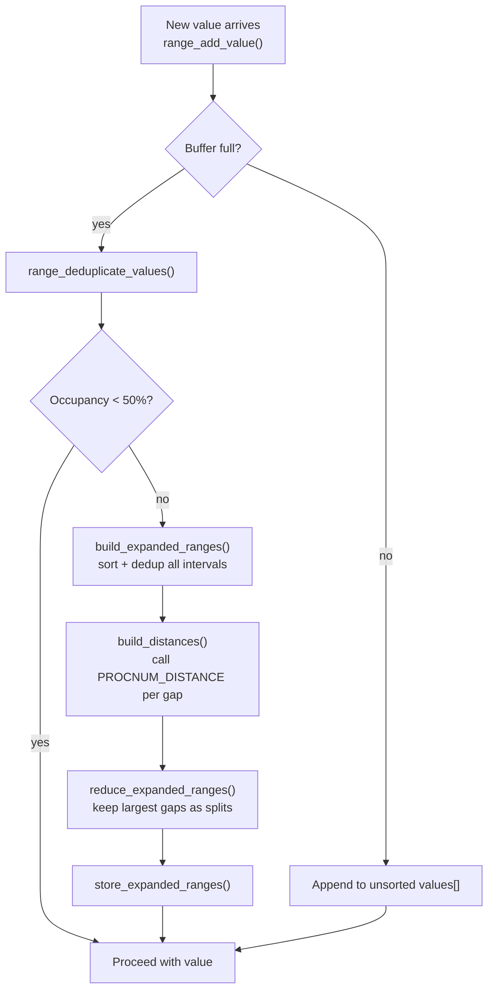

The minmax-multi operator class extends the basic [[subsystems/indexes/brin|BRIN]] `minmax` opclass by tracking a bounded set of non-overlapping intervals per page range instead of a single global min/max pair. This makes the opclass resilient to outliers: a single out-of-range value no longer forces the entire summary into a uselessly wide interval. The index can then continue excluding page ranges that fall within the gaps between clusters.

## The Outlier Problem with Plain Minmax

The standard `minmax` opclass collapses all data in a heap page range into two boundary values. A table with timestamps clustered around `[1000, 2000]` that receives one row with value `1000000` must extend its summary to `[1000, 1000000]`. Every subsequent query whose predicate falls between `2001` and `999999` now touches that page range unnecessarily. If outliers are frequent this degrades into a full scan.

Minmax-multi solves this by maintaining multiple intervals. After the outlier is added the summary might instead read `[1000, 2000]` and `[1000000, 1000000]`. This leaves the gap clearly absent from the index. Queries targeting values in that gap still skip the range. The tradeoff is more CPU work per insert and more storage per summary, both bounded by the `values_per_range` reloption (default 32, maximum 256).

## Summary Representation

The in-memory state is held in the `Ranges` struct (`brin_minmax_multi.c`). Its `values[]` flexible array is divided into two logically distinct sections:

```
+-------------------------------+-----------------------------+
| 2 × nranges boundary values   | nvalues single-point values |
+-------------------------------+-----------------------------+
```

Regular intervals are stored as consecutive (min, max) pairs in the first section. Collapsed intervals — where min equals max — are stored as a single value in the second section, saving one slot. The invariant `2*nranges + nvalues <= maxvalues` is enforced at all times.

| Field | Meaning |
|---|---|
| `nranges` | Count of proper intervals (two boundary values each) |
| `nvalues` | Count of single-point values |
| `nsorted` | How many of the `nvalues` points are already sorted |
| `maxvalues` | Allocated capacity (the in-memory buffer, larger than `target_maxvalues`) |
| `target_maxvalues` | The final on-disk limit set by `values_per_range` |

On disk the summary is stored as a `SerializedRanges` bytea varlena. The on-disk `maxvalues` records the reloption value that was in effect when the summary was written. Deserialization re-inflates the buffer to a multiple of that value to amortise compaction cost.

## Insert Buffer and Compaction

Rather than enforcing the `values_per_range` limit on every insert, minmax-multi allocates an in-memory buffer up to 10× the target size (capped at 8192, minimum 256), set by the constants `MINMAX_BUFFER_FACTOR`, `MINMAX_BUFFER_MAX`, and `MINMAX_BUFFER_MIN`. New values are appended to the unsorted section of `values[]` without sorting or deduplication, making individual inserts cheap.

When the buffer fills, `ensure_free_space_in_buffer()` is called. It first tries a cheap deduplication pass (`range_deduplicate_values()`), sorting and deduplicating the unsorted point values. If that alone reduces occupancy below 50% of capacity (controlled by `MINMAX_BUFFER_LOAD_FACTOR = 0.5`), the compaction stops there. Otherwise the full merge algorithm runs. The existing intervals and points are expanded into a flat `ExpandedRange[]` array, sorted, and deduplicated. They are then reduced by merging the intervals separated by the smallest gaps.

The final reduction at serialization time — `compactify_ranges()` — applies the same algorithm but targets `target_maxvalues` exactly, without the 50% headroom. No further inserts are expected until the summary is re-read, so the headroom is unnecessary.

## Gap-Based Merging Algorithm

When the number of values must be reduced, the algorithm identifies which intervals to merge by measuring the gaps between them:

1. All existing ranges and single-point values are expanded into `ExpandedRange` structs (each with `minval`, `maxval`, `collapsed`).
2. Overlapping ranges from two different summaries (as happens during a union) are merged by `merge_overlapping_ranges()`.
3. `build_distances()` calls the type-specific distance support procedure (procnum 11, `PROCNUM_DISTANCE`) to measure the gap between consecutive intervals, producing a `DistanceValue[]` array sorted in descending order.
4. `reduce_expanded_ranges()` keeps only the `(max_values/2 - 1)` largest gaps as split points and forms new interval boundaries from the global min, global max, and the endpoints of each retained gap.

The result preserves the widest separations in the data at the cost of merging closely-spaced intervals. The approach is greedy and does not guarantee an optimal partition. In practice, however, it produces significantly better results than widening a single global interval. Compaction runs inside a short-lived `AllocSetContext` to contain memory from expensive `distanceFn` calls (e.g. `numeric_sub` for numeric types).



## Distance Functions

The distance support procedure (procnum 11) is mandatory and type-specific. It receives the max of one interval and the min of the next. It returns a `float8` representing the gap width. Built-in implementations cover:

| Types | Method |
|---|---|
| `int2`, `int4`, `int8`, `float4`, `float8`, `numeric` | Arithmetic subtraction |
| `date`, `timestamp`, `timestamptz`, `interval`, `time`, `timetz` | Subtraction on underlying int64/float8 representation |
| `tid` | Map to `(blockno × MaxHeapTuplesPerPage + offset)`, subtract |
| `uuid`, `macaddr`, `macaddr8` | Byte-by-byte subtraction, normalized to `[0, 1]` via successive `/256` steps |
| `inet` | Subtract masked address bytes, normalize by address family size |
| `pg_lsn` | Direct int64 subtraction |

For UUID and MAC address types the distance is approximate, because a `float8` cannot represent a full 128-bit delta exactly. This is acceptable: a slightly inaccurate distance might cause a suboptimal merge choice, but the resulting summary is still correct.

## Consistent Check

At scan time, `brin_minmax_multi_consistent()` deserializes the stored `SerializedRanges` and evaluates all scan keys against each stored interval in turn. For a given interval `[minval, maxval]`:

| Strategy | Check |
|---|---|
| `<`, `<=` | `minval [op] scankey` |
| `=` | `minval <= scankey AND maxval >= scankey` |
| `>=`, `>` | `maxval [op] scankey` |

If any single interval satisfies all scan keys, the function immediately returns `true` (include this page range). Point values in the second section of the array are tested the same way — a point satisfies all five B-tree strategies directly against its single stored value.

The function returns `false` only when every interval and every point fails at least one scan key for every key in the set. Because the summary is conservative (it always covers the actual data), a `false` return is a definitive exclusion.

## Union

`brin_minmax_multi_union()` merges two summaries, as required when a BRIN summarization pass combines a placeholder tuple with an independently accumulated local summary. Both summaries are deserialized into `ExpandedRange[]` arrays and concatenated. The combined array is then sorted, deduplicated, and overlap-merged. The combined set is then reduced to fit within `ranges_a->maxvalues` boundary values using the same gap-based algorithm. Unlike the buffer compaction case, no load-factor headroom is applied — the result is packed as tightly as the target allows.

## Storage Parameter

```sql
CREATE INDEX ON events USING brin (event_time)
  WITH (values_per_range = 64);
```

`values_per_range` (default 32, range 8–256) controls the on-disk budget per summary. Higher values allow more intervals, improving selectivity for clustered but non-monotone data, at the cost of larger index tuples and more CPU during merges. The option is registered via `brin_minmax_multi_options()` and stored in `MinMaxMultiOptions.valuesPerRange`.

## Key Data Structures

| Struct | Role |
|---|---|
| `Ranges` | In-memory summary: boundary values array, counts, comparator cache |
| `SerializedRanges` | On-disk varlena: compact header + packed boundary values |
| `ExpandedRange` | Temporary (min, max, collapsed) triple used during merging |
| `DistanceValue` | (index, double) pair used to sort gaps before reduction |
| `MinMaxMultiOptions` | Parsed reloption carrying `valuesPerRange` |
| `MinmaxMultiOpaque` | Per-column cache of strategy and distance `FmgrInfo` entries |

## Related Topics

- [[subsystems/indexes/brin|BRIN Index Internals]] — overall BRIN architecture, revmap, page layout, and the opclass callback contract
