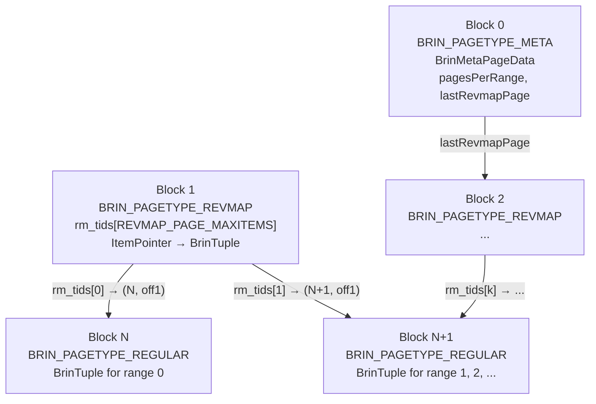
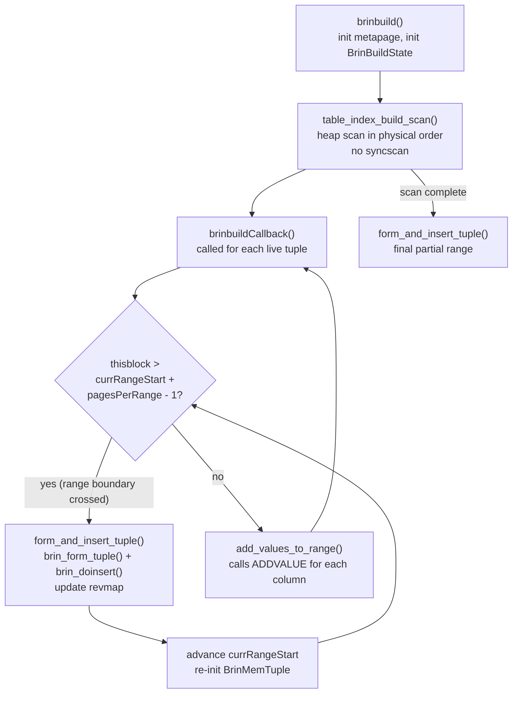
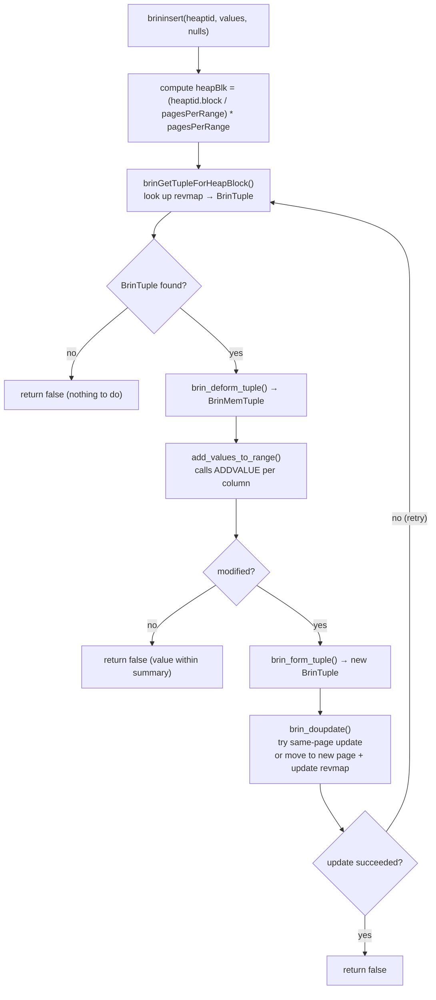
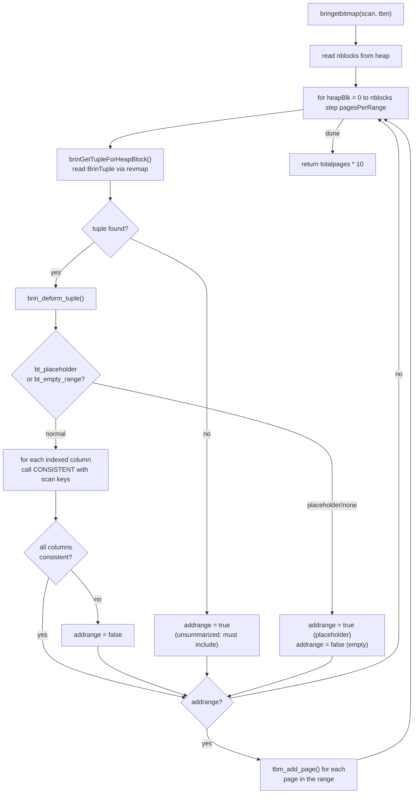
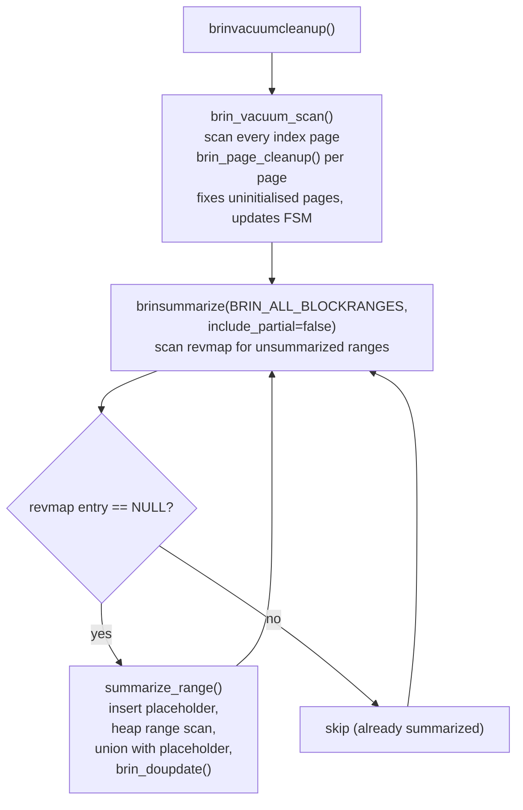

# BRIN Index Internals

BRIN (Block Range INdex) is a lossy, summarizing index access method designed for very large tables where the indexed column values are naturally correlated with heap physical order (e.g. a `created_at` timestamp that grows monotonically as rows are appended). Rather than indexing individual tuples, a BRIN entry summarises an entire *range* of consecutive heap pages. The resulting index is extraordinarily small — a few hundred kilobytes for a billion-row table — at the cost of requiring a heap recheck on every row within a qualifying range.

The implementation lives in `src/backend/access/brin/`. The AM handler (`brinhandler()`, `brin.c`) registers the `aminsert`, `amgetbitmap`, `ambuild`, and `amvacuumcleanup` callbacks but deliberately leaves `amgettuple = NULL`: BRIN supports only bitmap scans, never tuple-at-a-time scans.

## When BRIN is useful

BRIN is the right choice when:

- The table is large (hundreds of gigabytes to terabytes) and would produce an unacceptably large B-tree index.
- The indexed column is naturally sorted in insertion order — timestamps, auto-increment IDs, write-once audit logs — so that adjacent heap blocks actually contain similar values.
- The workload is primarily range queries (`WHERE created_at BETWEEN ...`) not point lookups.
- The query plan is acceptable with bitmap heap scans that recheck every tuple in qualifying page ranges.

BRIN is a poor choice for randomly-ordered data: if each page range contains both very small and very large values, the `consistent` check never excludes any range. The index then adds overhead without benefit.

## Index structure

A BRIN index file contains three distinct page types, distinguished by the `BrinPageType()` macro reading `BrinSpecialSpace.vector` at the end of each page (`brin_page.h`):

| Constant | Value | Purpose |
|---|---|---|
| `BRIN_PAGETYPE_META` | `0xF091` | Metapage (block 0) |
| `BRIN_PAGETYPE_REVMAP` | `0xF092` | Range map pages |
| `BRIN_PAGETYPE_REGULAR` | `0xF093` | Summary tuple storage |



### Metapage

Block 0 is always the metapage. Its content is the `BrinMetaPageData` struct (`brin_page.h`):

```c
typedef struct BrinMetaPageData
{
    uint32      brinMagic;       /* 0xA8109CFA */
    uint32      brinVersion;     /* BRIN_CURRENT_VERSION = 1 */
    BlockNumber pagesPerRange;   /* storage parameter, default 128 */
    BlockNumber lastRevmapPage;  /* highest revmap block allocated */
} BrinMetaPageData;
```

`pagesPerRange` is fixed at index-creation time and controls the granularity of summaries. The default is `BRIN_DEFAULT_PAGES_PER_RANGE = 128` (`brin.h`).

### Range map (revmap)

The range map is the key to BRIN's efficient lookup: it is a dense, flat, random-access array that maps each heap block range to the location of its summary tuple. This two-level indirection (heap block → revmap slot → `BrinTuple` location) allows summaries to be relocated on disk without updating the revmap in many cases.

The range map occupies all blocks from 1 through `lastRevmapPage`. Each revmap page is a flat array of `ItemPointerData` values stored in `RevmapContents.rm_tids[]`. Each element is a (block, offset) pointer to the `BrinTuple` on a regular page that summarises the corresponding heap block range.

The mapping from a heap block number to its revmap slot uses two macros from `brin_revmap.c`:

```c
#define HEAPBLK_TO_REVMAP_BLK(pagesPerRange, heapBlk) \
    ((heapBlk / pagesPerRange) / REVMAP_PAGE_MAXITEMS)

#define HEAPBLK_TO_REVMAP_INDEX(pagesPerRange, heapBlk) \
    ((heapBlk / pagesPerRange) % REVMAP_PAGE_MAXITEMS)
```

`REVMAP_PAGE_MAXITEMS` is computed from the page size: `(BLCKSZ - header overhead) / sizeof(ItemPointerData)`, approximately 2730 entries per 8 kB page. The revmap grows by one page at a time (via `revmap_physical_extend()`) as new heap blocks are encountered. If the next block to be claimed as a revmap page is currently a regular BRIN page containing tuples, those tuples are evacuated first (`brin_evacuate_page()`).

Looking up the summary for heap block 512 with `pagesPerRange=128` is: range 4 → revmap page `(4 / 2730) + 1 = 1`, index `4 % 2730 = 4`.

### Regular pages and BrinTuple

Regular pages (`BRIN_PAGETYPE_REGULAR`) are ordinary heap-formatted index pages. Each item on a regular page is a `BrinTuple` — the on-disk summary for one block range. Multiple `BrinTuple` entries from different ranges can share a single regular page. The revmap `ItemPointer` for each range points to the correct item.

The on-disk `BrinTuple` header packs a block number and an 8-bit `bt_info` flags/offset byte (`BRIN_NULLS_MASK`, `BRIN_PLACEHOLDER_MASK`, `BRIN_EMPTY_RANGE_MASK`, and the data offset), followed by an optional null bitmask and the opclass-defined `Datum` values. See [[subsystems/indexes/brin-internals|BRIN Tuple Layout and Opclass Internals]] for the exact struct layout and bit assignments.

### In-memory representation

When a `BrinTuple` is read from disk, it is deformed into a `BrinMemTuple`. Its `bt_columns` array of `BrinValues` gives each opclass callback a convenient per-column view of the accumulated min/max (or other opclass-defined) state. The full struct definitions live in [[subsystems/indexes/brin-internals|BRIN Tuple Layout and Opclass Internals]].

### BrinDesc

`BrinDesc` is the index-level descriptor, built once per index open. It caches the tuple descriptor and the per-column `BrinOpcInfo` array passed to every opclass callback. See [[subsystems/indexes/brin-internals|BRIN Tuple Layout and Opclass Internals]] for its fields.

## Operator classes

An opclass must implement four mandatory support procedures (numbered in `brin_internal.h`):

| Procnum | Constant | Signature | Purpose |
|---|---|---|---|
| 1 | `BRIN_PROCNUM_OPCINFO` | `(typoid) → BrinOpcInfo*` | Describe storage layout |
| 2 | `BRIN_PROCNUM_ADDVALUE` | `(bdesc, bval, value, isnull) → bool` | Expand summary with new value |
| 3 | `BRIN_PROCNUM_CONSISTENT` | `(bdesc, bval, scankey[, nkeys]) → bool` | Can this range match the scan key? |
| 4 | `BRIN_PROCNUM_UNION` | `(bdesc, col_a, col_b) → void` | Merge two summaries in-place |

Procedure 5 (`BRIN_PROCNUM_OPTIONS`) is optional and adds per-column storage parameters. Custom opclasses can use procedure numbers 11–15.

### `minmax` opclass (`brin_minmax.c`)

The built-in `minmax` opclass stores two values per column: the minimum (`bv_values[0]`) and the maximum (`bv_values[1]`). `oi_nstored = 2`.

When a new value arrives, `brin_minmax_add_value()` compares it against the stored bounds using the B-tree comparison operators for the type. It widens whichever bound is exceeded. If the new value already falls within the stored range, the summary is unchanged:

```
if (newval < bv_values[0])  →  update min
if (newval > bv_values[1])  →  update max
return true if updated, false if value already within range
```

At query time, `brin_minmax_consistent()` maps the scan strategy to the appropriate bound:

| Strategy | Check |
|---|---|
| `<`, `<=` | `min() [op] scankey` |
| `=` | `min() <= scankey AND max() >= scankey` |
| `>=`, `>` | `max() [op] scankey` |

Two summaries are merged by `brin_minmax_union()`, which takes the lower of the two minimums and the higher of the two maximums. The result is the tightest summary that covers both input ranges.

The `minmax` opclass works for any type with a total order: integers, timestamps, UUIDs, text, etc.

### `inclusion` opclass

The `inclusion` opclass (in `brin_inclusion.c`, not shown here) is designed for geometric and range types. Instead of min/max it stores the *union* of all values seen in the range — for example, the bounding box enclosing all geometry points, or the union of all `tsrange` values. `consistent` tests whether the summary union overlaps (or contains, etc.) the scan key.

### `bloom` opclass (`brin_bloom.c`)

Added in PostgreSQL 13, the `bloom` opclass stores a Bloom filter over the hash values of all column values in the range. It only supports equality queries (`WHERE col = value`).

Key parameters (configurable per-column via `WITH (...)` on the index column):

| Option | Default | Range | Meaning |
|---|---|---|---|
| `n_distinct_per_range` | `−0.1` (10% of rows) | ≥ 16 | Expected distinct values per range |
| `false_positive_rate` | `0.01` (1%) | 0.01%–25% | Desired Bloom filter FPR |

The Bloom filter uses two hash seeds (`BLOOM_SEED_1`, `BLOOM_SEED_2`) and the Kirsch-Mitzenmacher scheme to generate `k` independent hash functions from two. Column values are first hashed using the type's standard hash function (producing `uint32`). That hash is then added to the Bloom filter.

When a new value is inserted into a range, `brin_bloom_add_value()` hashes it and sets the corresponding bits. At scan time, `brin_bloom_consistent()` hashes the scan key and tests whether all the corresponding bits are set. A clear bit is a definitive exclusion — the value was never inserted into this range. All bits set means only that the range *might* contain the value. False positives are possible and are controlled by the `false_positive_rate` parameter.

The Bloom opclass is best suited for equality lookups on tables with moderate cardinality per range (e.g., a `user_id` column where rows cluster by user over time). Unlike `minmax`, it can exclude ranges even when data is not perfectly sorted — it just requires that the value has never been hashed into the filter for a given range.

## Index build

Building a BRIN index requires only a single sequential heap scan. This is the natural consequence of summarizing ranges: all the information needed for a range's summary is gathered in one pass through its pages. A single in-memory `BrinMemTuple` (`bs_dtuple` in `BrinBuildState`) accumulates the running summary for the current range. As each live heap tuple is visited, its column values are fed into the opclass `ADDVALUE` callbacks. When a tuple belonging to a new range arrives, the completed summary is serialized to disk via `brin_form_tuple()` and written to a regular page via `brin_doinsert()`. This call also updates the revmap atomically. The accumulator is then reset for the new range (`brin_memtuple_initialize()`).

**PostgreSQL 17:** BRIN indexes can be built using parallel workers, matching the capability already available for B-tree and hash indexes. The heap is scanned in parallel. Each worker independently summarizes its assigned block ranges. The results are merged into the final index at the end. The degree of parallelism is controlled by the `max_parallel_maintenance_workers` GUC, subject to the usual cost-based parallel-worker selection.



Ranges can contain no live tuples at all (e.g. all-dead or fully empty pages). These are handled by advancing the range boundary with a fresh tuple until the current tuple's block falls within the window (`brinbuildCallback()`). This guarantees a revmap entry exists for every range, even empty ones. After the scan, the last (possibly partial) range is flushed with a final `form_and_insert_tuple()` call.

## Incremental updates on insert

BRIN's insert strategy is deliberately minimal: on each heap row insertion, the existing summary for that block range is widened only if the new value falls outside it. If no summary exists yet for the range (the range is "unsummarized"), nothing is done at all. The range remains unsummarized until [[subsystems/background/autovacuum|autovacuum]] or an explicit summarization call handles it. This keeps insert overhead as low as possible for append-heavy workloads.



The `ADDVALUE` callback for each indexed column returns `true` if it expanded the summary. If any column signals a change, the updated summary must be written back to disk. The write prefers a same-page overwrite (`PageIndexTupleOverwrite()`) when the new serialized tuple fits within the old page slot. Otherwise, the updated tuple is placed on a different regular page. The revmap entry is redirected atomically (`brin_doupdate()`, `brin_pageops.c`).

Concurrent updates are handled without locks via an optimistic retry loop. Before writing, the existing tuple is compared against the version that was originally read (`brin_tuples_equal()`). If another backend modified the summary in the interim, the loop re-reads the current version from the revmap and retries. This ensures the final stored summary is at least as wide as all concurrent updates combined.

### Autosummarization

If the `autosummarize` storage parameter is enabled (default: `false`), the first insertion into a brand-new range triggers a request for autovacuum to go back and summarize the *previous* range. That range was left unsummarized during normal row-by-row inserts (`brininsert()`, `brin.c`). The request is sent via `AutoVacuumRequestWork(AVW_BRINSummarizeRange, ...)`.

## Bitmap scan

The bitmap scan is the only supported scan mode — BRIN never returns individual tuples. The design reflects the fundamental trade-off: rather than paying per-row overhead during inserts, BRIN pays at scan time by rechecking every tuple on pages it cannot definitively exclude. During a scan, every heap block range is examined in order. Its summary is loaded via the revmap. The opclass `CONSISTENT` callback then decides whether the range can be excluded, given the query's scan keys. Ranges that cannot be excluded have all their pages added to the output `TIDBitmap`. The bitmap heap scan then rechecks every tuple on those pages against the original predicates (`bringetbitmap()`, `brin.c`).



Several aspects of the scan deserve attention:

- **Unsummarized ranges are always included.** When the revmap lookup returns NULL (no entry, or an InvalidTID), the range is conservatively treated as matching. Missing a qualifying row is never acceptable, so doubt always resolves toward inclusion.
- **Placeholder tuples are always included.** A placeholder is written during concurrent summarization (`summarize_range()`). It signals that the range is being rebuilt and that no definitive summary exists yet.
- **Bitmap is lossy / page-granular.** `tbm_add_page()` adds whole pages, not individual TIDs. `BitmapHeapScan` will recheck every tuple on those pages against the original query predicates. BRIN never claims to be lossless.
- **Multiple scan keys per column.** Opclasses whose `CONSISTENT` function accepts a 4-argument form (`fn_nargs >= 4`) receive all scan keys at once. Older opclasses receive them one by one. A single false return short-circuits the remaining keys for that column.
- **NULL handling.** IS NULL / IS NOT NULL scan keys are checked separately before calling `CONSISTENT`, using the `bv_allnulls` and `bv_hasnulls` flags, without invoking the opclass.

The return value `totalpages * 10` is a rough estimate of heap tuples (not pages) matching the scan. The planner uses it only for cost estimation.

## Page-level storage operations

All structural changes to regular pages and the revmap are managed by two core operations in `brin_pageops.c`.

**Inserting a new summary tuple** means finding a regular page with sufficient free space (consulting the [[subsystems/storage/fsm|FSM]]) and initializing new pages if the relation must be extended. It then means writing the `BrinTuple` there and atomically updating the revmap slot to point to the new location. All of this is WAL-logged with `XLOG_BRIN_INSERT` (`brin_doinsert()`).

**Replacing an existing summary tuple** prefers a same-page overwrite (`PageIndexTupleOverwrite()`) when the updated tuple fits within the existing slot and the page has enough free space for any growth. When the page cannot accommodate the new tuple, the updated version is written to a different regular page and the revmap entry is redirected atomically. WAL records differ accordingly: `XLOG_BRIN_SAMEPAGE_UPDATE` for in-place updates and `XLOG_BRIN_UPDATE` for cross-page moves. `brin_doupdate()` returns `false` to signal that the caller should retry. This happens if the old tuple was concurrently modified or the page was repurposed as a revmap page.

### Page evacuation

When the revmap needs to grow into a block currently occupied by a regular page, that page must be cleared first. It is marked with `BRIN_EVACUATE_PAGE` by `brin_start_evacuating_page()`, which prevents any new insertions onto it. Every tuple currently on the page is then re-inserted elsewhere via `brin_doupdate()` (`brin_evacuate_page()`). Only after the page is empty can it be re-initialized as a revmap page.

## VACUUM and summarization

Because BRIN does not index individual tuples, there are no per-tuple index entries to delete during vacuum. All meaningful maintenance happens after the heap vacuum pass, in two phases (`brinvacuumcleanup()`):



The first phase (`brin_vacuum_scan()`) scans every index page, fixes any uninitialized pages, and updates the FSM. The second phase (`brinsummarize()`) scans the revmap, looking for ranges that have no summary entry. It builds a summary for each one it finds.

Building a summary for a previously unsummarized range requires care in the face of concurrent inserts. The approach is to first write a placeholder `BrinTuple` (with `BRIN_PLACEHOLDER_MASK` set) into the index and update the revmap to point to it. This way, any concurrent `brininsert()` calls that arrive during the scan update the placeholder rather than bypass it entirely. A heap scan over the range then accumulates values into a local `BrinMemTuple` using `table_index_build_range_scan()` with "any visible" mode. Finally, the placeholder (which may have been widened by concurrent inserts) is read back and merged with the locally accumulated summary via `union_tuples()`. This function calls `BRIN_PROCNUM_UNION` per column. If the placeholder was modified again between the read and the write, `brin_doupdate()` returns false. The loop then reads the latest version and retries (`summarize_range()`).

### SQL management functions

| Function | Description |
|---|---|
| `brin_summarize_new_values(regclass)` | Summarise all currently-unsummarised ranges |
| `brin_summarize_range(regclass, bigint)` | Summarise a single page range (by heap block number) |
| `brin_desummarize_range(regclass, bigint)` | Remove the summary for a range (mark it unsummarised) |

`brin_desummarize_range()` delegates to `brinRevmapDesummarizeRange()`, which sets the revmap slot to `InvalidItemPointer` and deletes the `BrinTuple` from the regular page.

## `pages_per_range` storage parameter

```sql
CREATE INDEX ON measurements USING brin (recorded_at)
  WITH (pages_per_range = 64);
```

`pages_per_range` is the single most important tuning knob. It is stored in `BrinMetaPageData.pagesPerRange` at index creation and cannot be changed afterwards (requires a `REINDEX`).

| Smaller `pages_per_range` | Larger `pages_per_range` |
|---|---|
| More precise exclusion (fewer false-positive pages) | Coarser exclusion |
| Larger index (more revmap pages, more summary tuples) | Smaller index |
| More work per insert (more revmap lookups) | Less work per insert |
| Better for moderately disordered data | Better for perfectly ordered data or very large tables |

For a 128-page-per-range index on an 8 kB page table, each range covers 1 MB of heap. The revmap requires approximately 1 page per 2730 ranges, so a 1 TB table (~134 million heap pages, ~1 million ranges) needs only ~370 revmap pages plus a small number of regular pages — an index of around 3 MB total.

## Concurrency notes

- `brininsert()` does not hold any lock on the heap during the revmap lookup and tuple update; it uses an optimistic retry loop.
- Multiple backends can concurrently summarise different ranges; within a single range, the placeholder mechanism serialises summarization via `brin_doupdate()`'s compare-and-swap semantics.
- The revmap lock ordering (metapage → revmap page → regular page) is consistent throughout to prevent deadlocks.
- WAL is written for all structural changes: index creation (`XLOG_BRIN_CREATE_INDEX`), tuple insert (`XLOG_BRIN_INSERT`), same-page update (`XLOG_BRIN_SAMEPAGE_UPDATE`), cross-page update (`XLOG_BRIN_UPDATE`), revmap extension (`XLOG_BRIN_REVMAP_EXTEND`), and desummarization (`XLOG_BRIN_DESUMMARIZE`).

## See also

- [[subsystems/indexes/brin-internals|BRIN Tuple Layout and Opclass Internals]] — full `BrinTuple`/`BrinMemTuple` byte layout, the inclusion opclass, and BRIN WAL records
- [[subsystems/indexes/btree]] — the B-tree AM; contrast per-tuple indexing vs. range summarization
- [[subsystems/indexes/gin]] — another bitmap-returning index AM
- [[code-paths/index-scan]] — executor path that invokes `bringetbitmap()` via `BitmapIndexScan`
- [[code-paths/vacuum]] — VACUUM coordination that drives `brinvacuumcleanup()`
