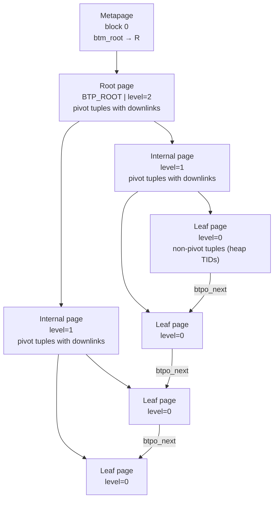
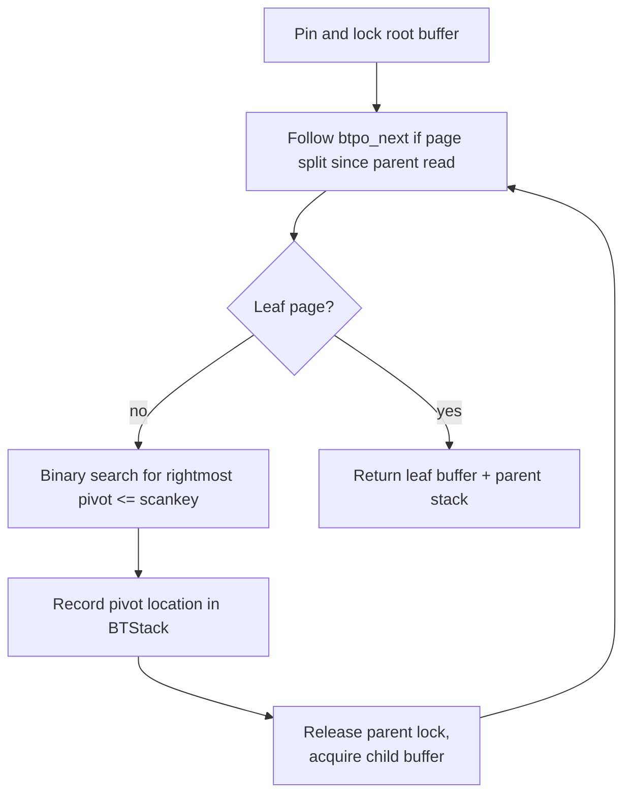
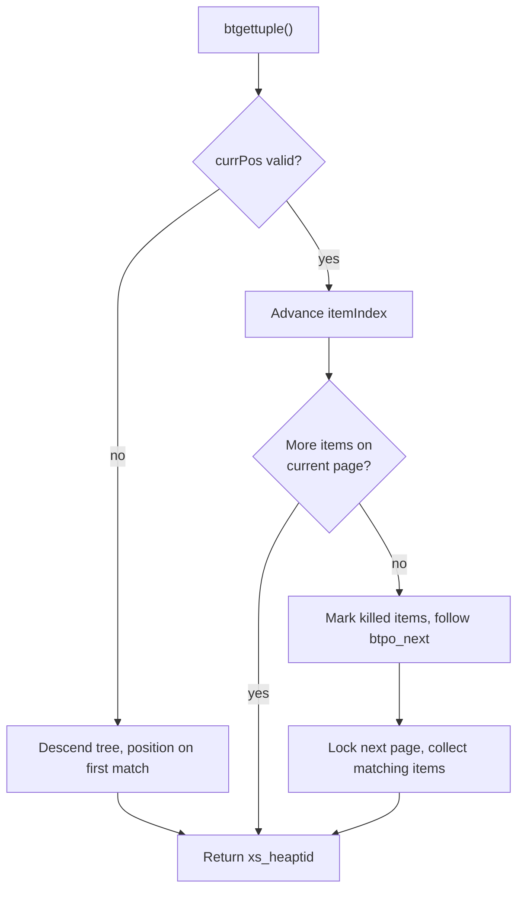

# B-tree Index Internals

PostgreSQL's B-tree access method (`nbtree`) implements the Lehman & Yao concurrent B-tree algorithm with a number of PostgreSQL-specific extensions. It is the default and most heavily used index type, supporting equality, range, and ordering queries. The implementation spans `src/backend/access/nbtree/` and its public header `src/include/access/nbtree.h`.

## Page layout

Every B-tree page is a standard 8 kB heap page. The opaque area at the end of each page holds the `BTPageOpaqueData` struct:

```c
typedef struct BTPageOpaqueData
{
    BlockNumber btpo_prev;    /* left sibling, or P_NONE if leftmost */
    BlockNumber btpo_next;    /* right sibling, or P_NONE if rightmost */
    uint32      btpo_level;   /* tree level — zero for leaf pages */
    uint16      btpo_flags;   /* flag bits */
    BTCycleId   btpo_cycleid; /* vacuum cycle ID of latest split */
} BTPageOpaqueData;
```

`btpo_prev` and `btpo_next` form a doubly-linked list across each tree level. Together they implement the right-link protocol described below. `btpo_level` counts upward from zero at the leaves. The root has the highest level. `btpo_flags` encodes the page type and state:

| Flag | Meaning |
|------|---------|
| `BTP_LEAF` | Leaf page (level 0) |
| `BTP_ROOT` | Root page |
| `BTP_DELETED` | Page removed from the tree |
| `BTP_META` | Metapage (block 0) |
| `BTP_HALF_DEAD` | Empty but not yet unlinked |
| `BTP_SPLIT_END` | Rightmost page of a split group |
| `BTP_INCOMPLETE_SPLIT` | Right sibling's downlink is not yet in parent |
| `BTP_HAS_GARBAGE` | Page has `LP_DEAD` tuples (deprecated flag) |
| `BTP_HAS_FULLXID` | Deleted page stores a `BTDeletedPageData` |

### High-key

Every non-rightmost page stores a **high key** as its first item (offset `P_HIKEY = 1`). The high key is a pivot tuple whose value is an upper bound on all data keys on the page: any key strictly greater than the high key cannot belong on this page and must be to the right. On rightmost pages there is no high key. Data items start directly at offset 1. The macro `P_FIRSTDATAKEY(opaque)` handles both cases.

The high key is central to the Lehman & Yao split protocol. When a page splits, the left half receives a new high key equal to (or a suffix-truncated version of) the first key on the right half. Any reader that arrives at a page and finds the target key exceeds the high key knows the page has split since the parent was read. It then follows `btpo_next` to find the correct page, without touching the parent.

### Metapage

Block 0 is always the metapage (`BTP_META`). It holds `BTMetaPageData`, which records the block number of the current root, the "fast root" (the lowest level at which the tree has a single page, used as a shortcut for small trees), the tree level, and bookkeeping fields for VACUUM. `btm_allequalimage` controls whether deduplication is allowed.

## Tree structure



### Pivot tuples vs. non-pivot tuples

Two distinct tuple formats live in the same index:

**Non-pivot tuples** appear only on leaf pages. They carry all indexed column values plus any `INCLUDE` columns. Their `t_tid` field is the heap TID of the matching heap row. The heap TID is also treated as a trailing tiebreaker key column in version 4 indexes (`BTREE_VERSION = 4`), making every tuple position in the tree physically unique.

**Pivot tuples** appear on internal pages (as downlink separators) and as high-key items on every non-rightmost page. They contain only key columns — `INCLUDE` columns are stripped. Their `t_tid` field stores the block number of the child page (the downlink) rather than a heap TID. Suffix truncation may remove trailing key columns when a new pivot is created at a split. This leaves those columns logically as minus-infinity. The number of key columns present is stored in the lower 12 bits of `t_tid`'s offset field when `INDEX_ALT_TID_MASK` is set in `t_info`.

On an internal page, the first data key is treated as minus-infinity by `_bt_compare()`: the comparison always returns "greater", so the leftmost child subtree covers all keys up to the second separator. This is the standard B+-tree convention, implemented in `src/backend/access/nbtree/nbtsearch.c`.

## Descending the tree to a leaf page

To locate a leaf page, the tree is descended one level at a time from the root. At each internal page, a binary search finds the rightmost pivot whose key is less than or equal to the scan key. The corresponding child is then fetched. The current page's lock is released as soon as the child is acquired. This means only one page is held at a time during descent. This lock-coupling discipline is what allows the tree to remain highly concurrent under write-heavy workloads.



The parent-page locations are saved in a singly-linked `BTStack` (each `BTStackData` records block number and offset of the chosen pivot). This stack is used during insertion to climb back up and insert new downlinks after a leaf page splits.

Descents for scans use a shared read lock on each internal page. Descents for insertions use a write lock on the target leaf. In write mode, the descent also repairs incomplete splits encountered along the way — pages with `BTP_INCOMPLETE_SPLIT` set have a right sibling whose downlink has not yet been inserted into the parent (`_bt_search()`, `nbtsearch.c`).

### Handling concurrent splits during descent

After fetching any page — whether the root or a child via a downlink — the code must verify it is still the correct page before trusting its contents. If the page's high key is less than the scan key (or less-or-equal when positioning after the last match), the page split after the parent was read. The target data has moved to the right. In that case, the sibling chain (`btpo_next`) is followed repeatedly until landing on a page whose high key exceeds the scan key, or until reaching the rightmost page. Deleted and half-dead pages encountered along the way are skipped (`_bt_moveright()`, `nbtsearch.c`).

## Scanning leaf pages

### Initial positioning

Before the first tuple can be returned, the scan must locate the precise starting point on the correct leaf page. The query's scan keys are first preprocessed into a `BTScanInsertData` that determines whether to position before the first match or after the last predecessor. The choice depends on whether the condition is `>=`/`>` (position at the first qualifying key) or `<`/`<=` (position one step past the last qualifying key and step back). After tree descent places the scan on the right leaf, a binary search locates the starting offset within that page.

From the starting offset, the page is scanned forward (or backward). Each tuple is tested against the query conditions, and matching items are accumulated into an item array. The read lock is dropped after all matches on the page are collected, leaving only a buffer pin (`_bt_first()`, `nbtsearch.c`).

### Advancing through the leaf level

Once positioned, advancing the scan is a matter of stepping through the pre-collected item array. When the array is exhausted, the scan needs to move to the next leaf page. Before leaving a page, any items observed to be dead are marked with `LP_DEAD` hints. The next page's block number was saved from `btpo_next` before the lock was released. This means a concurrent split of the current page cannot cause any leaf pages to be skipped. The next page is then locked, read, and its matching items collected (`_bt_next()`, `nbtsearch.c`).



## Built-in comparison functions

Every btree operator class registers a 3-way comparison function at `BTORDER_PROC` (support function 1) in `pg_amproc`. This function receives two values of the indexed type and returns a negative, zero, or positive `int32` indicating their relative order. It is the primitive that all key comparisons during search, insertion, and deduplication ultimately delegate to.

`nbtcompare.c` provides these functions for the simplest built-in types: those where the comparison reduces to arithmetic or byte-by-byte ordering with no collation, no detoasting, and no edge-case values like NaN. The file deliberately handles only "trivial" datatypes. Types with more complex ordering semantics (floating-point, `text`, `name`, `numeric`, etc.) have their btree support functions in the `src/backend/utils/adt/` files that own those types.

### Correctness constraints

A comparison function must impose a strict total order on all non-NULL values. Two invariants follow from this requirement:

1. The return value sign must be consistent with the type's `=`, `<`, `>`, and other boolean operators registered in the same operator class. Violating this produces wrong index scan results without any immediate error.
2. The function must handle every representable value, including corner cases such as `NaN` for floats or encoding oddities for character types. Punting or returning an unspecified result for unusual inputs corrupts the index.

Because comparison functions are called repeatedly during query execution and memory allocated inside an index access is not released until the query ends, these functions must not leak memory. This is particularly relevant for toastable types, which must free any detoasted copy of their input before returning.

### Integer and OID comparisons

For `int2`, the safe idiom `(int32) a - (int32) b` is used — widening both operands to 32 bits before subtracting avoids overflow. For `int4` and wider types, subtraction would risk overflow, so the functions use explicit three-way if/else comparisons. `btint4cmp`, `btint8cmp`, `btoidcmp`, and the cross-type variants (`btint48cmp`, `btint84cmp`, `btint24cmp`, `btint42cmp`, `btint28cmp`, `btint82cmp`) all follow this pattern.

Cross-type comparators support mixed-type operator classes. An operator class for `int4` can register `btint48cmp` as the comparator used when an `int4` index column is compared against an `int8` scan key. This allows the planner to use the index without a cast.

### Sort support

Several types register a `SortSupport` function alongside the standard comparator. Sort support (`btint2sortsupport`, `btint4sortsupport`, `btint8sortsupport`, `btoidsortsupport`) installs a faster `comparator` callback into a `SortSupport` struct. This callback receives `Datum` values directly rather than going through the `FunctionCallInfo` machinery. This eliminates per-call overhead in sort-heavy operations like `CREATE INDEX` and `ORDER BY` scans. On 64-bit platforms, `btint8sortsupport` delegates to `ssup_datum_signed_cmp`, which compares the raw `Datum` values as signed integers without any extraction. This makes it essentially free.

### `"char"` and boolean

`btcharcmp` compares PostgreSQL's single-byte `"char"` type by casting both inputs to `uint8` before subtracting. This is necessary because `char` may be signed on some platforms, and the ordering must be by unsigned byte value. `btboolcmp` subtracts the `bool` values after casting to `int32`. Since booleans are stored as 0 or 1, this produces −1, 0, or 1 with no risk of overflow.

### `oidvector`

`btoidvectorcmp` handles the `oidvector` type used in system catalogs. It sorts first by vector length (shorter vectors sort lower), then lexicographically by element value. This is an arbitrarily chosen but stable total order. The definition is not mathematically meaningful, but it satisfies the total-order requirement.

## Page splits

A page split is triggered when a new tuple does not fit in the available free space. The split divides the page's contents between the original (left) page and a newly allocated right page. It then links them together and inserts a new downlink into the parent.

### Split location algorithm

Choosing where to split a full page is a non-trivial optimization problem. The wrong split point wastes space, degrades future insertions, or forces the high key to include more attributes than necessary. This makes the pivot tuple larger. `_bt_findsplitloc()` (`nbtsplitloc.c`) encapsulates this decision entirely.

The algorithm works in three phases. First, it materializes every legal split point as a `SplitPoint` record tracking the free space that would remain on each half after the split and the new item are placed. A split is legal only if both halves have non-negative free space. Second, it assigns each candidate a `curdelta` — the absolute deviation from the target free-space balance — and sorts the array by delta. Third, it selects the best point within a constrained interval of near-optimal candidates, using a penalty score that accounts for suffix truncation effectiveness.

The target balance depends on context:

- **General leaf pages** use a 50:50 split by default: the goal is to minimize `|leftfree - rightfree|`.
- **Rightmost leaf pages** apply the `fillfactor` multiplier so that `leftfree / totalfree ≈ fillfactor%`. This matches the fill produced by `CREATE INDEX` (`nbtsort.c`) and is a deliberate optimization for append-heavy workloads (monotonically increasing sequences, timestamps, etc.) where all inserts go to the rightmost page.
- **Internal pages** always use the `BTREE_NONLEAF_FILLFACTOR` (70%) on rightmost pages. Interior internal pages split 50:50.
- **Localized ascending inserts on non-rightmost leaf pages** are detected by `_bt_afternewitemoff()`. If the page has uniformly-sized tuples and the new item's heap TID is adjacent to the previous item's TID (suggesting the same transaction inserted both), the split is biased to leave the new item as the last entry on the left half. This frees the right half for the anticipated continuation of the ascending run.

### Split interval and penalty

Rather than picking the single most balanced split point, `_bt_findsplitloc()` computes a **split interval**: the set of candidates whose free-space imbalance is within a tolerance band around the optimal split. For leaf pages the tolerance is 5% of total data size. For internal pages it is 7.5%. Within this interval the function picks the candidate with the lowest penalty.

On leaf pages, penalty is the index of the first attribute that differs between the last-left and first-right tuples — equivalently, the number of key attributes that must be retained in the new high key. A lower penalty means more suffix truncation is possible. This makes the pivot tuple smaller. On internal pages, penalty is the byte size of the first-right tuple, since that tuple becomes the new high key and its non-key content will be discarded entirely.

### Duplicate-heavy strategies

When the default interval contains only split points where all candidates would require appending a heap TID to the high key (indicating dense duplicates throughout the interval), `_bt_strategy()` switches to one of two fallback strategies:

- **`SPLIT_MANY_DUPLICATES`**: The page has multiple distinct values but the default interval falls entirely within a block of duplicates. The interval is widened to all legal splits. The best split is the one that places the boundary just outside the duplicate group. This avoids building a long chain of pages packed with a single high key.
- **`SPLIT_SINGLE_VALUE`**: The entire page is filled with one logical key value. This makes it impossible to produce a high key without the heap TID tiebreaker. The split is biased heavily to the right (`BTREE_SINGLEVAL_FILLFACTOR ≈ 96%`), leaving the left page nearly full. Subsequent inserts of the same duplicate value (which tend to have increasing heap TIDs) split to the right consistently. This distributes the load across many pages rather than repeatedly splitting the same one.

When a split is triggered on a non-rightmost page, and the `SPLIT_MANY_DUPLICATES` strategy would choose a split point where the new item lands just to the right of the duplicates group, `_bt_bestsplitloc()` falls back to the 50:50 split. This avoids a pathological pattern of monotonically decreasing insertions that would leave right-half pages with permanently wasted space.

When building the right page, the new high key for the left page is derived from the first key of the right half. On leaf pages, **suffix truncation** shortens this high key to the minimum number of attributes needed to separate the last key of the left page from the first key of the right page. This reduces pivot tuple size in the parent. On internal pages, truncation is not applied to the new high key, though the first data item on the right page is truncated to zero attributes (minus-infinity).

The split is made visible to concurrent readers before the parent is updated. The left page's `BTP_INCOMPLETE_SPLIT` flag, the right page's `btpo_prev`, and the left page's `btpo_next` pointing at the new right page are all written atomically. The right page's `btpo_next` inherits the old left page's former right neighbour. Both pages are held under write lock while this linking is performed. The right page's lock is released before the new downlink is inserted into the parent.

Inserting the downlink into the parent is a recursive operation. The saved `BTStack` is used to locate the correct parent page, and a tuple insert is performed at that level. This may itself trigger a split. Once the downlink is written successfully, `BTP_INCOMPLETE_SPLIT` is cleared on the left child (`_bt_insert_parent()`, `nbtinsert.c`).

A concurrent reader that holds no lock on the parent may arrive at the pre-split (now left-half) page with a stale pointer. Finding the search key exceeds the high key tells it unambiguously that the page has split. It then follows `btpo_next` to the new right page, all without re-reading the parent. This is the core property of the Lehman & Yao right-link protocol. It is why maintaining a correct high key on every non-rightmost page is non-negotiable.

## Concurrent access: the Lehman & Yao protocol

PostgreSQL's B-tree follows the algorithm published by Lehman & Yao (1981) with modifications. The key property is that **page splits do not require top-down locking**:

- A split sets `BTP_INCOMPLETE_SPLIT` on the left page and installs the right-link (`btpo_next`) before releasing any lock. This makes the split visible to concurrent readers.
- Any reader or inserter that encounters an incomplete split (detected via `BTP_INCOMPLETE_SPLIT` in `_bt_moveright()` or `_bt_insertonpg()`) is obligated to finish it by inserting the missing downlink before proceeding.
- During descent, only one page is locked at a time (read lock on internal pages, write lock only on the leaf target). Parent locks are released as soon as the child is acquired.
- The `BTStack` allows an inserter to return to each parent level and insert the new downlink. If the stack becomes stale due to concurrent splits, `_bt_getstackbuf()` re-finds the correct parent location using the child's block number.

The doubly-linked sibling list (`btpo_prev`, `btpo_next`) also supports backward scans. For backward scans, `_bt_walk_left()` in `nbtsearch.c` follows `btpo_prev` while holding pins and verifying LSNs to handle concurrent deletions.

## Index-only scans

Because the B-tree stores complete indexed column values in its leaf tuples, it can satisfy queries without visiting the heap at all. `btcanreturn()` always returns `true`, indicating that the B-tree AM always supports index-only scans. When the executor requests tuple data (`scan->xs_want_itup`), each matched `IndexTuple` is copied into a workspace buffer (`so->currTuples`) so it remains accessible after the page lock is released. `scan->xs_itup` is then pointed into that workspace (`_bt_saveitem()`, `_bt_setuppostingitems()`, `nbtsearch.c`).

`scan->xs_recheck` is always set to `false` for B-tree scans (`btgettuple()`, `nbtree.c`): because the index is exact and lossless, the executor does not need to re-evaluate the original quals against each returned row.

For `INCLUDE` indexes, the non-key columns present in leaf non-pivot tuples are returned through `xs_itup`. The visibility check against the heap's [[subsystems/storage/visibility-map|visibility map]] is performed at a higher layer in `nodeIndexonlyscan.c`. The B-tree AM is unaware of it.

## Deduplication (version 4)

When many rows share the same indexed key value, storing a full tuple for each row wastes significant space. Deduplication addresses this by merging equal key values into **posting list tuples**, each of which holds a single copy of the key followed by a sorted array of heap TIDs (`ItemPointerData[]`). This is enabled when `btm_allequalimage = true`. This flag is set at `CREATE INDEX` time if all operator classes satisfy the `BTEQUALIMAGE_PROC` condition.

A posting list tuple is recognized by having `INDEX_ALT_TID_MASK` set in `t_info` and `BT_IS_POSTING` set in `t_tid`'s offset field. The TID count is in the lower 12 bits of the offset field. The byte offset of the TID array within the tuple is in the block-number field.

Deduplication is triggered lazily at insertion time, just before a leaf page would otherwise have to split. When a page fills up, `_bt_delete_or_dedup_one_page()` attempts a deduplication pass (`_bt_dedup_pass()`, `nbtdedup.c`) before resorting to a page split. The pass groups contiguous runs of equal-key items — each run tracked as a `BTDedupInterval` in `BTDedupStateData`. It merges each group into a single posting list tuple on a shadow page, then atomically overwrites the original.

VACUUM handles posting lists in `btreevacuumposting()`. If some but not all TIDs in a posting list are dead, the tuple is updated in place (`_bt_delitems_vacuum()` with a `BTVacuumPosting` descriptor). If all TIDs are dead, the tuple is deleted outright.

Deduplication is not supported on `INCLUDE` indexes, because non-key columns differ between rows and cannot be collapsed into a shared tuple.

## VACUUM interaction

### LP_DEAD marking

Scans accumulate knowledge about dead index entries as a side effect of normal operation: when a heap tuple is found to be dead during a scan, `btgettuple()` records the item's position in `so->killedItems[]`. Just before the scan leaves a page, those positions are used to set the `LP_DEAD` bit on each marked item (`_bt_killitems()`, called from `_bt_steppage()`, `btendscan()`, and `btrescan()`). This is a hint, not an authoritative deletion. The item still occupies space and will be reclaimed by VACUUM.

### Bulk deletion by VACUUM

VACUUM reclaims index space by driving a linear scan through all leaf pages (`btvacuumscan()` → `btvacuumpage()`, `nbtree.c`). Each live leaf page is acquired under a cleanup lock, which waits for all concurrent scans on that page to complete (`_bt_upgradelockbufcleanup()`). This ensures no scan holds a stale reference to items about to be deleted. The VACUUM callback is applied to every heap TID on the page, including TIDs inside posting lists. Items whose TIDs are all dead are collected for outright deletion. Posting lists with only partial deletions are collected for in-place update. All deletions and updates for a page are applied in a single WAL record. `btpo_cycleid` is then cleared to mark the page as processed (`_bt_delitems_vacuum()`).

### Concurrent deletion without VACUUM

Index tuple deletion can also occur eagerly during insertion when a page is full. Rather than immediately splitting the page, the inserter checks whether any existing entries are already dead by asking the table AM to confirm which TIDs are no longer live (`index_delete_tuples()`). Confirmed-dead entries are removed, potentially freeing enough space to avoid the split entirely. This is coordinated through `_bt_delete_or_dedup_one_page()` → `_bt_delitems_delete_check()` (`nbtinsert.c`). Deduplication is attempted as a further fallback before a split is performed.

### Page deletion

When a leaf page becomes completely empty, VACUUM can remove it from the tree entirely (`_bt_pagedel()`, `nbtpage.c`). The process first marks the page half-dead (`BTP_HALF_DEAD`) by encoding the block number of the subtree's top parent into its high key. It then unlinks the page by updating the previous page's `btpo_next` and the next page's `btpo_prev`. The two-phase approach — half-dead first, unlinked second — ensures that concurrent readers using the sibling chain can always detect the page's transitional state and navigate around it safely.

A deleted page stores `BTDeletedPageData.safexid`, the transaction ID after which no in-progress scan can hold a reference to the page's downlink. The page is not returned to the [[subsystems/storage/fsm|Free Space Map]] for reuse until `BTPageIsRecyclable()` confirms that XID is no longer visible to any active transaction.

## Scan key compilation

Before descending the tree, the raw `ScanKey` array provided by the planner is transformed into an optimized internal representation. This representation drives descent and leaf-page filtering. This transformation serves several purposes. Redundant conditions on the same column are simplified — `x > 3 AND x > 5` becomes just `x > 5` — so that descent terminates at the tightest applicable bound. Each key is annotated with `SK_BT_REQFWD` or `SK_BT_REQBKWD` to indicate whether a failed match on that key terminates the scan in the forward or backward direction. This lets the scan stop early without examining every remaining tuple. Array keys (`SK_SEARCHARRAY`) are expanded into sorted arrays of discrete values. This enables an efficient "skip-scan" that jumps between array elements without scanning the gaps between them. The result is stored in `so->keyData[]` (`_bt_preprocess_keys()`, `nbtutils.c`).

**PostgreSQL 17:** The skip-scan mechanism was extended to cover `ScalarArrayOp` IN-list and `= ANY(array)` queries (`nbtree` skiparray). When a query uses `IN (const, ...)` or `= ANY(array)`, the AM now constructs array scan keys from the constant list and uses the existing skip-scan logic to jump directly between matching key ranges in the index. This bypasses the gaps between list elements. This produces a major speedup for selective IN lists on large indexes, since the index traversal now scales with the number of matching values rather than the total index size.

**PostgreSQL 18:** Multi-column B-tree skip scan was fully generalized to handle missing leading-column predicates. An index on `(a, b)` can now satisfy `WHERE b = 5` alone. As the scan reaches each boundary on `b`, the executor advances to the next distinct value of `a` and repeats. This effectively skips entire leading-column ranges that cannot contain matches. This removes the need to maintain redundant single-column indexes on trailing columns in many schemas. The implementation lives in `src/backend/access/nbtree/`.

A separate insertion-time scan key, `BTScanInsertData`, is built by `_bt_mkscankey()` for use during tree descent for insertions. It replaces the search operators with 3-way comparison functions (`BTORDER_PROC`) and carries the `heapkeyspace` and `allequalimage` flags from the metapage, along with the `scantid` tiebreaker used when inserting into version 4 indexes.

## See also

- [[code-paths/index-scan]] — executor-level index scan path that calls `btgettuple()`
- [[code-paths/vacuum]] — VACUUM coordination that drives `btbulkdelete()`
- [[subsystems/storage/heap]] — heap page layout and visibility that B-tree TIDs point into
